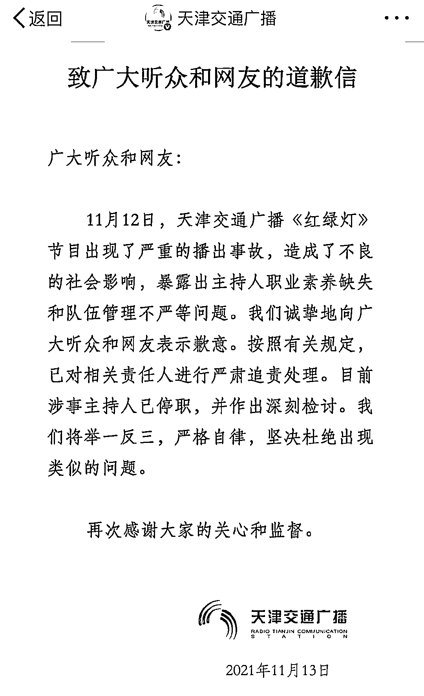
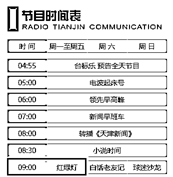
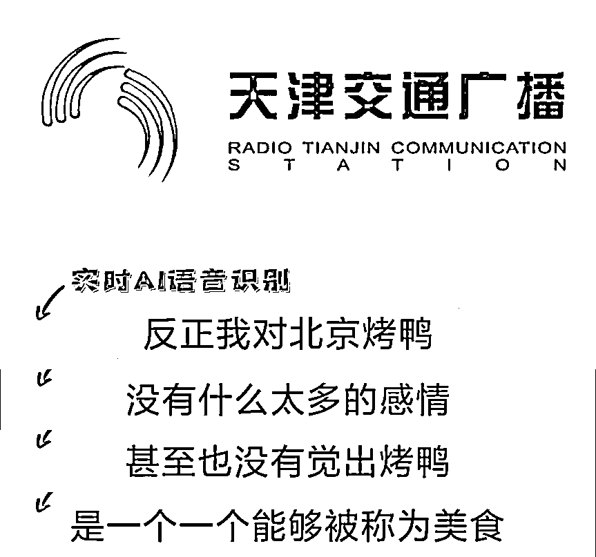
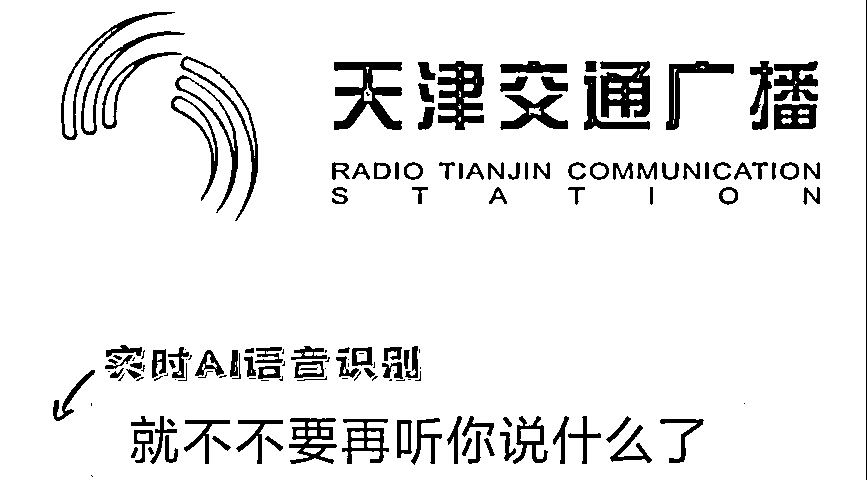
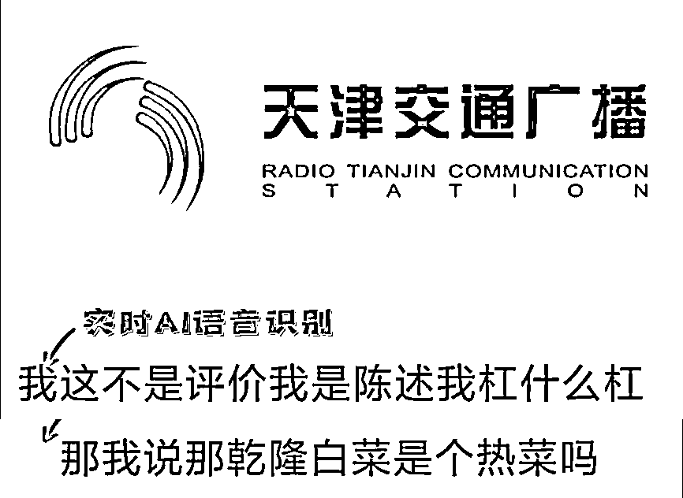
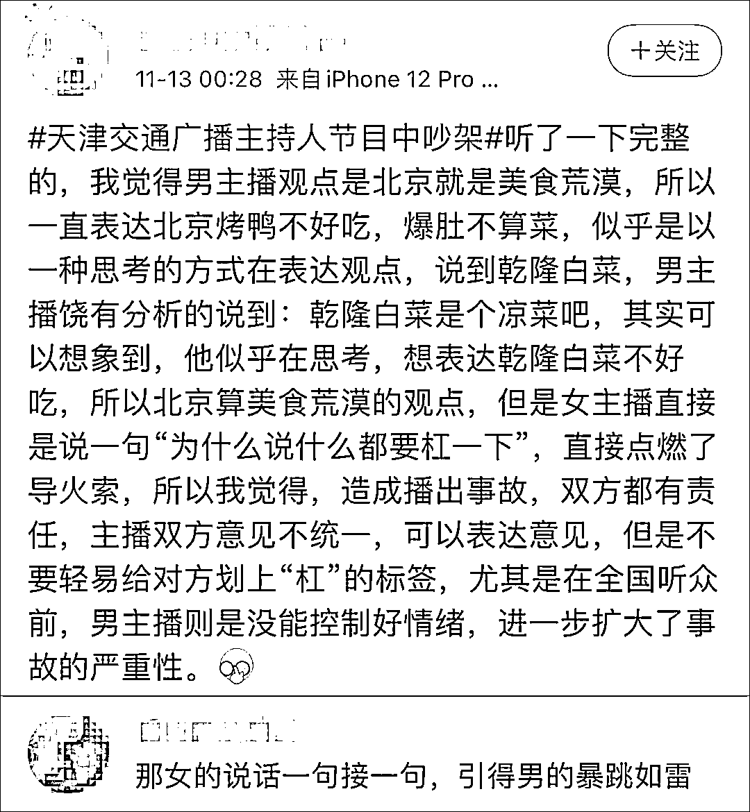
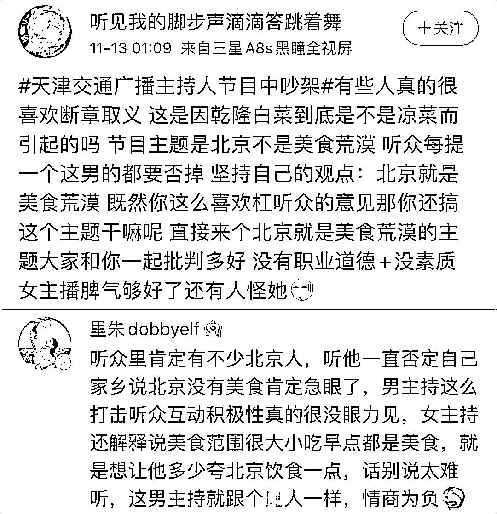
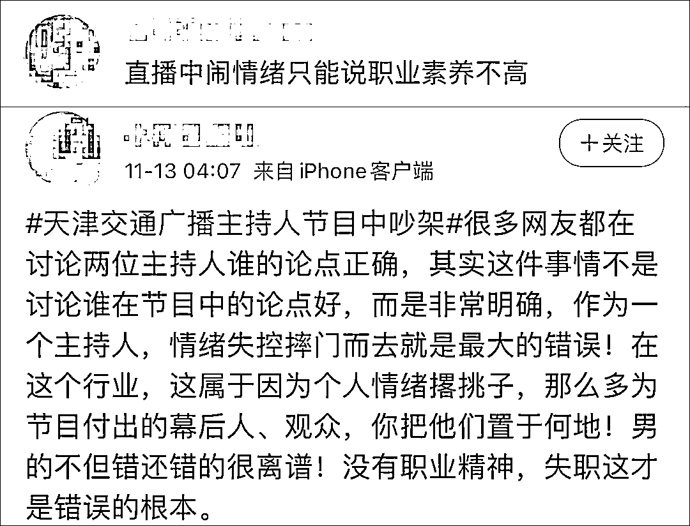
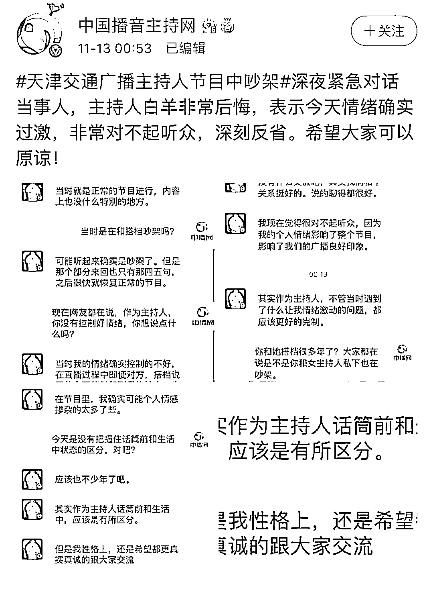
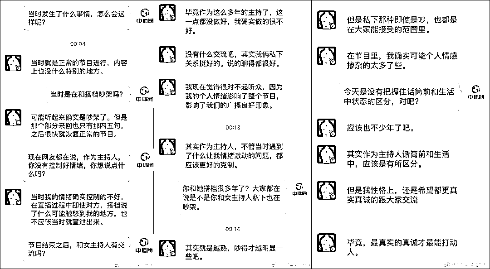

# 天津交通广播道歉

> 原文：[`mp.weixin.qq.com/s?__biz=MzIyMDYwMTk0Mw==&mid=2247524063&idx=3&sn=44b024ce01d89058ce504dcf3919bcd0&chksm=97cb55e7a0bcdcf1067759b8814d1d015a71cbd49402d8aebc6fe890871897683df08c98e709&scene=27#wechat_redirect`](http://mp.weixin.qq.com/s?__biz=MzIyMDYwMTk0Mw==&mid=2247524063&idx=3&sn=44b024ce01d89058ce504dcf3919bcd0&chksm=97cb55e7a0bcdcf1067759b8814d1d015a71cbd49402d8aebc6fe890871897683df08c98e709&scene=27#wechat_redirect)

昨天一场“前所未有的播出事故”让天津交通广播站在了风口浪尖上，引发诸多网友关注与讨论。 

12 日一早，该台《红绿灯》节目讨论起了“北京不是美食荒漠”，在主播白羊多次反驳听众提议的内容后，另一主播王琳反问其“为何每句话都要杠一下”，未想白羊听后突然情绪失控，直播中就发火大吼搭档并摔门而去，只留王琳一人主持完后续节目。

据@中国播音主持网 13 日消息，当事主播白羊深夜道歉，承认节目中自己情绪过激，“即使搭档说了什么可能触怒到我的地方也不应该当时就宣泄出来”。他表示对节目中发生的事情感到万分后悔及抱歉，将深刻反省，希望听众予以原谅。

据极目新闻报道，节目工作人员表示他们暂未接到停播通知，对两位主持人节目中意见不合的处理情况暂不清楚。@天津交通广播 刚刚发布致歉信，表示已对相关责任人进行严肃追责处理，目前涉事主持人已停职。

[`mp.weixin.qq.com/mp/readtemplate?t=pages/video_player_tmpl&action=mpvideo&auto=0&vid=wxv_2134057264972955650`](https://mp.weixin.qq.com/mp/readtemplate?t=pages/video_player_tmpl&action=mpvideo&auto=0&vid=wxv_2134057264972955650)

视频/观察者网 郑冰灏

据官方介绍，天津交通广播创办于 1994 年 1 月 1 日，2013 年 1 月 28 日由天津市政府命名为“天津应急广播”，是国内最早成立的省级应急广播频率之一。2016 年 5 月 18 日开通“天津公益广播频率”，成为全国首家公益广播。 

发生播出事故的，是天津交通广播在工作日早上 9 点直播的一档交通类闲聊节目《红绿灯》，主要受众是司机群体。

图自天津交通广播官网

当天的主播分别是白羊和王琳，两人都是天津交通广播里资历深厚的老主持人。

昨天这两位听众的老熟人一如既往地在节目里和大家唠了起来，聊的主题是“北京不是美食荒漠”，然而节目开始还没多久，已经有火药味了。

[`mp.weixin.qq.com/mp/readtemplate?t=pages/video_player_tmpl&action=mpvideo&auto=0&vid=wxv_2134055903082446851`](https://mp.weixin.qq.com/mp/readtemplate?t=pages/video_player_tmpl&action=mpvideo&auto=0&vid=wxv_2134055903082446851)

8 分钟录音 

就“北京烤鸭算不算美食”，俩人起了点争论。白羊先打断了王琳的话头，认为烤鸭算不上是北京美食，“其实北京出什么，可能对于咱天津来说也不会有多深刻的印象。反正我对北京烤鸭没有什么太多的感情，或者觉得他多如何如何，甚至也没有觉得烤鸭是一个能被称为美食的。”

王琳即刻打断了他的话，“我们看一下听众说什么，我不要再听你说什么了。”白羊随即加大音量，“我说半天了，你光不说话知道吗”，王琳反驳“话都被你说了，你还让别人说什么啊”。

这时两人之间的气氛已经变得有些紧张，王琳开始转话题，读了条听众互动内容，提议爆肚算北京美食。白羊又反驳，认为那只能算是地方小吃不是菜，王琳则表示入口的都是美食，不是只有菜才是美食。

之后有听众提到了乾隆白菜，白羊又表示乾隆白菜算是凉菜。王琳憋不住了：“大羊老师，你为什么每一句话都要跟着杠一下？”没想到白羊瞬间发飙，情绪激动地大吼道“我说乾隆白菜是个凉菜也是杠？那我要说乾隆白菜是个热菜吗？”

王琳语气未变，回答“重点不在这，重点在于你老是抬杠”，白羊继续怒气冲冲地表示自己只是陈述事实，根本没有杠。

最后王琳只能幽幽地回了句“好吧，你说什么都对”，就准备继续读一下听众留言，结果只听见一个摔门声，直播暂时中断。

在短暂音乐后，后续的节目都只有王琳一人主持，白羊不知去向，但后者在同日下午 13 点正常主持节目《茶余饭后》。

在直播中突然情绪失控大吼搭档，还摔门而出，这场播出事故在网上传开后让不少网友感到惊讶之余，也纷纷讨论起来：有人认为是王琳在直播中怼搭档，让白羊下不来台才导致的争吵；

也有人觉得白羊的确一直在反驳听众的提议，听起来是有种不适，可能对于积极互动的听众来说是一种打击，而王琳则在努力圆场。

不过大家都公认在直播中发脾气摔门走人肯定是 100%错误的行为，是一种没有职业素养的体现。

据@中国播音主持网 13 日消息，深夜白羊通过中播网向公众致歉，承认节目中自己情绪过激，对在节目中发生的事情感到万分后悔及抱歉，将深刻反省，希望听众予以原谅。

根据中播网晒出的聊天记录，白羊解释称当天节目是在正常进行，自己和王琳只是有“四五句”争论，随后就恢复正常了，事后与王琳也没有就此事有过什么交流，他还强调俩人私下关系挺好，“其实就是越熟，吵得才越明显一些吧”。

白羊也承认自己在节目中的确没有控制好情绪，掺杂了过多的个人情感，“在直播过程中即使对方，搭档说了什么可能触怒到我的地方，也不应该当时就宣泄出来。”

据极目新闻 13 日报道，天津交通广播《红绿灯》节目工作人员表示他们暂未接到停播通知，节目应该会正常播出，只不过恰逢周末，播出的应该是节日版。关于两位主持人节目中意见不合的处理情况，他们暂不清楚。

刚刚，天津交通广播通过其官方微博发布《致广大听众和网友的道歉信》，称按照有关规定已对相关责任人进行严肃追责处理，目前涉事主持人已停职。

来源：观察者网

← 向右滑动与灰产圈互动交流 →

