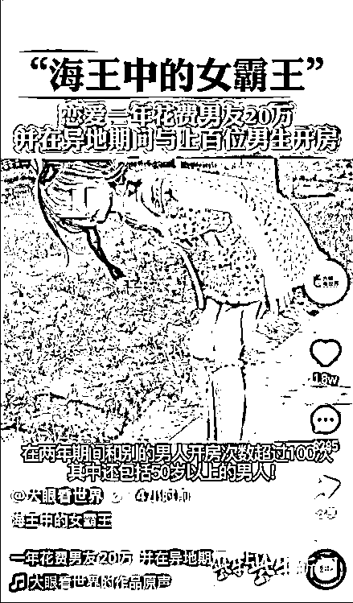

# 因为 4 张图，女大学生博主被造谣成“海王”！遭多人辱骂，连父母都被攻击

> 原文：[`mp.weixin.qq.com/s?__biz=MzIyMDYwMTk0Mw==&mid=2247524063&idx=4&sn=a2f7192cb69942d106a0ad5ab9981851&chksm=97cb55e7a0bcdcf1a033c679e2427ce8e255779530545a0f88fb9c6a534f3ecbbad895d21450&scene=27#wechat_redirect`](http://mp.weixin.qq.com/s?__biz=MzIyMDYwMTk0Mw==&mid=2247524063&idx=4&sn=a2f7192cb69942d106a0ad5ab9981851&chksm=97cb55e7a0bcdcf1a033c679e2427ce8e255779530545a0f88fb9c6a534f3ecbbad895d21450&scene=27#wechat_redirect)

在北京一所大学读大四的女生小嘉（化名） 

因为喜欢在社交网络上发布照片和视频，

受到网络暴力。

[`mp.weixin.qq.com/mp/readtemplate?t=pages/video_player_tmpl&action=mpvideo&auto=0&vid=wxv_2132876033203699712`](https://mp.weixin.qq.com/mp/readtemplate?t=pages/video_player_tmpl&action=mpvideo&auto=0&vid=wxv_2132876033203699712)

一个短视频博主将她的照片

和毫无关联的网络传言拼凑在一起，

做成短视频在多个网络平台上发布，

点赞量高达 10 多万。

很多不明真相的人看到造谣视频后，

用跟贴和私信等方式对她进行谩骂攻击。

这是她在半年内遭遇的第二次网络暴力，

今年 5 月份遇到网暴时，

她选择的是逃避，

然而没有换来安宁。

这一次，

她决心拿起法律武器，

维护自己的权益。

**她说：“这次事件不仅是为自己发声，**

**也是为被谩骂和被造谣的人发声。”**

图 视频把一个网络传言和小嘉的照片拼凑在一起

**女大学生莫名遭到造谣视频攻击**

小嘉是一名大学生，正在北京一所大学读大四。

她还是个穿搭和恋爱博主，在一个生活方式平台上拥有数万粉丝，经常发布服装搭配和情侣方面的照片和视频。

她的身高不是很高，所以自嘲是个小“矮子”，和男友的身高落差比较明显，她的外表显得也比实际年龄小一些。因为这些原因，她多次受到网络攻击和辱骂，不过那时只是局限于攻击她的长相，影响不是太大。

10 日，一个名为“大眼看世界”的蓝 V 短视频博主在多个社交媒体平台上发布名称为“海王中的女霸王”短视频，声称一名女生“恋爱一年花费男友 20 万，并与上百位男生有染”。视频张冠李戴，用的文字材料是所谓长春的一个传言，照片却是小嘉在生活方式平台上发的美妆照。

这个视频博主平时发的短视频点赞量一般，在某短视频平台上大多数只有几十个点赞，这个“海王中的女霸王”短视频发布没多久，点赞量迅速超过十万。

**起初，小嘉对此毫不知情，直到看到视频的粉丝和朋友问她怎么回事，她才知道为什么突然受到网络攻击。**

小嘉和这个短视频博主以前从未有过交集，直到这件事发生后，才知道这个账号。

图 小嘉在社交网站上发布的穿搭照片

**半年前遇到网暴曾选择逃避**

今年 5 月份，小嘉遭遇过一次严重的网络暴力，有人把她的照片和各种传言编织在一起，发到网络上。**很多不明真相的人看到网贴，循踪追到她的社交账号，疯狂地跟贴和发私信谩骂。**

那次恐怖经历让小嘉记忆犹新。潮水般的网络攻击让她不知所措，几乎要崩溃了，“不敢回学校上课，一直在学校附近躲了一个月，不敢上街。”

躲了一些天之后，她发了一个律师函，要求对方删除帖子，没有进一步与平台和造谣者进行交涉。

**但是，5 月份的网络暴力一直在延续，网贴在某些平台仍然能看到，时隔半年，偶尔仍有不明真相的人到她的账号下跟贴谩骂。**

“大眼看世界”用她的照片和别的图拼凑出视频发布后，这几天她又遭到谩骂私信的轰炸。

图 小嘉在社交网站上发布视频进行澄清

**没有得到任何道歉**

小嘉认识到，逃避不是解决问题的办法，只会让造谣者更加猖狂，所以她决心站出来保护自己。

**11 日晚上，小嘉录制了一段澄清视频，表示最近受到恶意造谣**，一个视频博主通过发布一个由四张图片拼凑而成的名为“海王中的女霸王”短视频，对她进行了人身攻击和恶意造谣，盗用了她在社交平台发布的两张照片和两张文字版的所谓“男友自述”。小嘉说，文字信息写的是长春的一名女生，**而她是湖南人，在北京读书**。短视频称小嘉在花呗有欠款，但是她从来没有开通过花呗。视频中的其他信息也都是造谣。

“仅凭四张图片就能把你写得如此不堪，**一些不明真相的网友不仅在评论区对我说了很难听的话，甚至还攻击我的父母。**”小嘉对此感到极为震惊和愤怒。

她说，女性因为穿着和在社交平台上发布照片遭到误解甚至攻击的例子有很多，个人信息被曝光，施暴者却安然无恙，造谣的成本非常低。她呼吁大家看到某些新闻要保持警醒，不要去捕风捉影。

事情已经发生两天了，小嘉没有得到任何道歉，她给这个博主发私人，恳求删除这个视频，没有得到任何回应，还若无其事地发布新作品。

紫牛新闻记者在短视频平台上联系“大眼看世界”，也没有得到回复。

**“海王中的女霸王”视频受到很多人的举报，12 日在一些平台上已经被删除，“大眼看世界”发布的其他视频也不见了。但是在某短视频平台上，造谣视频直到 12 日下午仍然存在，点赞量超过 4 万。**

**“要让背后的人受到惩罚”**

短视频社交流行之后，利用短视频造谣的事件时有发生，天眼查搜索发现，某短视频平台受到的名誉权纠纷起诉就多达近百起。

2020 年 7 月份的一份判决书显示，被告陶某通过某短视频平台散布有关原告李某的不实信息和文字内容，进行恶意诋毁。李某搜集了证据，将陶某和某短视频平台告上法庭，要求二被告立即停止侵权，书面赔礼道歉，并且赔偿损失。法院判决陶某以书面方式向原告李某赔礼道歉，并且赔偿精神损失和其他合理支出。陶某无正当理由拒不出庭参加诉讼，不影响法院依据查明的事实依法做出缺席裁判。

知名法律博主“逻格斯 logics”告诉紫牛新闻记者，律师处理这种案子一般会先用时间戳**电子取证**，这个方法速度比较快，几分钟就能做好，而且在办公室就可以做，之后再去做公证。**普通人的话，先录个屏是可以的，然后还是要尽快做公证。**

**固定证据之后，向警方报案，由警方和网络平台联系，调取侵权人的身份信息和联系方式，然后到法院起诉。**

**也可以直接向法院起诉网络平台，要求提供侵权人的身份信息和联系方式，再起诉侵权人。**

小嘉决心把造谣者告上法庭，不会像以前那样发一个律师函就到此为止了，即使没有钱请律师，也要用自己的力量要个说法。

12 日一大早，她就赶到公证处固定证据。她知道，法律诉讼需要很多程序，造谣视频虽然仅仅有十几秒，受害人维权可能得花费几个月的时间。“但是没有什么好害怕的，发完澄清视频之后，对我的骂声就也没有那么大了。我现在唯一想做的事情就是赶紧把背后的人找出来，然后让他受到惩罚。”

来源 :扬子晚报

← 向右滑动与灰产圈互动交流 →

