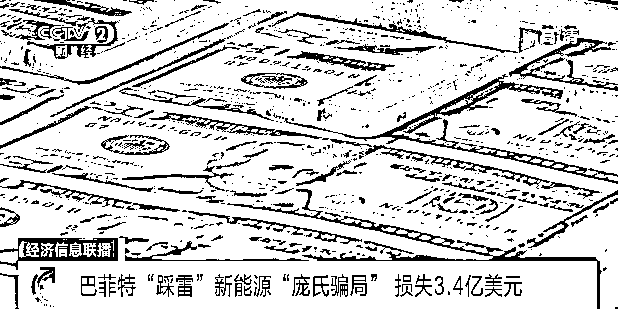
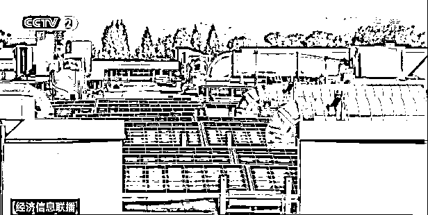

# 这种骗局，巴菲特也中招！损失超 20 亿元！

> 原文：[`mp.weixin.qq.com/s?__biz=MzIyMDYwMTk0Mw==&mid=2247524063&idx=5&sn=3c001b6b2368fac14fef722d078dad88&chksm=97cb55e7a0bcdcf1e50c8f44e12d64f5e8cd248debae12b895b9a4364fce5df2ce5ed75aa4f9&scene=27#wechat_redirect`](http://mp.weixin.qq.com/s?__biz=MzIyMDYwMTk0Mw==&mid=2247524063&idx=5&sn=3c001b6b2368fac14fef722d078dad88&chksm=97cb55e7a0bcdcf1e50c8f44e12d64f5e8cd248debae12b895b9a4364fce5df2ce5ed75aa4f9&scene=27#wechat_redirect)

近日，美国加利福尼亚州地方法院宣布，旧金山湾区一家太阳能公司的老板因实施“庞氏骗局”，骗取了投资者多达 10 亿美元，被判处 30 年监禁。美国知名投资人巴菲特也是这起骗局的“受害者”之一。

[`mp.weixin.qq.com/mp/readtemplate?t=pages/video_player_tmpl&action=mpvideo&auto=0&vid=wxv_2134106713803784192`](https://mp.weixin.qq.com/mp/readtemplate?t=pages/video_player_tmpl&action=mpvideo&auto=0&vid=wxv_2134106713803784192)

△央视财经《经济信息联播》栏目 11 月 12 日视频 

据美国检察官表示，这起“庞氏骗局”时间跨度接近 8 年，涉及 35 个投资基金、至少 17 个受害投资方，诈骗金额接近 10 亿美元。**受害者中还包括知名投资人巴菲特。据了解，伯克希尔－哈撒韦旗下的投资公司也曾投资入股了这家诈骗公司的太阳能项目，最终导致公司蒙受了 3.4 亿美元，约合 21.7 亿元人民币的损失。 **

美国加州地方法院的判决书显示，策划“庞氏骗局”的卡尔波夫近日当庭承认了电信欺诈和洗钱罪。**卡尔波夫夫妇共同创办了一家名为 DC 太阳能的公司，凭借新能源概念、税收减免等噱头，卡尔波夫夫妇利用类似庞氏骗局的循环进行诈骗，早期投资者所得收益实际上都来自于后期投资者的资金投入。**这家公司所宣称拥有的 1.7 万台发电机中，至少一半并不存在。  

来源：央视财经（ID：cctvyscj）

← 向右滑动与灰产圈互动交流 →

# 

> 原文：[`mp.weixin.qq.com/s?__biz=MzIyMDYwMTk0Mw==&mid=2247524063&idx=6&sn=c52daea859dc50cb03d99ef5c6c6b65c&chksm=97cb55e7a0bcdcf1fffb7de26d9f93d363d67ff65ba207b6e776f1bf66d279cc470152eb094d&scene=27#wechat_redirect`](http://mp.weixin.qq.com/s?__biz=MzIyMDYwMTk0Mw==&mid=2247524063&idx=6&sn=c52daea859dc50cb03d99ef5c6c6b65c&chksm=97cb55e7a0bcdcf1fffb7de26d9f93d363d67ff65ba207b6e776f1bf66d279cc470152eb094d&scene=27#wechat_redirect)