# 湖南 00 后女孩拍大尺度写真后，摄影师拿底片“失踪”了……

> 原文：[`mp.weixin.qq.com/s?__biz=MzIyMDYwMTk0Mw==&mid=2247524116&idx=2&sn=87764851eb4ced483cb43c1ec6389809&chksm=97cb542ca0bcdd3ac5a91cc4b9fe9c51879859b15f6f1f46d7983c814d782a9fc5174a580b46&scene=27#wechat_redirect`](http://mp.weixin.qq.com/s?__biz=MzIyMDYwMTk0Mw==&mid=2247524116&idx=2&sn=87764851eb4ced483cb43c1ec6389809&chksm=97cb542ca0bcdd3ac5a91cc4b9fe9c51879859b15f6f1f46d7983c814d782a9fc5174a580b46&scene=27#wechat_redirect)

该公众号已被封禁

[`v.qq.com/iframe/preview.html?width=500&height=375&auto=0&vid=b3308fon26f`](https://v.qq.com/iframe/preview.html?width=500&height=375&auto=0&vid=b3308fon26f)

11 月 6 日

20 岁的女生小刘身材高挑

在朋友的极力推荐下

她进行了一组免费的内衣写真拍摄

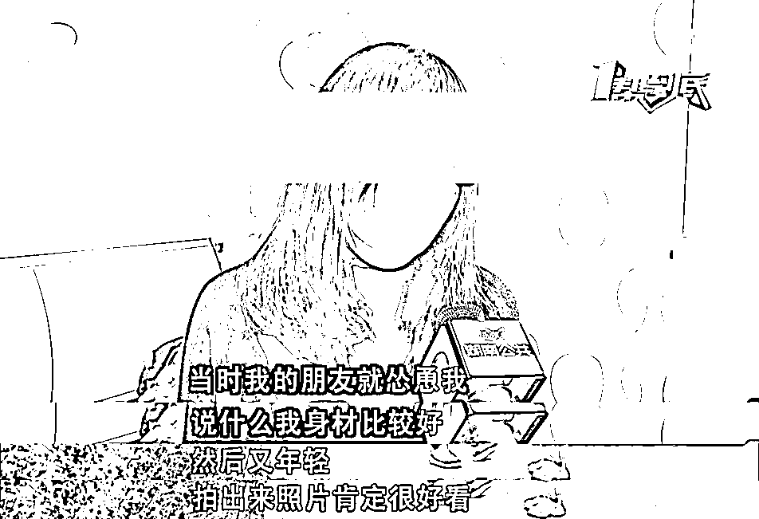

小刘说当时在酒店拍摄时

现场除了这名男性朋友之外

还有一名摄影师和他同为摄影师的朋友

原本的内衣写真在大家的劝说下

最后变成了大尺度私人写真

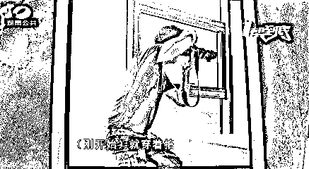

可就在拍摄完拿到照片后

小刘发现照片不仅不全

底片对方也未交予自己

人也已经消失了

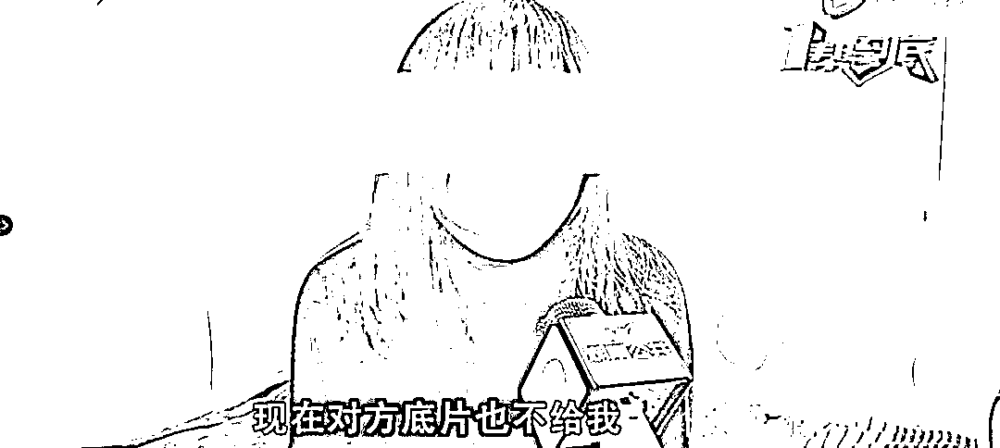

她表示 

有些照片尺度较大 

有些甚至都没有穿衣服

她现在很担心她的私密照片会不会被外泄了

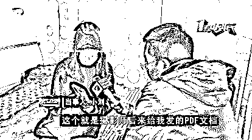

因为她收到的照片是一份 PDF 

而且是裁剪过的

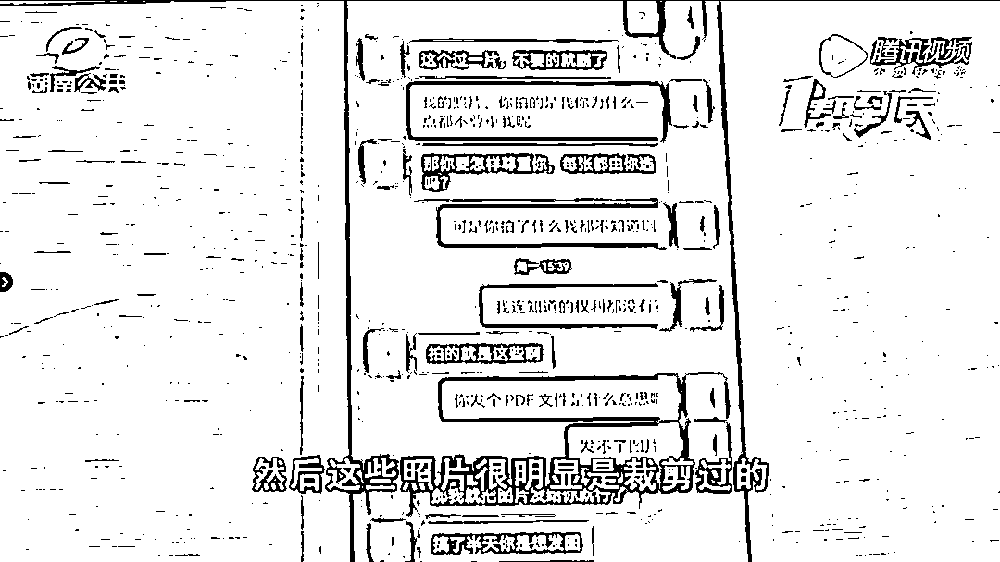

更让小刘感到不适的是

在场的另外一个摄影师

给自己发来的微信消息

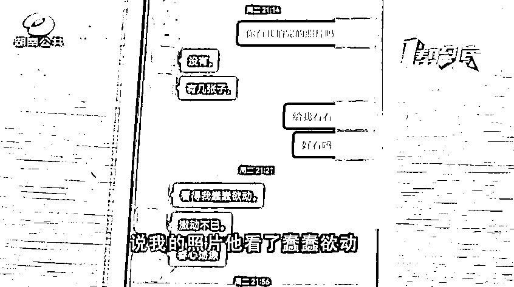

小刘表示

他在微信里说 

看了照片让他蠢蠢欲动

还说想再次约我见面

让我去约拍

记者现场联系摄影师 

对方电话关机

并且微信拉黑了小刘 

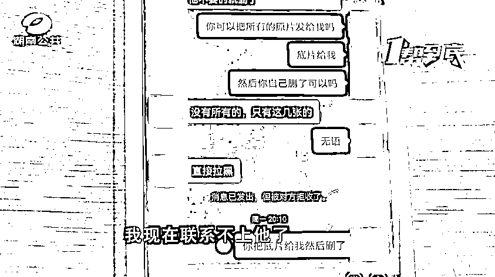

对此，小刘朋友表示

自己和他们只是摄影圈认识的

并非朋友

自己会转告对方把底片删除

保证底片不会流传出去

对于此事

记者也咨询了律师

↓↓↓

**湖南见田律师事务所律师 黄世凯**

拍摄了尺度较大的写真照片，而照片又被第三人所利用，很有可能已经构成了民事侵权，即对他人的肖像权造成了损害，同时也有可能对他人的隐私权造成侵害，要承担停止侵权、道歉或者民事赔偿的民事责任。

如果写真照片被有偿地泄漏了或者被他人不当利用了，这有可能造成名誉侵权，严重的可能构成刑事犯罪。所以及时地停止传播，删除相关资料，是防止犯罪的重要举措。

目前，小刘已经报警

警方已经介入调查

晨报君查阅新闻发现

女子单独拍写真的事件频发

去年 6 月

# 浙江一女子拍写真，

# 收到摄影师消息：“等你养胖了约你”…

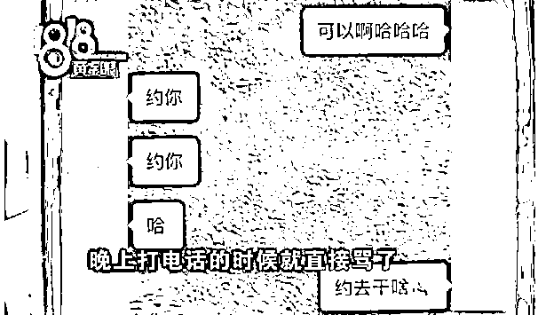

最后，摄影机构进行退款并道歉

去年 7 月 

一女生单独去拍写真 

结果被侵犯

该摄影师因犯强奸罪

判处有期徒刑 4 年半

该事件引发不少网友讨论 

认为女生不要单独去拍写真

但也有网友认为拍写真没关系

但是要保证自身安全 

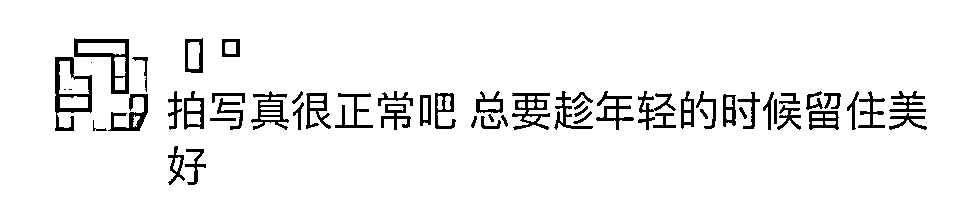

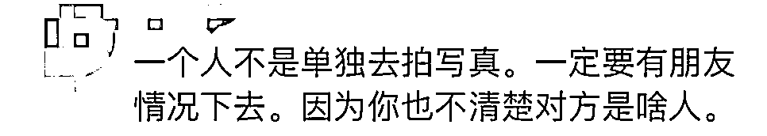

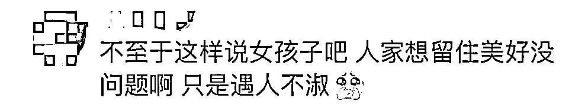

**你怎么看待** 

**女生约拍写真** 

**欢迎留言说说你的看法** 

来源：潇湘晨报

← 向右滑动与灰产圈互动交流 →

