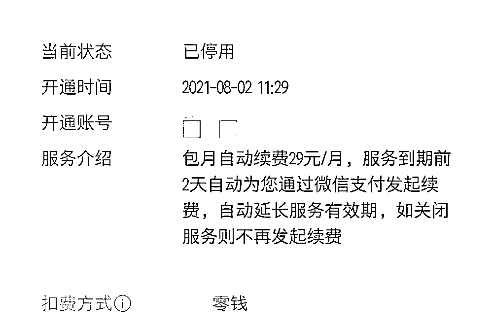

# 赶快自查！一堆 APP 正在“自动续费”......

> 原文：[`mp.weixin.qq.com/s?__biz=MzIyMDYwMTk0Mw==&mid=2247524116&idx=3&sn=512c84d74269bdf339929df83f15d8d6&chksm=97cb542ca0bcdd3ab27a756cdcc9398f42f9c4d5dc6918c35177096fb3abf446b4dddab98dc0&scene=27#wechat_redirect`](http://mp.weixin.qq.com/s?__biz=MzIyMDYwMTk0Mw==&mid=2247524116&idx=3&sn=512c84d74269bdf339929df83f15d8d6&chksm=97cb542ca0bcdd3ab27a756cdcc9398f42f9c4d5dc6918c35177096fb3abf446b4dddab98dc0&scene=27#wechat_redirect)

**手机里的那些“自动续费”，你该关的都关掉了吗？不查不知道，一查吓一跳！原来，**即使卸载了 APP，这些“自动续费”并没有被关掉，还会继续扣你的钱钱钱……****

**最近，重庆市民 26 岁的小佳（化名）一查自己的手机钱包，才发现多个 APP 正在“自动续费”。而其中有的 APP 早就停用甚至卸载了……这一切，都源于小佳当初在开通会员时忘记将“自动续费”停用。**

****多款 APP 在“自动续费”****

**小佳表示，自己打算在“双十一”血拼一波，因此，就清算起自己的微信和支付宝账单，想做好计划开支。她发现，自己的微信和支付宝里，有多笔“自动续费”的扣款。**

**她仔细一回忆，这当中有视频会员、网盘会员、修图软件会员、音乐软件会员、论坛会员等。小佳说：“现在开会员的时候，都会有提示，如果选择“连续包月”，就可以享受最低折扣。所以我在开通的时候肯定选便宜的，没想到后来就忘了关。”**

****被扣近 200 元冤枉钱****

**小佳说，这些“自动续费”的 APP 中，有的自己仍在享受会员服务，**有的早就没用甚至卸载了**。**

**比如某视频会员，这是此前自己追某个综艺时开通的，当时想着综艺结束就立即关闭。但后来自己直接将软件卸载了，却没想到“自动续费”仍在继续中，**“29 元一个月的扣着，可我都卸载了两个月呀。”****

**小佳统计，自己没用、卸载的 APP 里，仍在“自动续费”会员的软件，已累积扣费达近 200 元。其中，最久的是一个论坛会员，自己开于今年 4 月，每月会员费是 12 元，一直扣到 10 月底才关停。**

****

****“扣费扣得无声无息的”****

**记者通过小佳的手机记录看到：当你开通某个 APP 的会员的“连续包月”服务后，在相应的支付软件中，就会生成一个协议——**服务到期前 2 天自动续费，自动延长服务有效期，如关闭服务则不再发起续费。****

**这当中，小佳最不满意的是，“自动续费”不能在 APP 里直接取消，哪怕是卸载也不会取消，一定要去支付软件里找到并关闭才行，“这种太容易搞忘了。”**

**“我自己开通的‘连续包月’，这个我认。但是这个扣费无声无息的，而且很难找到关闭口，这点就很不科学。”小佳说道。**

****APP“主动”帮用户选择自动续费****

**与小佳有类似经历的市民不在少数。“就开了一个月会员，结果下个月被扣了钱，打电话咨询客服才知道是自动续费。”济南市民孙祺告诉记者，虽然一个月会员也就 10 几元钱，但她对何时同意开通自动续费完全没有印象。**

**“本来想体验一把会员待遇，点击付费后才想起来，好像不起眼的地方有个自动续费选项被默认勾选了，回头一看果然‘中招’了。”威海市民郭先生告诉记者，自己在某款视频 APP 上开通会员时，选择了系统默认的选项，结果发现自己购买的是自动续费套餐。**“想取消自动续费，程序比开通时繁琐多了。**”**

**记者对多款 APP 进行了测试。在大多数常用软件中，付费页面均有选择自动续费连续包月选项和单独包月选项。但在一些 APP 会员充值界面，系统默认选择的是连续包月套餐，在套餐下方，写着一行字号较小、字体颜色偏淡的话：“首月到期后，则会自动续费。”如果不仔细看，很难注意到。也有一些 APP 标注充值价格中，“连续包月”优惠折扣较大，比起单独包月、季度包月的价格，勾选“连续包月”或者“到期自动续费”选项，价格往往最低最优惠。**

****自动续费“套路”多****

**记者发现，不少消费者都曾遇到类似的自动续费问题，很多人都在不知不觉中掉进了消费陷阱。在有关自动续费的问题上，一些 APP 的“套路”是这样“玩”的。**

**** 套路一：“免费试用”不免费 ****

**苹果应用商店中一款拍照 APP，在首页打着“解锁更高级功能——点击免费试用”的幌子，用户点击进去却被要求开通包月服务。原来，所谓的“免费试用”是先购买每月的包月服务，然后才能获得赠送的“7 天免费”会员服务。**

**** 套路二：充值优惠“代价”不小 ****

**在一些 APP 的页面顶部，常出现“一分钱体验 7 天会员”“5 块钱充值一个月会员”等诱人标语。但消费者充值后，却在接下来的几个月连续遭遇扣费。**

 **对于此类活动，部分 APP 往往在诱导性标语和图案上，使用夸张的字号，但在活动宣传页的某个“角落”，“悄悄”标注“1 分钱体验会员将尊享连续包月会员特权，自动加入连续包月计划”等协议，用户只要付费就相当于同意了协议条款。** 

**** 套路三：“自动续费”成了唯一选项 ****

**记者充值某社交平台会员时，充值界面只有 4 个套餐，分别是“连续包年”“连续包半年”“连续包季”“连续包月”，在套餐下方的小字自动续费声明中，写着“如需取消续订，请在当前订阅周期到期前 24 小时，手动在相关设置管理中关闭自动续费功能。”用户在充值界面没有单独包月或包年选项，一旦选择充值，只能选择自动续费。**

****如何自查和取消“自动续费”？ ****

**方法来了！请赶紧自查操作**

****检查和关闭自动续费方法****

> ****微信：**打开微信，点击【我的】—【支付】 — 右上角的【···】 — 【自动扣款】，检查和选择要关闭的扣款项目。**
> 
> ****支付宝：**打开支付宝，点击【我的】—【设置】—【支付设置】—【自动扣款】，检查和选择要关闭的扣款项目。**

**再次提醒小伙伴们，有些 APP“连续包月”确实能享受优惠，但如果不是长期使用，记得关闭“自动续费”选项，以免造成不必要的开销。**

**来源：新华社、上游新闻、红网**

****

**← 向右滑动与灰产圈互动交流 →**

****