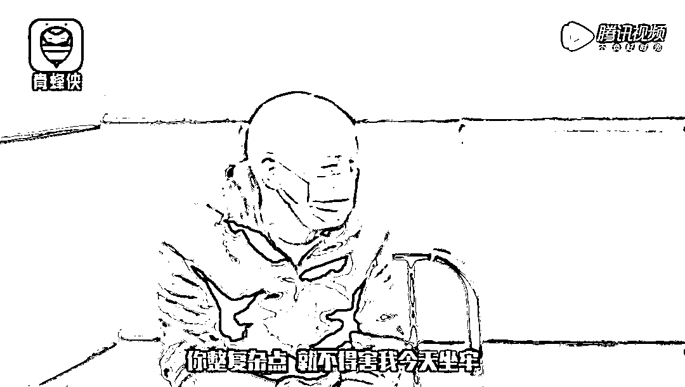
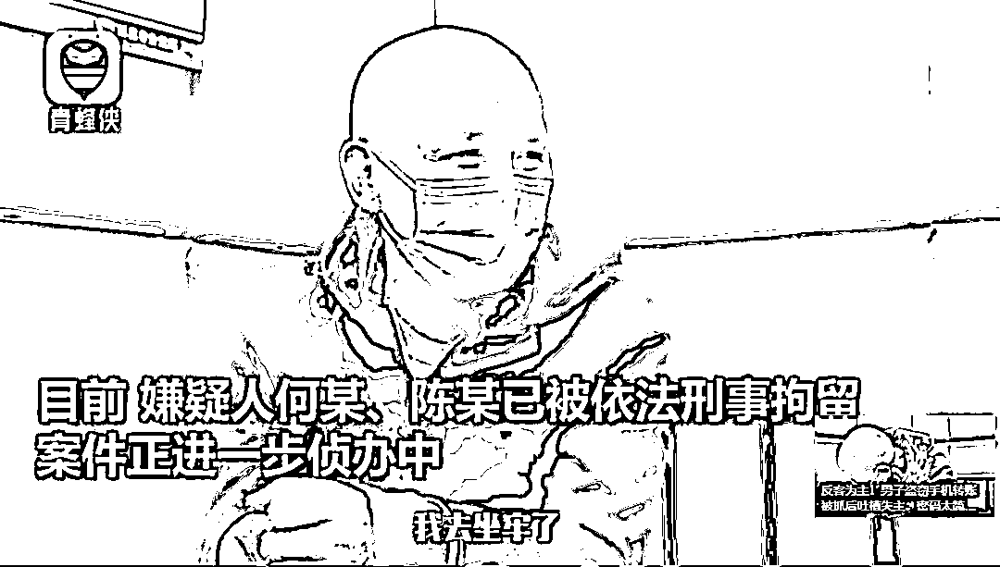
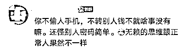

# “害我坐牢”两小偷被抓！反倒这样吐槽失主...

> 原文：[`mp.weixin.qq.com/s?__biz=MzIyMDYwMTk0Mw==&mid=2247524116&idx=4&sn=079beb9ada6d110a421c638c35ef52b0&chksm=97cb542ca0bcdd3a91ba0a1d15c8e67cb1f2c15cf19a1187d2477cfb6535d706e2c5c3b9314a&scene=27#wechat_redirect`](http://mp.weixin.qq.com/s?__biz=MzIyMDYwMTk0Mw==&mid=2247524116&idx=4&sn=079beb9ada6d110a421c638c35ef52b0&chksm=97cb542ca0bcdd3a91ba0a1d15c8e67cb1f2c15cf19a1187d2477cfb6535d706e2c5c3b9314a&scene=27#wechat_redirect)

近日，四川西昌两男子盗窃他人手机，转走七千余元。被抓后嫌疑人何某再三恳求民警给个机会，当面向失主赔礼道歉、赔偿损失。然而他在见到失主后却开始抱怨：密码太简单，害他坐牢……

[`mp.weixin.qq.com/mp/readtemplate?t=pages/video_player_tmpl&action=mpvideo&auto=0&vid=wxv_2132700257992900609`](https://mp.weixin.qq.com/mp/readtemplate?t=pages/video_player_tmpl&action=mpvideo&auto=0&vid=wxv_2132700257992900609)

**“密码太单调了，害我坐牢”**

10 月 27 日凌晨 5 点 50 分，长安北路的吴老板将自己的包放在小吃店内，吴老板进了一趟后厨，出来后发现放在桌上的现金和包不见了。

当日早上 7 时许，安宁镇杂货铺的柳大娘出门后到后院喂鸡。返回时发现屋内的手机、挎包不见了。

随后，柳大娘立即通知女儿登陆微信号，发现微信零钱 7507.5 元被转走了。

西昌公安接到吴老板和柳大娘的报警求助后，立即开展侦查工作，发现两起盗窃案高度相似，并锁定何某及陈某有重大作案嫌疑，但两人已往成都方向逃窜，民警于 11 月 5 日开展追逃工作。

11 月 7 日，西昌市公安局在重庆市璧山区璧城派出所的支持和协助下，抓获在长安、安宁辖区入室盗窃的嫌疑人何某及陈某，并于 11 月 9 日将两人从重庆市押解回昌。

经调查，两名嫌疑人在昌盗窃手机、现金等财物，涉案金额约一万余元，且在攀枝花、绵阳、重庆等多地实施了盗窃。

当民警询问何某，为何要“一路”盗窃时。何某声称，二人打算前往澳门赌博。

嫌疑人何某再三恳求，希望民警能给他个机会，当面给柳大娘赔礼道歉、赔偿损失。

然而何某在见到失主后，却满腹抱怨：大娘微信密码太简单，未安装防盗门，“害他”坐牢。

“我不想要你的钱” 

“你的密码太单调了，害我坐牢！”

“我没说你有错，都有责任”

“你没责任，为什么不安防盗门？”

“安了防盗门，还有贼偷你东西？”

“不说了，不说了”

“我去坐牢了”

目前，嫌疑人何某、陈某已被西昌公安依法刑事拘留，案件正进一步侦办中。

**网友：果然是厚颜无耻！**

有网友表示，“果然是厚颜无耻！”“你不偷人手机，不转别人钱不就啥事没有嘛。还怪别人密码简单。”“这就是所谓的歪理邪说吧。”

**警方提醒**

1.家中不要存放大量现金及贵重物品；

2.手机要设置难破解的开机密码，另外还要为不同的支付软件设置不同的密码；

3.防范技术开锁，选用高品质锁具，安装结实护栏配备防盗装置，夜间及外出时锁好门窗。

来源：中国新闻网综合西昌公安、青蜂侠、红网、网友评论

← 向右滑动与灰产圈互动交流 →

