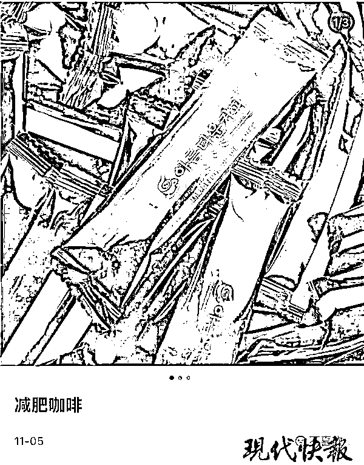
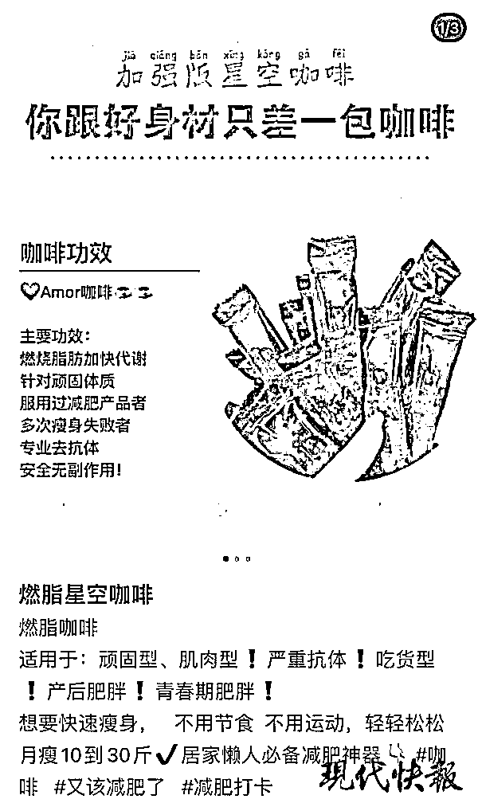

# 警惕！这种咖啡千万别碰，严重可致命

> 原文：[`mp.weixin.qq.com/s?__biz=MzIyMDYwMTk0Mw==&mid=2247524116&idx=5&sn=15caae3b97450c49ebd5f805d2be9129&chksm=97cb542ca0bcdd3a36ee9740726c8d31fd8ab304c4ffc26091ecee22868408a9804f126352d2&scene=27#wechat_redirect`](http://mp.weixin.qq.com/s?__biz=MzIyMDYwMTk0Mw==&mid=2247524116&idx=5&sn=15caae3b97450c49ebd5f805d2be9129&chksm=97cb542ca0bcdd3a36ee9740726c8d31fd8ab304c4ffc26091ecee22868408a9804f126352d2&scene=27#wechat_redirect)

运动减肥太累，怎么办呢？市面上一些打着无需运动、不用节食的减肥产品成了急需减肥者们的选择，其中有一款名为 " **星空减肥咖啡** "。11 月 13 日，江苏省禁毒委员会办公室通过其公众号** " 江苏禁毒 " 发布提醒：****这款咖啡含有违禁药西布曲明成分，切不可盲目跟风使用**。 

**女孩喝 " 星空咖啡 "**

****心跳加快血压飙升进医院****

****浏览某知名社区平台，可以发现不少网友在发帖推荐 " 星空减肥咖啡 "，一些据称正在喝的人每天都会打卡分享自己的 " 疗效 "。不过，也有一些网友表示自己喝 " 星空减肥咖啡 " 时，出现了副作用，普遍出现的反应是**口渴、恶心反胃、心慌**。****

****据媒体报道，**浙江省慈溪女孩小许喝了 " 星空咖啡 " 后，出现了心跳加快血压飙升的状况，直接进了医院**。****

****喝咖啡怎么会喝出副作用呢？****

****据小许描述，一开始她是听朋友说，这款产品效果不错，便从网络购物平台购买了 10 袋。小许表示，这个星空咖啡饱腹感确实强，吃完就算饿，看到饭也吃不下。" 第一天喝了，我**口干舌燥，头晕眼花，恶心，身体无力，晚上还失眠**，不知道有没有副作用。连续三天吃下来，**心跳很快还出虚汗，血压也升高了**！" 小许当时吓得赶紧去了医院，检查结果还好只是尿酸高，多喝水就能恢复。**医生告诉小许喝的产品里检测出西布曲明，这是一种违禁药，服用时间长了容易致命**。****

****小许立即报了警。据检察机关了解，**像小许这样的受害者还有很多，且分散在全国各地**。而她们购买的产品，均来自罗某甲等 8 名犯罪嫌疑人。他们以低价购进 " 星空咖啡 " 打包、代发货。在明知上述减肥产品，含有违禁药西布曲明成分的情况下，通过微信销售给多名下家。****

****同时，罗某甲等 8 名犯罪嫌疑人，还通过几个网络购物平台销售上述减肥产品，并从中获利。****

******1 公斤咖啡粉含 50 克西布曲明******

********严重可导致中风、死亡********

******据警方调查，小许购买的这些所谓 " 韩国正版 " 咖啡，真实产地是天津、吉林等地。其中一个源头生产者吕某，**从网上购来咖啡粉末，1 公斤咖啡粉末，添加 50 克西布曲明，放在桶里搅拌，最后通过咖啡机进行灌装和打包**。吕某还通过糖果压片机，**用类似的方法制作减肥糖**。******

********

****据悉，西布曲明的作用是抑制食欲中枢，使人胃部的饱胀感增强，食欲下降。**西布曲明早年用于辅助治疗肥胖症，但是副作用大，会造成心率加快，血压增高，严重时可导致中风甚至死亡**。****

****2010 年 10 月，国家食品药品监督管理局发布通知，停止西布曲明制剂和原料药在中国生产、销售和使用。****

******虽然国家食品药品监督管理局下令，但仍有逐利的商家，变着花样换个包装继续售卖**。现代快报记者在某生活分享平台上搜索 " 星空咖啡 "，出现了很多网友分享帖。在网友的分享帖中，称顽固型、肌肉型、吃货型的肥胖都可以做到快速瘦身，并且号称可以轻轻松松月瘦 10 到 30 斤，是居家懒人必备减肥神器。****

****记者私信其中数名网友，星空咖啡效果如何？该怎样购买？一名网友回复记者称，体验装 99 元 10 条，269 元 30 条，在网友处即可购买。随后，她要求记者加其微信，了解更多购买事宜。但**当记者询问咖啡的成分是否含有西布曲明时，该网友则选择了 " 消失 "**。****

******江苏禁毒：******

********控制饮食保持运动才是 " 王道 "********

******记者了解到，目前市面上合法的减肥药并不多，多数还是打着减肥旗号的保健食品，而在朋友圈里火热的一些 " 网红减肥药 "，甚至涉毒。11 月 13 日，**江苏禁毒发布提醒，切不可盲目跟风使用减肥产品，控制饮食、保持运动、健康生活才是最理智的减肥方式**。******

****同时，江苏禁毒还发布了市面上常见减肥药所含成分：****

******第 1 类******

******西布曲明（违禁药）******

****西布曲明是一种抑制剂，有降低食欲，减少进食，让人有饱腹感的作用，长期服用含西布曲明成分的减肥药，会出现口干、失眠、腹泻、心率升高、月经紊乱癫痫发作、四肢抽搐等反应。****

****2010 年，西布曲明已被多国宣布禁止生产和销售，并被列为违禁药。****

******第 2 类******

******奥利司他（合法 OTC）******

****作用于消化系统中的胃肠道，阻止脂肪摄入，方法简单粗暴，就是吃进去后直接排出来。奥利司他是目前唯一合法的 OTC 减肥药。但副作用也很明显：一是吃后肛门会不由自主的流脂肪油，如同大小便失禁一般，需要经常穿着纸尿裤。二是长期服用对肝损害严重，甚至有可能导致肝衰竭死亡。****

******第 3 类******

******苯丙胺（非法禁药）******

****是一种作用于中枢神经系统的兴奋剂，能让人保持兴奋状态。二战时期被制作成军需药品，专门给前线士兵使用，以保持旺盛的战争力。二战结束后，苯丙胺又衍生出甲基苯丙胺，即大名鼎鼎的冰毒。在我国属于一类精神药品，属于严格管制。****

******第 4 类******

******芬氟拉明（非法禁药）******

****芬氟拉明非常有效果，但只要停药体重就会迅速反弹，需要长期服用，因此极易滥用上瘾，并且副作用非常严重，导致各种精神疾病。****

****芬氟拉明在全球早已被叫停，同时联合国要求各国立法，严格管制苯丙胺，禁止非法使用。****

******第 5 类******

******氟西汀（非法减肥药）******

****主要作用是治疗抑郁症，唯一与减肥粘边的作用，是其具有治疗神经性贪食症的作用，实际上就是通过抑制食欲达到治疗作用。****

****副作用是导致激越、焦虑，认知缓慢和情感缺乏等等，严重时有可能引发癫痫、躁狂以及产生自杀的念头和行为。****

******第 6 类******

******酚酞（非法禁药）******

****酚酞为化学成品，外观为晶体粉末状，是一种刺激性轻泻药，主要作用于大肠，用于慢性便秘，长期服用有致癌的风险。过量服用，还有可能诱发心律失常神志不清、肌痉挛以及倦怠乏力等症状。****

******第 7 类******

******左旋肉碱、酵素等营养成分******

****左旋肉碱是一种类氨基酸，又名维生素 Bt，它并不是药物，而是一种营养成分。同类的还有被吹得神乎其神的一种名为酵素的酶，实际上，酵素就是一种蛋白质，在很多水果中都有，例如西红柿。人体的左旋肉碱和酶一般都能自给自足，根本不需要额外补充。、****

****来源 ：现代快报+/ZAKER 南京，潇湘晨报****

********

****← 向右滑动与灰产圈互动交流 →****

********