# 假戴森，已销往全国！

> 原文：[`mp.weixin.qq.com/s?__biz=MzIyMDYwMTk0Mw==&mid=2247524177&idx=1&sn=a86ef8146b565b0332ac8174cb431264&chksm=97cb5469a0bcdd7fd650f859e25403662c604fd99c6aaaec74d286e2cae5b31f71ca1e37b901&scene=27#wechat_redirect`](http://mp.weixin.qq.com/s?__biz=MzIyMDYwMTk0Mw==&mid=2247524177&idx=1&sn=a86ef8146b565b0332ac8174cb431264&chksm=97cb5469a0bcdd7fd650f859e25403662c604fd99c6aaaec74d286e2cae5b31f71ca1e37b901&scene=27#wechat_redirect)

你们花上千元高价买的戴森吹风机， 

可能只是贴着真二维码的冒牌货！

近日，央视曝光戴森吹风机出现了“真假美猴王”事件，涉案 1.2 亿元。 

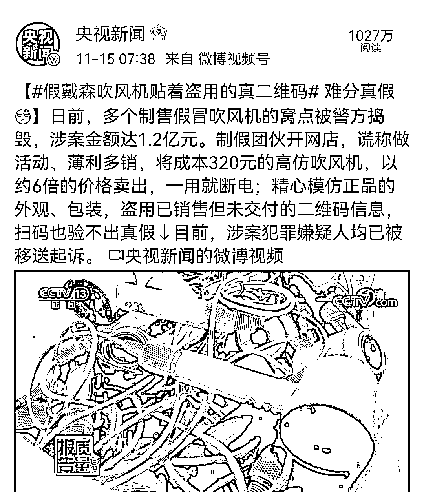

据央视新闻报道，日前，江苏警方捣毁多个制售假冒吹风机的窝点，抓获了犯罪嫌疑人 22 名，现场扣押了假冒戴森吹风机 7000 多台，配件 1 万多个，假冒的商标 20 多万个，扣押了专业的生产设备一套，模具 10 台，**整个案件的涉案金额达到 1.2 亿元。**

[`mp.weixin.qq.com/mp/readtemplate?t=pages/video_player_tmpl&action=mpvideo&auto=0&vid=wxv_2136829919111233541`](https://mp.weixin.qq.com/mp/readtemplate?t=pages/video_player_tmpl&action=mpvideo&auto=0&vid=wxv_2136829919111233541)

受害者蔡女士说，她是在一家名为“方青折扣店”的淘宝店上买的，花了 1699 元。店家称他们在做活动，所以价格比官方便宜。蔡女士看其销量排名是第一，便下了单。

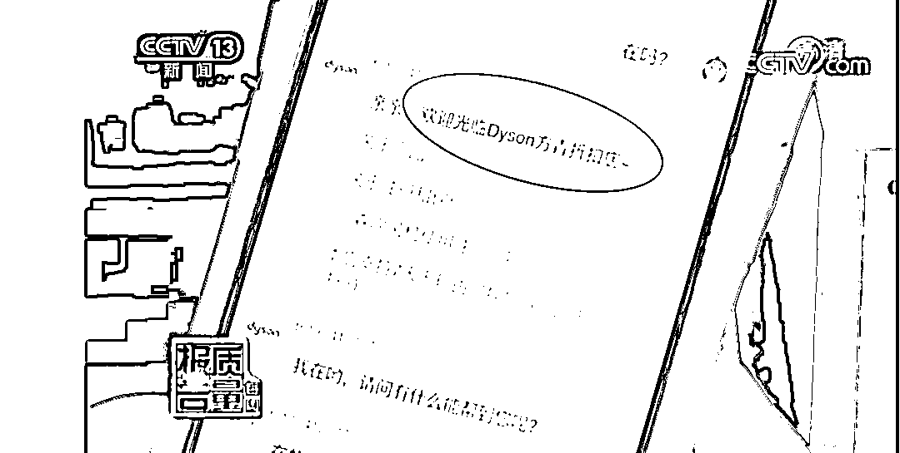

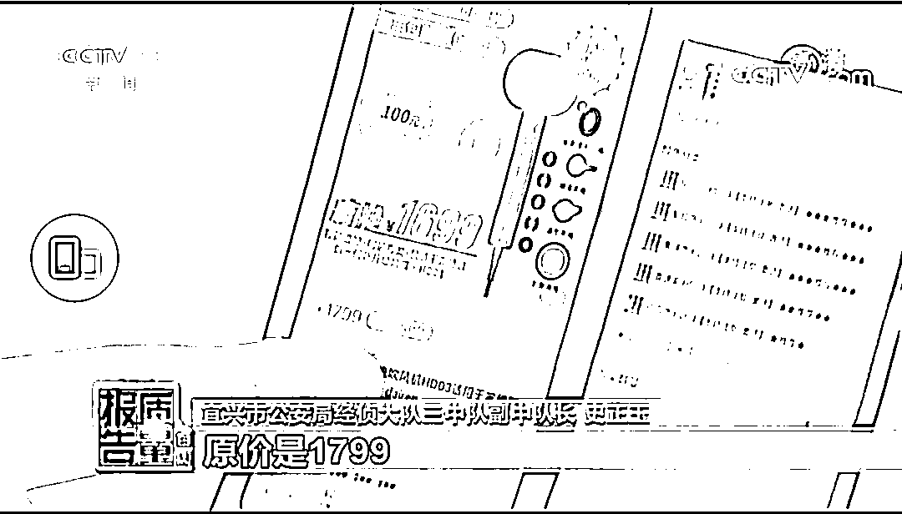

**但是拿到手后却发现电风吹不仅风力很小，而且第一次使用了几分钟就断电了。**因此蔡女士怀疑自己买到了假货，便到警局举报，不料一查竟发现这款戴森吹风机是冒牌货。

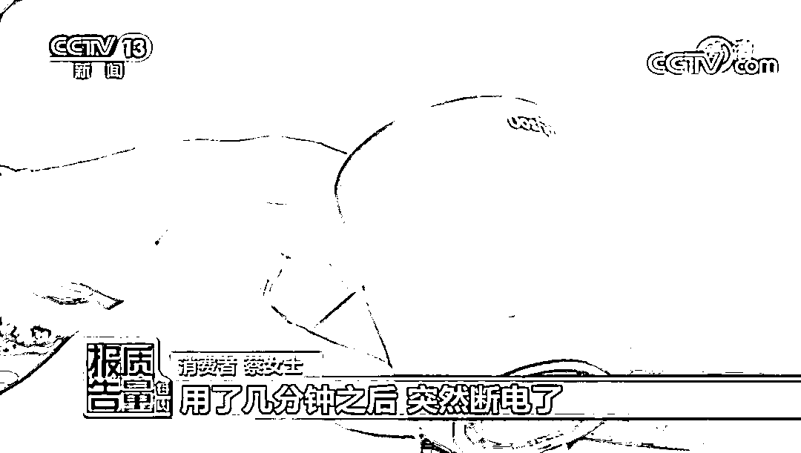

警方深入调查后发现，这家淘宝店注册于 2020 年 12 月左右，假冒的戴森吹风机已经销往全国各地，制假团伙是广东东莞的孔某团伙。

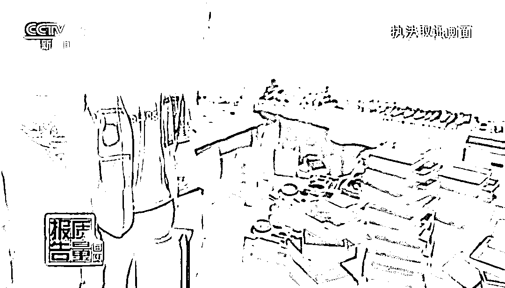

这个制假团伙精心模仿戴森吹风机正品的外观、包装，**盗用已销售但未交付的二维码信息，这样就算消费者用手机扫码也验不出真假。**

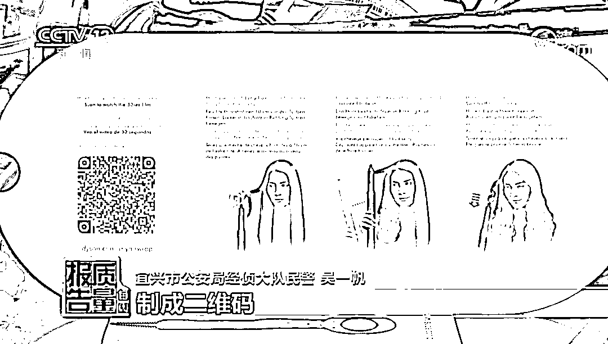

据孔某交代，他的日产量在 100 台左右，月产大概在 3000 台。

主要通过几层经销商，通过上海、广东、深圳等城市的经销商在淘宝、闲鱼和微店等平台在全国兜售。

**成本 320 元左右，售价却近 2000 元，网店卖出一台假戴森可获利 1000 元左右。**

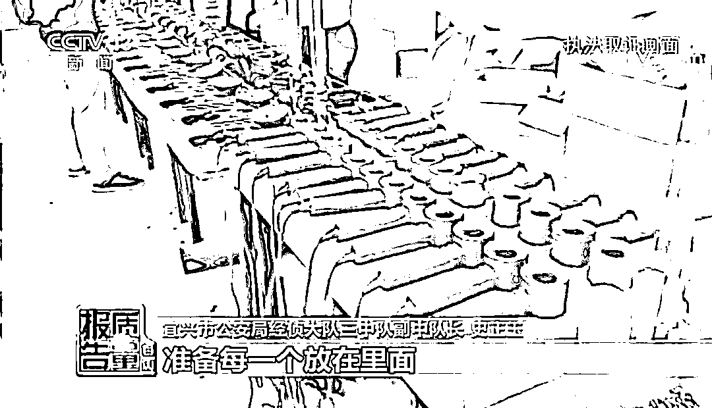

目前，涉案犯罪嫌疑人均已被移送起诉。

看到这里，网友气疯了，排队留言：严惩不法分子。

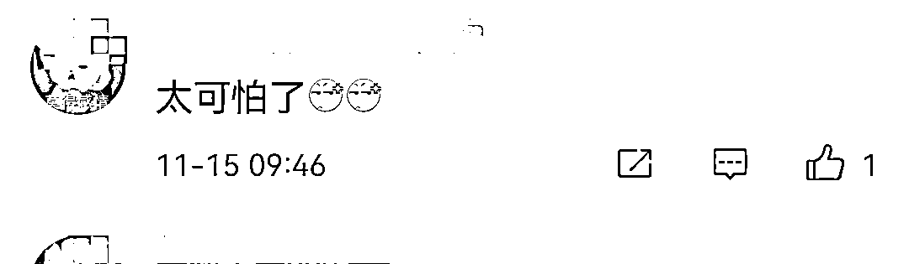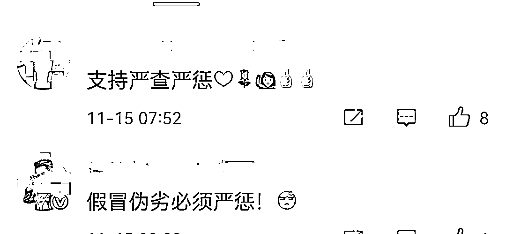

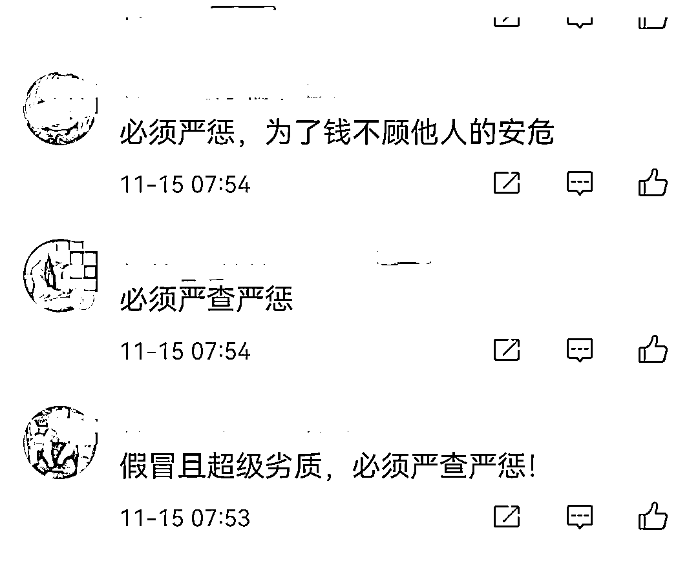

不法分子要严惩

但消费者们也要加强防范意识

近年来，售假事件层出不穷

就在前几天广州白云区刚查获了

一宗网络销售假冒知名品牌化妆品案件

11 月 5 日，广州市白云区查处了一宗网络销售假冒知名品牌化妆品案，**该涉事公司的 3500 余支“兰芝”“SKII”“雪花秀”“迪奥”等品牌的化妆品全是假冒产品，涉案值约 40 余万元**。

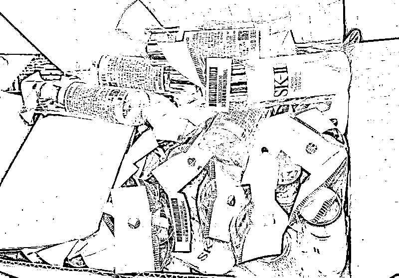

而在现场还翻出一大堆跟各种品牌授权书一模一样的“赝品印章”。

执法人员表示，这家涉事公司伪造了各种知名化妆品品牌方授权书，然后骗过某互联网团购平台资质审查，堂而皇之地在网上销售假冒化妆品。

“**消费者一定要注意，挂在网上的品牌授权书不一定是真的**，我们已发现过很多类似情况，因为平台要求提供货源合法渠道的进货证明和授权书，售假分子就用伪造应对。有时候，‘正主’找到平台投诉假货和售假商家时，不少网络平台本身缺乏鉴别能力，往往不会‘偏信’品牌方的一家之言，许多售假商家就这样蒙混过关，继续坑害消费者……”

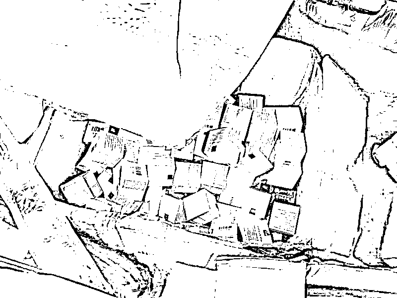

今年 3 月，上海市青浦区人民检察院以涉嫌假冒注册商标罪、销售假冒注册商标的商品罪、非法制造注册商标标识罪对 30 余名被告人提起公诉。

这个售假团伙**勾结正品专柜柜员**提供内部资料利用正品非法拆解制版、原材料生产制造、**跨境分销，“一条龙产业链”**制售假 LV 包分销至全国和境外**涉案金额高达 1 亿余元。**

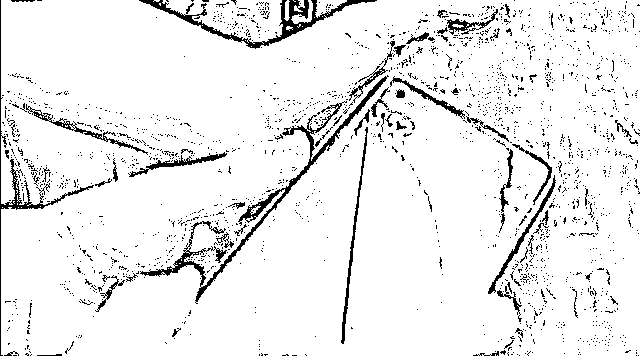

所以所有消费者， 

建议大家选择品牌官方渠道购买。

千万别为了省钱而选择所谓的折扣店

要知道现在网络上很多不法分子

都是瞄准了消费者的贪便宜心理作案。

来源 ：新闻晨报、央视新闻

← 向右滑动与灰产圈互动交流 →

