# 发霉、长毛、吃出虫卵！三只松鼠又出问题！

> 原文：[`mp.weixin.qq.com/s?__biz=MzIyMDYwMTk0Mw==&mid=2247524177&idx=2&sn=4fc6d56637756efc745aa3b520888694&chksm=97cb5469a0bcdd7f5760f4ea2d7f2ddcb09758d23298d0ff8d8c2a09b2efff7615490fad44d5&scene=27#wechat_redirect`](http://mp.weixin.qq.com/s?__biz=MzIyMDYwMTk0Mw==&mid=2247524177&idx=2&sn=4fc6d56637756efc745aa3b520888694&chksm=97cb5469a0bcdd7f5760f4ea2d7f2ddcb09758d23298d0ff8d8c2a09b2efff7615490fad44d5&scene=27#wechat_redirect)

“双 11”刚落幕，“网红食品第一股”三只松鼠的投诉就接踵而至

湖南人对美食的热爱有多深？

数据显示

2021 年京东“双 11”期间

**湖南人最爱的外省品牌前五分别为：**

**三只松鼠、农夫山泉、稻香村、百草味、五芳斋**

然而，“双 11”刚落幕 

“网红食品第一股”

**三只松鼠**的投诉就接踵而至

↓↓↓

** 11 月 12 日 **

▽

有网友在微博发文，“薇娅直播间买的三只松鼠每日坚果变质发霉”。

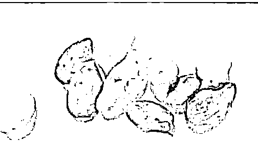

** 11 月 13 日 **

▽

又有网友发文称，天猫超市买的三只松鼠手撕面包“居然发霉”，照片显示深灰色块状霉斑清晰可见。

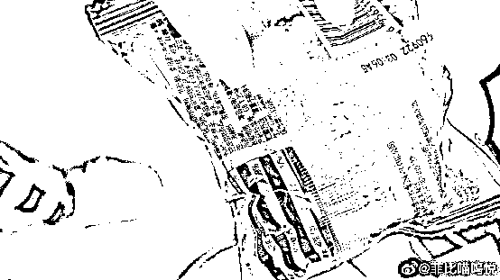

对此 

**三只松鼠方面回应**

↓↓↓ 

关于产品客诉具体由客服部门沟通

原因暂时不明

公司会内部调查，给消费者一个交代

实际上

仅 10 月以来

**三只松鼠在多个平台的食品问题**

**投诉就达数十起**

与居高不下的投诉伴随曝光的

还有三只松鼠营收下滑的消息

这个知名网红零食品牌

**到底怎么了？**

**牛肉粒板栗发霉“令人作呕”** 

** 巴旦木水果罐头吃出虫子 **

11 月 13 日，网友“菲比喵呜悦”在微博投诉，“天猫超市买的三只松鼠手撕面包居然是发霉成这样的……包装都没有打开哦，按照食品安全法不得赔 1000？？？”并配上了两张面包图片，霉点和大块霉斑清晰可见。

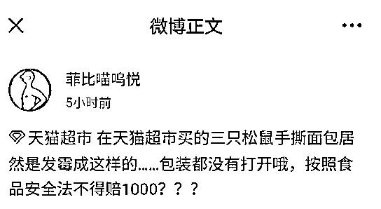

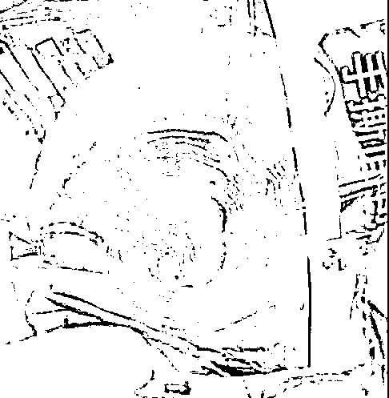

▲ 图源：@菲比喵呜悦

11 月 12 日，网友“三千天真”投诉，“**薇娅直播间买的三只松鼠每日坚果变质发霉”，且“商家死不承认”，**“说我已开袋的变质坚果无法作为证据，不能按照食品安全法进行赔偿”。

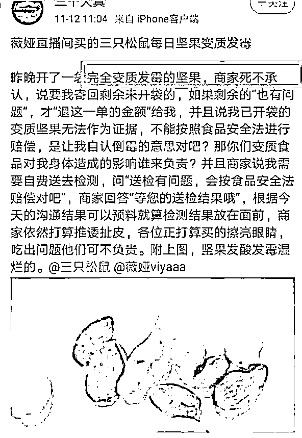

▲ 图源：@三千天真

11 月 6 日，网友“咪嘞个咻”投诉，“买了个三只松鼠的牛肉粒，**打开第一包就发霉了”**。从其配发图片看，牛肉粒大面积发霉长毛。

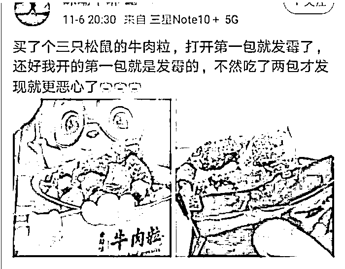

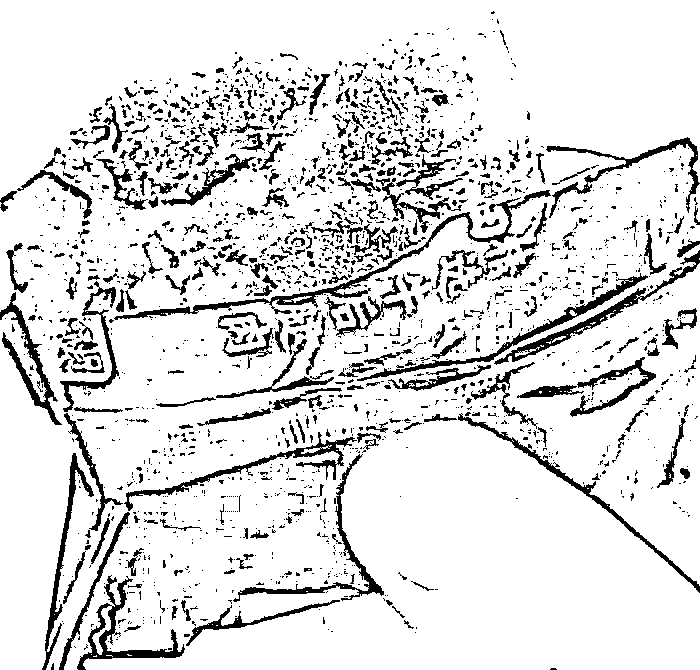

▲ 图源：@咪嘞个咻

黑猫投诉平台上的投诉也涉及产品发霉变质、长毛、“水果罐头吃出虫子”，巴旦木产品“吃出虫卵”等问题：

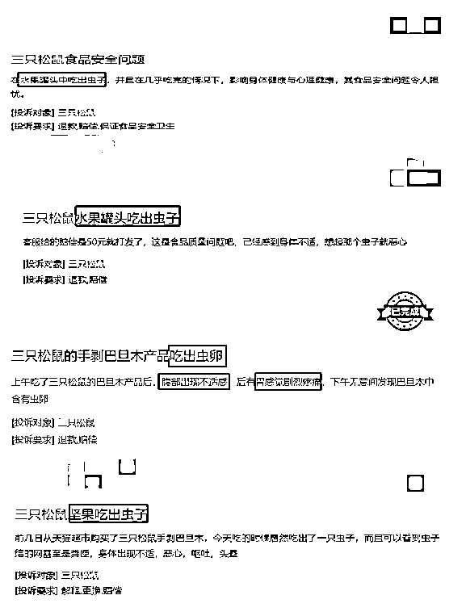

** 多次被食安部门通报 **

** 部分指标超标 340% **

记者进一步查询发现，**早在 2017 年，三只松鼠就曾因食品安全问题登上国家食品药品监督管理总局（现已合并到市场监管总局）的“黑名单”。**

2017 年 8 月 15 日，国家食品药品监督管理总局发布 3 批次食品不合格情况，其中就包括三只松鼠开心果，而不合格的原因为霉菌超标。

具体来看，此次检查为“抽检”，抽样单位名称为“天猫超市”，样品名称是**“****开心果”**，**不合格项目为“霉菌”**。霉菌检查结果为“70CFU/克”，而标准值上限是“25CFU/克”，三只松鼠该批次开心果霉菌超过标准值上限 180%。

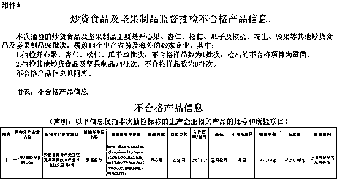

除此之外，天眼查数据显示，三只松鼠 2020 年 5 月 23 日生产的“开口松子”，在重庆某超市被抽查出不合格。**具体指标是“过氧化值”**，标准值是每 100 克不超 0.5 克，**但该批次抽查样品达到每 100 克 2.2 克，超标 340%。**

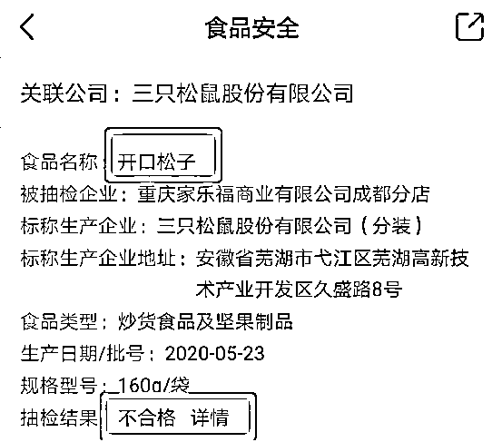

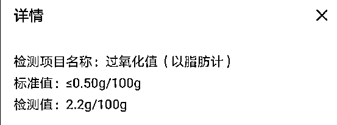

因为产品责任纠纷问题，三只松鼠屡屡与消费者发生诉讼，天眼查数据显示，**三只松鼠的各类司法和行政风险达到四百多条。**

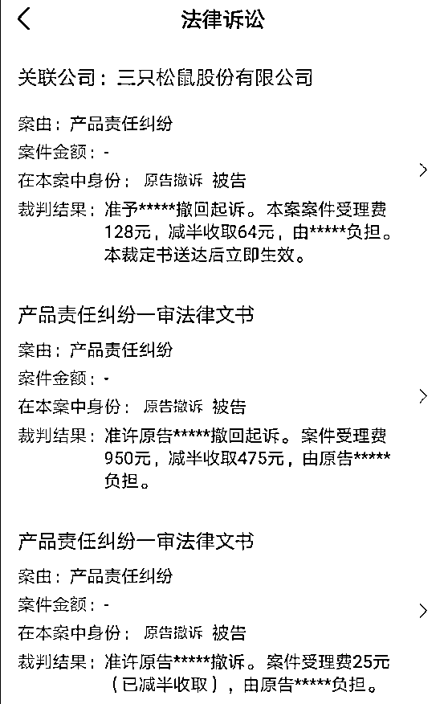

** 营销费用持续高增 **

**营业收入却下滑 **

三只松鼠是一家典型的靠营销驱动的公司。

2012 年 6 月，三只松鼠上线，此后 7 年踩中风口的三只松鼠“飞起来了”，总是以刷屏姿态出现在电视剧植入广告中及营销号推广，2020 年与薇娅的直播合作就超过 50 场……

在电商平台的流量加持下，**该品牌从一个初创小品牌逐渐成长为年营收破 100 亿的超级网红。与此同时，“推广费及平台服务费”持续高烧不退。**

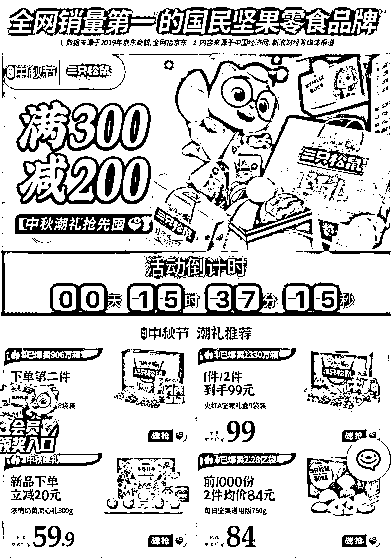

据统计，三只松鼠的“推广费及平台服务费”在 2017 年到 2020 年间分别是 2.87 亿元、3.93 亿元、6.60 亿元、9.61 亿元，同比涨幅依次为 36.93%、67.94%、45.61%。**而今年上半年，“推广费及平台服务费”已达到 7.21 亿元，相比去年同期的 3.98 亿元，激增 81%。**

但持续的营销费用投入，对销售额的拉动却出现了明显的递减。

数据显示，2018 年、2019 年，三只松鼠的营业收入分别为 70.01 亿元、101.73 亿元，同比分别增长了 26.05%、45.30%。然而，到了 2020 年，尽管“推广及平台服务费”增长 45%，但全年营业收入仅录得 97.94 亿元，较 2019 年下降了 3.72%，这也是其成立以来首次出现营收下滑的情况。

据今年 8 月报道，三只松鼠半年报数据显示，今年上半年，该公司实现营业收入 52.61 亿元，与上年同期持平。扣除非经常性损益的净利润为 2.64 亿元，虽然大幅增长 72.10%，**但与 2019 年同期相比，仅增长 236.47 万元。****这意味着，近 3 年公司主营业务净利润原地踏步，与休闲食品整体市场增幅差距拉大。**

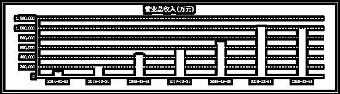

与持续烧钱做营销相比，**三只松鼠在产品上一直是外包，其实归根到底是靠着电商流量在做一门“贴牌生意”**：由多家供应商共同供货，然后统一贴上“三只松鼠”的品牌标签对外销售。

但这样的“贴牌模式”模式，天然决定了其没有能力深入到加工过程的每一个细节中，加之品类繁杂，质量管理难保不出现漏洞，这导致三只松鼠多次因产品质量问题而被用户投诉、被有关部门处罚。消费者不会关心究竟是哪家代工厂惹的祸，既然贴上了三只松鼠的品牌，那就得三只松鼠负责。其结果就是三只松鼠品牌知名度难以转化为品牌美誉度和忠诚度。

**你吃过三只松鼠吗？**

来源：上观新闻、中国基金报、经济日报、广州日报、长沙晚报

← 向右滑动与灰产圈互动交流 →

