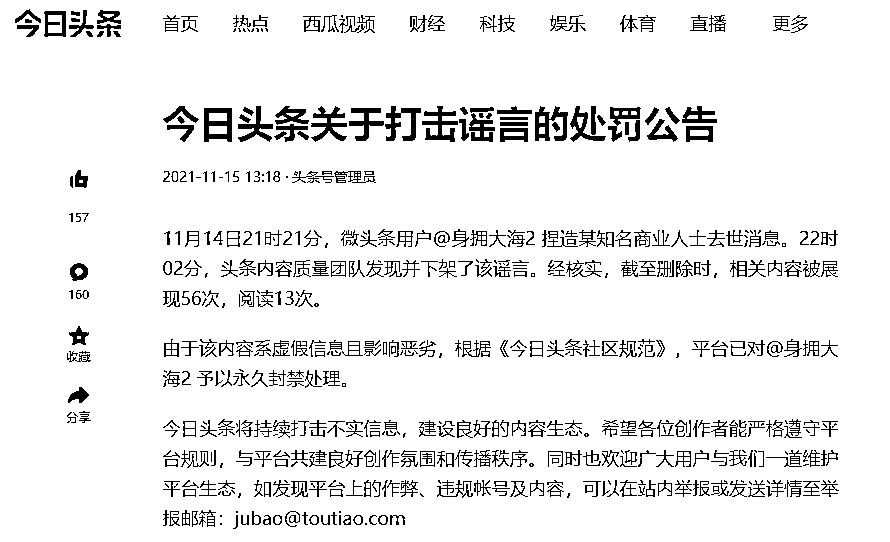
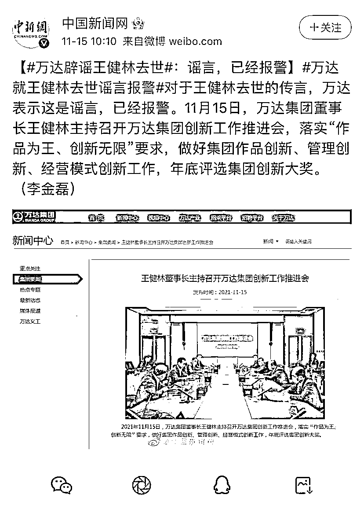

# 王健林去世？万达:已报警！

> 原文：[`mp.weixin.qq.com/s?__biz=MzIyMDYwMTk0Mw==&mid=2247524177&idx=3&sn=03266fb6da54b3a84b6a5856c522702d&chksm=97cb5469a0bcdd7fab9be2a35298cc2f2016620171f11dddc89c064ee70984eb5e5b0536ed66&scene=27#wechat_redirect`](http://mp.weixin.qq.com/s?__biz=MzIyMDYwMTk0Mw==&mid=2247524177&idx=3&sn=03266fb6da54b3a84b6a5856c522702d&chksm=97cb5469a0bcdd7fab9be2a35298cc2f2016620171f11dddc89c064ee70984eb5e5b0536ed66&scene=27#wechat_redirect)

[`mp.weixin.qq.com/mp/readtemplate?t=pages/video_player_tmpl&action=mpvideo&auto=0&vid=wxv_2137069190162235398`](https://mp.weixin.qq.com/mp/readtemplate?t=pages/video_player_tmpl&action=mpvideo&auto=0&vid=wxv_2137069190162235398)

澎湃新闻记者·编辑 仇依楠 素材来源 综合网络 责任编辑：李蕊

今天下午，头条号管理员发布《今日头条关于打击谣言的处罚公告》称，11 月 14 日 21 时 21 分，微头条用户@身拥大海 2 捏造某知名商业人士去世消息。22 时 02 分，头条内容质量团队发现并下架了该谣言。经核实，截至删除时，相关内容被展现 56 次，阅读 13 次。

由于该内容系虚假信息且影响恶劣，根据《今日头条社区规范》，**平台已对@身拥大海 2 予以永久封禁处理。**

平台截图 

**此前报道**

11 月 14 日晚间，有一则关于“万达集团董事长王健林先生去世”的谣言在网上流传。据中国新闻网 15 日报道，**对于王健林去世的传言，万达表示是谣言，已经报警。**

另据万达集团官网最新消息显示：11 月 15 日（即今日），万达集团董事长王健林主持召开万达集团创新工作推进会，并附有现场照片。

来源：澎湃新闻 

← 向右滑动与灰产圈互动交流 →

