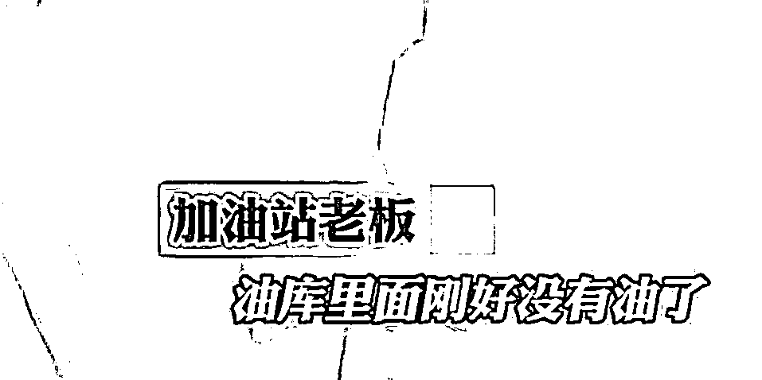
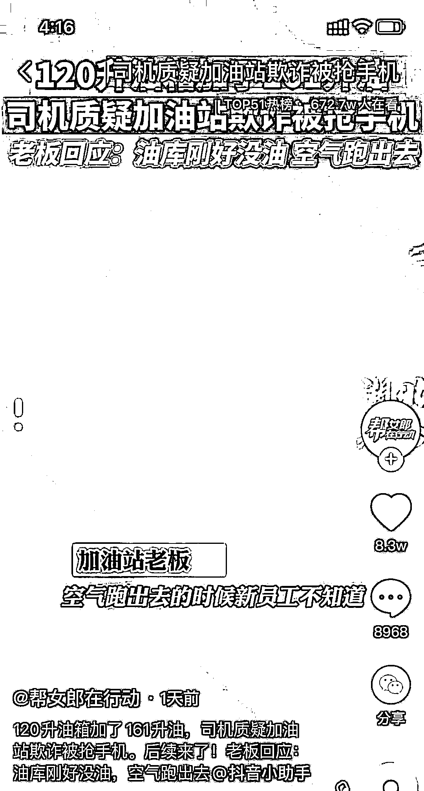
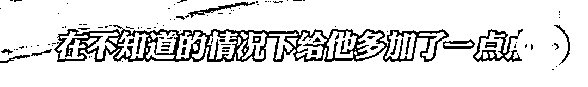
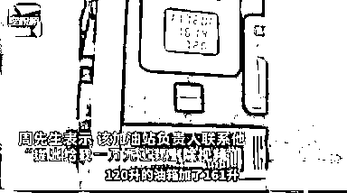

# 120 升油箱被加 161 升油！男子拍摄后加油站曾想花 1 万删视频！

> 原文：[`mp.weixin.qq.com/s?__biz=MzIyMDYwMTk0Mw==&mid=2247524177&idx=4&sn=ebc24c88ae1cd96a84847f56e0635838&chksm=97cb5469a0bcdd7f11d47ed748270912c424111ac0eca17c68e442786218e72279b3bd3e2f5f&scene=27#wechat_redirect`](http://mp.weixin.qq.com/s?__biz=MzIyMDYwMTk0Mw==&mid=2247524177&idx=4&sn=ebc24c88ae1cd96a84847f56e0635838&chksm=97cb5469a0bcdd7f11d47ed748270912c424111ac0eca17c68e442786218e72279b3bd3e2f5f&scene=27#wechat_redirect)

**120 升的油箱，加油站的加油机竟然显示加了 161 升汽油。**近日，有网友在网上发视频举报了这家位于四川省盐亭县黄甸镇的加油站。

[`v.qq.com/iframe/preview.html?width=500&height=375&auto=0&vid=f3308fl3tpk`](https://v.qq.com/iframe/preview.html?width=500&height=375&auto=0&vid=f3308fl3tpk)

近日，一货车车主拍摄的视频在网上流传，视频显示：一家加油站加油机显示已加油 161 升，而车主在旁边问加油站工作人员，我 120 升的油箱你给我加了 161 升，你加满了吗？

工作人员发现拍摄后，抢夺手机。加油站老板称，车主没有权利把员工拍摄进去。加油站老板表示，油缸里没有油了，空气跑进去的时候，新员工不知道，在不知道的情况下给他多加了一点。

车主表示，该加油站负责人联系他，**“提出给我一万元让我删除视频”。**

****

**车主随后发微博称，这家加油站位于四川省盐亭县黄甸镇。当地居民向记者证实，视频中的加油站就在该镇，加油站全名为“国际能源王程加油站”。**

****11 月 14 日，澎湃新闻记者从盐亭县市场监管局获悉，该局对视频反应的**情况进行调查，确认基本属实。目前，已对该加油站采取相应行政措施，案件正在进一步调查处理中。******

****据天眼查信息显示：盐亭黄甸镇王程加油站为个人独资企业，投资人姓严，主营：汽油、柴油、润滑油。2019 年 10 月 8 日，该加油站已被行政处罚一次，原因是“销售以不合法产品冒充合格产品”被盐亭县市场监管局罚款 18360 元，没收违法所得 1000 元。此前，该加油站还因擅自使用他人商品名称、包装、装潢相同或近似的标识被处罚款 3 万元。****

****来源 ：潇湘晨报综合澎湃新闻、星视频、湖北电视综合频道****

********

****← 向右滑动与灰产圈互动交流 →****

********