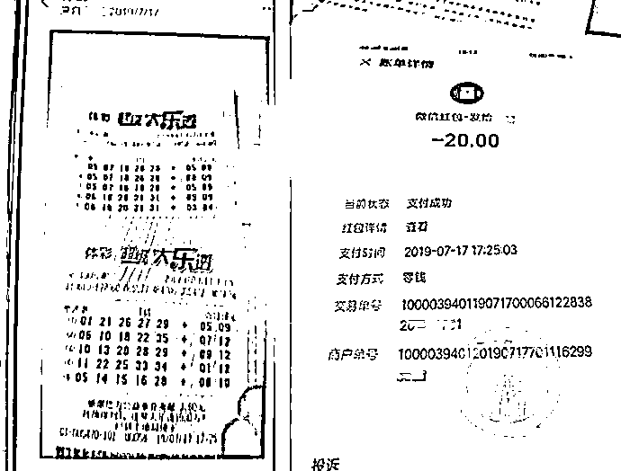
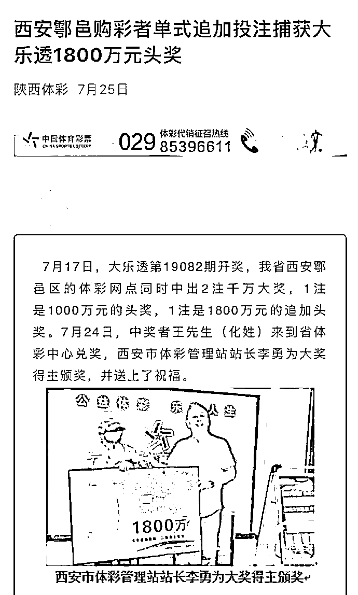
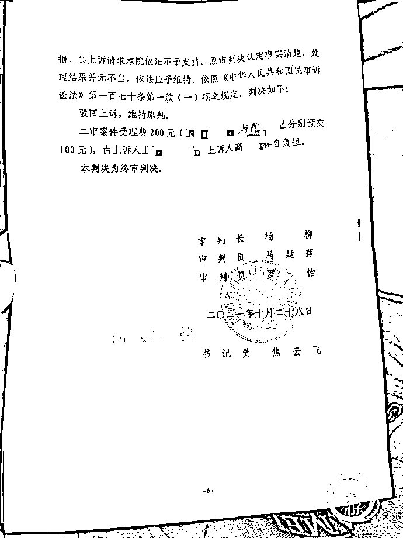

# 男子网购彩票中 1001 万竟归他人，将其告上法庭胜诉后，奖金没拿到还成失信人

> 原文：[`mp.weixin.qq.com/s?__biz=MzIyMDYwMTk0Mw==&mid=2247524177&idx=5&sn=f9158ed62de5772a15915a6e35220cbf&chksm=97cb5469a0bcdd7f730155356c669feebc06143bc0dde0630962d20b8a51d14adb9cffe833c7&scene=27#wechat_redirect`](http://mp.weixin.qq.com/s?__biz=MzIyMDYwMTk0Mw==&mid=2247524177&idx=5&sn=f9158ed62de5772a15915a6e35220cbf&chksm=97cb5469a0bcdd7f730155356c669feebc06143bc0dde0630962d20b8a51d14adb9cffe833c7&scene=27#wechat_redirect)

**花 20 元购买 10 注彩票中奖 1001 万元，**西安市民姚先生兴奋不已；但投注站老板告诉他，那张中奖彩票不是他的，并因自己的错误向姚先生致歉，**还签署了一份价值 15 万元的《赔偿协议》。**

感到疑惑的姚先生将投注站老板、彩票领奖者及陕西省体育彩票管理中心告上法庭。

这场历时 700 多天的诉讼，近期终于有了结果，西安市中级人民法院终审做出判决，**购彩者姚先生胜诉。**

11 月 15 日，姚先生告诉记者，虽然他赢了这场彩票纠纷案的官司，**但至今，他仍无法拿到彩票和奖金。也因此事，姚先生被列入被执行人名单，成为了失信人。**

他说，他正准备报警，控告投注站老板和彩票领奖者涉嫌诈骗，以此方式维护自己的权益。

▲投注站老板发给姚先生的彩票及姚先生的转账截屏。拼图来源/当事人提供

**投注站老板表哥领走巨额奖金**

姚先生今年 40 岁，在陕西西安市鄠邑区打工，月入 3000 元左右，长期有购买彩票的习惯，与投注站老板王某相熟。

王某夫妇二人在西安市鄠邑区国土资源局鄂邑分局东侧共同经营一家中国体育彩票站。

记者通过已有判决获悉此事经过。

2019 年 7 月 17 日下午 13 时，他人在王某处购买自选彩票，因王某未按要求出票，于是多出了一张五注价值 10 元彩票。17 时 25 分，姚先生向王某发送 20 元微信红包，并注明“机选大乐透 10”，王某将该彩票和一张机选五注彩票照片一并通过微信发送给姚先生。

当晚，开奖后，该彩票中奖。

姚先生向王某索要彩票时，王某称，因自己失误将他人彩票错发给姚先生。

次日，姚先生到陕西省体育彩票管理中心查明彩票出票时间与自己购买彩票时间不一致。

经协商，王某赔偿姚先生精神损失 15 万元，双方签订了协议，王某给付 7 万元，余款 8 万元向姚先生出具借条。

**同年 9 月 5 日，高某领取涉案彩票奖金 801 万元。**

**姚先生告诉记者，高某其实就是王某的表哥。**

姚先生得知此事后，于同年 9 月 9 日，将王某夫妇、高某及陕西省体育彩票管理中心告上法庭，请求法院判令中奖彩票所有者为姚先生。

▲涉事投注站一日出了两张巨奖彩票，当地媒体的关于不是一个人中了两个大奖的报道，这让姚先生起了疑心。图片来源/网络截图

**一审判决**

**中奖彩票属网购彩票人**

就在这场中奖彩票所有权确认纠纷案审理期间，2020 年 6 月 23 日，姚先生又另向法院起诉，希望法院判令他与王某此前达成的《赔偿协议》无效。

姚先生说，自己是在被蒙骗的情况下签署了这份《赔偿协议》。

一审法院审理认定，王与姚二人签署的《赔偿协议》无效。对此，王某夫妇不服，提出上诉。**法院二审维持了《赔偿协议》无效的原判决。**

今年 5 月 14 日，这场中奖彩票所有权确认纠纷案也迎来了一审判决，鄠邑区人民法院依照《合同法》有关规定，**判决确认中奖彩票为姚先生所有。**

一审法院认为，民事主体从事民事活动，应当遵循诚信原则，恪守承诺。该案中，姚先生通过微信转账支付票款，王某收款后将等额彩票投注号码拍照发给姚先生，双方交易合意已经达成一致，且符合此前交易习惯，王某应按照约定交付相应的彩票。

王某辩称，已将涉案中奖彩票销售给高某，而失误拍照发送给了姚先生，但不能提供相应的证据证明双方购买彩票过程，也没在开奖前发现并及时告知姚先生，且未向姚先生告知涉案彩票为高某所有，与常理不符。

王某又辩称，姚先生微信转款附言“机选大乐透 10”是购买 10 元彩票，与实际转款 20 元相矛盾，故对王某的辩称理由一审院不予采信。

▲10 月 28 日，西安市中级人民法院终审判决，中奖彩票所有权归姚先生。摄影/上游新闻记者 贾晨

**终审胜诉，却拿不到钱**

一审判决后，王某夫妇不服提出上诉。

王某夫妇认为，一审法院未依法查明和认定案件事实，适用法律错误，完全违背法律的本意；对另案判决直接引用，未经质证。请求法院撤销原审判决，驳回姚先生的诉请。

领走奖金的高某也上诉认为，对彩票的所有权如有争议，法院作出确认，应当是在争议彩票兑奖前作出，在彩票已经兑奖后，法院不能、法律也不允许作出诉争彩票的归属判决。因此，一审判决认定事实不清、适用法律不当。

陕西省体育彩票管理中心则认为，这场纠纷与自己无关，陕西省体育彩票管理中心不应承担任何责任。

姚先生认为，一审判决合法，应维持原判。

**今年 10 月 28 日，西安市中级人民法院做出终审判决，维持原判。中奖彩票所有者为姚先生。**

西安市中级人民法院认为，本案中，姚先生通过微信转账支付票款，王某收款后将等额彩票投注号码拍照发给姚先生，双方交易合意已经达成一致，且符合此前交易习惯，王某应按照约定交付相应的彩票。原审法院确认该彩票的所有者为姚先生，并无不妥。

而王某等的上诉理由缺乏依据，法院依法不予支持。

然而，11 月 15 日，姚先生告诉记者，**虽然他赢了这场彩票纠纷案的官司，但至今仍无法拿到彩票和奖金，自己也惹上了麻烦。**

此前，因此事，法院判令王、姚二人签订的《赔偿协议》无效，**姚先生需退还王某曾支付的 7 万多元赔偿款，但姚先生认为，自己的千万奖金都未拿到，自己为何要先给对方钱。**

今年 10 月 8 日，姚先生因此事被法院列入被执行人名单，**成为了失信人。**

对此，姚先生说，他十分苦恼。他正准备报警，控告投注站老板和彩票领奖者涉嫌诈骗，以此方式维护自己的权益。

记者多次致电王某，但其电话始终无法接通。

来源 ：上游新闻，潇湘晨报

← 向右滑动与灰产圈互动交流 →

