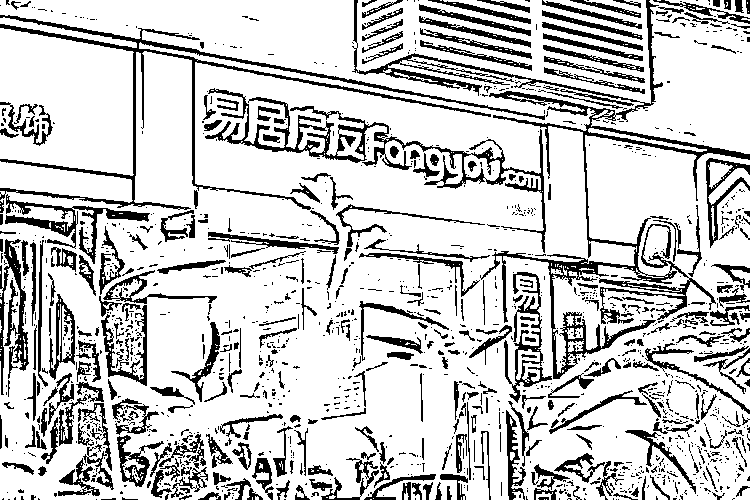
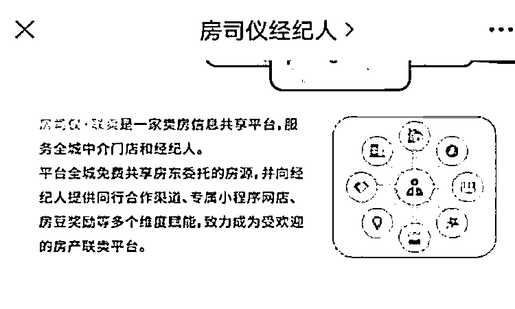

# 房子刚挂牌电话就被打爆！记者调查：有暗网

> 原文：[`mp.weixin.qq.com/s?__biz=MzIyMDYwMTk0Mw==&mid=2247524177&idx=6&sn=6db07cda5f888da09fd036da79ad0b9a&chksm=97cb5469a0bcdd7fa9773ac28d0345d7ea4029db8c1c2117f3fd3224bad5c67cfa7cca01705f&scene=27#wechat_redirect`](http://mp.weixin.qq.com/s?__biz=MzIyMDYwMTk0Mw==&mid=2247524177&idx=6&sn=6db07cda5f888da09fd036da79ad0b9a&chksm=97cb5469a0bcdd7fa9773ac28d0345d7ea4029db8c1c2117f3fd3224bad5c67cfa7cca01705f&scene=27#wechat_redirect)

##### 从未在房产中介登记过要出售房屋，但陈女士一家却在**一天内接到了 50 次骚扰电话**：您 XX 路的房子，现在卖吗？

##### 

##### 这些房产中介不仅了解陈女士一家的手机号、座机号，还能详细报出陈女士家的房屋面积和门牌号。**自家的房产信息究竟是如何泄露的？房产经纪人又为何会一夜之间集体获知了她家的信息？**

[`mp.weixin.qq.com/mp/readtemplate?t=pages/video_player_tmpl&action=mpvideo&auto=0&vid=wxv_2136515576024956930`](https://mp.weixin.qq.com/mp/readtemplate?t=pages/video_player_tmpl&action=mpvideo&auto=0&vid=wxv_2136515576024956930)

###### 房屋未挂牌却一天接了 50 个中介电话。视频来源：张益维

## **自述：一天接了 50 个中介电话** 

叮铃铃，电话铃声又一次响起——

陈女士：“我应该没有在你这边挂过房子！”

某房产经纪人：“现在房源都是互通的。你是哪里的房子在卖？”

陈女士：“你都不知道我哪里的房子在卖，就给我打电话？”……

2021 年 6 月至 8 月，类似的对话，陈女士一家已数不清进行了多少次。

对于生活在杨浦区老公房中的陈女士一家而言，6 月 17 日原本只是寻常的一天。他们正在居住的这套房子的户主是陈女士父亲，一家人在这间房子中生活地很惬意，从未想过要将这套房屋挂牌出售。 

然而，**当天上午 11 时 33 分，一通突如其来的电话，打破了一家人宁静的生活。**

来电者是一名房产经纪人，她自称来自于 21 世纪不动产杨浦区某门店。电话中，她开门见山地询问陈父，是不是要卖掉正在居住的房子。

一开始，陈父以为对方只是打错了电话。然而，仔细询问后却发现，对方不仅能详细报出他的门牌号，还能够详细说出他家的房屋面积。

紧接着，中午 11 时 41 分、11 时 47 分、11 时 48 分、11 点 50 分、11 时 52 分……最初的那通电话，仿佛是一个进军的号角，大量来自房产中介的电话蜂拥而来，不断“轰炸”陈女士家的座机以及陈父的手机。**仅 20 分钟内，陈家人的电话、手机铃声便接连响起了 10 次。**

###### ▲陈女士父亲接到的房产中介骚扰电话

###### 

当天，持续不断的电话铃声，从上午 11 点 33 分持续响到了晚上 19 点 51 分，接连响了 50 次。这 50 通电话无一例外都在重复询问同一个问题：您 XX 路的房子，现在卖吗？

“不卖！”伴随着一声又一声的电话铃，陈女士一家的回复越发焦躁。

然而，无论陈女士多少次和中介强调自家的房屋不卖，挂断一通电话，总会有下一通电话铃声再次响起。这样的状态，持续了一个多月，甚至在 5 个月后的如今，陈女士一家仍会时不时接到房产中介打来的咨询电话。

“能不能不要再给我们打电话了？”陈女士在电话中反复强调。

然而，这些房产经纪人告诉陈女士，由于他们来自不同的房产中介公司，即使一家将内网中陈女士家的房屋下架，也会有别的房产中介再次打电话过来。因为陈女士家的房产信息，已经被公开了。

这些房产中介中，有人自称来自中原地产、有人自称来自易居房友、有人自称来自 21 世纪不动产……还有一些人报出的房产中介公司名字，是陈女士听都没听到过的。

## **疑问：是谁泄露了信息？** 

在一次又一次的接通和挂断中，崩溃的陈女士愈发想弄清楚一个问题：这些房产中介，是怎么获知她家信息的？

她将这个问题，抛给了来电的诸多房产中介公司。

6 月 17 日当晚，一个自称来自中原地产杨浦某店的中介人员告诉陈女士，她是从公司内网上看到陈女士家房屋信息的。据她猜测，泄露陈女士家房屋信息的，可能是“其它公司”。

“我们这边只有一个人打过您电话，所以说源头可能是其它公司放出来的。”这名房产中介人员建议陈女士将第一个打电话过来的房产中介人员手机号在网上查一下，“如果是正规公司打过来的话，上网基本都能查到这个人是谁，叫什么名字。”

另一名自称来自中原地产的房产经纪人则告诉陈女士，挂在中原地产内网的信息，可能来自“对盘群”。

“打不通电话或者房东不接电话（的房子），一般都是‘对盘群’出来的房子，如果是我们店自己接到的盘，都会有委托的。”这名房产经纪人说。

“我怀疑我可能是被很小的中介恶搞了，您觉得，我怎样才能找到这个信息呢？”陈女士问。

“我实在没办法查到是哪个中介，‘对盘群’有好多中介，（陈女士家的房屋信息）基本上十几个中介都会有。“对方回答。

在一名自称来自亿誉（音）地产的房产中介看来，房产中介们集体获悉某个挂牌房屋的信息，并不稀奇：“只要您挂在外面，（我们）都会有这套。”

## **测试：登记售房后 10 分钟电话被打爆** 

陈女士告诉记者，这已不是她第一次碰到房屋信息被房产经纪人共享的情况了。此前，她在帮助亲人售卖另一套房屋时，刚在一家房产中介公司挂牌后没多久，就有多个不同的房产中介打电话给她，要求看房。

陈女士推测，房产中介间或有某种类似“内网”的交换渠道存在，让售房业主们的个人信息，在这些房产中介面前，暴露无遗。

房屋中介间是否存在这样一个“内网”？陈女士家的房屋信息又是如何泄露的？不核实产证信息就可以登记售房吗？

为了解情况，晨报记者随机挑选了陈女士家附近一家中介公司——同策好房，随机编造了一套房屋信息，表达了售房意愿。

### **发现一：未核实产证便登记售房** 

得知记者有出售房屋的意愿后，房产中介人员热情地接待了记者。紧接着，让记者没想到的一幕发生了。

###### ▲记者随机挑选了一家同策好房尝试挂牌

###### 

在仔细询问了记者房屋地址后，同策好房的工作人员在该公司电脑中的某个系统内搜索了一番，这套房屋的详细信息赫然出现在了这个系统中，信息详尽到这套房子的面积、户主姓名以及联系电话。在系统中，这套房子被备注为“信息盘”。

上述经纪人告诉记者，这些信息之所以会存在该公司的系统内部，并不是因为曾有业主试图卖房，而是“整个小区一起录入的”。

**“它是整个小区一起导进去的。”这名房产经纪人说。**

**至于“一整个小区”的房屋信息从何而来，这名房产经纪人并没有解释。**

尽管记者没有提供任何产证信息，随口说的房屋面积大小以及记者本人的电话号码也都与该公司系统内的信息不符，但这名经纪人还是进行了售房登记。登记后，这家房产中介的几名经纪人反复确认了记者的电话是否能够打通。

“今晚，我相信你的电话要被打爆。”确认电话能打通后，一名经纪人笑言。

“这个信息不是在你们公司内部登记吗？打电话的都是你们的人吗？”记者问。

“是我们同策的，但我不能保证，不是我们同策的人也会知道你的电话。就像一个房子挂在某某网上，全世界都知道你的电话了。”这名经纪人说。

果然，正如这名经纪人所言，在记者离开这家门店 10 分钟后，记者的电话就被杨浦区的房产经纪人们打爆了。

### **发现二：房产中介电话蜂拥而来**

11 日 6 日 15 时 42 分，记者离开了同策好房房产中介公司。15 时 50 分，记者的电话随即被一个标记为房产中介的号码打响。随后，数十个房产中介的电话蜂拥而来。

**当日 15 时 50 分至 18 时 15 分，记者一共收到了 15 通来电，接通或回拨了其中的 12 通。**

记者接通的这 12 通电话，无一例外来自于房产中介公司。除了同策好房外，房产中介们自报家门包括：21 世纪不动产、中原地产、易居房友、泓拓（音）地产、六新（音）地产、新城（音）地产等。

对于从何处得知记者售房信息一事，每个人说法不一。 

15 时 50 分打通记者电话、自称易居房友的房产中介人员说，他之所以能得到记者的电话，是因为“可能别人收集了”。“这说明我们公司比较有实力，是吧？”这名中介小哥有些洋洋得意。 

另一通电话中，自称来自易居房友另一家门店的中介人员，对记者表示了同情：“是呀，这个信息怎么都出来啦，而且你接下来可能还会接到一些电话的。” 

第三位自称来自易居房友的房产中介人员告诉记者，记者提供的信息是“系统自动登出来的”：“是系统上登记的，下午 15 点 46 分挂的。”

###### ▲先后有 3 名自称来自易居房友的中介人员拨打记者电话

###### 

如果这名中介小哥所言不虚，那么，大约记者离开同策好房 3 分钟后，记者提供的信息就已被公开。

“它（同策好房）不可能只挂内网，如果只挂内网，我们怎么能拿到？现在基本资源好一点的公司都有了。”这名中介小哥说。

对于信息到底是如何流传的，自称来自另一家同策好房的房产中介人员，给出了比较明确的答案，他说：“可能是店里的‘对盘手’给对出来了，因为房子都是房源共享的。上海中介都是一样的，房源共享。”

与想象的不同，这名房产经纪人说，中介们赖以沟通消息的渠道并非“内网”，而是一个微信群。

**“是一个内部的微信群，每家店都有一个‘对盘手’，每个‘对盘手’都会入那个群，一般人是进不去的。”**

这个说法得到了一名自称来自中原地产房产经纪人的佐证，这名经纪人也表示，信息来自一个微信群：“是一个互通群，他发到群里面的。”

据统计，11 月 6 日当日，记者共计接到了 23 个电话，在接下来的两日，记者又接到了 17 个电话。

###### ▲记者接到的房产中介电话列表

###### 

尽管每个中介对消息的来源解释各不相同，不过在一个问题上，中介们的说法非常统一，他们说，目前能拿到记者提供信息的只有房产经纪人，且不同公司的房产经纪人之间，没有合作售房的关系。

## **调查：“共享房源”严重泄露个人信息** 

无论是在与陈女士，还是和记者的沟通中，房产经纪人都反复提及了两个概念——“房源共享”和“对盘群”。

那么，什么是“对盘群”？房产经纪人们又是怎样“共享房源”的呢？这样的“房源共享”，是否获得了售房者的授权？

### 如何共享？微信群、小程序渠道多样！ 

究竟什么是“对盘群”？网上不乏有人提问求解，但回复者廖廖。

仅有的回答中，对方把“对盘”描述为“交换信息，统一口径”。不过，尽管对“对盘”这一概念解释不多，但创建“对盘群”，招募房产中介的消息却不少。

从这些招募信息看来，“对盘群”与此前同策好房等房产中介的描述一致，是房产中介相互间交换房源信息的通道。

在百度“上海房产吧”内，有不少人发帖招募房产中介加入“对盘群”。在一则名为《徐汇对盘群，留号码，拉你进群合作共赢》的帖子下方，不少人留下了自己的微信号。 

一名自称是来自“美凯龙爱家”的网友在留下微信号的同时表示：“可以看全上海的小区楼盘和室号，号码看不到，需要对盘”。

在《对盘群来了，对盘群，自己扫码进》的帖子中，发帖者不仅留下了群二维码名片（现已失效），还截图了群内的聊天记录。从聊天记录中，可以清晰看到房产中介间交换房源信息的情形：

”今日房源，馨佳园十一街坊，1X 号 XXXX，74 平，378 万，X 先生，177XXXXXXXX。“（记者注：为保护个人隐私，本文隐去敏感信息，统一以 X 代替）

”同策好房浦东新区：浦东-碧云东方公寓-0X-XXXX，150XXXXXXXX“……

记者调查发现，“房源共享”行为，在房产经纪人圈内并不稀奇，除了“对盘群”外，还有多种 APP 小程序声称提供“房源合作”服务。

例如，一个名为“一房一万房产经济资源共享平台”的 APP，就声称可提供“同行资源合作”服务，该 APP 需要注册人提供真实姓名、经济人名片、身份证号以及邀请码方可注册使用。同样声称提供“同行合作渠道”的小程序还有“房司仪经纪人”小程序以及“享家经纪人”小程序等。

###### ▲“房司仪经纪人”小程序的介绍

###### 

“房司仪经纪人”小程序声称：“平台全城免费共享房东委托的房源，并向经纪人提供同行合作渠道；诚邀您将有独家销售权或可控合作的房源，发布上架至【同行合作】板块，拓宽合作渠道，共享至全城同行快速合作。”

“享家经纪人”小程序声称：“现在中介之间的房源基本都是相互合作共享的。”“享家经纪人中介房源合作管理系统”的功能之一，即是“房源查找与房源合作分享”，其主要功能为“中介之间资源共享，提高房源成交转化率”。

由于“一房一万房产经济资源共享平台”、“房司仪经纪人”小程序、“享家经纪人”小程序均要求注册者为经纪人，并要求提供名片、身份证等信息，记者无从得知这些程序中所交换的“共享房源”，是否获得了房东授权。

不过，在一款不要求提供使用者身份的小程序“神房”中，记者看到，确有部分小程序，可供人在不经房东允许的情况下，随意发布“合作房源”信息。在这类小程序中，许多业主的房屋信息和个人电话，被完全暴露给了所有房地产经纪人。

### **有何危害？房东个人信息泄露严重**

和许多面向经纪人的房源查找小程序相似，“神房”小程序提供从各类业主可能自行发布房源的网站上收集房源的服务。使用者只要每个月支付 20 元至 30 元，就可以随意浏览“神房”小程序从诸如 58 同城、百姓网等平台上集纳的房源信息。

###### ▲使用者在“神房”小程序充值后就可浏览房源信息

###### 

此外，使用者还可以自行录入房源。使用者主动录入的房源，会出现在“神房”小程序“合作售房”板块。

在这个板块上，记者看到了大量详细至门牌号、业主电话的房源信息，记者随机拨打了 15 个电话，其中 7 个电话为中介或疑似中介接了电话，4 个电话没有打通或被直接挂断，另有 5 个电话为售房者本人电话，这 5 名售房者无一例外对自己的房源信息、个人电话被公开在“神房”小程序一事，一无所知。 

###### ▲不少售房者对房源和个人信息被公布一无所知

###### 

“我这边没房子在卖。”一名电话被公开的“售房者”，似乎已不是第一次接到此类问询电话。对于此类电话非常厌倦。无论记者问什么，她都不断重复着相同的回复：“我这边没有房子在卖。”

另一名售房者则对接到电话十分疑惑，他告诉记者，尽管他确实在附近有房子售卖，但记者报出的房屋大小、门牌号、售价均与他正在售卖的房子不符，他本人也从未或允许任何人在“神房”小程序上挂过自己的房子。

反应最激烈的“售房者”，当属售房点被标记在浦东新区某小区的一位爷叔。他似乎已被骚扰得十分不耐烦。记者刚一询问，这位爷叔就情绪激烈地“怼”了回来：“我不卖可以吧？我这房子关你什么事？我就不给你们卖！”

记者实测发现，无需任何审核，所有人都可以将房源信息上传到“合作售房”板块，上传的内容可以详细至联系方式、门牌号等。一旦上传，该信息立刻会被所有付费使用“神房”小程序的用户们看到。 

由于此类平台的用户大多是四处寻找房源的房产中介，一旦有人将他人的个人信息恶意曝光在此类平台，那么，对于被曝光者而言，等待他们的就会是无穷无尽的骚扰。

## **律师说法：房产中介交换个人信息不合法**

根据 2021 年 11 月 1 日施行的《个人信息保护法》，“个人敏感信息”是指那些一旦泄露可能对个人的人格尊严、人身或财产安全造成危害的个人信息，比如生物识别信息、特定身份、金融账户、行踪轨迹等等。

在北京观韬中茂（上海）律师事务所葛志浩律师看来，虽然法律并未将联系电话和家庭住址等信息列举为敏感个人信息，但是，以家庭地址为例，如果这一信息的泄露在现实中导致个人的人身安全有遭受侵害的可能，那么理论上也应当归属于敏感信息之列。

葛志浩律师明确指出，在未获得用户授权的情况下，房产中介之间交换房屋信息不合法。

从《个人信息保护法》的立法宗旨来看，个人信息非经授权不得使用是基本原则，然而在大多数案例中，中介之间交换的房屋信息并没有做到让用户应知尽知，更谈不谈上授权，因此，在未获得授权的情况下，这些所谓以房源合作为目的进行个人信息交换的群体或平台都不具备合法性。

如果房产中介确需交换个人信息，葛志浩律师认为，房产中介应当征得用户的授权，而且这一授权应当是明确、具体的，不仅要对交换目的进行释明，同时还需要就接受个人信息一方的具体联系人、联系方式等信息向用户告知，以确保用户对自己信息流向有清晰的掌握。

事实上，近年来，房产中介因交换、出售个人信息获刑的案例很多。据媒体报道，2020 年，江苏省昆山两名房产经纪人，就因相互之间大量交换他人姓名、电话号码、小区名称、房屋面积、联系方式、门牌号等公民个人信息，均被判处有期徒刑七年，并处罚金人民币 2000 元。

据悉，针对上述房地产经纪企业存在交换、泄露个人信息行为，日前，宝山区检察院已联合区公安分局、区委网信办、区消费者权益保护委员会，共同签署宝山区《个人信息保护协作意见》。同时，召集 30 家房地产经纪企业代表召开宝山区房地产经纪企业个人信息保护综合治理会议。会上，30 家宝山区房地产经纪企业分别签署了个人信息保护《承诺书》，对今后严格守法、坚持最小必要原则、不利用大数据“杀熟”等作出郑重承诺。

来源 ：周到 APP，潇湘晨报

← 向右滑动与灰产圈互动交流 →

