# 现场脱内裤，当街性暗示……恭喜，她终于被封杀了

> 原文：[`mp.weixin.qq.com/s?__biz=MzIyMDYwMTk0Mw==&mid=2247524242&idx=1&sn=f850a6837631f7bb2b0597c96fcc6a33&chksm=97cb54aaa0bcddbcc18b99e5e0bbbf3463a28e5b46c12763adbbb097d060b14af691911d39da&scene=27#wechat_redirect`](http://mp.weixin.qq.com/s?__biz=MzIyMDYwMTk0Mw==&mid=2247524242&idx=1&sn=f850a6837631f7bb2b0597c96fcc6a33&chksm=97cb54aaa0bcddbcc18b99e5e0bbbf3463a28e5b46c12763adbbb097d060b14af691911d39da&scene=27#wechat_redirect)

# 

169\. Don\\\\\\ t let yesterday use up too much of today. 别留念昨天了，把握好今天吧。(Will Rogers) 170\. If you are not brave enough, no one will back you up. 你不勇敢，没人替你坚强。171\. If you don\\\\\\ t build your dream, someone will hire you to build theirs. 如果你没有梦想，那么你只能为别人的梦想打工。172\. Beauty is all around, if you just open your heart to see. 只要你给自己机会，你会发现你的世界可以很美丽。173\. The difference in winning and losing is most often...not quitting. 赢与输的差别通常是--不放弃。(华特·迪士尼) 174\. I am ordinary yet unique. 我很平凡，但我独一无二。175\. I like people who make me laugh in spite of myself. 我喜欢那些让我笑起来的人，就算是我不想笑的时候。176\. Image a new story for your life and start living it. 为你的生命想一个全新剧本，并去倾情出演吧！177\. I\\\\\\ d rather be a happy fool than a sad sage. 做个悲伤的智者，不如做个开心的傻子。178\. The future belongs to those who believe in the beauty of their dreams. 未来属于那些相信梦想之美的人。(埃莉诺·罗斯福) 179\. Even if you get no applause, you should accept a curtain call gracefully and appreciate your own efforts. 即使没有人为你鼓掌，也要优雅的谢幕，感谢自己的认真付出。180\. Don\\\\\\ t let dream just be your dream. 别让梦想只停留在梦里。181\. A day without laughter is a day wasted. 没有笑声的一天是浪费了的一天。(卓别林) 182\. Travel and see the world; afterwards, you will be able to put your concerns in perspective. 去旅行吧，见的世面多了，你会发现原来在意的那些结根本算不了什么。183\. The key to acquiring proficiency in any task is repetition. 任何事情成功关键都是熟能生巧。《生活大爆炸》 184\. You can be happy no matter what. 开心一点吧，管它会怎样。185\. A good plan today is better than a perfect plan tomorrow. 今天的好计划胜过明天的完美计划。186\. Nothing is impossible, the word itself says \\\\\\ I\\\\\\ m possible\\\\\\ ! 一切皆有可能！“不可能”的意思是：“不，可能。”(奥黛丽·赫本) 187\. Life isn\\\\\\ t fair, but no matter your circumstances, you have to give it your all. 生活是不公平的，不管你的境遇如何，你只能全力以赴。188\. No matter how hard it is, just keep going because you only fail when you give up. 无论多么艰难，都要继续前进，因为只有你放弃的那一刻，你才输了。    When Paul Jobs was mustered out of the Coast Guard after World War II, he made a wager with his crewmates. They had arrived in San Francisco, where their ship was decommissioned, and Paul bet that he would find himself a wife within two weeks. He was a taut, tattooed engine mechanic, six feet tall, with a passing resemblance to James Dean. But it wasn’t his looks that got him a date with Clara Hagopian, a sweet-humored daughter of Armenian immigrants. It was the fact that he and his friends had a car, unlike the group she had originally planned to go out with that evening. Ten days later, in March 1946, Paul got engaged to Clara and won his wager. It would turn out to be a happy marriage, one that lasted until death parted them more than forty years later. Paul Reinhold Jobs had been raised on a dairy farm in Germantown, Wisconsin. Even though his father was an alcoholic and sometimes abusive, Paul ended up with a gentle and calm disposition under his leathery exterior. After dropping out of high school, he wandered through the Midwest picking up work as a mechanic until, at age nineteen, he joined the Coast Guard, even though he didn’t know how to swim. He was deployed on the USS General M. C. Meigs and spent much of the war ferrying troops to Italy for General Patton. His talent as a machinist and fireman earned him commendations, but he occasionally found himself in minor trouble and never rose above the rank of seaman. Clara was born in New Jersey, where her parents had landed after fleeing the Turks in Armenia, and they moved to the Mission District of San Francisco when she was a child. She had a secret that she rarely mentioned to anyone: She had been married before, but her husband had been killed in the war. So when she met Paul Jobs on that first date, she was primed to start a new life. Clara, however, loved San Francisco, and in 1952 she convinced her husband to move back there. They got an apartment in the Sunset District facing the Pacific, just south of Golden Gate Park, and he took a job working for a finance company as a “repo man,” picking the locks of cars whose owners hadn’t paid their loans and repossessing them. He also bought, repaired, and sold some of the cars, making a decent enough living in the process. There was, however, something missing in their lives. They wanted children, but Clara had suffered an ectopic pregnancy, in which the fertilized egg was implanted in a fallopian tube rather than the uterus, and she had been unable to have any. So 颗普通的行星，但它在许多方面都是独一无二的。比如，它是太阳系中唯一一颗面积大部分被水覆盖的行星，也是目前所知唯一一颗有生命存在的 Arthur Schieble died in August 1955, after the adoption was finalized. Just after Christmas that year, Joanne and Abdulfattah were married in St. Philip the Apostle Catholic Church in Green Bay. He got his PhD in international politics the next year, and then they had another child, a girl named Mona. After she and Jandali divorced in 1962, Joanne embarked on a dreamy and peripatetic life that her daughter, who grew up to become the acclaimed novelist Mona Simpson, would capture in her book Anywhere but Here. Because Steve’s adoption had been closed, it would be twenty years before they would all find each other. Steve Jobs knew from an early age that he was adopted. “My parents were very open with me about that,” he recalled. He had a vivid memory of sitting on the lawn of his house, when he was six or seven years old, telling the girl who lived across the street. “So does that mean your real parents didn’t want you?” the girl asked. “Lightning bolts went off in my head,” according to Jobs. “I remember running into the house, crying. And my parents said, ‘No, you have to understand.’ They were very serious and looked me straight in the eye. They said, ‘We specifically picked you out.’ Both of my parents said that and repeated it slowly for me. And they put an emphasis on every word in that sentence.” Abandoned. Chosen. Special. Those concepts became part of who Jobs was and how he regarded himself. His closest friends think that the knowledge that he was given up at birth left some scars. “I think his desire for complete control of whatever he makes derives directly from his personality and the fact that he was abandoned at birth,” said one longtime colleague, Del Yocam. “He wants to control his environment, and he sees the product as an extension of himself.” Greg Calhoun, who became close to Jobs right after college, saw another effect. “Steve talked to me a lot about being abandoned and the pain that caused,” he said. “It made him independent. He followed the beat of a different drummer, and that came from being in a different world than he was born into.” Later in life, when he was the same age his biological father had been when he abandoned him, Jobs would father and abandon a child of his own. (He eventually took responsibility for her.) Chrisann Brennan, the mother of that child, said that being put up for adoption left Jobs “full of broken glass,” and it helps to explain some of his behavior. “He who is abandoned is an abandoner,” she said. Andy Hertzfeld, who worked with Jobs at Apple in the early 1980s, is among the few who remained close to both Brennan and Jobs. “The key question about Steve is why he can’t tty good,” he said, “because he knew how to build anything. If we needed a cabinet, he would build it. When he built our fence, he gave me a hammer so I could work with him.” Fifty years later the fence still surrounds the back and side yards of the house in Mountain View. As Jobs showed it off to me, he caressed the stockade panels and recalled a lesson that his father implanted deeply in him. It was important, his father said, to craft the backs of cabinets and fences properly, even though they were hidden. “He loved doing things right. He even cared about the look of the parts you couldn’t see.” His father continued to refurbish and resell used cars, and he festooned the garage with pictures of his favorites. He would point out the detailing of the design to his son: the lines, the vents, the chrome, the trim of the seats. After work each day, he would change into his dungarees and retreat to the garage, often with Steve tagging along. “I figured I could get him nailed down with a little mechanical ability, but he really wasn’t interested in getting his hands dirty,” Paul later recalled. “He never really cared too much about m189\. It requires hard work to give off an appearance of effortlessness. 你必须十分努力，才能看起来毫不费力。190\. Life is like riding a bicycle.To keep your balance,you must keep moving. 人生就像骑单车，只有不断前进，才能保持平衡。(爱因斯坦) 191\. Be thankful for what you have.You\\\\\\ ll end up having more. 拥有一颗感恩的心，最终你会得到更多。192\. Beauty is how you feel inside, and it reflects in your eyes. 美是一种内心的感觉，并反映在你的眼睛里。(索菲亚·罗兰) 193\. Friendship doubles your joys, and divides your sorrows. 朋友的作用，就是让你快乐加倍，痛苦减半。194\. When you long for something sincerely, the whole world will help you. 当你真心渴望某样东西时，整个宇宙都会来帮忙。echanical things.” “I wasn’t that into fixing cars,” Jobs admitted. “But I was eager to hang out with my dad.” Even as he was growing more aware that he had been adopted, he was becoming more attached to his father. One day when he was about eight, he discovered a photograph of his father from his time in the Coast Guard. “He’s in the engine room, and he’s got his shirt off and looks like James Dean. It was one of those Oh wow moments for a kid. Wow, oooh, my parents were actually once very young and really good-looking.” Through cars, his father gave Steve his first exposure to electronics. “My dad did not have a deep understanding of electronics, but he’d encountered it a lot in automobiles and other things he would fix. He showed me the rudiments of electronics, and I got very interested in that.” Even more interesting were the trips to scavenge for parts. “Every weekend, there’d be a junkyard trip. We’d be looking for a generator, a carburetor, all sorts of components.” He remembered watching his father negotiate at the counter. “He was a good bargainer, because he knew better than the guys at the counter what the parts should cost.” This helped fulfill the pledge his parents made when he was adopted. “My college fund came from my dad paying $50 for a Ford Falcon or some other beat-up car that didn’t run, working on it for a few weeks, and selling it for $250—and not telling the IRS.” The Jobses’ house and the others in their neighborhood were built by the real estate developer Joseph Eichler, whose company spawned more than eleven thousand homes in various California subdivisions between 1950 and 1974\. Inspired by Frank Lloyd Wright’s vision of simple modern homes for the American “everyman,” Eichler built inexpensive houses that featured floor-to-ceiling glass walls, open floor plans, exposed post-and-beam construction, concrete slab floors, and lots of sliding glass doors. “Eichler did a great thing,” Jobs said on one of our walks around the neighborhood. “His houses were smart and cheap and good. They brought clean design and simple taste to lower-income people. They had awesome little features, like radiant heating in the floors. You put carpet on them, and we had nice toasty floors when we were kids.” Jobs said that his appreciation for Eichler homes instilled in him a passion for making nicely designed products for the mass market. “I love it when you can bring really great design and simple capability to something that doesn’t cost much,” he said as he pointed out the clean elegance of the houses. “It was the original vision for Apple. That’s what we tried to do with the first Mac. That’s what we did with the iPod.” Across the street from the Jobs family lived a man who had become successful as a real estate agent. “He wasn’t that bright,” Jobs recalled, “but he seemed to be making a fortune. So my dad thought, ‘I can do that.’ He worked so hard, I remember. He took these night classes, passed the license test, and got into real estate. Then the bottom fell out of the market.” As a result, the family found itself financially strapped for a year or so while Steve was in elementary school. His mother took a job as a bookkeeper for Varian Associates, a company that made scientific instruments, and they took out a second mortgage. One day his fourth-grade teacher asked him, “What is it you don’t understand about the universe?” Jobs replied, “I don’t understand why all of a sudden my dad is so broke.” He was proud that his father never adopted a servile attitude or slick style that may have made him a better salesman. “You had to suck up to people to sell real estate, and he wasn’t good at that and it wasn’t in his nature. I admired him for that.” Paul Jobs went back to being a mechanic. His father was calm and gentle, traits that his son later praised more than emulated. He was also resolute. Jobs described one exampl What made the neighborhood different from the thousands of other spindly-tree subdivisions across America was that even the ne’er-do-wells tended to be engineers. “When we moved here, thegh-tech and made living here very exciting.” In the wake of the defense industries there arose a booming economy based on technology. Its roots stretched back to 1938, when David Packard and his new wife moved into a house in Palo Alto that had a shed where his friend Bill Hewlett was soon ensconced. The house had a garage—an appendage that would prove both useful and iconic in the valley—in which they tinkered around until they had their first product, an audio oscillator. By the 1950s, Hewlett-Packard was a fast-growing company making technical instruments. Fortunately there was a place nearby for entrepreneurs who had outgrown their garages. In a move that would help transf The most important technology for the region’s growth was, of course, the semiconductor. William Shockley, who had been one of the inventors of the transistor at Bell Labs in New Jersey, moved out to Mountain View and, in 1956, started a company to build transistors using silicon rather than the more expensive germanium that was then commonly used. But Shockley became increasingly erratic and abandoned his silicon transistor project, which led eight of his engineers—most notably Robert Noyce and Gordon Moore—to break away to form Fairchild Semiconductor. That company grew to twelve thousand employees, but it fragmented in 1968, when Noyce lost a power struggle to become CEO. He took Gordon Moore and founded a company that they called Integrated Electronics Corporation, which they soon smartly abbreviated to Intel. Their third employee was Andrew Grove, who later would grow the company by shifting its focus from memory chips to microprocessors. Within a few years there would be more than fifty companies in the area making semiconductors. The exponential growth of this industry was correlated with the phenomenon famously discovered by Moore, who in 1965 drew a graph of the speed of integrated circuits, based on the number of transistors that could be placed on a chip, and showed that it doubled about every two years, a trajectory that could be expected to continue. This was reaffirmed in 1971, when Intel was able to etch a complete central processing unit onto one chip, the Intel 4004, tronic amplifier. “So I raced home, and I told my dad that he was wrong.” “No, it needs an amplifier,” his father assured him. When Steve protested otherwise, his father said he was crazy. “It can’t work without an amplifier. There’s some trick.” “I kept saying no to my dad, telling him he had to see it, and finally he actually walked down with me and saw it. And he said, ‘Well I’ll be a bat out of hell.’” Jobs recalled the incident vividly because it was his first realization that his father did not know everything. Then a more disconcerting discovery began to dawn on him: He was smarter than his parents. He had always admired his father’s competence and savvy. “He was not an educated man, but I had always thought he was pretty damn smart. He didn’t read much, but he could do a lot. Almost everything mechanical, he could figure it out.” Yet the carbon microphone incident, Jobs said, began a jarring process of realizing that he was in fact more clever and quick than his parents. “It was a very big moment that’s burned into my mind. When I realized that I was smarter than my parents, I felt tremendous shame for having thought that. I will never forget that moment.” This discovery, he later told friends, along with the fact that he was adopted, made him feel apart—detached and separate—from both his family and the world. Another layer of awareness occurred soon after. Not only did he discover that he was brighter than his parents, but he discovered that they knew this. Paul and Clara Jobs were loving parents, and they were willing to adapt their lives to suit a son who was very smart—and also willful. They would go to great lengths to accommodate him. And soon Steve discovered this fact as well. “Both my parents got me. They felt a lot of responsibility once they sensed that I was special. They found ways to keep feeding me stuff and putting me in better schools. They were willing to defer to my needs.” So he grew up not only with a sense of having once been abandoned, but also with a sense that he was special. In his own mind, that was more important in the formation of his personality. School Even before Jobs started elementary school, his mother had taught him how to read. This, however, led to some problems once he got to school. “I was kind of bored for the first few years

**01**

当内卷一词成功入侵生活各处，

你可能不知道，那些在中国“圈粉”的外国人们，也没能逃掉这个“魔咒”。 

**一金发大眼的漂亮小姐姐对着镜头，一脸神秘：**

“今天跟妈妈打视频路过银行，站在那儿了一会。

妈妈看到银行保安，然后就说，中国的保安怎么这么可怜呢。

我愣了一下，问她为什么？

她说，他们身上怎么都不带 AK 呢？

**我听完笑得不行，我说****，****妈，这里是中国，很安全，AK  不需要****！”**

**听出什么意思了吗？**

**变相夸我们治安好呗。**

就凭小姐姐这一口流利中文，加全程“真情流露”，

屏幕前的你我听完，有几个不热血沸腾，能忍住不转赞评统统安排上。 

毕竟，我们脚踏的大地，永远有外国人羡慕不来的安稳。 

可很快就有人发现了不对劲儿。 

这边小姐姐话音刚落，

这边，一外国小哥也正好和妈妈打视频，正好路过一家银行。 

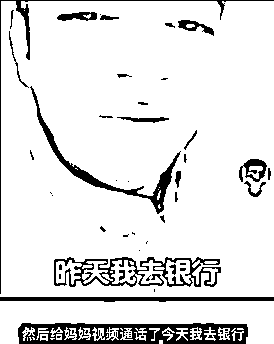

另一边，一大胡子歪果仁也正好遇见保安，正好被她妈同情中国保安好可怜。 

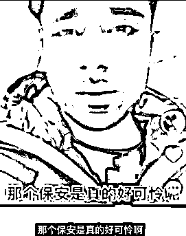

还有这位大哥，正激动在和她妈科普：妈，这里是中国！ 

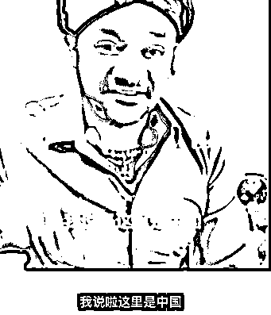

好家伙，这就是同一个世界，同一个妈吗？

可惜，你妈妈压根不知道有这回事吧。 

**翻开短视频，一张张不同国家的面庞，嘴里念着一模一样的台词，**

**已经分不清究竟是谁模仿了谁，** 

**却叫我们终于认清：**

**夸赞中国好并非真心，掌握了财富秘密才是真。**

毕竟张张嘴就能几十万点赞，赚的盆满钵满。

不要觉得无伤大雅，许多跨越国家的朴素感情，

**就是被这些“演技超群”，把高喊“我爱中国”当成生意，**

**赚着我们的钱，却把我们当傻子的外国网红们一点点消耗殆尽的。**

而当初心都不再，他们又还能走多远呢？ 

但碰到下面一群人，他们还是小巫见大巫了。 

**02**

“我跟老公刚办完离婚手续，老公就说出了隐情，我当时就泪崩了。” 

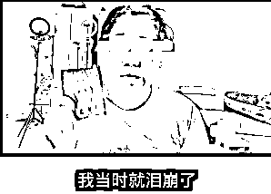

一个女人手持离婚证，讲述着自己和老公的故事： 

在一起 10 年，从无话不谈到无话可说， 

终于两人无法继续将就，终于分道扬镳。 

一段错误的亲密关系结束，无异于让彼此脱离苦海， 

**正为当事人感到高兴，才发现自己又被骗了。**

**因为不同的女人，正上演一模一样的剧本。**

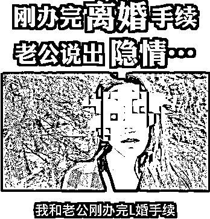

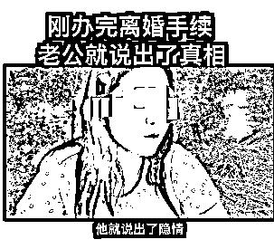

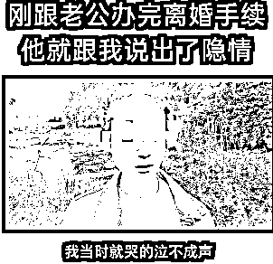

“真巧，我们的老公都是同一个人呢。” 

哪里有什么十年感情离婚，什么听到隐情当场泪崩， 

**手里的离婚证，不过是拿的同一个剧本，**

**眼里的复杂，不过是新一波的流量密码。**

当网络奔现，街头偶遇的甜甜恋爱不再能够博眼球， 

“离婚隐情、出轨、彩礼……”就成了一批网红博主“博同情”的工具。

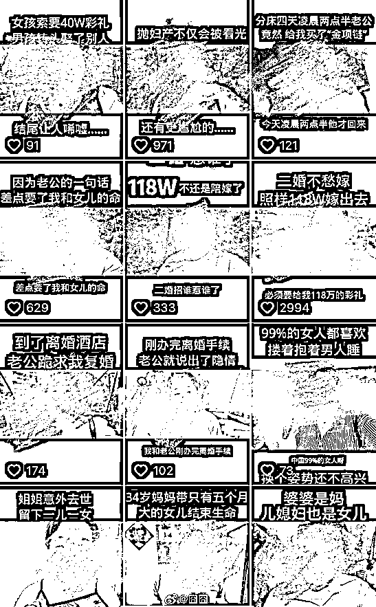

文明程度越来越高的新时代，离婚、二婚都不可怕，

可怕的是，不知道哪个真正勇敢离婚的姑娘正在被利用，

还有各种无中生有，无事生非，

**什么“二婚不愁嫁，照样让他拿 118 万”……** 

**什么“昨天遇见一个男人，三句话让他给我花了 18 万”，** 

**让记录生活，正扭曲成“编出你的傻 x 故事。”** 

**更可怕的是，充斥的全是这些三观不正，挑动对立的恶俗狗血的谣言和瞎话。**

这边，为了拍视频赚流量，有人什么都敢说，

这边，当然就有人为了红，什么都敢做。

**03**

一个女生站在前面，一个男生手里拿着鞋子，一下又一下狠狠打在女生屁股上。

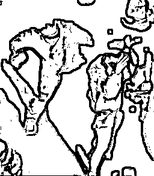

这可不是在什么私密场所，而是在人来人往的马路上。 

仔细一看，周围还有摄像机正对准，然后完美捕捉下这一幕。 

**当众打屁股，洗脚水倒头上……**

**光天化日，最近，一群男男女女正聚集“网红城市”长沙的街头，上演着一场又一场低俗直播。**

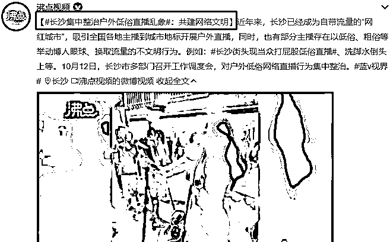

时而“动情表演”，时而喊叫吵闹，

一些主播们沉浸在自己的世界里，丑态百出，旁若无人，反正怎么吸引眼球就怎么来。

**甚至，堂而皇之把软色情搬到大庭广众之下，**

**再把视频传播到亿万受众的平台，** 

然后，不断引来口味独特的看客们，隔着屏幕点赞打赏，哈哈大笑。 

实在不懂笑点在哪，就像不知道他们的底线究竟在哪。 

**想起国庆节发生在济南闹市的一幕，**

**一女主播身着深色紧身衣，一边频繁下跪在地上，一边疯狂喊叫。**

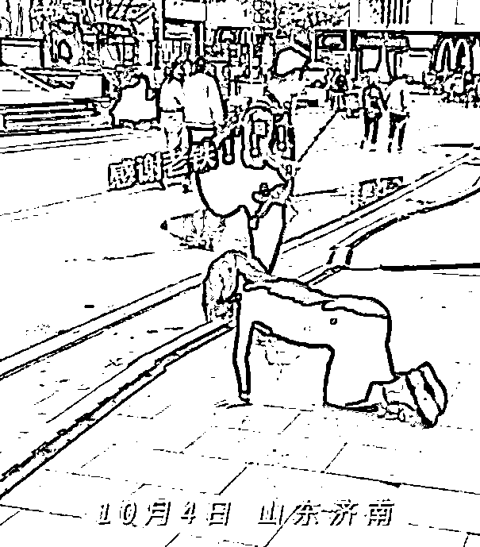

公共场合，公共空间， 

但凡有一些素质也该考量自己的行为是否会让别人不适，

可流量之下，显然他们已经把底线全部踩到脚下。 

在大街跪，在景点跪，在海边沙滩跪……

跪久了，可能就不知道怎么站起来，也忘了自己是个人。 

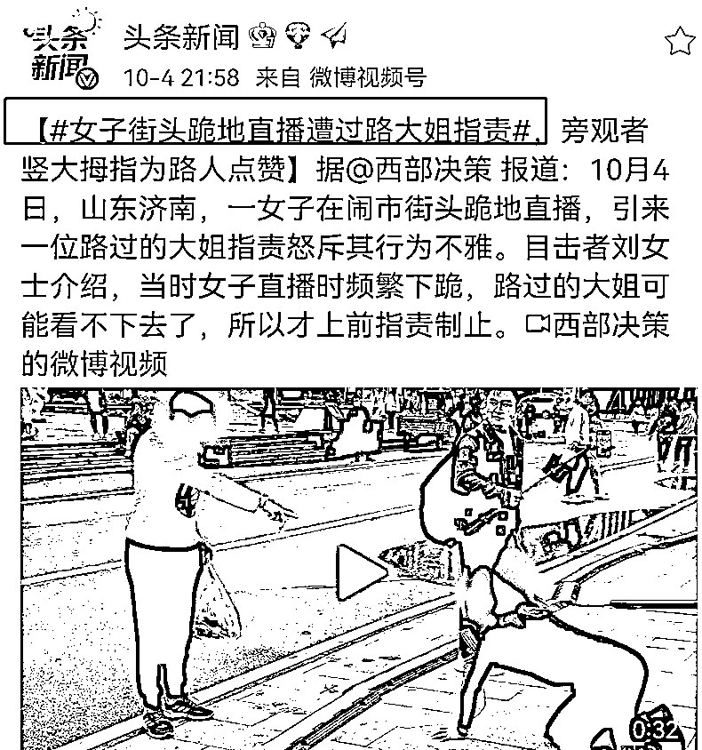

不怪一路过大姐实在看不下去，上前怒怼制止了跪地的女主播：

**“国庆节你在这儿跪谁呢，注意点影响。”** 

也有人为女主播叫屈，“人家又没做什么伤天害理的事”？

但就像有人发出的灵魂拷问：这些网红主播究竟在传播什么东西？ 

除了传播“低级庸俗，人类下限”，

除了传播“九年义务教育还不如直播当网猴挣钱”，

我实在说不出其他意义何在。

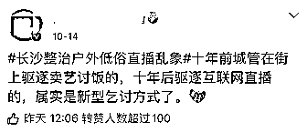

尼尔·波兹曼在《娱乐至死》中说：

**“有两种方法可以让文化精神枯萎。**

**一种是奥威尔式的——文化成为一个监狱，另一种是赫胥黎式的——文化成为一场滑稽戏。”**

然后，在这场滑稽的，毫无营养的大戏之下， 

**“人类悄无声息地成为娱乐的附庸，毫无怨言，甚至心甘情愿，其结果是，我们成了一个娱乐至死的物种。”**

**04**

吴亦凡郑爽事件以来，清朗运动如火如荼。

娱乐圈劣迹艺人封了一大波，却还有无数毫无底线的网红，就像一群蛀虫，侵蚀到网络各个角落。

**有人每天上演分手怀孕出轨引流量，**

**有人每天闹市打屁股跪地上博眼球，**

**有人直播间胸口塞异物，现场脱内裤求打赏……**

**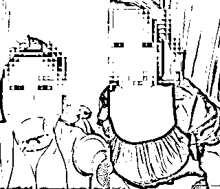**

本就浮躁的社会，已充斥太多碎片化、无意义的信息，再容不下这些坑蒙拐骗，恶心低俗。 

无数次费解人类高质量男性为何能刷屏， 

迷人的郭老师之流为何有无数人疯狂簇拥， 

**说到底，太多人喜欢沉浸在不用思考的狂欢中，**

**却忘了，自己早早沦为了这场荒诞盛宴里的工具，也忘了精神的贫瘠，才是真的贫穷。**

总是怀念以前。

**有演技有实力才能当演员，被万人追捧；** 

**有真本事有一技之长才能成网红，被口碑相传。**

回头看现在畸形的世界，

大师们在流浪，小丑一个个跻身殿堂。 

只要有颜值有粉丝就能当明星， 

只要卖卖丑、扭扭屁股哗众取宠就能红，只要红了就能直播代言赚大钱……

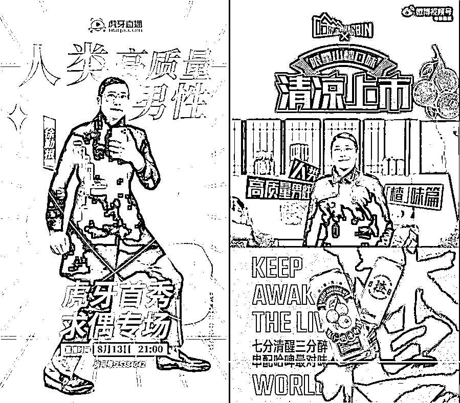

当错误观念若越来越根深蒂固， 

社会风气被荼毒的越来越严重，国民素质被越拉越低。

作为成年人，或许尚能抵住诱惑，区分良莠，

我们的下一代，又将在娱乐至死，网红至上的虚假环境里何去何从？ 

充斥恶俗毁三观的娱乐至死，从来不是我们想要看到的时代。 

**好消息是，最近微信也已经出手，** 

**封杀了一波低俗无下限的主播账号。**

**娱乐圈牛鬼神蛇被一个个拉出来，**

**接下来，我们就等着网红圈妖魔鬼怪被肃清那一天。**

# 来源：我不是一条鱼

灰产圈在线客服

← 向右滑动与灰产圈互动交流 →

