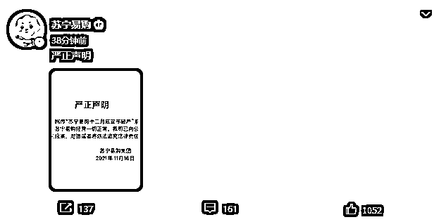
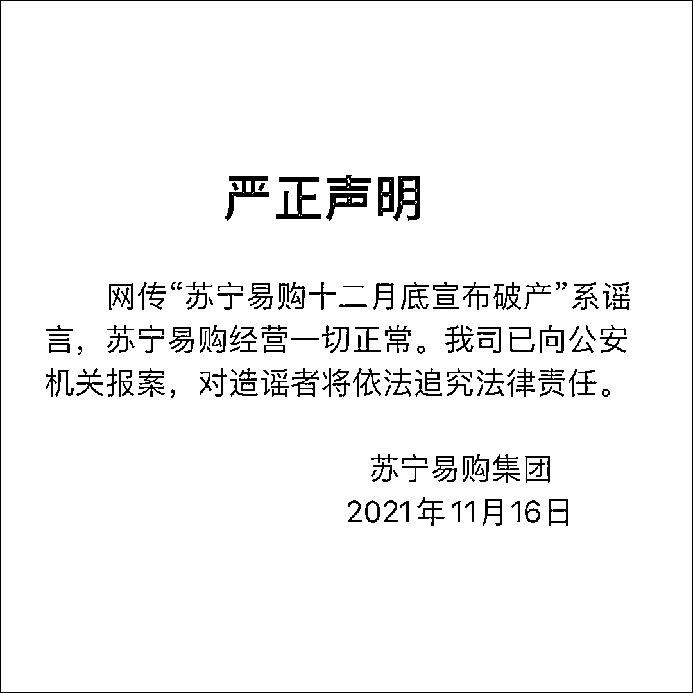

# 前有王健林“去世”，后有苏宁“破产”，网络谣言何时休？

> 原文：[`mp.weixin.qq.com/s?__biz=MzIyMDYwMTk0Mw==&mid=2247524242&idx=6&sn=dad9f623ab50049c6c04552b35745d80&chksm=97cb54aaa0bcddbcc1dde9ba486c3d5b34f56f18a90055239057b7350642978b4469c98f5bff&scene=27#wechat_redirect`](http://mp.weixin.qq.com/s?__biz=MzIyMDYwMTk0Mw==&mid=2247524242&idx=6&sn=dad9f623ab50049c6c04552b35745d80&chksm=97cb54aaa0bcddbcc1dde9ba486c3d5b34f56f18a90055239057b7350642978b4469c98f5bff&scene=27#wechat_redirect)

此前报道：

[王健林去世？万达:已报警！](http://mp.weixin.qq.com/s?__biz=MzIyMDYwMTk0Mw==&mid=2247524177&idx=3&sn=03266fb6da54b3a84b6a5856c522702d&chksm=97cb5469a0bcdd7fab9be2a35298cc2f2016620171f11dddc89c064ee70984eb5e5b0536ed66&scene=21#wechat_redirect)

@苏宁易购 16 日发表严正声明，**称网传“苏宁易购十二月底宣布破产”系谣言**，**已向公安机关报案**，苏宁易购经营一切正常。

图自@苏宁易购

来源：@苏宁易购

灰产圈在线客服

← 向右滑动与灰产圈互动交流 →

