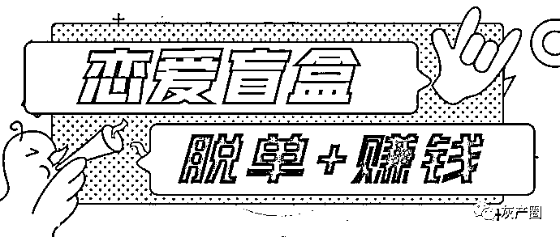
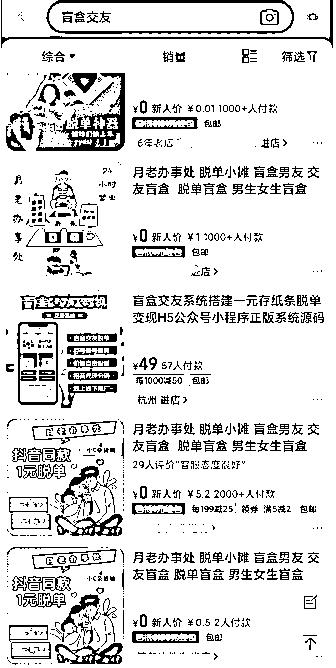
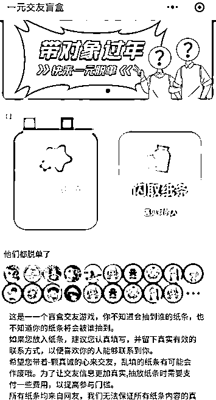
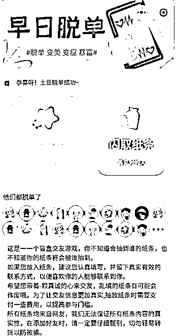

# 一元“脱单”？盲盒交友火爆，背后风险必须警惕

> 原文：[`mp.weixin.qq.com/s?__biz=MzIyMDYwMTk0Mw==&mid=2247524242&idx=7&sn=0763cc5c8a0a8b8daa1d2ee3c42e3aa1&chksm=97cb54aaa0bcddbc3b0ed0c5b0f6085f35a7032131dedaac7a5024e796ef3e31aa2603443b85&scene=27#wechat_redirect`](http://mp.weixin.qq.com/s?__biz=MzIyMDYwMTk0Mw==&mid=2247524242&idx=7&sn=0763cc5c8a0a8b8daa1d2ee3c42e3aa1&chksm=97cb54aaa0bcddbc3b0ed0c5b0f6085f35a7032131dedaac7a5024e796ef3e31aa2603443b85&scene=27#wechat_redirect)

只要一元钱，要么能获得一个陌生人的联系方式，要么能将自己的联系方式“匹配”出去，以此等待“有缘人”。近期，兴起了一种名为“盲盒交友”的社交方式，不仅有人做线下买卖，电商平台上也有商家经营此类业务，吸引了不少渴望“脱单”的年轻人。但律师提醒：这种玩法有泄露个人信息的风险，不要盲目跟风。

盲盒交友源于一些城市出现的抽陌生人纸条的街头摊位，只需花一元钱就能盲抽一张写有他人自我介绍和联系方式的纸条。在电商平台上，搜索“盲盒交友”，经营此类业务的商家也不少，顾客既可以花钱留下自己的联系方式，等待商家“匹配”；也可以买一个陌生人的联系方式，价格再高一点的还可以要求看对方照片或者选择对方地域等具体条件，价格多在 1 元至 5 元之间。网上销量最高的一家店铺，月销量竟达到了 3000 笔以上。

电商平台有商家经营盲盒交友业务或直接售卖小程序源码

不仅如此，一些对网络流量敏感的人，还将这种方式线上化，将这套玩法做成了标准化的小程序，直接对外出售小程序的源码，声称“只要付钱，就有人帮你搭建好系统，可以在线‘摆摊’赚钱”，这套系统价格多在几百元不等。在这样的小程序里，首页一般会有根据性别划分的抽纸条、放纸条操作，使用者需要先上传自己的照片、联系方式、个人简介等信息，然后可以付费抽取一个陌生人的联系方式，抽取后可自行联系对方。

盲盒交友小程序

这种新鲜的玩法吸引了不少想“脱单”的年轻人，希望通过这种方式能找到自己的“有缘人”。但这种方式的效果颇让人怀疑，记者搜索发现，在电商平台此类商品的评论中，有不少人表示“留了联系方式之后，根本没人回。”“买到的联系方式是个微商，就想让我买东西。”

对此，北京市常鸿律师事务所彭艳军律师分析称，参与者自愿提交自己的个人信息以对等地获得他人信息，并不涉及侵犯他人隐私权或者非法窃取他人信息的问题。但由于这类玩法一般会让参与者提供个人照片、简介、联系方式等，这就可能导致泄露个人信息的风险，而且难以保证商家不会将这类信息挪作他用。彭律师进一步表示，运营这种玩法的小程序系统，在技术层面也难以确定是否存在技术漏洞，数据储存安全也无法保证，存在被盗取的风险。

此外，彭律师还强调，对于经营此类业务的商家或平台，若将盲盒里大量个人信息贩卖给他人，情节严重的，可能会以出售、非法提供公民个人信息罪被追究刑事责任。因此，彭律师提醒：“盲盒交友”虽是一种新的社交方式，本身无可厚非，但参与者仍需理性，尤其是要有个人信息保护意识，不要盲目跟风。

来源：北京日报，潇湘晨报

灰产圈在线客服

← 向右滑动与灰产圈互动交流 →

