# 欧莱雅惹众怒，李佳琦薇娅都暂停一切合作！

> 原文：[`mp.weixin.qq.com/s?__biz=MzIyMDYwMTk0Mw==&mid=2247524303&idx=1&sn=64d3054ae17270ca6937737b096cd563&chksm=97cb54f7a0bcdde1634dc89539456faa123f1440c78983e1cd3c4e3cd438ba6f60aa6439cb2b&scene=27#wechat_redirect`](http://mp.weixin.qq.com/s?__biz=MzIyMDYwMTk0Mw==&mid=2247524303&idx=1&sn=64d3054ae17270ca6937737b096cd563&chksm=97cb54f7a0bcdde1634dc89539456faa123f1440c78983e1cd3c4e3cd438ba6f60aa6439cb2b&scene=27#wechat_redirect)

“双十一”在李佳琦直播间预售

宣称全年最低，

后续在自己直播间

被网友发现价格几乎便宜一半，

**欧莱雅被指存在虚假宣传，**

**相关词条也登上微博热搜。**

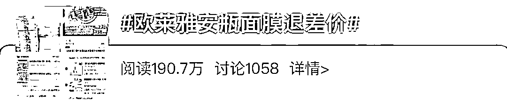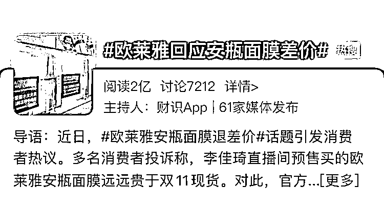

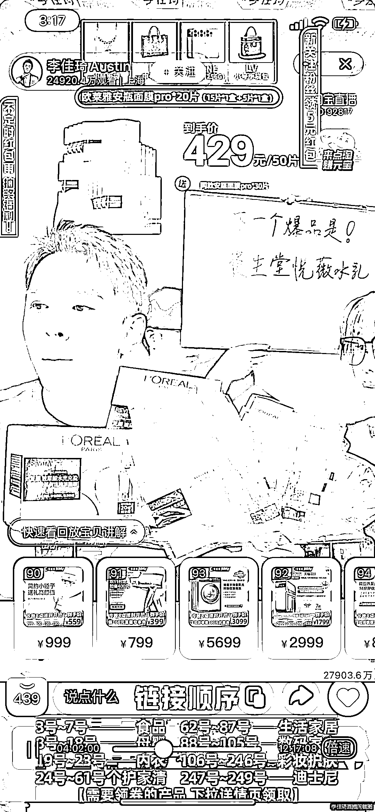

11 月 17 日，李佳琦所在的 MCN 机构美 ONE 对“欧莱雅被指虚假宣传”事件做了最新回应：

“此次价格争议是由于平台及店铺发放的限时限量满减券造成，并且该券有使用门槛，需单笔有效订单满足 999 元实付才可使用，并不是单独购买一个直播间单品就可以达到使用门槛的……在此事得到妥善解决之前，李佳琦直播间将暂停与巴黎欧莱雅官方旗舰店的一切合作。”

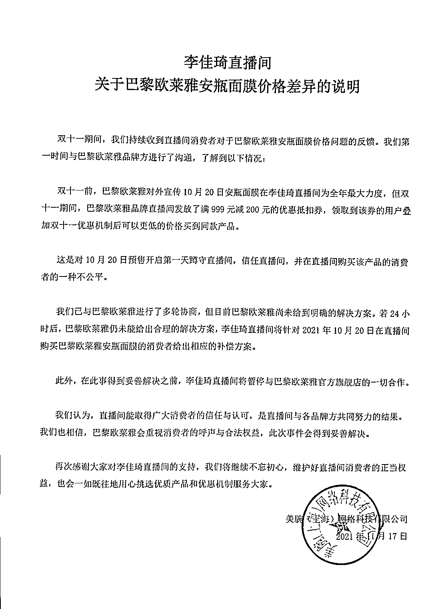

紧接着，薇娅直播间@薇娅惊喜社官方微博也发布关于欧莱雅安瓶面膜的声明：

表示若 24 小时后巴黎欧莱雅品牌方还未能给出合理的解决方案，将启用薇娅直播间兜底方案进行相应的补偿。同时，将暂停与巴黎欧莱雅品牌任何形式的合作，直至此事妥善解决。

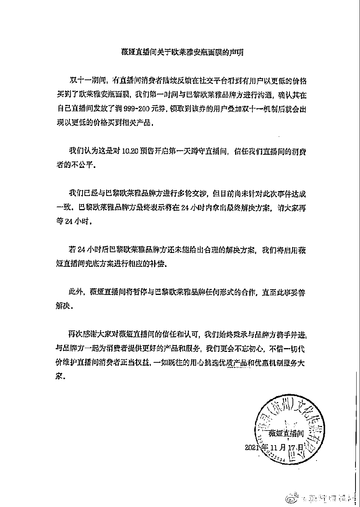

10 月底，

包括李佳琦薇娅在内的多位头部主播，

在直播里带货了一款欧莱雅的安瓶面膜，

欧莱雅官方宣称

是“全年打折最大力度”，

50 片的面膜售价为 429 元。 

 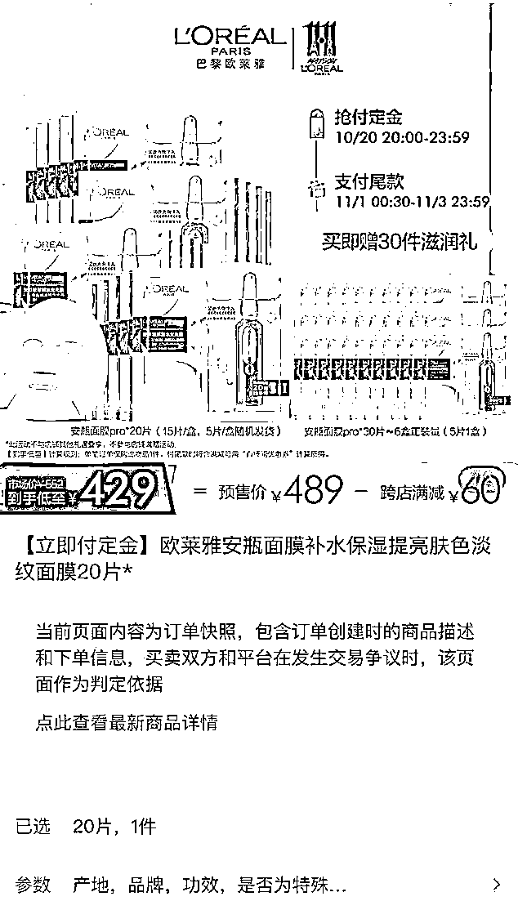

然而短短几天后的 11 月初，

不少消费者发现，

在欧莱雅品牌方的直播间内，

能以接近半价的 257 元价格

购入 50 片同款面膜。

 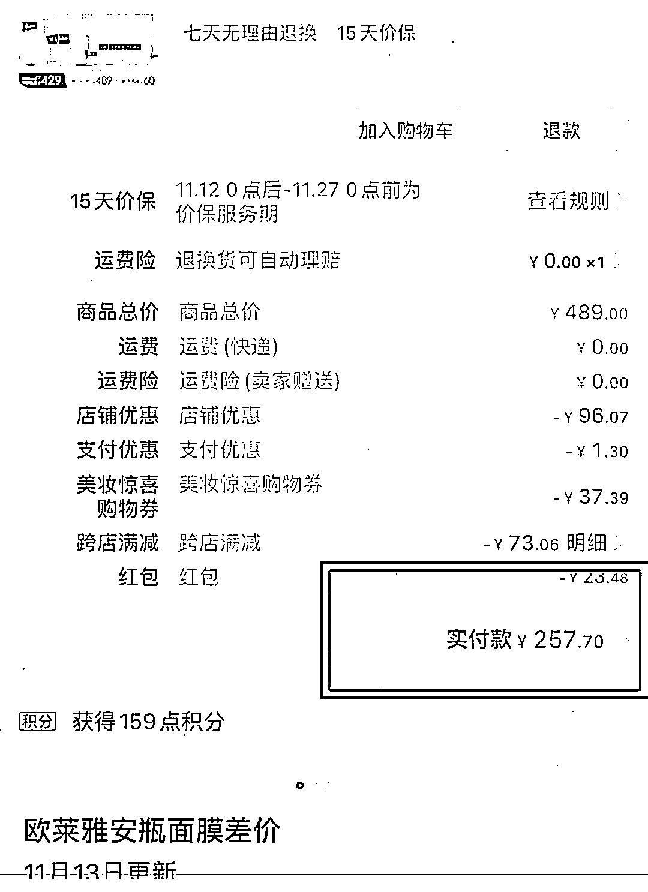

当然，

也有细心的消费者表示，

欧莱雅品牌直播价格

之所以低于直播间价格，

是因为结束双 11 预售后，

欧莱雅品牌方在 11 月 1 日~3 日期间

持续放出大量满 999~200 元的优惠券，

消费者使用该券后，

成交价格大幅打折。

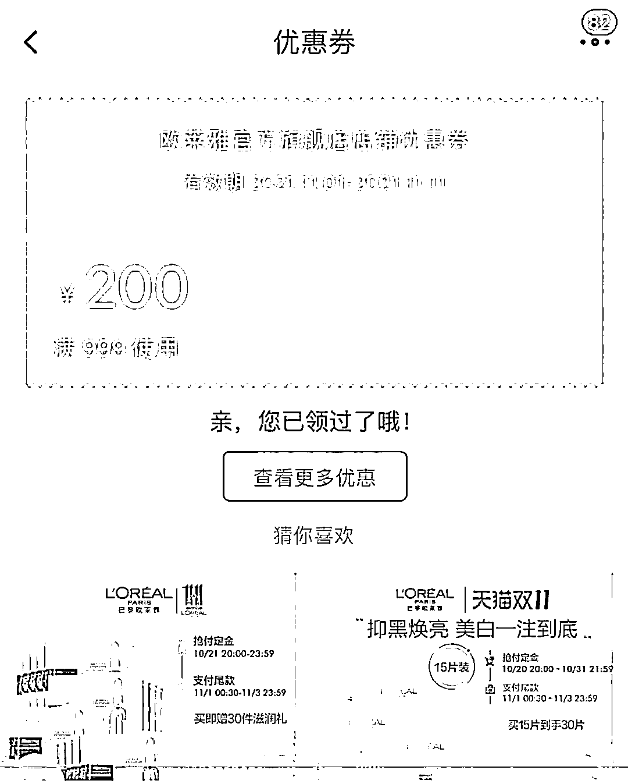

此前网友截图显示，

根据“巴黎欧莱雅”

官方微博的编辑记录，

欧莱雅分别于 10 月 13 日和 14 日

发布微博称

“10 月 20 日李佳琦直播间

欧莱雅安瓶面膜是全年最大力度”； 

但在 11 月 11 日，

上述微博内容已删去

“全年最大力度”的字眼。

11 月 17 日，

澎湃新闻记者再次翻阅微博，

该条信息已无显示。 

 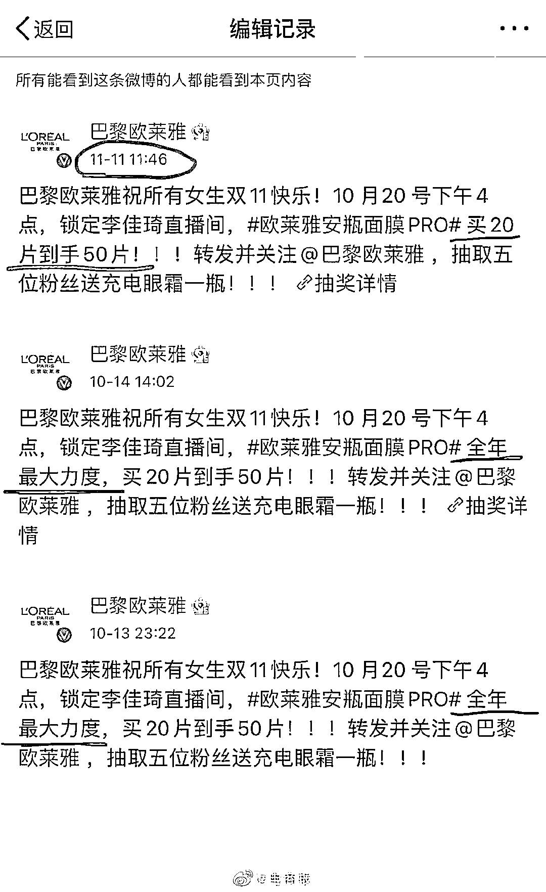

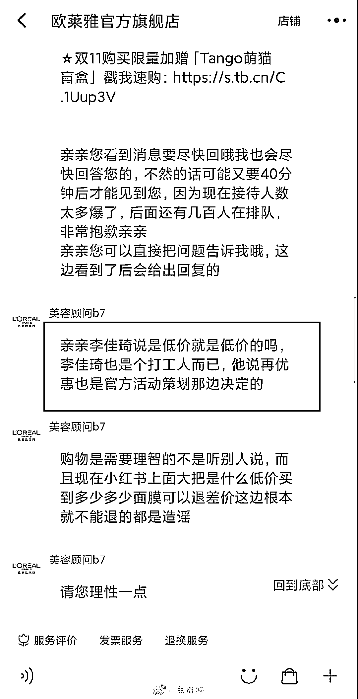来源：微博@电商报

在直播间买贵了的消费者们，

纷纷涌入各大投诉平台。

在黑猫投诉平台上，

有消费者集体投诉：

“巴黎欧莱雅虚假宣传，

付定金后发放大量优惠券，

欺骗消费者并且不一视同仁退差价”。

目前集体投诉量已超过千件。

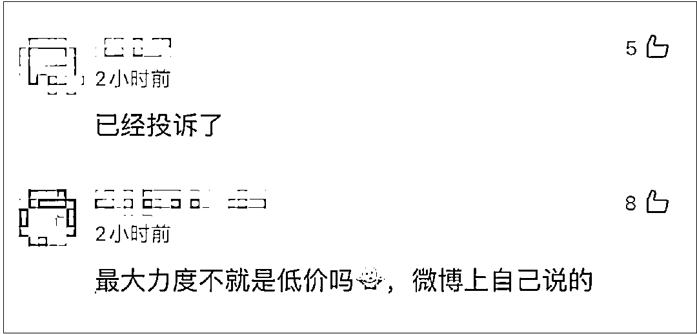

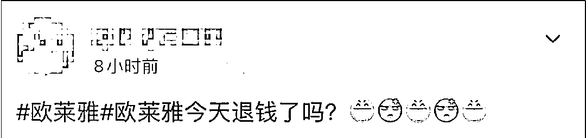

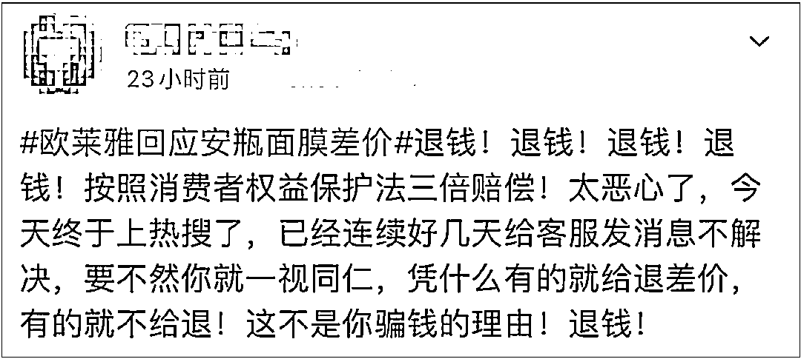

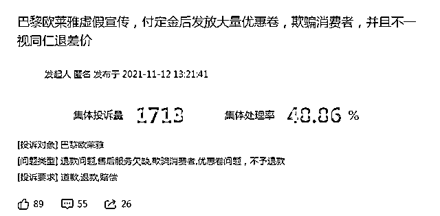

11 月 17 日，欧莱雅回应澎湃新闻记者称，经了解，此次出现部分消费者以低于直播间到手价拍下商品，是因为叠加使用了多种平台和店铺的优惠，享受这些优惠是需要凑单达到一定总价格门槛的，同时平台系统会自动将符合条件的优惠平摊到活动商品上才能达到的。在收到消费者相关反馈后，品牌已在第一时间成立专门售后服务小组积极处理消费者的相关问询。

不过，至于怎么处理消费者退货情况，截至记者发稿，品牌方暂未回应。

来源：澎湃新闻

← 向右滑动与灰产圈互动交流 →

