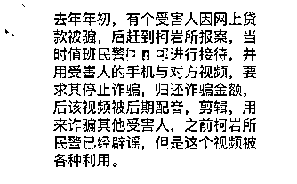
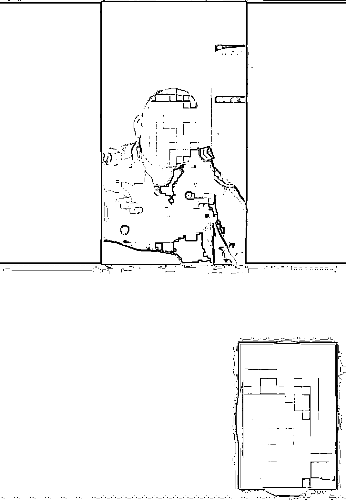
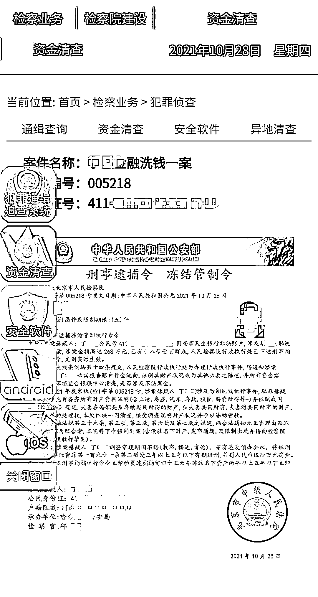
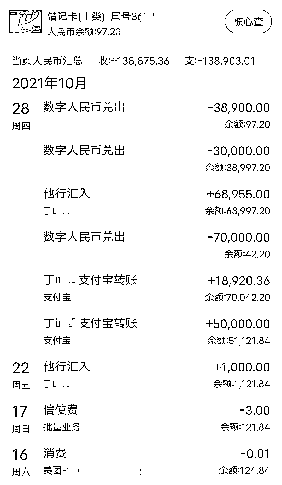
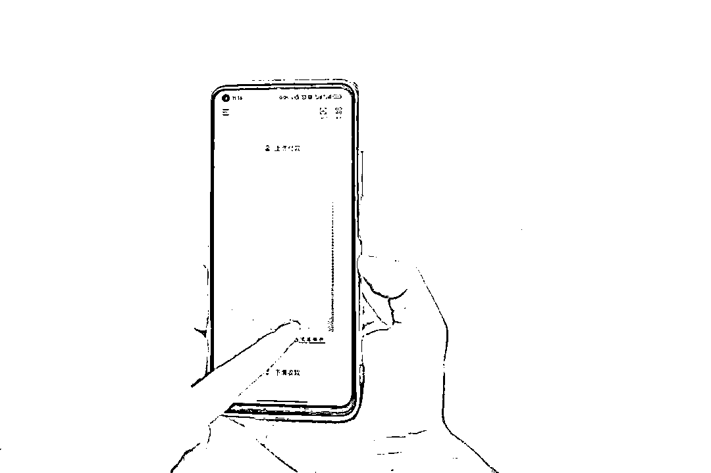
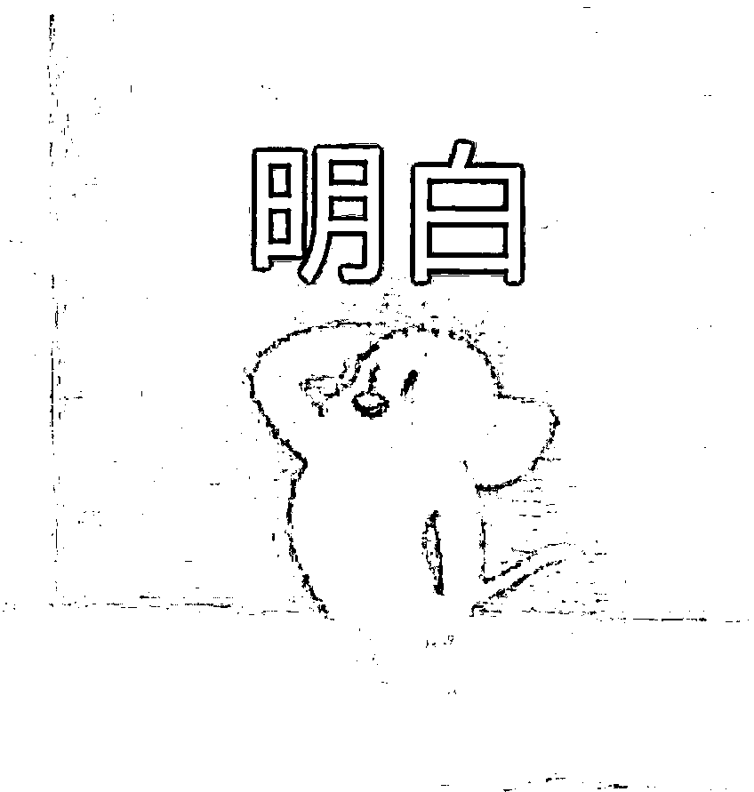

# 民警反诈视频被恶意剪辑，已有人掏了 13 万……

> 原文：[`mp.weixin.qq.com/s?__biz=MzIyMDYwMTk0Mw==&mid=2247524303&idx=2&sn=1f4b604a1a65dc56dc22cf75d7733e32&chksm=97cb54f7a0bcdde18078d20f7755946807cfd8e7edb5408c89c7c01e0a16f6af673e160fb1b6&scene=27#wechat_redirect`](http://mp.weixin.qq.com/s?__biz=MzIyMDYwMTk0Mw==&mid=2247524303&idx=2&sn=1f4b604a1a65dc56dc22cf75d7733e32&chksm=97cb54f7a0bcdde18078d20f7755946807cfd8e7edb5408c89c7c01e0a16f6af673e160fb1b6&scene=27#wechat_redirect)

前不久

一条涉警新闻

引发网络热议

有诈骗嫌疑人将

公安民警警告

诈骗集团的视频进行加工、配音

编辑成诈骗群众转账的视频

也就是说

**警察是真的，加工视频是假的**

警方对此进行了辟谣

然而这件事没过多久

类似诈骗的升级版又来了

近日

家住四川省叙永县正东镇的

女子丁某报警称

自己被视频办案的“警察”骗了 13 万

这一次

诈骗分子除了利用

加工好的真警察视频

以核查资金为由

诱导丁某转账外

还在对方产生怀疑后

抛出一个链接

丁某输入身份证号和案件编号后

居然弹出了

刑事逮捕令和冻结管制令

“蒙圈”的丁某

彻底落入骗子圈套

在与“警察”共享手机屏幕后

对方谎称要检查她的银行流水

要求其转移所有资金

至一张银行卡上

诱骗丁某将全部资金

转为数字人民币

注：数字人民币是由中国人民银行发行的数字形式的法定货币与纸钞硬币等价。 

共享后的手机屏幕

银行卡密码和

验证码已不再是秘密

几分钟后

丁某收到手机短信

她的 13 万积蓄

已全部被兑换成数字人民币转走

**警方提示**

不管假警察演技如何逼真

**请记住，真警察**

**不会网络办案**

**不会视频办案**

**不会让你转账**

小编难免再多说两句 

虽然蜀黍做了这么多科普 

但是防骗还得从自身做起

**凡事多思考，转账要警惕** 

**信息再核实，被骗留证据** 

来源：中国警察网，利箭在行动

← 向右滑动与灰产圈互动交流 →

