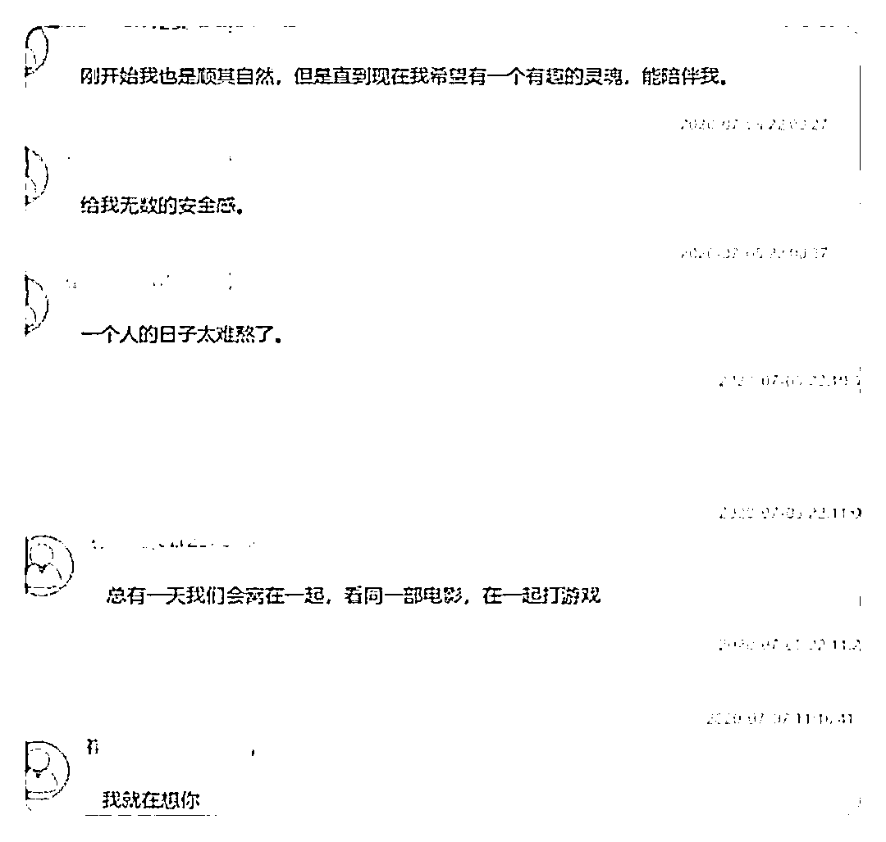

# “兵哥哥”吞了小姑娘 70 万？抓了！

> 原文：[`mp.weixin.qq.com/s?__biz=MzIyMDYwMTk0Mw==&mid=2247524303&idx=4&sn=38c3ddc077b11553b19cc4d629378254&chksm=97cb54f7a0bcdde126264be5f5a3236ca32f5aef7e107c9ba812ccbf57d6ea523afbc3a37d21&scene=27#wechat_redirect`](http://mp.weixin.qq.com/s?__biz=MzIyMDYwMTk0Mw==&mid=2247524303&idx=4&sn=38c3ddc077b11553b19cc4d629378254&chksm=97cb54f7a0bcdde126264be5f5a3236ca32f5aef7e107c9ba812ccbf57d6ea523afbc3a37d21&scene=27#wechat_redirect)

不少女孩心中 

都住着一个“兵哥哥”

身强体健

一身正气

......

总之就是个“好男儿” 

这不

如东姑娘在游戏里

认识了这么一个“兵哥哥”

（兵哥哥的“自拍照”）

该男子 28 岁

有着东北人的豪爽性格 

不仅如此 

这个退伍的“兵哥哥”家境殷实

父亲军人 母亲教师 

家中经营店铺

颇有余产 

俩人在 QQ 炫舞手游中成了游戏 CP 

之后互加微信

发展出甜甜的恋爱

没多久

小陈接到了男子的第一个求助

他称自家店铺一时资金短缺

急需用钱

小陈姑娘微信给恋人转了 8000 元

这笔钱对独自在外打拼的姑娘来说

不是一笔小钱

于是小陈让兵哥哥写了借条

（借条）

随着两人的感情越来越深厚

男子借钱的理由越来越多

患病急需用钱

店铺需要资金周转

房租需要交纳

爷爷去世需要回家路费和殡葬费

...... 

（各种借款理由） 

10 个月的时间

小陈倾尽所有

还四处举债

转账 70 万帮助男友度过难关

（各种转账记录）

又是小半年

男子以自己新冠复发住院的理由

再次向小陈借钱

小陈坚持要去医院看望兵哥哥

他实在拗不过

直接切断了和小陈的联系

小陈意识到自己上当受骗了

如东警方接到报案后

全力开展案件侦查工作

（抓获照片） 

2021 年 11 月 5 日

嫌疑人崔某在天津某小区被警方抓获

等待他的

将是法律的制裁

**相关法条：**

**《刑法》第二百六十六条**

**诈骗公私财物，数额较大的，处三年以下有期徒刑、拘役或者管制，并处或者单处罚金；数额巨大或者有其他严重情节的，处三年以上十年以下有期徙刑，并处罚金；数额特别巨大或者有其他特别严重情节的，处十年以上有期徒刑或者无期徒刑，并处罚金或者没收财产。**

千里姻缘一线牵 

网络提供了相识的机会 

但并不都是良缘 

线上的“恋人” 

奔现前别谈钱

来源：南通反诈、如东公安微警务、潇湘晨报

← 向右滑动与灰产圈互动交流 →

