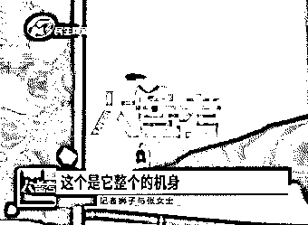

# 女孩住酒店发现顶灯藏有摄像头，正对着床：我们都还没结婚！

> 原文：[`mp.weixin.qq.com/s?__biz=MzIyMDYwMTk0Mw==&mid=2247524303&idx=5&sn=440292259a426aee43f5a49a83afe3d6&chksm=97cb54f7a0bcdde1e975f01349cfec787eed90b6bc8f1b06e69b91e1f9c2e37dbca45a0a3cb4&scene=27#wechat_redirect`](http://mp.weixin.qq.com/s?__biz=MzIyMDYwMTk0Mw==&mid=2247524303&idx=5&sn=440292259a426aee43f5a49a83afe3d6&chksm=97cb54f7a0bcdde1e975f01349cfec787eed90b6bc8f1b06e69b91e1f9c2e37dbca45a0a3cb4&scene=27#wechat_redirect)

“抬头看见屋顶有个亮点，一照没想到真是摄像头！”

10 月中旬，张女士和朋友一起入住了位于河南郑州市商都路与中兴南路附近的酒店，临走退房时，却突然看见房间顶灯的地方有一个亮点，当时朋友担心会不会是针孔摄像头，张女士就用自带的摄像头检测工具先检查了一下，没想到一照真的显示有摄像头。

张女士和朋友第一时间选择了报警，民警到达后，工作人员将顶灯拆下，在灯筒旁边找到了一个摄像头的装置。对此，张女士表示很介意，她称自己和朋友都没结婚，如果视频真的外露了她们来说伤害很大。

记者随后也来到了张女士入住的这家雲松酒店 6027 房间，可以看到被发现的这个摄像头就在床头的正上方，顶灯外围有个小黑点，如果不仔细观察，很难发现这会是一个针孔摄像头。对此， 酒店方表示并不知情，他们会定期对插座孔洞进行检查，但是顶灯这个位置相对比较隐蔽，“应该是个老手，装在了电源上，设备看着像有一段时间了，不是新安装的！”

经过调解，酒店方表示自己在酒店安全管理方面有一定的责任也不会回避，在对张女士当面进行道歉后，为其减免了房费，张女士也表示接受道歉。

事发后，郑州市公安局郑东分局商都路派出所对此事展开了调查。经民警确认，酒店发现的这个装置是一个没有即时储存功能的摄像头，随后联系了专业的技术人员对涉事酒店进行全面排查。

张女士告诉记者，被发现的这个摄像头是可以上传云端的，能 200 人同时在线观看。面对这样的事她也很无奈，同时也担心酒店这种偷拍摄像头的事情时有发生，如果不及时把犯罪分子揪出来绳之以法，那会不会有更多人受害？

近日，记者再次联系当事人了解事件的最新进展。

张女士称，事发后酒店方态度一直比较积极，也没有要求撤案。记者也联系到当时的酒店店长申先生，申先生表示，当时经过协调，双方已经达成和解协议，并且赔偿了张女士一万元。之后酒店各个房间的筒灯、卫生间等各处也都全部检查了一遍，相关的监控视频也都交给了辖区派出所，并没发现有其他特殊异常人员进入涉事房间。目前因为此事，他本人也已经从酒店离职。

来源 ：民生大参考、大象新闻

← 向右滑动与灰产圈互动交流 →

