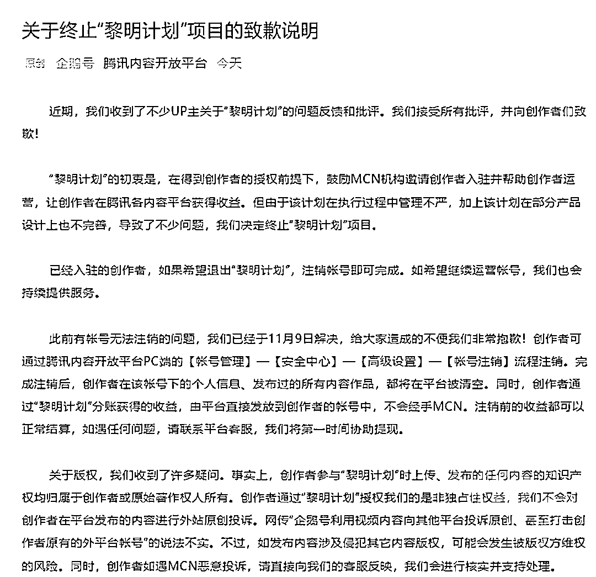

# 刚刚，腾讯向 B 站 UP 主道歉了

> 原文：[`mp.weixin.qq.com/s?__biz=MzIyMDYwMTk0Mw==&mid=2247524303&idx=7&sn=cd4055e18d7d884840c8013588b3978f&chksm=97cb54f7a0bcdde1bd4865a93194dad3fad238d743522cbe706053b0e3809a721ccd59ec6c18&scene=27#wechat_redirect`](http://mp.weixin.qq.com/s?__biz=MzIyMDYwMTk0Mw==&mid=2247524303&idx=7&sn=cd4055e18d7d884840c8013588b3978f&chksm=97cb54f7a0bcdde1bd4865a93194dad3fad238d743522cbe706053b0e3809a721ccd59ec6c18&scene=27#wechat_redirect)

最近，有大量 B 站 up 主发布了维权视频，称腾讯内容开放平台的“黎明计划”存在侵权行为。

据上千位 B 站 up 主描述自己参加黎明计划的始末：腾讯会外包给 MCN 签约 b 站 5 万粉丝以上 up 主，给 200-2000 块不等的入驻金，后续企鹅号会自动搬运该 up 主在 B 站发布的所有视频，按照最高 30 元/万次播放给补贴。

 黎明计划中会规定，加入计划必须加入 MCN 机构成为矩阵号，成为矩阵号后，所有收益机构 3 成 up 主 7 成，up 做内容，机构负责原创维护。这个原创维护就是他们会在企鹅号上注册 up 主的“独家”账号，未来 up 主所有的视频只能发布在企鹅号上，也就是说他们能先从 B 站搬运 up 主的视频到企鹅号上，然后拿着独家协议去 B 站举报，up 主的 B 站内容就会被下架...

今天上午，腾讯内容开放平台发布公告称，决定终止“黎明计划”项目，因执行过程中管理不严，加上计划在部分产品设计上不完善，导致了不少问题。

此外，腾讯内容开放平台辟谣称，创作者通过“黎明计划”授权我们的是非独占性权益，我们不会对创作者在平台发布的内容进行外站原创投诉。网传“企鹅号利用视频内容向其他平台投诉原创、甚至打击创作者原有的外平台帐号”的说法不实。

来源 ：橙柿互动、新浪微博、腾讯内容开放平台

← 向右滑动与灰产圈互动交流 →

