# DR 钻戒一生一枚，个人隐私说没就没

> 原文：[`mp.weixin.qq.com/s?__biz=MzIyMDYwMTk0Mw==&mid=2247524360&idx=1&sn=b4023c18bd746cabb6f963fac522f2a7&chksm=97cbab30a0bc2226544d3f8274d627e59f134b0925a0002052a6274e9ad2eb0f337516ad62cd&scene=27#wechat_redirect`](http://mp.weixin.qq.com/s?__biz=MzIyMDYwMTk0Mw==&mid=2247524360&idx=1&sn=b4023c18bd746cabb6f963fac522f2a7&chksm=97cbab30a0bc2226544d3f8274d627e59f134b0925a0002052a6274e9ad2eb0f337516ad62cd&scene=27#wechat_redirect)

前几天刷微博的时候，看见好几个明星和 DR 挂在微博上。

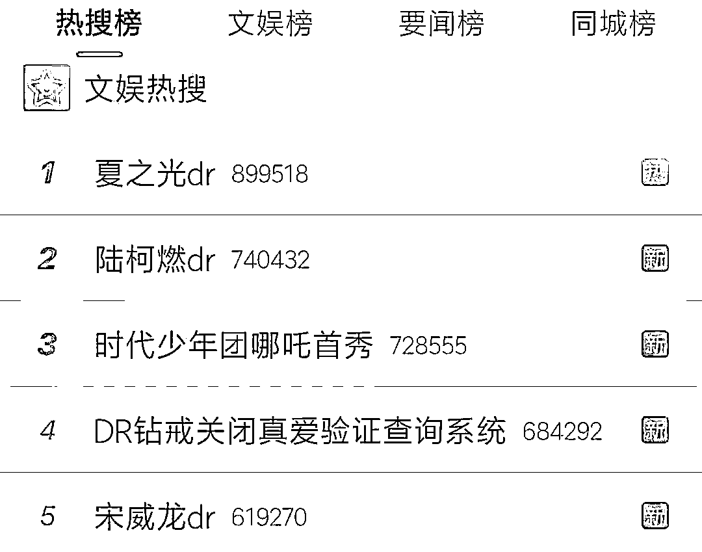

△ 微博截图

大家都知道，DR 是一个钻戒品牌。

所以这些明星为什么集体 DR 了？

**难道大家都结婚了？？？**

不应该啊，点开他们的微博也没看见什么婚礼相关的信息。按道理，哪怕是隐婚，粉丝也早就炸了。

细细一看，我终于弄清楚事情的来龙去脉。

这一切要从 DR 婚戒的营销理念说起。

DR 婚戒最大的卖点便是**「男士一生只能定制一枚」**。

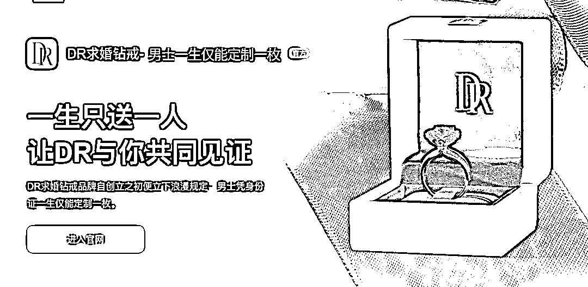

仅凭着这份唯一的理念，DR 钻戒这个品牌一炮而红。

如何保持唯一性呢？ 

DR 便要求顾客购买 DR 求婚钻戒时，**需要男士绑定有效身份信息**。

同时，还需要签署一份**「真爱协议」**并绑定受赠人的姓名。

这样一来，男士与受赠人就绑定了，一生只能买一次，这个购买记录终身不能删除。

DR 为了给这个仅能定制一枚做一个验证，又搞了一个以身份号为核心的**「真爱查询系统」**。

这个查询系统，只要输入身份证就可以查验到这个身份证号有没有买过这个婚戒。

**这！！！**

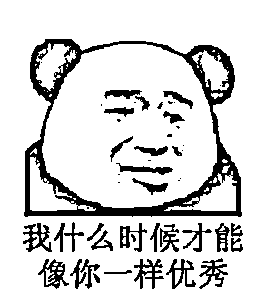

然后，就有粉丝利用这个系统来查她们的哥哥，有没有背着她们求婚。

**还真让他们查出了一批购买了 DR 钻戒的明星名单。**

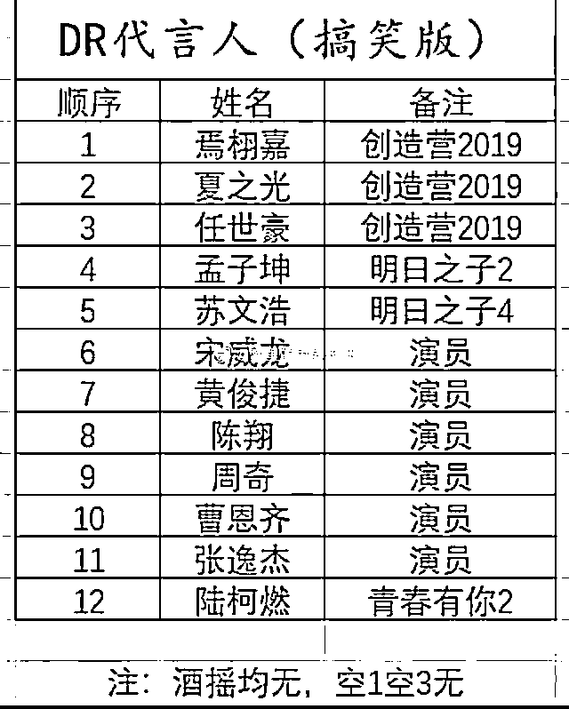

△图源网络

于是就有了热搜事件。

毕竟，很少有粉丝能接受，自己心爱的哥哥一边卖者单身人设，一边背着粉丝瞒着公司，偷偷买了一生只能定制一枚的 DR 钻戒给 “圈外女友”... ... 

名单曝光后，有几个明星马上发文否认。

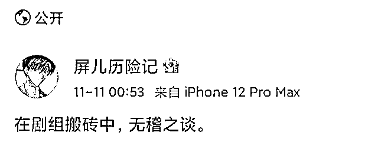

△微博截图

还有明星撇清力度更强，表示会保留追究法律责任的权利，守护清朗健康的网络环境，严厉抵制造谣诽谤的行为。

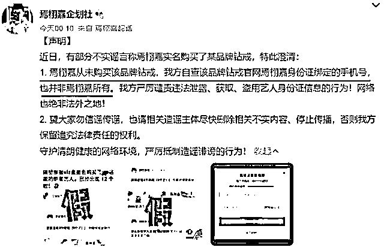

△微博截图

更有粉丝在这个时候跳出来为明星洗白。

声称是自己用冒用爱豆身份证号购买的钻戒，跟爱豆无关。

希望澄清误会，获得谅解。

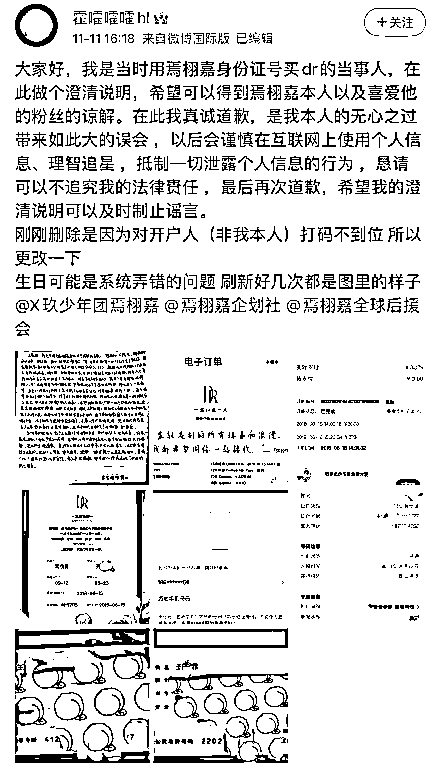

△微博截图

瓜吃到这，到底名单上哪些明星是本人购买的钻戒，我也已经不去关心。

我心里只有两个大大的疑惑： 

*   **真能通过身份证号码，就能随便查到别人的购买记录吗？**

*   **爱豆的身份证号又是如何泄露的？**

**真能通过身份证号码查到别人的购买记录吗？**我在 DR 官方小程序上尝试了下购买产品。

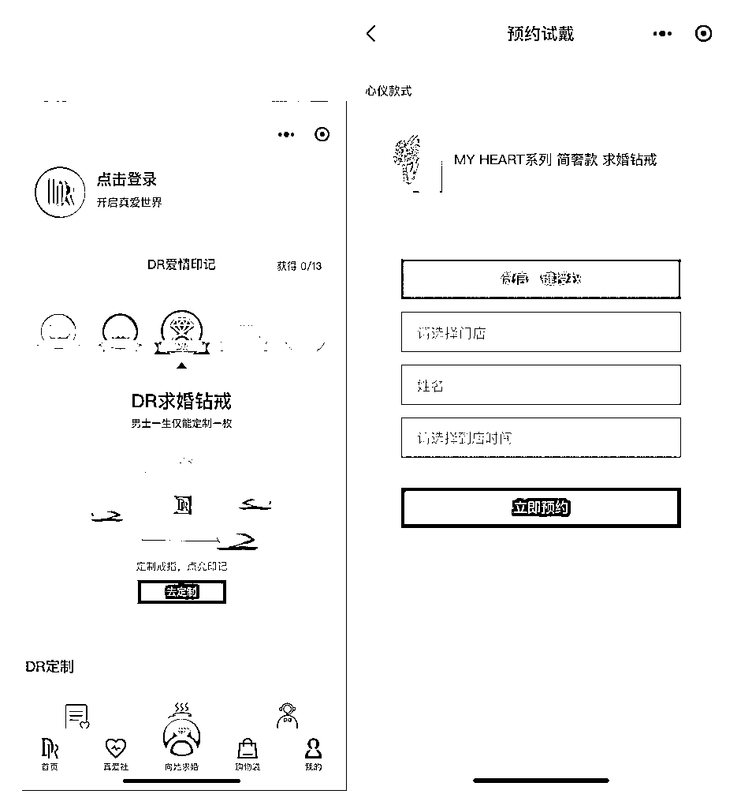

△ DR 小程序页面截图

发现凭本人已实名认证的手机号码注册成为用户后，使用他人（男士）身份证号码下单购买，在未进行人脸或身份证原件验证的情况下，页面显示通过“真爱验证”。

实际上，注册使用的手机号码所对应的身份信息与下单输入的身份证号码并不一致，也可以通过平台验证。

更有人直接跑去咨询 DR 官方店的客服，得到的回复只要输入身份证即可购买，而当中**没有检验「人证合一」的步骤**。

——换言之，我**随便乱填个身份证号码就能买**。

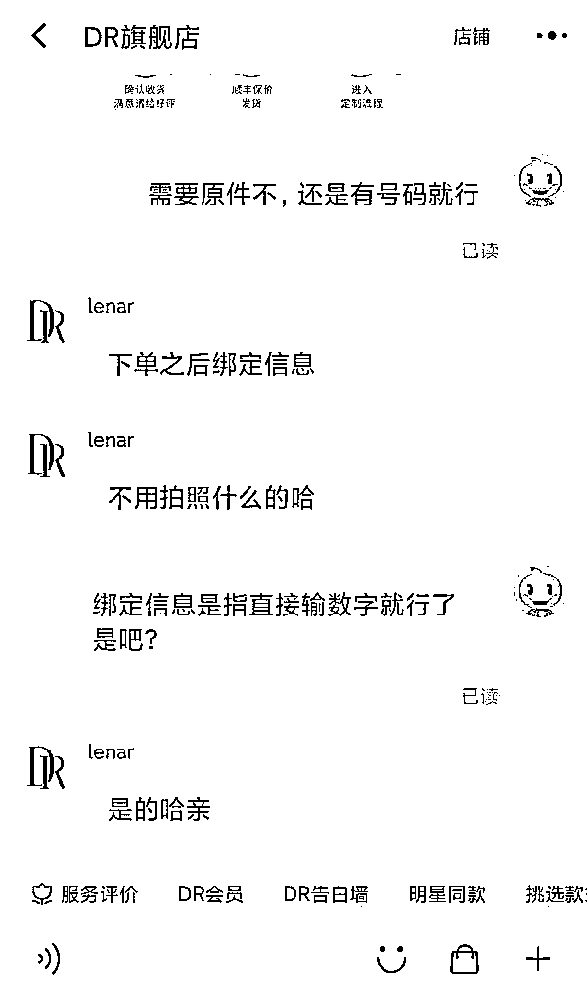

△ 网络截图

这让 DR 钻戒的“一生只送一人”彻底成了营销噱头，

于是，不少网友质疑 DR 钻戒存在顾客隐私泄露风险等问题。

根据**《消费者权益保护法》**第十四条：消费者在购买、使用商品和接受服务时，享有个人信息依法得到保护的权利。同时，经营者及其工作人员对收集的消费者个人信息必须严格保密，不得泄露、出售或者非法向他人提供。在发生或者可能发生信息泄露、丢失的情况时，应当立即采取补救措施。

事情发酵后。

DR 钻戒已经**关闭了官网和小程序的“真爱查询通道”**。理由是为了保护购买者的个人信息和个人隐私。

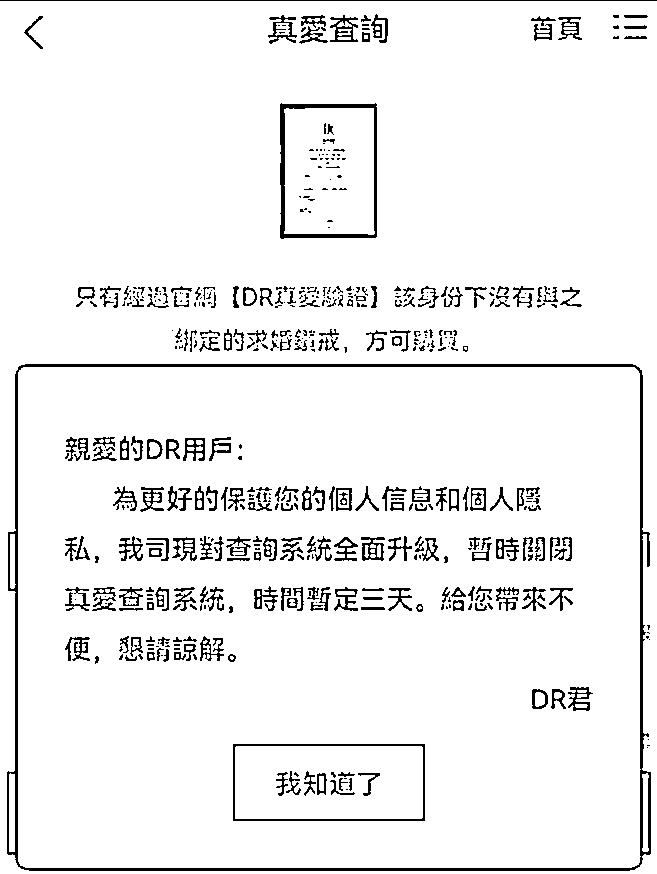

△ 微博截图

怎么看，这都有点此地无银三百两、不打自招的感觉。

但是，DR 官方对于冒用身份信息购买钻戒、客户信息泄露等问题并未作出解释。对于如何审查、核实和保护用户身份信息的问题，也只字未提。

可以确定的是，查询系统虽然停了，DR 的真爱查验系统确实存在 BUG。

**爱豆的身份证号是如何泄露的？**

早在 2018 年，一位记者调查发现，在黄牛那儿花**50 元**就可以购买明星身份证号码，包教如何查询明星航班信息。

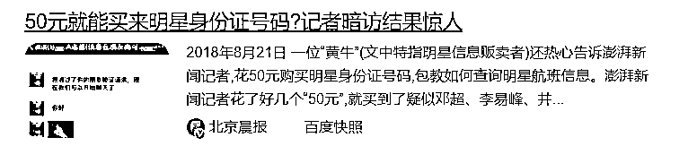

△ 百度截图

杨幂也曾为此发微博吐槽过这种明星个人信息被非法买卖的事情。

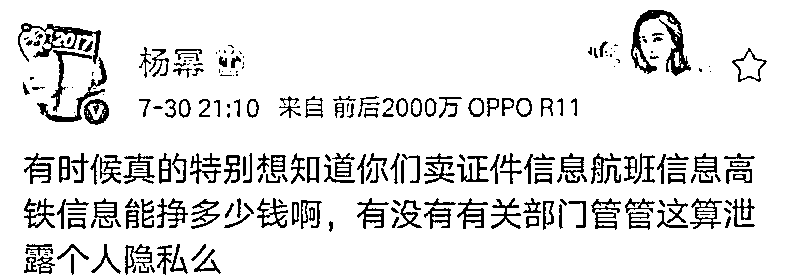

△ 微博截图

不少的「私生饭」买了明星的信息，就去给明星打电话、买明星航班旁边的座位、拿明星的电话去登录软件... ...

这种行为，现然已经构成了骚扰**。且按照法律的规定这种买卖他人的信息只要超过 50 条就是犯罪。**

甚至在此次 DR 事件中，还有一些黄牛开启了 DR 代查的业务。

△ 微博截图

很多网友不禁感慨，**公众人物这样的隐私都能轻而易举的被获得，尚且申诉无门。更何况是作为普通人的我们。**

我最近讲过很多电信诈骗案例，其根源也在于**个人信息的泄露**。

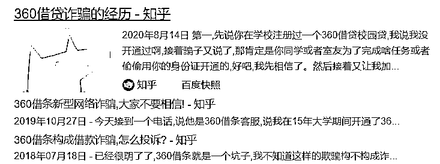

**事实上，DR 事件不过是目前社会信息泄露事件的一个缩影。**

作为普通人的我们，一定要提高个人信息保护意识。

在当今大数据的时代，我们要注意：**快递的面单、外卖的信息、朋友圈的定位、行程记录、航班酒店信息、家庭住址、手机号码等等**。

但大家也不要太过担心，国家的政策正在一步步地收紧。早在今年 11 月，就开始施行《个人信息保护法》，其中也提到不得过度收集个人信息，更强调了不得非法买卖、提供、公开他人信息。

如果自己当真遇到了什么事情且无法判断的时候，记得第一时间拨打 110 报警喔。

← 向右滑动与灰产圈互动交流 →

