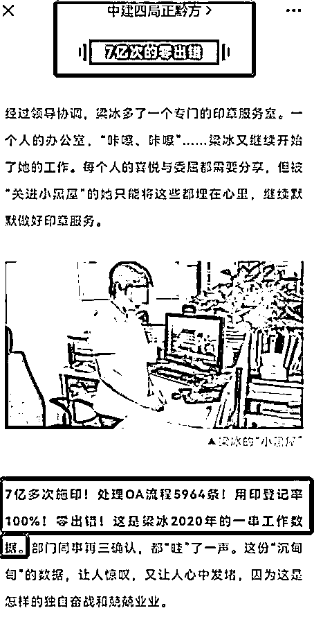
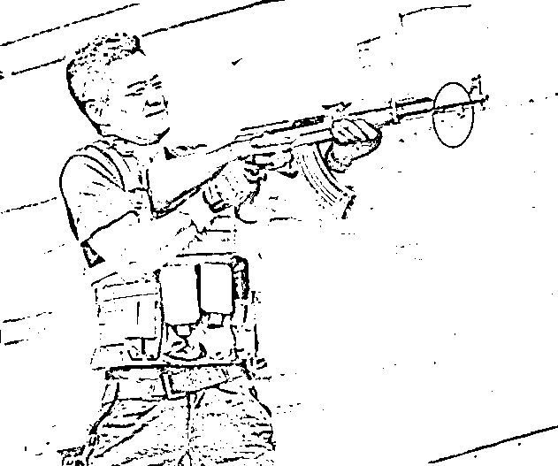
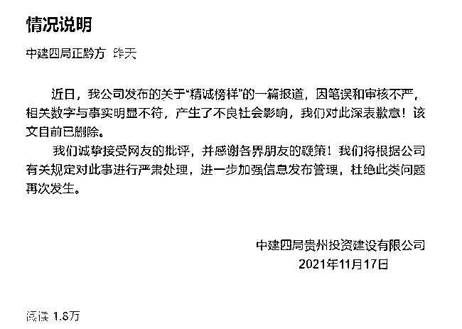

# 女员工一年盖章 7 亿次，速度超 AK47！不吃不喝盖 22 次/秒也盖不完

> 原文：[`mp.weixin.qq.com/s?__biz=MzIyMDYwMTk0Mw==&mid=2247524360&idx=3&sn=7b0303d0e50fa63a3be1c7ab2bbfec03&chksm=97cbab30a0bc2226e83c704d0978afbe9d2fca00ae4da9523d6760b3d9bd09148a55b4025301&scene=27#wechat_redirect`](http://mp.weixin.qq.com/s?__biz=MzIyMDYwMTk0Mw==&mid=2247524360&idx=3&sn=7b0303d0e50fa63a3be1c7ab2bbfec03&chksm=97cbab30a0bc2226e83c704d0978afbe9d2fca00ae4da9523d6760b3d9bd09148a55b4025301&scene=27#wechat_redirect)

# 中建四局的女员工怕不是已经突破了人类极限。

宣扬展现员工工作风貌本是好事，但中建四局的操作着实令人找不着北。最近名为“中建四局正黔方”的公众号上发布了一篇文章，本意是为了夸赞自家员工勤劳敬业，但有用力过猛嫌疑，引发了网友强势围观和吐槽。

文章**《一年盖 7 亿个章，中建四局某员工已成功突破人类极限》**里提到该企业员工梁某负责公司的印章服务，**2****020 年施印 7 亿多次，处理 OA 流程 5964 条，用印登记率 100%，而且还是零出错****……**

一年能盖章 7 亿多次，这是什么概念？**假设一年 365 天、每天 24 小时不眠不休地盖章，每小时盖章近八万次，****每分钟盖章 1331 次，每秒要盖 22.18 次，而且还是 “零出错”。**

这简直是把群众的智商按在地上摩擦，有网友就表示“先不说核对内容，每次我翻到盖章页，找到盖章地儿都得半分钟。”“这个速度甚至超过了部分机枪的射速。”

**理论上来说，AK47 射速是 600 发/分钟，这不是突破人类极限是什么？**

如此违背常识的数据竟然堂而皇之出现在一家国企的宣传文章里。说明涉事企业的宣传人员在写文章时，有夸大宣传之嫌，并且毫无常识。

此外据海报新闻报道，也有网友指出可能中建四局是以骑缝章来计算的，一本几百页的标书、合同，一个章下去，每页都算一个，盖一个章就能算几百次。按照这种解释，有网友计算了一下，假设每页算一个章总计需要 7 亿页纸。

一张普通 A4 纸的厚度大约是 0.104 毫米，7 亿页纸摞起来约有 72.8 千米高。东方明珠塔主体高度约 350 米，这些摞起来的纸张能堆出 2080 个东方明珠塔，而如果将 7 亿张纸首尾连接起来，还可以轻松环绕地球 5 周，这还是太过夸张了。

**17 日晚，中建四局贵州投资建设有限公司发布情况说明，称是“因为笔误和审核不严****，相关数字与事实明显不符，产生了不良社会影响，我们对此深表歉意！”**

目前该公众号已删除了涉事文章。

不过从这篇文章内容排版来看，“7 亿次的零出错”被提炼成小标题，可见笔误的可能性非常小，刻意为之的可能性更大。

来源：财经正解局

← 向右滑动与灰产圈互动交流 →

