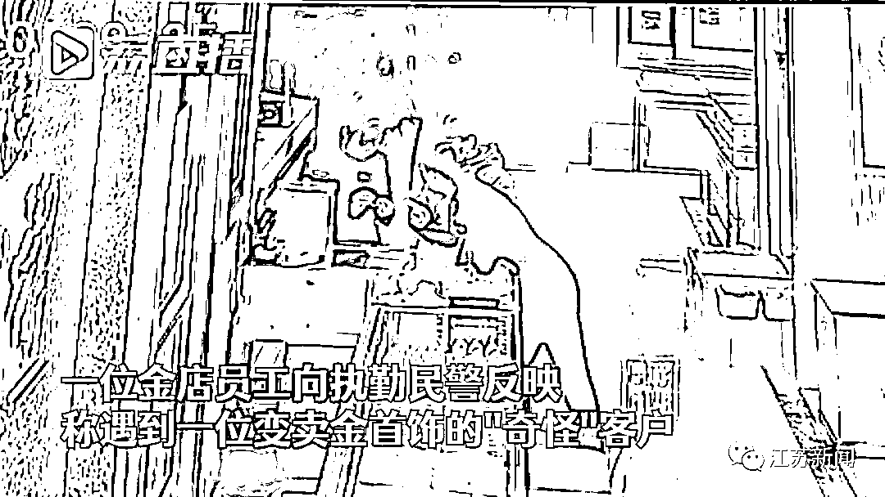
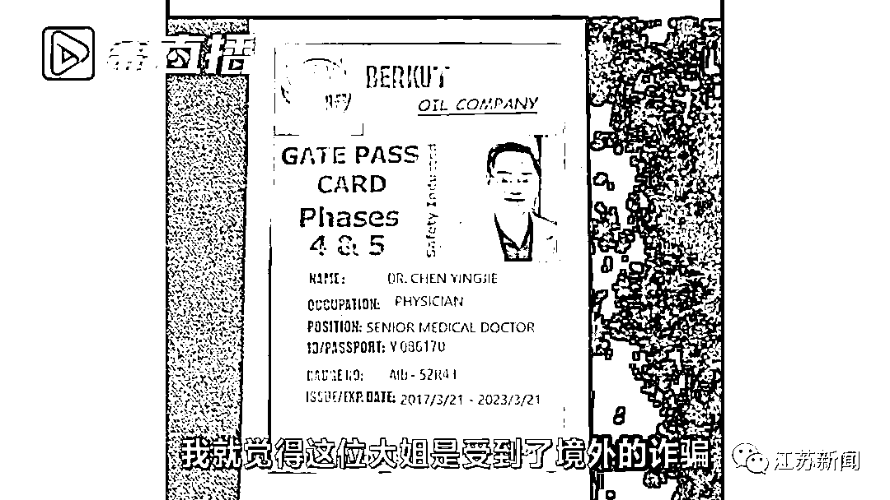
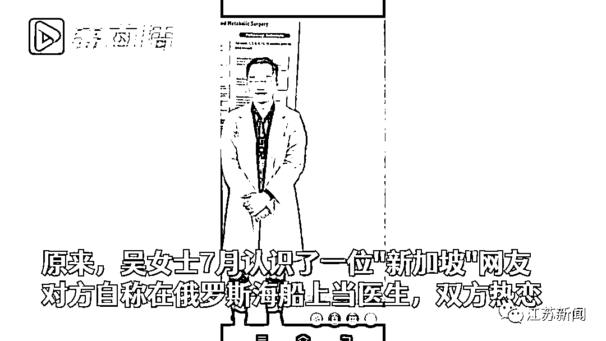
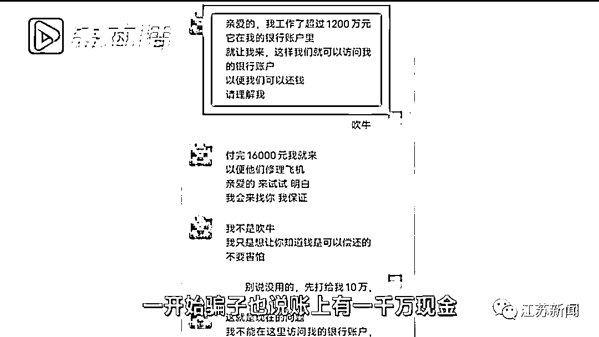
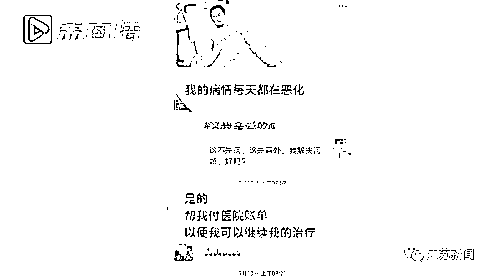
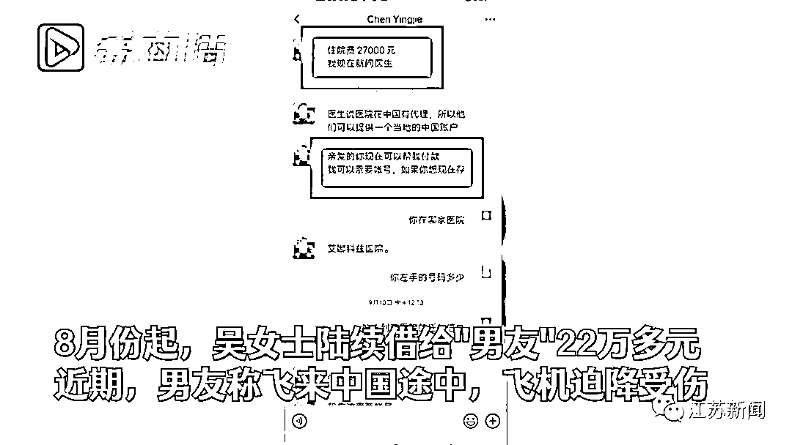
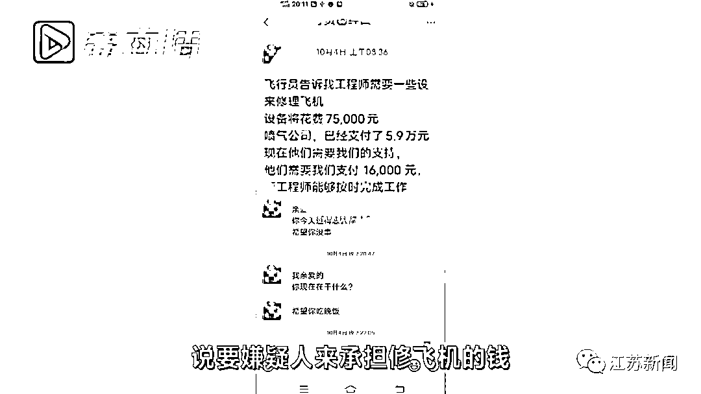
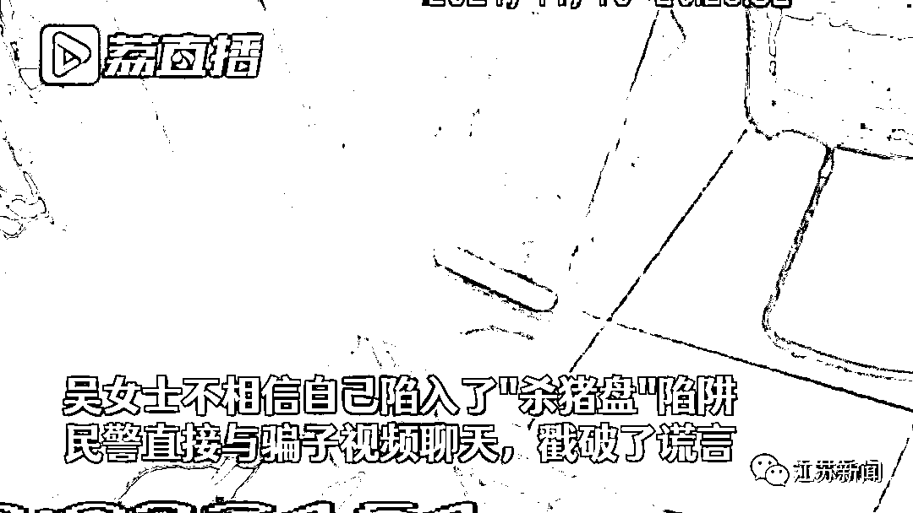
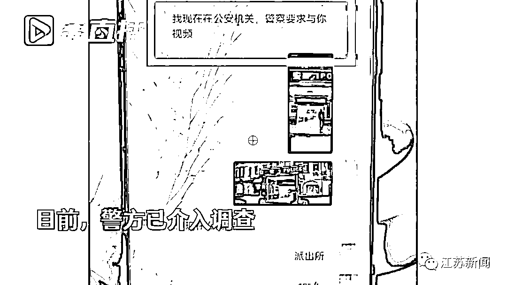

# 又双叒叕见“杀猪盘”骗局！这次剧情更离谱……

> 原文：[`mp.weixin.qq.com/s?__biz=MzIyMDYwMTk0Mw==&mid=2247524360&idx=4&sn=ccc21929ff0d01193a3b8c2a49ca30a9&chksm=97cbab30a0bc22268c7ac0fb4f448a685a5b6ddea1f656ac536c290a78146d744f0905932337&scene=27#wechat_redirect`](http://mp.weixin.qq.com/s?__biz=MzIyMDYwMTk0Mw==&mid=2247524360&idx=4&sn=ccc21929ff0d01193a3b8c2a49ca30a9&chksm=97cbab30a0bc22268c7ac0fb4f448a685a5b6ddea1f656ac536c290a78146d744f0905932337&scene=27#wechat_redirect)

“我和他很熟的，不可能是骗子，

要是真有事，我会打 110 报警的……”

江苏省南通如皋城南街道的吴女士

接到民警的预警电话时

还非常坚定地相信“男友”

经过民警近 4 小时的劝阻

她才彻底从骗子编造的谎言中清醒过来

然而她已经在这场骗局中损失了 22 万余元

[`mp.weixin.qq.com/mp/readtemplate?t=pages/video_player_tmpl&action=mpvideo&auto=0&vid=wxv_2139896375772282882`](https://mp.weixin.qq.com/mp/readtemplate?t=pages/video_player_tmpl&action=mpvideo&auto=0&vid=wxv_2139896375772282882)

11 月 10 日上午，如皋九华交警中队副中队长刘陈在对商户进行门前停车宣传时，一位金店员工向他反映了一个奇怪的客户。

原来 11 月 9 日下午，一位 40 岁左右的女子来店里变卖金首饰。店员当时就觉得这个客户有点奇怪，**“她精神状态不好，神情难过，开始问她一句话不说，拿着几十颗旧金子。”**

店员一边帮她办理业务，一边聊天，女子终于说出了发生的事情。女子表示，**她的老公在国外发生坠机，身受重伤，需要大笔资金。**现在她向亲戚朋友借钱，变卖金银首饰，就是为了汇款过去。

店员认为，航空公司发生事故有赔偿，但女子说她老公在境外坐的是私人飞机。店员猜测该女子受到了**境外的诈骗**，便提醒她。对方说不可能，她每天都和老公视频聊天。

得知这个情况后，刘陈意识到，这个来变卖的女子很可能遭遇了诈骗，立即向店员要来了变卖人登记的信息进行研判。他发现该女子是城南街道的吴女士，于是联系了皋南派出所，开展联系核实工作。

当天下午，皋南派出所拨打吴女士电话了解情况。在电话联系中，民警认为吴女士遭到了电信网络诈骗，但吴女士坚决否认。在民警的坚持下，吴女士才终于松口愿意到约定地点见面谈谈。

原来今年 7 月，吴女士在网络平台上认识了一位自称是医生的网友，双方添加了微信聊天。网友说自己叫陈英杰，新加坡人，现在在俄罗斯海船上做医生。经过一段时间的交流，吴女士与这名所谓的“医生”陈英杰建立了感情，称呼亲昵。

如皋市公安局皋南派出所副所长江文军介绍：“这个‘医生’说新加坡办的工资卡在俄罗斯取不出钱来，请吴女士帮忙垫付一些钱。后来他又说要到中国来发展，没有飞机票的钱，请她垫付机票钱。一开始这人说账上有一千万现金，到中国来之后就会还给吴女士。”

**从 8 月份开始，吴女士陆陆续续已借钱转给这个男友 22 多万元。**近期，男友说要到中国来发展，在吴女士等待的期间，却等到了男友发来的一个坏消息。

对方称自己往国内飞的航班迫降在哈萨克斯坦，他受伤昏迷了几天几夜，医药费医院来垫付，还要拍 CT。吴女士一点没有怀疑，始终相信男友能从哈萨克斯坦过来还钱。**最荒唐的是，修飞机的钱还要吴女士来承担。**

为了让吴女士相信自己陷入了诈骗陷阱，民警采取了最简单的方式。用吴女士的微信和对方视频聊天，但对方一直没有接受。警方拍了两张派出所的照片发过去，且在微信里表明了警察的身份，让对方赶紧把钱打回来。之后骗子没有再回复。

经过大量的案例和劝说，吴女士也答应不会再联系、转钱给对方。

吴女士遭遇的这一骗局的套路明显是**“海外恋人”的杀猪盘套路**，如今演化出“战地医生”“外籍军官”“海船工程师”等多种身份。整个套路的关键点，就是对方的国外账户无法提现，或者邮寄财物请受害人代收，但要先垫付一定的金额。

警方提醒：“在微信上主动找你的，一提到是国外什么资深人士，很有可能是骗子，‘杀猪盘’诈骗。”

来源：江苏新闻

← 向右滑动与灰产圈互动交流 →

