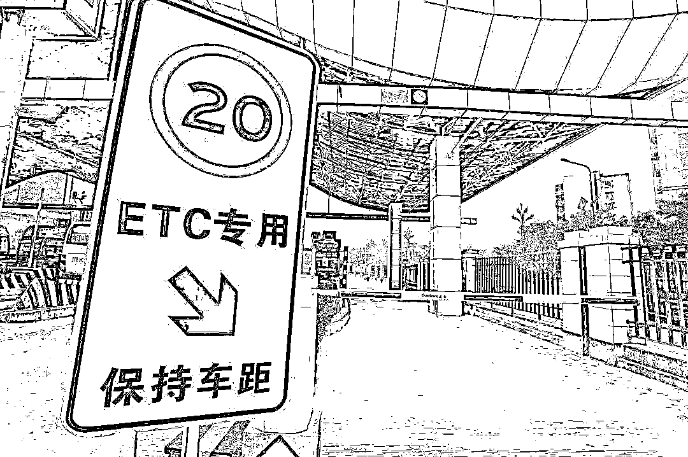
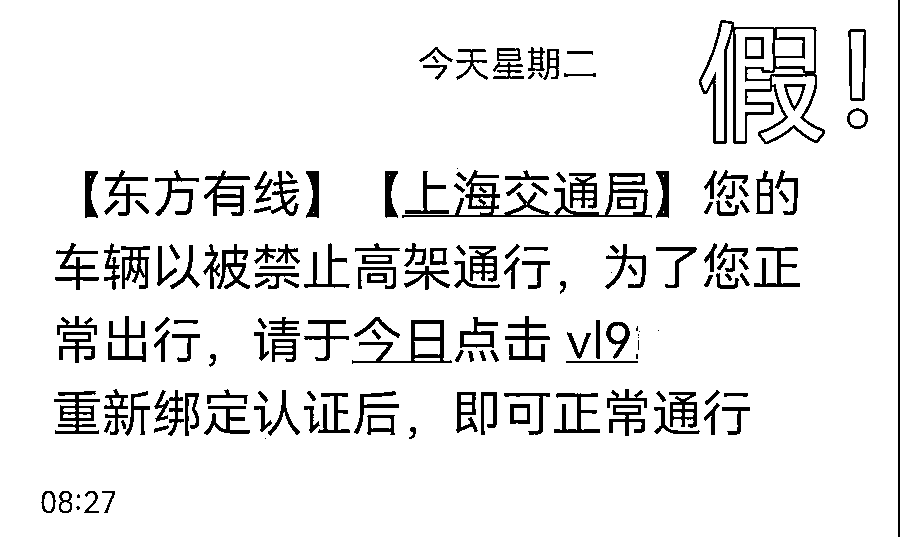
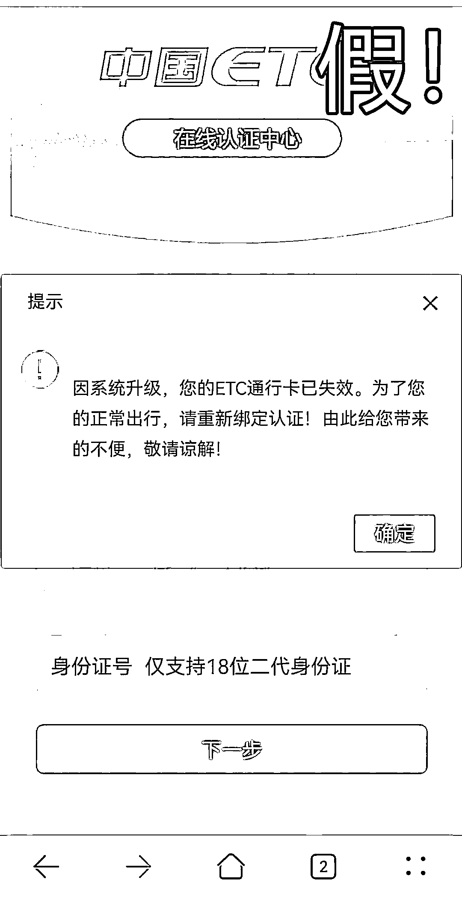
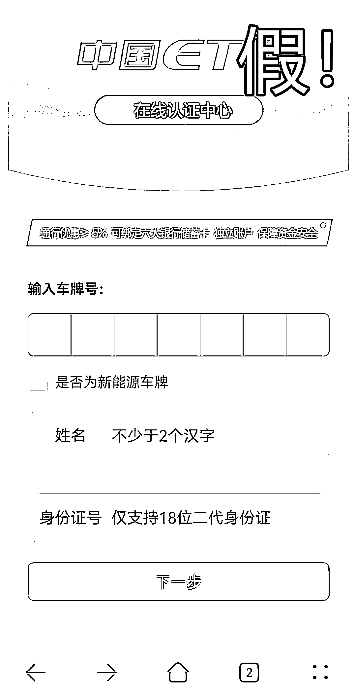
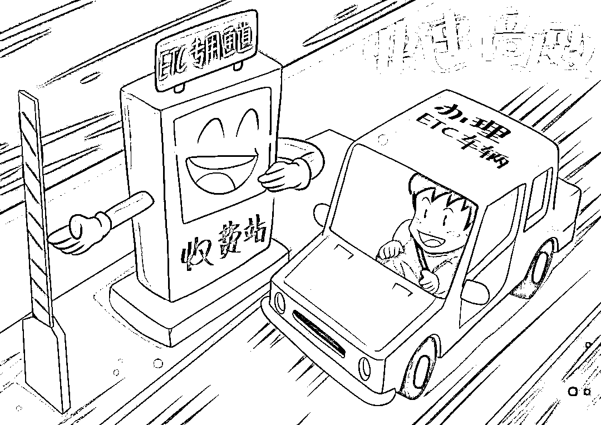
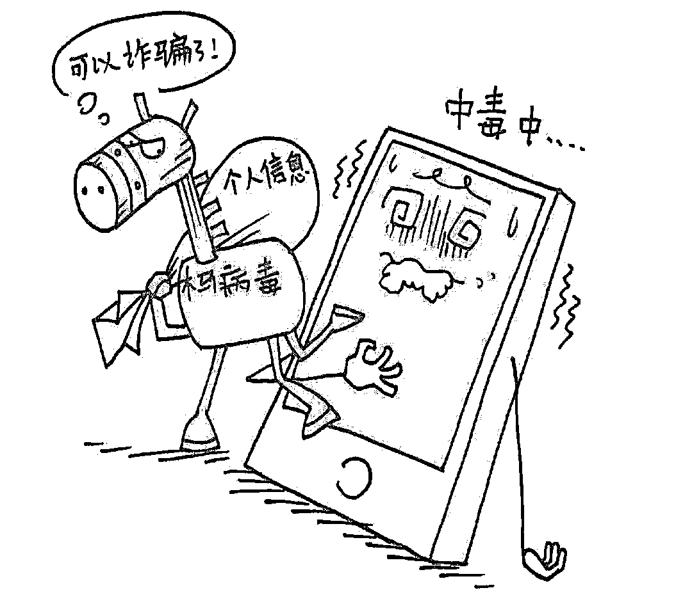

# 盗用 96877 发送诈骗短信，这种新型诈骗方式请注意！

> 原文：[`mp.weixin.qq.com/s?__biz=MzIyMDYwMTk0Mw==&mid=2247524360&idx=5&sn=1c133df9e7e8c0156dfc9825677ea8c2&chksm=97cbab30a0bc2226ec364aab1f23a0a051e1fb7c47bd94cf1d20ce42c7fcf9cf91cf44bece76&scene=27#wechat_redirect`](http://mp.weixin.qq.com/s?__biz=MzIyMDYwMTk0Mw==&mid=2247524360&idx=5&sn=1c133df9e7e8c0156dfc9825677ea8c2&chksm=97cbab30a0bc2226ec364aab1f23a0a051e1fb7c47bd94cf1d20ce42c7fcf9cf91cf44bece76&scene=27#wechat_redirect)

市公安局说，诈骗分子盗用上海东方有线客服号码 96877，通过发送短信，提示车主及企业经营者“车辆被禁止高架通行、高速公路 etc 卡失效、营业执照状态异常”，诱导市民点击钓鱼网址链接获取其身份信息、银行卡信息、短信验证码，从而进行银行卡账户盗刷，实施诈骗。广大市民群众在收到类似短信内容时，应仔细甄别，通过正规途径办理相关业务。详见↓

今日，上海市公安局反诈中心接到多起报案，**诈骗分子通过发送短信，提示车主及企业经营者“车辆被禁止高架通行、高速公路 etc 卡失效、营业执照状态异常”，诱导市民点击钓鱼网址链接获取其身份信息、银行卡信息、短信验证码，从而进行银行卡账户盗刷，实施诈骗。**

**车辆被禁止高架通行**

11 月 16 日，市民刘某收到一条短信，**“【东方有线】【上海交通局】您的车辆已被禁止高架通行，为了您正常出行，请于今日点击 vl**.cn/Y 重新绑定认证后，即可正常通行”**。

因为之前办理过网上的 ETC 业务，刘某看完信息后没有怀疑就点击了短信附带的链接。

界面看起来很正规，便按照提示内容填写了自己的车牌号、姓名、身份证号、手机号、银行账号等信息。

随后，刘某手机收到一个验证码。而当他将验证码输入认证界面后，收到的却是银行发来的扣款信息：“叮，您的账户消费 30000 元……”，才知道自己被骗。

**诈骗套路**

诈骗分子打着**“车辆被禁止高架通行”的幌子，让市民点击短信内的链接处理。**当市民点击链接并填写个人信息后，卡内资金直接被盗刷。短信内的链接，实际上就是钓鱼网站，一旦市民轻信，骗子在后台便能获取到市民在网页上填写的个人信息，从而通过快捷支付功能将市民银行卡内的资金转走。

除了上述内容外，诈骗分子还**冒充市场监管总局**发送“【东方有线】【市场监管总局】，您的营业执照显示状态异常，11 月 16 日前进入 jhuy****.net 自助更新，延迟将受处罚”；**冒充 12123**发送“【东方有线】【12123】，尊敬的车主，您的高速公路 ETC 卡失效，请于 11 月 16 日前进入 hvf****.net 解除，否则影响您出行”，引诱不明真相市民点击短信内的网址链接，进而填写银行卡账号等信息，导致发生被骗。

****警方提示****

****

****陌生短信不轻信****

****信息内容要甄别****

**“96877”是上海东方有线公司客服号码，不负责诈骗短信中所谓的高速公路 etc 卡失效、营业执照状态异常等相关业务。广大市民群众在收到类似短信内容时，应仔细甄别，通过正规途径办理相关业务。**

****未知链接不点击****

****个人信息不泄露****

**在此类诈骗中，诈骗分子往往会在短信内容中嵌入一个未知网站链接，吸引您点击登录，骗取您填写个人信息，特别是**手机验证码，**从而造成银行卡账户盗刷。再次提醒广大市民群众不要轻易点击。**

**来源：天天防诈骗**

****

**← 向右滑动与灰产圈互动交流 →**

****