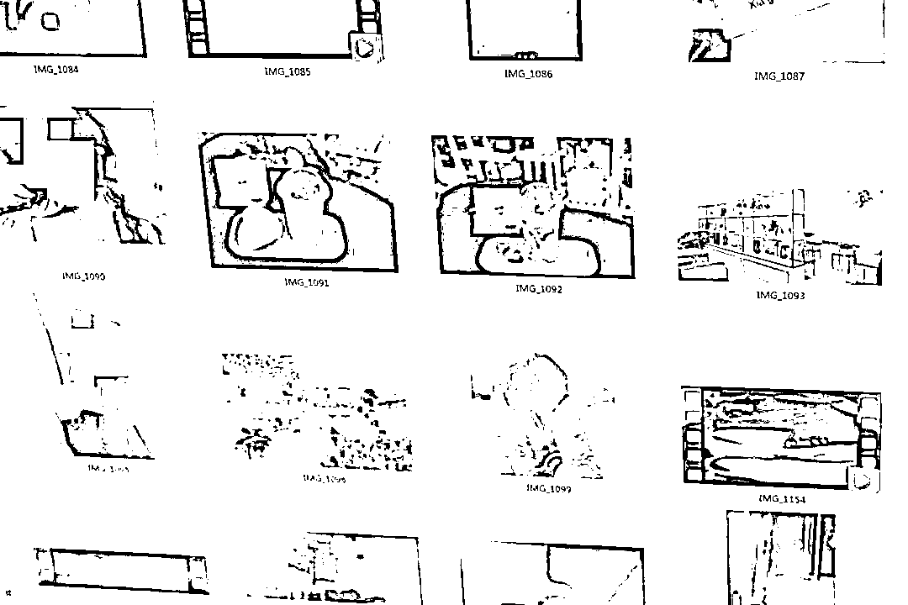
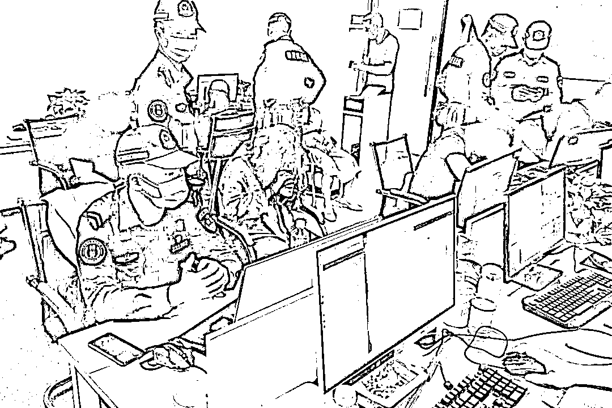
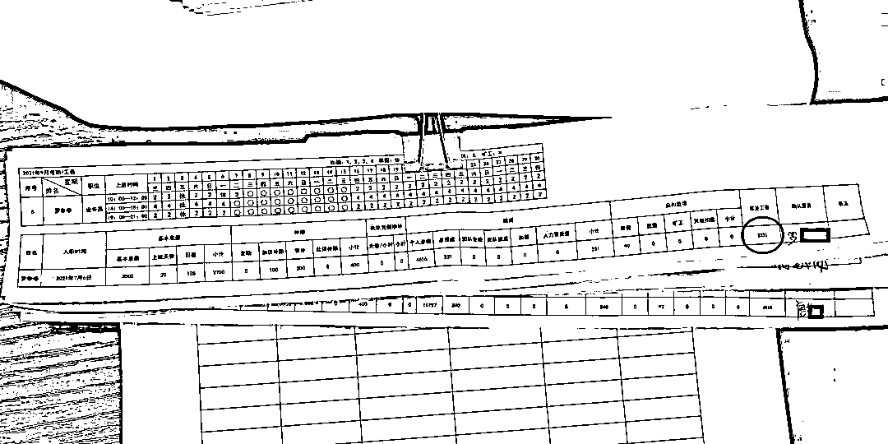
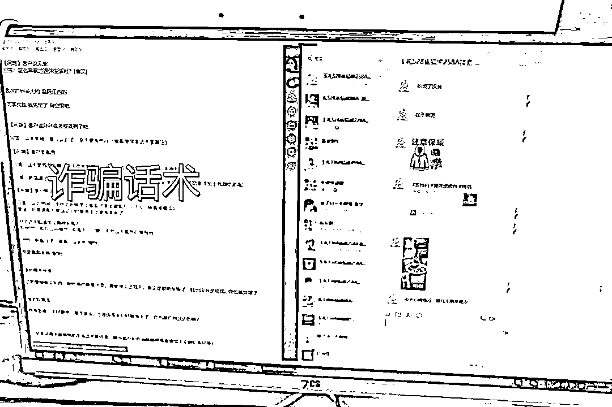
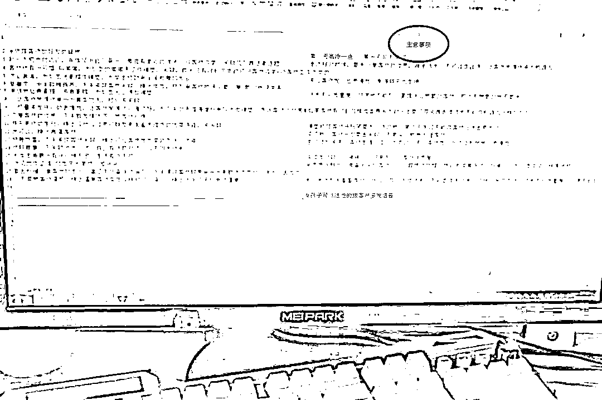
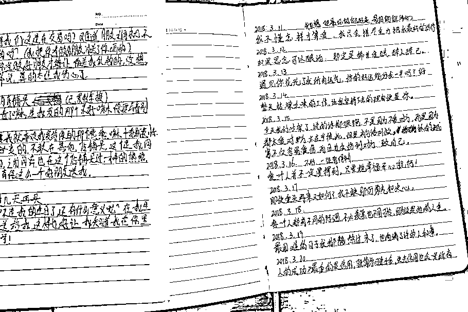
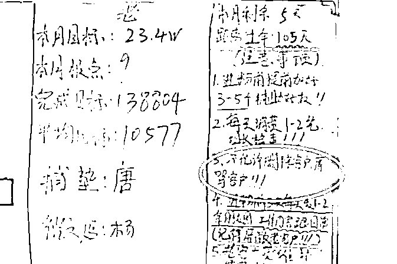
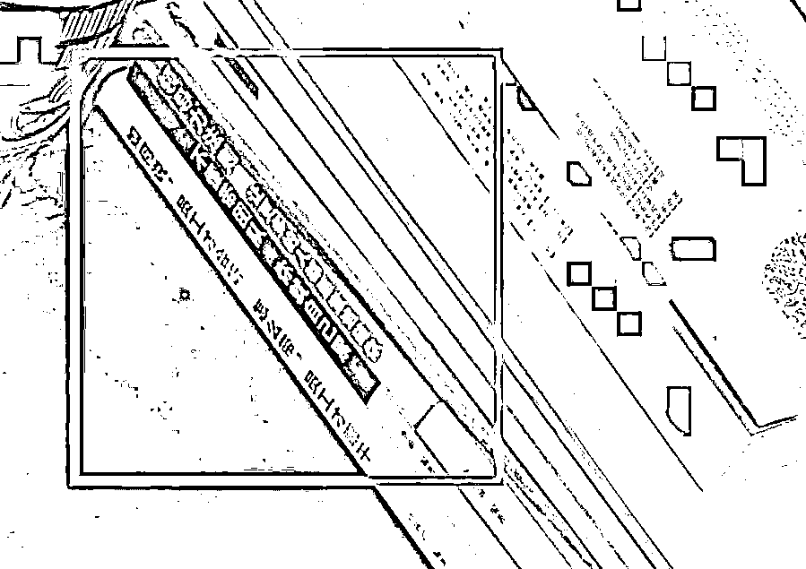

# 诈骗窝点被端！立好 KPI，手写情话，做好笔记，一线员工工资仅 3000，努力与回报永远成正比！

> 原文：[`mp.weixin.qq.com/s?__biz=MzIyMDYwMTk0Mw==&mid=2247524424&idx=1&sn=6abea35774bc312ab3669aa80a25886e&chksm=97cbab70a0bc226640eb984b8c25d87b1a695157ebc4205b1ee2cf33780512f8d52994e72955&scene=27#wechat_redirect`](http://mp.weixin.qq.com/s?__biz=MzIyMDYwMTk0Mw==&mid=2247524424&idx=1&sn=6abea35774bc312ab3669aa80a25886e&chksm=97cbab70a0bc226640eb984b8c25d87b1a695157ebc4205b1ee2cf33780512f8d52994e72955&scene=27#wechat_redirect)

该公众号已被封禁

到了年底就心惶惶 

工资什么的让人心烦

特别是亲戚朋友聚一起时总讨论：

二姨家的女儿月薪上万了！

大叔家的儿子已经买房买车了！

忙碌了一年，网贷都没还请

朋友圈里风风光光

可能已经没钱买秋裤

**月薪 3000 的爱情长啥样？**

90 后，在石马一工厂打拼，流水线的工作没法为阿国（化名）滋养出爱情。抖音上的花花世界，小姐姐说话还甜，刷一刷，世界仿佛就在手里。

11 月 11 日，“光棍节”，抖音上认识的小姐姐一改高冷姿态，竟然主动联系了阿国（化名）。**“我创业开花店了，你要不要支持一下我”**小姐姐发来了信息，鲜花配美人，支持小姐姐的事业，说不定她就会以爱情来回报。

转账 976，美女 886

钱一到账，人就不见了

“光棍节”光了的还有阿国的钱包。

▲“小姐姐”发朋友圈的图

月收入 3000+

发完工资潇洒几天后 

剩下的还要撑过月尾

很多人都在说，月薪 3 千的人，不配谈恋爱

现实生活挥霍不起

就有人想到网上寻求慰藉

只是没想到

遇上的会是他们——

[`v.qq.com/iframe/preview.html?width=500&height=375&auto=0&vid=wxv_2139925077914615813`](https://v.qq.com/iframe/preview.html?width=500&height=375&auto=0&vid=wxv_2139925077914615813)

近日，塘厦公安分局刑侦大队

在惠州一出租屋内

打掉一个“网络交友诈骗团伙”

现场抓获 3 人

你以为在网上遇上的“真爱”

在“她”的眼里，你只是个“穷鬼” 

**薪资 3 千，做出 8 千的事**

想要获得升职加薪，增加收入，有些事，是要学着去做的。比如，**在你月薪三千的时候，就应该做月薪八千的事。**

近日，塘厦公安分局办案中心

在惠州一大厦内

打掉一个“网络交友诈骗团伙”

现场抓获 9 人

[`v.qq.com/iframe/preview.html?width=500&height=375&auto=0&vid=wxv_2140053503912771585`](https://v.qq.com/iframe/preview.html?width=500&height=375&auto=0&vid=wxv_2140053503912771585)

经审讯

9 名犯罪嫌疑人供认了

其通过网络交友

以交换礼物、生日等理由

索要礼物

并要求对方到指定的网站下单

以此进行诈骗 

在现场，塘厦警方查获了该团伙作案用的电脑、手机等物品，其中有些东西着实让人感受到了“诈骗人”的“努力”。

▲诈骗分子的工资单

我们总以为干诈骗的人应该轻轻松松月入过万，但没想到，负责**假扮美女与受害人聊天的嫌疑人**，**月薪竟是 3 千左右**。

但诈骗人在拿三千工资时，却能体现出八千的价值——

01

**良好的“诈骗”习惯**

良好的工作习惯可以有效提高工作效率。诈骗分子将**各种话术都做好备注分类保存**，对**不同受害者的“诈骗”进度也会备注在微信上**。上班时间，只要对照话术安排，将内容复制黏贴给受害人，假装在与网友聊天。

▲诈骗话术

02

**记录“诈骗”技巧的习惯**

诈骗分子在与受害人聊天的过程中，**注重总结归纳**，习惯记录下“注意事项”，下次再遇到“难搞”的受害人时，就可以很快找到解决方法。

▲诈骗分子归纳的“注意事项”

“网络交友诈骗”，最重要的就是那一份情，诈骗分子为了获得受害人的信任，还会亲自**手写“情话”**，风格就像是我们写的“QQ 签名”……

▲诈骗分子手写的情话

03

**立好 KPI，带着目标完成“诈骗”**

“千斤重担万人挑，人人头上有指标”天天用同样的话术和人聊天，肯定会觉得闷，为了激励“诈骗分子”，他们定下了月目标、平均日目标，还安排了专人**每天更新白板上的数据**。

▲诈骗分子的 KPI

在团伙作案的诈骗分子，还有很重要的一点，就是要管理团队，“热爱学习”的诈骗分子还买了不少关于“团队管理”的书籍，分工合作，共同“诈骗”。

▲“诈骗分子”的书

莫欺少年穷

月薪 3000 也许只是骗子的

短暂收入

你再不好好学“反诈知识”

骗子就要“反超”你了 

愿我们都不要遇上，月薪 3 千却用 8 千努力的骗子。

来源：塘厦公安，阻击诈骗

← 向右滑动与灰产圈互动交流 →

