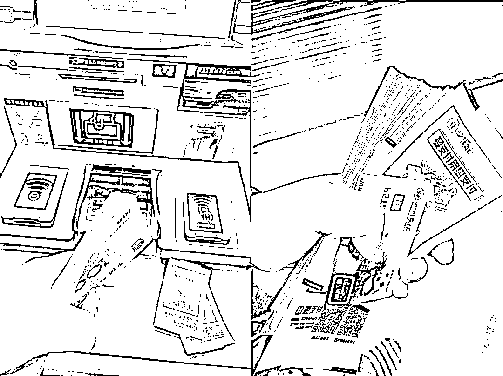
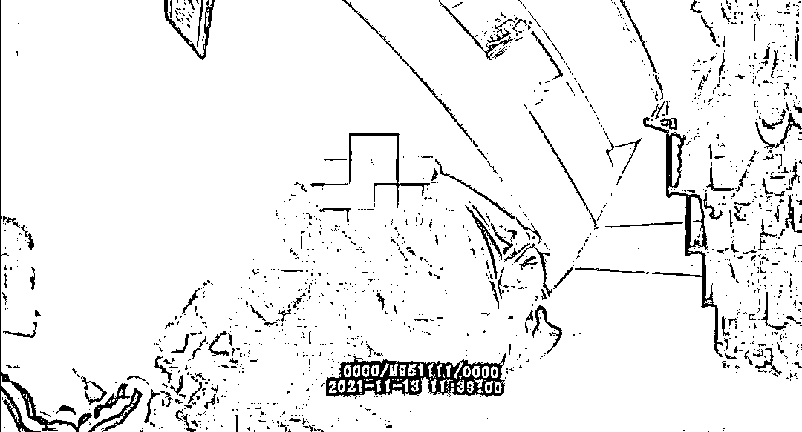
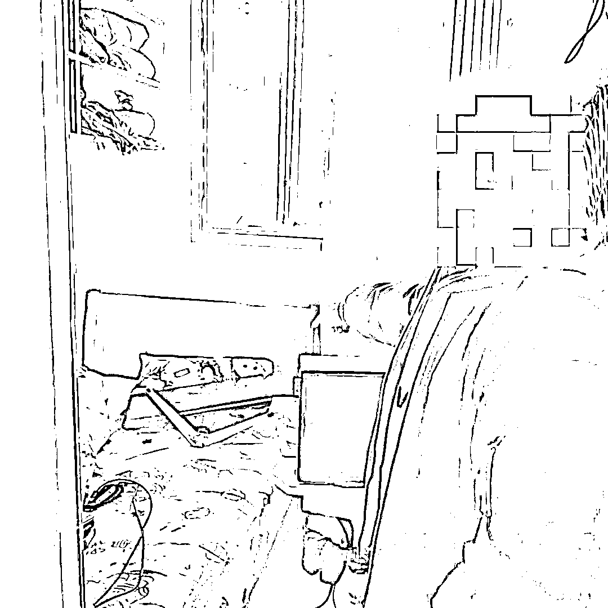
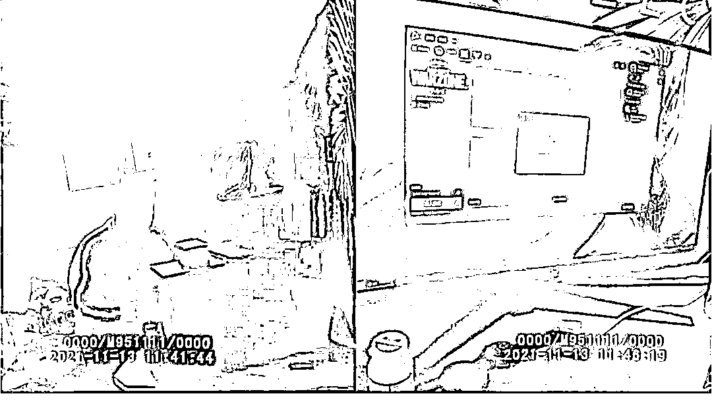

# 19 岁高三学生色诱诈骗 20 余万元！

> 原文：[`mp.weixin.qq.com/s?__biz=MzIyMDYwMTk0Mw==&mid=2247524424&idx=2&sn=276ea8e353568b3018a516598ab25324&chksm=97cbab70a0bc226669d67ca569cefb86ad63759cdb6143c99897f3808aebb69680dd1bed4a09&scene=27#wechat_redirect`](http://mp.weixin.qq.com/s?__biz=MzIyMDYwMTk0Mw==&mid=2247524424&idx=2&sn=276ea8e353568b3018a516598ab25324&chksm=97cbab70a0bc226669d67ca569cefb86ad63759cdb6143c99897f3808aebb69680dd1bed4a09&scene=27#wechat_redirect)

你的校园生活是怎样的呢？ 

应该是在奋笔疾书、备战高考

满心期待着考上理想大学吧

但宜宾江安县高三男孩李某

却因涉嫌诈骗被警方抓获！

在李某手机内，有大量炫富视频与照片

[`mp.weixin.qq.com/mp/readtemplate?t=pages/video_player_tmpl&action=mpvideo&auto=0&vid=wxv_2138206004705132545`](https://mp.weixin.qq.com/mp/readtemplate?t=pages/video_player_tmpl&action=mpvideo&auto=0&vid=wxv_2138206004705132545)

**（李某手机相册内的炫富视频）** 

**（炫富照片）**

案情回放

2021 年 11 月 3 日，宜宾江安县公安局根据市局反诈中心推送线索，在辖区内抓获一名**以观看色情直播为由对外实施诈骗犯罪嫌疑人李某**。目前，已查实嫌疑人李某利用网络诈骗 20 余万，串案 4 起，该案正在进一步办理中。

2021 年 8 月，反诈中心收到公安部推送线索，受害人王某在网上添加一 QQ 号在网上观看色情直播，对方以预付押金为由，要求王某通过支付宝扫描二维码转账六万多后将其拉黑。反诈中心立即开展研判，最终确定嫌疑人作案地在宜宾江安县城区，遂将线索移交到江安县公安局继续侦办和研判。 

（抓获现场） 

江安县公安局收到线索后，立即进行分析研判，11 月 3 日，在江安县城区一民房内将犯罪嫌疑人李某抓获。

（指认现场）

据李某自己供述，他是一名高三学生，熟悉电脑，于**2019 年开始摸索诈骗流程**，2021 年开始实施诈骗，通过 QQ 平台发布一些关于“色情”直播的“内涵”文案，谎称自己能提供所有类型的“色情”直播，骗取受害人向自己交押金后再将其拉黑，前后共诈骗 10 人，诈骗钱财 20 余万元。

[`mp.weixin.qq.com/mp/readtemplate?t=pages/video_player_tmpl&action=mpvideo&auto=0&vid=wxv_2142332996668964866`](https://mp.weixin.qq.com/mp/readtemplate?t=pages/video_player_tmpl&action=mpvideo&auto=0&vid=wxv_2142332996668964866)

**（李某现身说法讲述诈骗过程）**

据嫌疑人姐姐讲述，弟弟李某平时没有去上学，几乎不出门，房门紧闭，以为他都是在家里打游戏。 

（李某作案用的电脑） 

就是这样一个小小的房间，一部电脑，两台手机，短时间就让李某获利不菲，并挥霍一空。

利用“色情”施诈的犯罪步骤： 

**01 四处撒网**

    诈骗分子会事先在网络上（QQ、微信、陌陌、网站等）发布所谓的提供特殊服务信息，大多都会附上露骨的性感照片，就等着受害人上钩。

**02 物色目标**

 等到对方看到信息主动找上门的时候，骗子立即承诺服务内容，通过各种忽悠，诱惑让受害人悠然神往，丧失理智。

**03 预交定金**

 达成交易意向后，骗子开始会以各种似乎“合乎情理”的理由让受害人先交钱，并且信誓旦旦称一收到钱马上提供相应的服务。通常这笔钱金额不会很大，一般都是一两百这样，一来试探受害人的心理防备程度。

**04 变本加厉**

当受害人交了第一笔钱之后，骗子又会编出要保证安全为由，要求受害人先通过汇款交上几千元的保证金。待交完保证金后，又会以其他各种理由索要钱财。 

**05 无影无踪**

    等到受害人发现上当受骗后，钞票已进入骗子的口袋里了。翻然悔悟后，想再与对方交涉时，骗子已消失得无影无踪，电话也打不通了。

**广大人民群众要绿色上网，远离网络不良行为；不要随意接受陌生网友的邀请，搭讪，不轻易点击陌生链接或下载 APP，更不要随意向陌生人转账，一旦被骗，应第一时间拨打 110 报警。**

来源 ：宜宾市反诈中心，熊猫反诈

← 向右滑动与灰产圈互动交流 →

