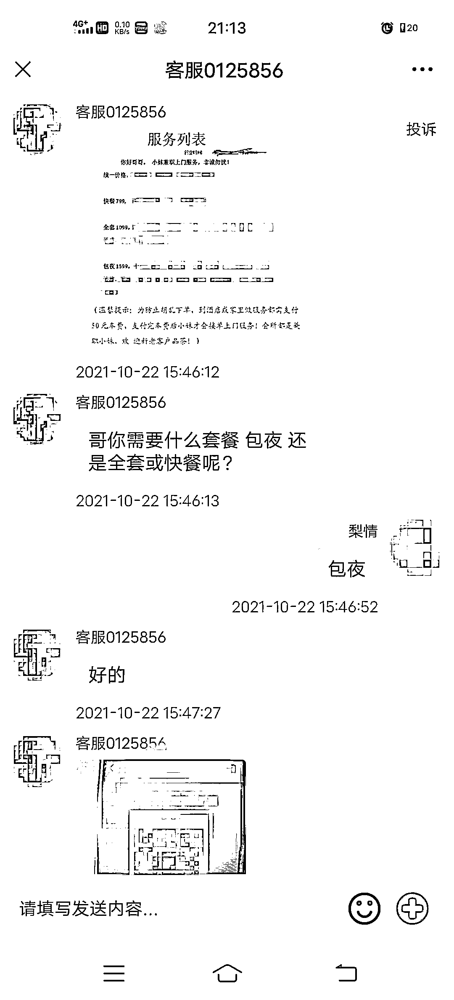
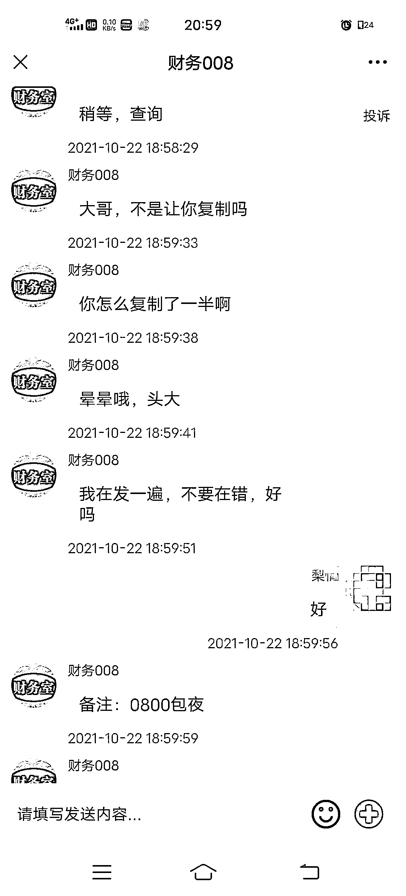
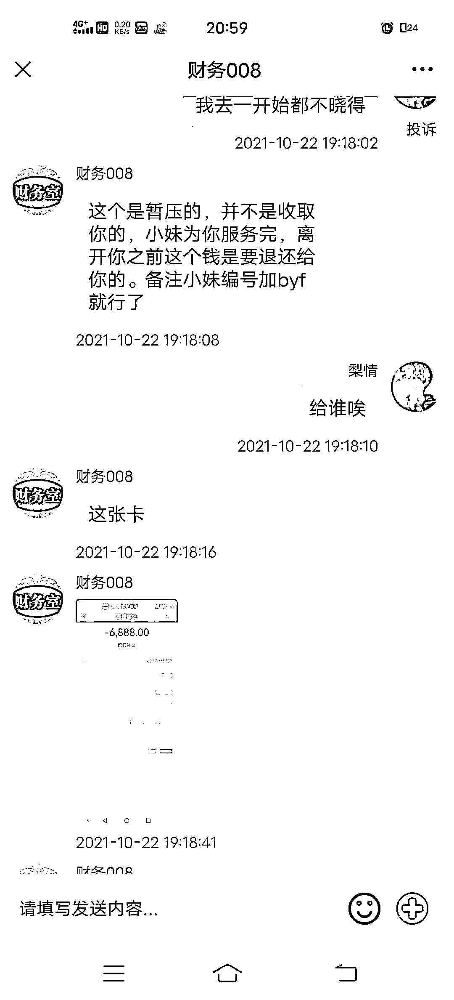

# 网上约“美女小姐姐”？小伙亏大了...

> 原文：[`mp.weixin.qq.com/s?__biz=MzIyMDYwMTk0Mw==&mid=2247524424&idx=3&sn=14de1c3dffb924e021c23dad9eaf0a24&chksm=97cbab70a0bc226611dac904b458358c06373fbe865ec9ec94444d1fa75e4ee87641d6b4daa9&scene=27#wechat_redirect`](http://mp.weixin.qq.com/s?__biz=MzIyMDYwMTk0Mw==&mid=2247524424&idx=3&sn=14de1c3dffb924e021c23dad9eaf0a24&chksm=97cbab70a0bc226611dac904b458358c06373fbe865ec9ec94444d1fa75e4ee87641d6b4daa9&scene=27#wechat_redirect)

打开手机

看见陌生消息

妹子外围兼职“上门服务”

这个时候

如果你经不住“粉红诱惑”

那么一不小心

就可能会掉进招嫖诈骗“黑色陷阱”

近日，在廿三里街道务工的小罗，本想“春风”一夜，结果却被骗走 1 万多元。

10 月 22 日的下午 4 点，小罗正拿着手机刷消息，突然看到一个聊天群内有人发了这样一条消息：“各种类型美女小姐姐，支持上门服务，品茶请添加微信客服”。

单身多年的小罗看到这条信息不由地动了“歪心思”，尝试着扫码添加该“客服”。

加上好友后，对方很快发来一张服务列表供小罗选择，挑选完自己所心仪的小妹和套餐，小罗按照要求先行转了 50 元的车费，之后对方便让小罗添加了“财务”的微信，告诉他等小妹上门了会由“财务”跟他联系。

到了晚上 6 点，“财务”发来消息称小妹已经到小罗附近了，让小罗先行支付服务费 1549 元。

想到接下来即将发生的事，小罗当即往对方发来的银行账户内转账，但却跳出来了转账失败的字样。

“财务”解释到这是因为小罗转账没备注，需要重新转账，等小妹见面核实后会将钱返还，依旧是没有多想，小罗便再次转了账，结果对方又称因为小罗的失误，备注信息里漏了“备注”两个字，订单还是没成立，仍需要再次转账。

对方的指责让小罗觉得的确是因为自己的失误才导致订单不成立，老老实实的按照要求又一次进行了转账。

好不容易将服务费缴纳成功了，小罗没想到“财务”下一句还是让他转账：“这边呢因为你是第一次下单，我们需要给小妹一点保障。这个钱是暂押的，等服务完是会退还给你的。”

在“财务”的万般理由说服下，小罗还是将 6888 元转了过去，但“财务”却用支付超时订单未生成为由，要求小罗重新转账。

这下小罗不干了，人还没见到，钱先转出去了一万多，要求对方退款，对方也假模假样让小罗填写了退款信息，却又告诉小罗只有先转退款资金的两倍，才能将全部钱如数退还。

听到这种说辞，小罗这才明白自己招来的不是美女，而是骗子，立马向廿三里派出所报了警。

目前，案件正在进一步侦查中。

**警方提醒**

招嫖诈骗是不法分子利用互联网发布虚假“招嫖”信息，吸引男性受害人，当受害人抵不住诱惑后，以索要“车费、服务费等”为借口实施诈骗的一种诈骗手段。

在网上冲浪时注意分辨信息，洁身自好，牢记嫖娼也属于违法行为如遇诈骗，请第一时间报警。

来源：义乌公安，阻击诈骗

← 向右滑动与灰产圈互动交流 →

