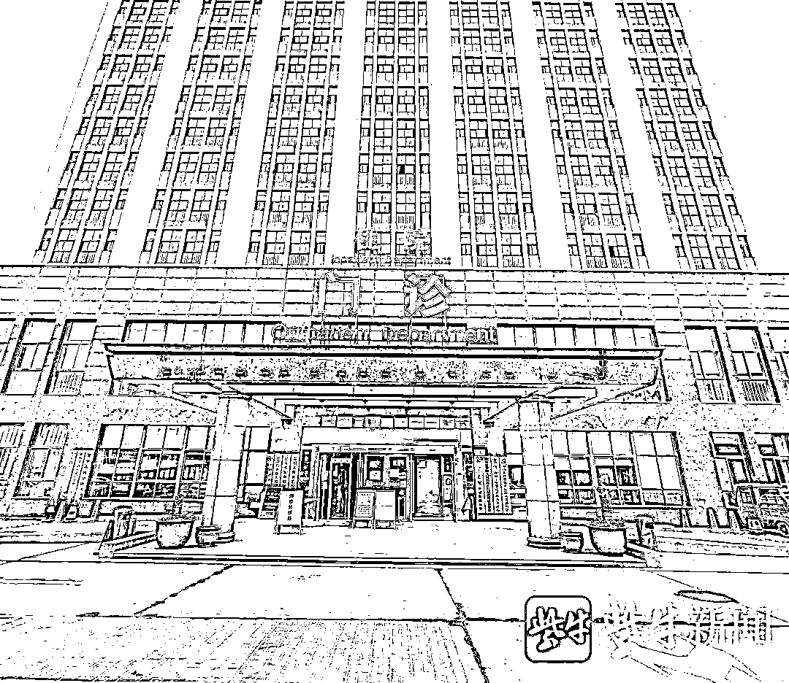
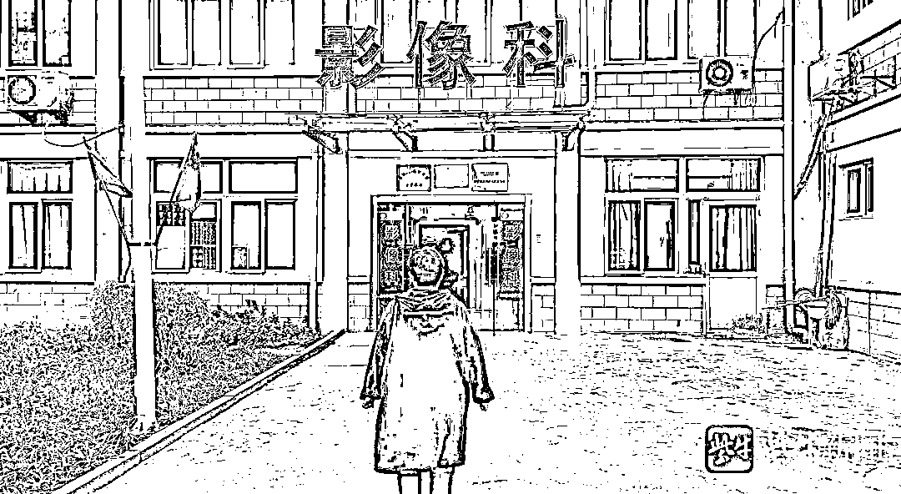

# 19 岁女生入职体检，拍 X 光时被要求脱光上衣？！涉事医生停职

> 原文：[`mp.weixin.qq.com/s?__biz=MzIyMDYwMTk0Mw==&mid=2247524424&idx=5&sn=e22e752d0fba9aeef59692d7f9d8304f&chksm=97cbab70a0bc2266cb452fcf727e858491380760b057b197ab19bf9a1404f498b06e66fe5150&scene=27#wechat_redirect`](http://mp.weixin.qq.com/s?__biz=MzIyMDYwMTk0Mw==&mid=2247524424&idx=5&sn=e22e752d0fba9aeef59692d7f9d8304f&chksm=97cbab70a0bc2266cb452fcf727e858491380760b057b197ab19bf9a1404f498b06e66fe5150&scene=27#wechat_redirect)

江苏常州一 19 岁女生去新北区某民营医院做入职体检。结果在胸透拍 X 光时，医生说 X 光片子看不清，要求脱光上衣拍片。女生回家后越想越不对劲，上网查询才发现，拍 X 光根本不用把衣服脱光。于是，她将此事告诉了父母，父母一听炸锅了，女儿被占便宜了，感觉遇到了“流氓医生”，就拨打了 12345 热线，并报了案，女生父母也向记者寻求帮助。

记者介入调查后得知，目前，**涉事医生承认了女生脱光上衣拍 X 光的事实，只是在原因上还有一些说辞。院方表示，已对其进行停职处理。**警方表示，案件仍在进一步调查之中。

[`mp.weixin.qq.com/mp/readtemplate?t=pages/video_player_tmpl&action=mpvideo&auto=0&vid=wxv_2141515744705052674`](https://mp.weixin.qq.com/mp/readtemplate?t=pages/video_player_tmpl&action=mpvideo&auto=0&vid=wxv_2141515744705052674)

涉事医院

**市民求助：**

**女儿做实习入职体检**

**受到男医生“侮辱”**

11 月 17 日清晨，常州市民刘女士（化姓）向记者反映，称她女儿在做实习入职体检过程中，被男医生“侮辱”了。据刘女士讲，她女儿小莉（化名）今年 19 岁，在读大专，明年就要毕业了。前段时间，他们约好了常州新北区一家公司，安排女儿去实习文员工作。11 月 15 日就可以去上班实习，不过公司要求先做入职体检。11 月 12 日上午，小莉按公司指定，去靠近公司的一家民营医院做体检，当做到胸透 X 光环节时，就遭遇了“侮辱”。

刘女士告诉记者，医生在女儿做 X 光的时候，居然让她把上身衣服脱光了。女儿因为不太懂，就反复确认医生要求后，就照做了。可是等到当晚回家，一夜都没怎么睡好，次日查询网络才发现，做胸透根本不需要脱光衣服，这才把怪事告诉了父母。当时，她和丈夫听到这事，就感觉这个医生有问题。先打了 12345，后来又报了案。大概是 14 日晚上，警方传唤了那个医生。后来民警联系他们家属，称医生已经承认，在检查时，小莉确实把上衣脱光了，但是他并不觉得有什么，因为在他看来，他是医生，来检查的人没有“男女之分”。

刘女士丈夫说，他们家想要个说法，并不是说要医院赔偿什么的，而是医院要拿出个态度来，该道歉道歉，该处罚医生处罚医生，今后规范检查流程。他们女儿被要求脱光照 X 光的事情，是被家长知道了，要是其他女生也遭遇这种事情，还都被蒙在鼓里，以为照 X 光就是该脱光，那不知道这个医生还要坑多少人。

涉事科室

**当事人说：**

**至少三次告知“再脱就光”**

**医生却坚持让她“脱光”**

17 日上午，记者见到了当事人小莉。“我这几天都没怎么睡好，老是想到这件事，感觉那个医生挺恶心的。”小莉告诉记者，事发当天，她来到 X 光室外排队等待做胸透，在门外看到医院有明文告知，女性必须摘掉胸罩拍胸片。见到告示，她就去了更衣室脱掉了内衣，上身仅穿着一件卫衣就在 X 光室外排队等待。很快便到了她做检查，走进 X 光室后，她就按照医生要求拍了胸透的片子。可是医生告诉她说，拍出来的成片看不清楚，要求她将卫衣脱掉。见是一位男医生在为其做检查，她便告诉男医生自己卫衣里面已经没衣服了。同时询问医生，“真的要在这里（X 光室室内）脱掉衣服？”然而，医生很明确告诉她，就在这里脱。

**“我当时问了他至少三遍，他就让我在里面把卫衣脱掉，还跟我说，他去把外面门关上，其他人看不到里面。”**小莉说，当时她也有些懵，但再想想外面还有人在排队，医生不可能会骗她，就没再多想，把卫衣脱掉了。等照完 X 光，穿上卫衣后，X 光室大门被打开，她走出去时，总感觉在排队的人用异样的眼光看着她，她挺难为情的。

当天晚上，她越想越不对劲，就问了闺蜜，“做胸透是不是要脱光了做？”不成想，闺蜜告诉她，做 X 光胸透根本不用脱光了做，她当时就蒙圈了。后来一晚上都没怎么睡好，在网上查了资料，也发现**做 X 光不需要脱光，只要没有金属物品什么的就行了。**她感觉自己被可能被“欺负”了，就把此事告诉了父母。后来，她父亲咨询了律师，律师告诉他们，这事很难固定证据，建议尽快报警，并且向职能部门投诉反映这一情况。后来，他们报了案，警察问其是否还能记得医生的长相，她当即表示，肯定记得住。后来在警方的帮助下，她确认了涉事医生就是金某。

女生当天穿着这件黑色卫衣去做的胸透

**记者调查：**

**当事医生已承认“女生脱光”**

**现场也有能换“病患服”的地方**

17 日中午，记者陪同刘女士来到涉事医院，找到了该院影像科的负责人周主任。据周主任讲，涉事医生 17 日并不在医院，他们开始也无法证实当事人及家属讲的是否属实。后来，警方介入了，金医生也承认了，女生小莉在做胸透时，有脱光上衣。院方也和金医生谈话了，询问其为何要让小莉脱光了做胸透？金医生说，因为当时第一张胸片拍得不清楚，所以要拍第二张，他不知道小莉是最后一件衣服了，只知道是卫衣有问题导致 X 光看不清，这才发生了小莉脱光上衣的情况。

随后，这位周主任带记者来到当时小莉做 X 光的地方。记者看到，**X 光室外不远处，就有更衣室，里面有一件病人服。如果 X 光拍不清，现场完全是有条件可以让检查人员去更换衣服的。**但不知为何，金医生却没有让小莉去换衣服。

记者看到，X 光室医生操作间有一扇门，医生关上门，外面等待区域是不大能看清 X 光体检人员的情况的。记者向周主任索要涉事医生金某的电话号码，希望能采访一下这位金医生，但周主任并没有提供，他表示，金医生今天不在医院，他们也不方便提供。

**涉事医院：**

**目前已对涉事医生进行停职处理**

**等待警方调查后做进一步处理**

那么病人做 X 光被要求脱光正常吗？带着疑问，记者采访了常州市卫健委，据有关负责人介绍，他们目前也正在着手调查此事，一般情况下，医生是不会要求患者把衣服脱光去做 X 光胸透的。当然，有的患者衣服上有金属件，确实影响影片成像的，必须脱光才能照清楚的，医院也会为体检者提供可更换的衣服。记者之后也从常州的三甲医院了解到，如果患者确实需要脱光上衣做检查的，他们会提供病患服。

当天下午，涉事医院有关负责人联系了记者，他告知记者，院方目前已经停止了金医生一切工作。院方也在等待警方的最终调查结果，对金医生还会做出进一步处理。据他们所知，金医生说，当时是因为衣服导致了 X 光影像不清楚，目前警方已经将小莉的衣服作为物证保存，将送检来进一步证实金医生的说法。

**法律观点：**

**涉事医生行为极可能违法**

**但不一定构成犯罪**

记者从警方获悉，目前案件仍在进一步调查之中，具体案件细节警方不便透露，女生的衣服警方也还需要进一步检测，需要多台机器验证是否影响成像。

记者查阅相关资料发现影像检查时是有**《放射科保护患者隐私的管理制度》**的。

1、任何患者有权要求保护个人隐私，工作人员有义务尊重和支持。

2、患者在检查时，无关人员不得在场。病人在进行 X 线检查需要暴露胸腹部时，工作人员均应尽到告知义务，向病人进行说明，以征求病人的理解和配合，得到病人的同意后，方可进行检查。

3、病人在投照胸腹部时，不分男女均可穿一件无扣、无金属饰物的全棉内裤，如衣物不符合以上要求，而必须暴露投照区时，需给患者提供干净检查服装。

4、各检查室内做到“一室一患”，对于必须接受需要暴露人体部位检查的异性病人，应有同事或家属在场。

5、如果病人投照区有疤痕或纹身等异常形态，决不允许嘲笑和议论，任何医务人员不得取笑病人的生理缺陷。

6、未经病人同意，医务人员不得将病人的个人信息、病情、宗教信仰、身体缺陷、个人隐情等透露与病人诊疗活动无关的人员。

7、患者检查时的各种检查申请单及登记资料、登记本要妥善保管，严禁无关人员随意翻阅、拍照。

8、严格保管患者检查图像与报告，无关人员不得翻阅，报告只能由患者或其授权人员领取，或由其接诊主管医护人员领取。患者检查资料、报告未经授权严禁拍照、拷贝。

9、未经注册的医师需在执业医师指导下开展医疗活动以及观摩学习，涉及病人隐私的，应征得病人同意。

那么这位金医生的行为到底从法律角度该如何定性？有律师认为，医务人员在医疗活动中应严格遵守 《执业医师法》 、《医务人员医德规范及实施办法》《医疗机构病历管理制度》等法律法规的要求，不得泄露患者隐私。**从金医生的情况来看，他的行为极可能违法违规了，但还不一定构成犯罪。**

首先，该医生的行为违反了《保护患者隐私权的制度和措施》、《放射科保护患者隐私的管理制度》等规定，如男医生对女性隐私部位进行检查时，必须有女性医务人员在场，又如病人在投照胸腹部时，不分男女均可穿一件无扣、无金属饰物的全棉内裤，如衣物不符合以上要求，而必须暴露投照区时，需给患者提供干净检查服装等。

其次，该医生行为侵犯了他人的隐私，对病人人格构成了侮辱。《民法典》第 1033 规定，任何人和单位不得拍摄、窥视他人身体的私密部位。私密部位属于个人不愿他人知道的且比较隐秘的部位。一些不法分子经常在不同的场合，采取不同的手段拍摄和偷窥妇女的私密部位。我国《治安管理处罚法》对偷窥、偷拍、窃听、散布他人隐私的，处五日以下拘留或者五百元以下罚款；情节较重的，处五日以上十日以下拘留，可以并处五百元以下罚款。《民法典》将拍摄、窥视他人身体的私密部位定性为侵犯个人隐私的行为，积极回应了公民，特别是妇女，对身体私密部位保护的迫切需求。

来源 ：扬子晚报，潇湘晨报

← 向右滑动与灰产圈互动交流 →

