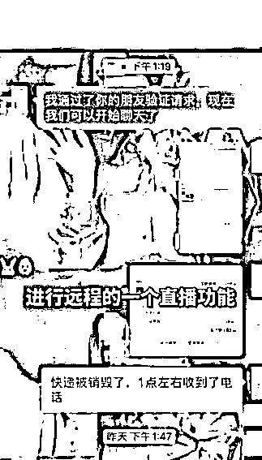

# “一件阳性，全车销毁”？有人被骗 10 万！国家邮政局紧急通知

> 原文：[`mp.weixin.qq.com/s?__biz=MzIyMDYwMTk0Mw==&mid=2247524424&idx=6&sn=fa11ab5cb80dd1f1d8b7222581ee7bf7&chksm=97cbab70a0bc226645ea96864bb45e4c6aa1bea0d5528933aa2fc67f61911f27313e891d355d&scene=27#wechat_redirect`](http://mp.weixin.qq.com/s?__biz=MzIyMDYwMTk0Mw==&mid=2247524424&idx=6&sn=fa11ab5cb80dd1f1d8b7222581ee7bf7&chksm=97cbab70a0bc226645ea96864bb45e4c6aa1bea0d5528933aa2fc67f61911f27313e891d355d&scene=27#wechat_redirect)

正值双十一收快递高峰期，近期北京和铁岭等地快递包装检出新冠阳性，引发关注。

值得注意的是，有诈骗分子试图借此大做文章，招摇撞骗。

“快递阳性要销毁”，被骗 10 万

据深圳公安局龙岗分局警察介绍，近期一位吴先生接到自称某快递公司的电话，说他的快递在运输过程中被检出新冠阳性，整车快递都要销毁，要对他进行赔付，还跟他核对了快递单号等有关信息。

截图来自深圳市公安局龙岗分局 

对方让吴先生扫一个二维码，填写了银行账号、密码、验证码等信息，结果显示验证码超时，对方又让他下载一个 app，进行远程直播，指引他一步步再操作。吴先生照做之后，发现他的账户出现 6 笔网络支付，总计超过 10 万元。

警方表示，在上述过程中，吴先生的银行账户、密码、验证码都泄露给了对方，对方就可以用他的账号进行支付了。这就是冒充客服的网购类诈骗，但是骗子更新了手段，利用疫情防控这个借口引人入局，隐蔽性很强。

一件阳性，全车销毁？　　

诈骗电话中提到“快递检出阳性，因此整车快递都要被销毁”。实际处理中，是否真的会波及一车快递？

快递专家杨达卿告诉记者：“据我了解的情况，部分快递企业一旦检出新冠病毒，要求原地封存，涉疫车辆和同批次快件逐票消杀，并同步给当地防疫部门，但不要求包裹销毁或全车销毁。”

快递物流专家赵小敏表示，一件快递阳性销毁全车快递，这种可能并不存在。

“目前快递在收寄之前都要进行全面消杀，快递物流公司每一次运转搬卸还要再次进行消杀。以现在的疫情防控形势，用户收到快递，不要让外包装进入家门就可以了。”

“快递检出阳性，快递公司要跟医疗部门和监管机构三方商定快递的处理方案。而且我们认为，商品被检出新冠阳性，处理之前和处理结果都要让用户知道，不可能说通知一下就销毁处理。” 

假如快件真的因为新冠阳性而销毁，用户将得到什么赔偿？

赵小敏表示，目前行业没有统一的规定。丢失损毁等情况，一**般是赔偿运费的 3-5 倍，最高会赔到 7 倍，**也有一部分情况是按照合同约定的价格赔偿，所以各种赔偿方案都有。

“如果是快递检出阳性导致被销毁，属于一种新的现象。我们认为不能完全参考快递起火，或者运输过程遗失的方案来处理，具体情况还有待商讨。”

如何安全收发快递？

国家邮政局紧急通知

11 月 18 日，国家邮政局发出关于做好冬春季邮政快递业新冠肺炎疫情防控工作的紧急通知，要求做好今冬明春行业疫情防控工作，全面精准落实“外防输入、内防反弹”防控措施，严密防范疫情通过寄递渠道传播扩散，切实维护邮政快递业安全稳定运行态势。

通知指出，近期个别地区发生新冠病毒核酸检测阳性电商员工寄递商品、进口货品入境后寄递过程中发现内件新冠病毒核酸检测阳性等涉疫事件。相关涉疫事件发生后，各级邮政管理部门、各企业高度重视，在地方疫情防控部门的指导下迅速拦截涉疫邮件快件，对相关生产经营场所、运输车辆、装备用具、邮件快件进行检测消毒，做好相关人员疫情排查、核酸检测、隔离观察等工作。**目前接受检测的涉疫邮件快件所关联的从业人员、收件人、生产营业场所、设施设备等核酸检测样本均为阴性。**当前，冬季来临、气温降低，新冠肺炎疫情与流感等呼吸道传染病叠加流行的风险增加，同时行业正处于业务旺季，从业人员揽收、投递邮件快件数量庞大，行业疫情防控形势依然严峻复杂。

**个人交寄零散进口货品的，如不能提供相关安全证明并做内件消毒处理的，企业不得收寄。**企业对进口冷链食品相关邮件快件在收寄、分拣、运输、投递等环节实施分区作业、独立运行。

**根据疫情防控实际，暂停列为中高风险地区的社区（村）快件收寄业务；中高风险解除后，快递企业要及时恢复。**低风险地区企业应综合评估协议客户主体资质、疫情风险、寄递物品属性等因素，对于不能确保交寄物品安全的协议客户，暂不收寄。

来源：中国经济网综合国家邮政局、中国新闻网、央视新闻客户端、红网

← 向右滑动与灰产圈互动交流 →

