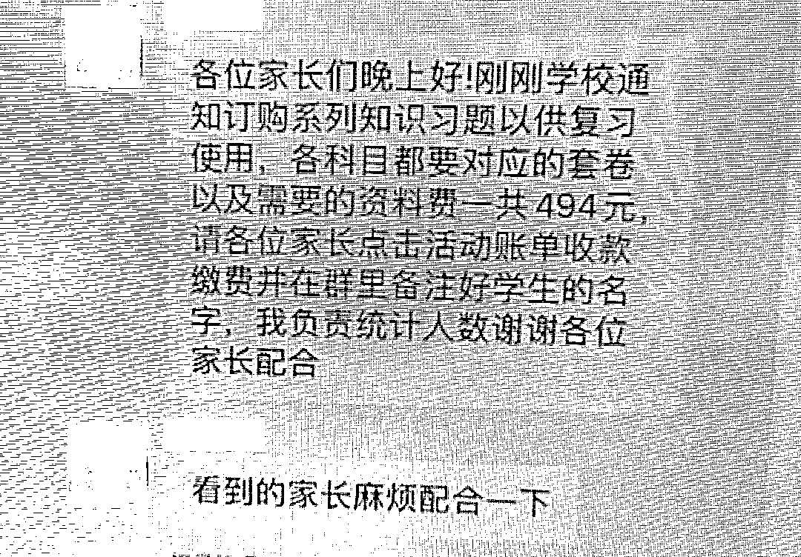
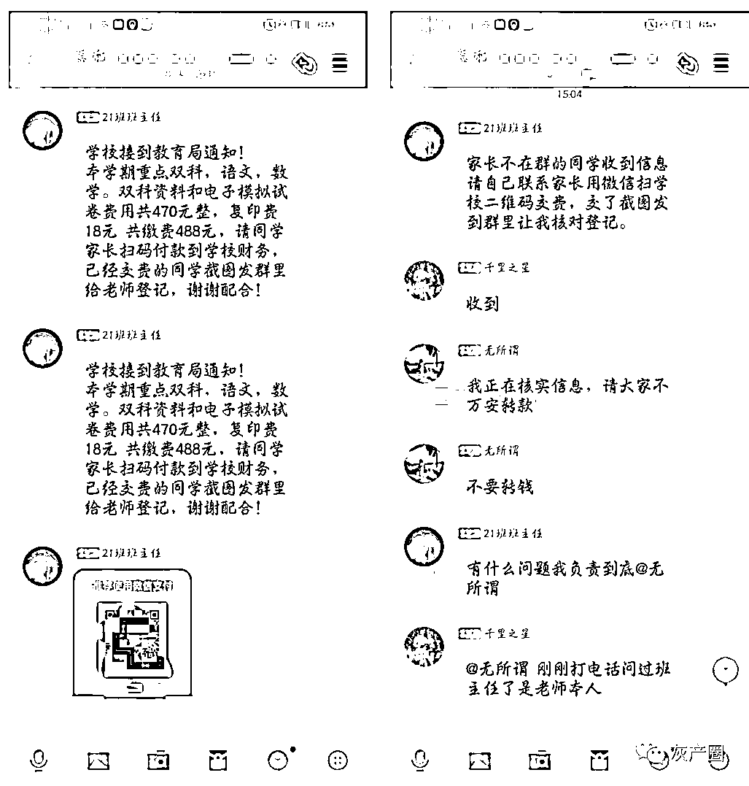
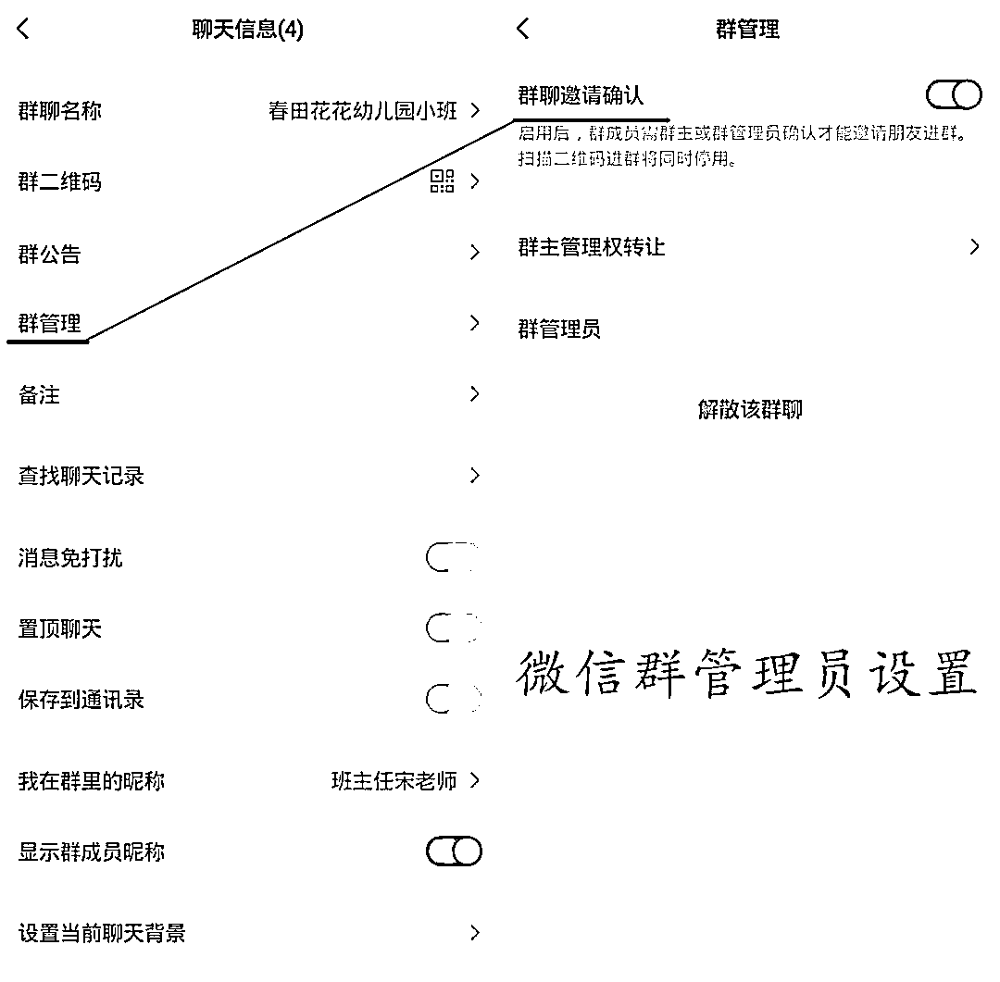
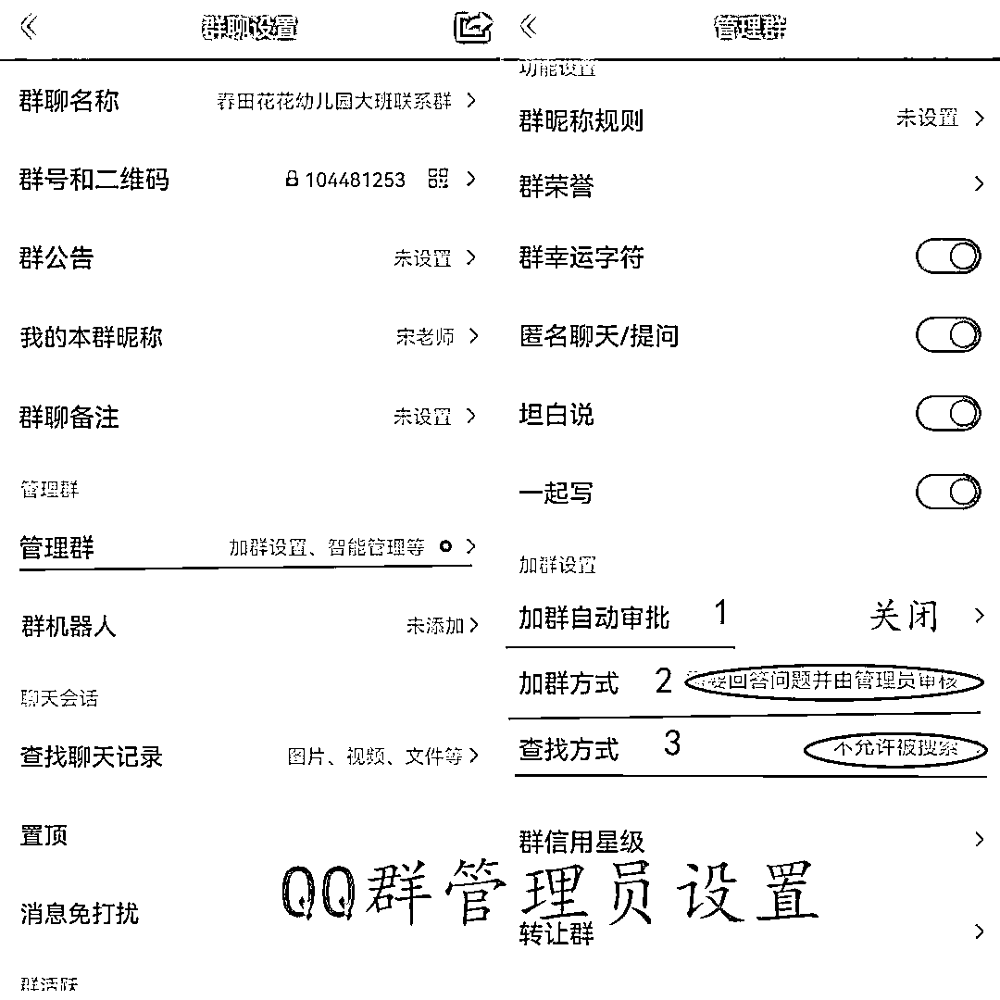
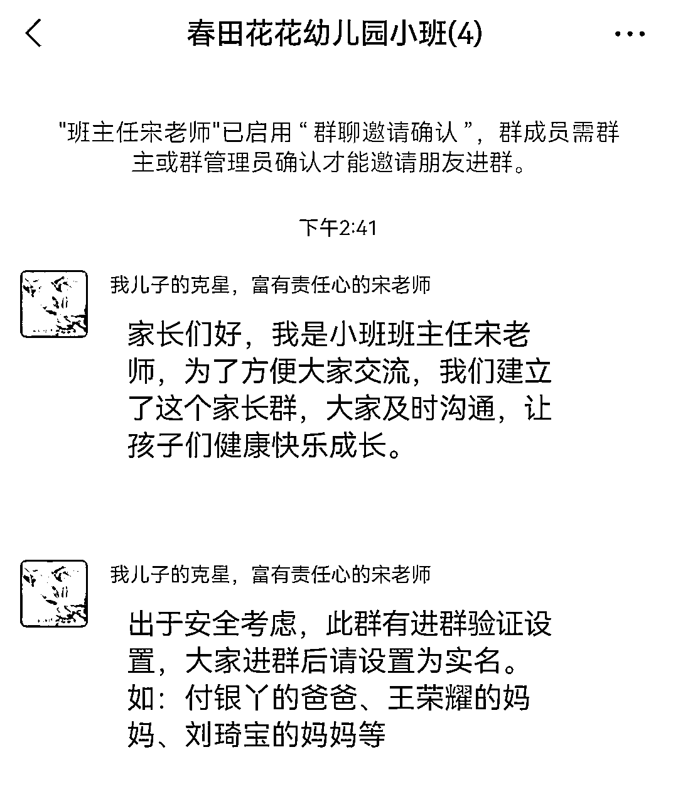
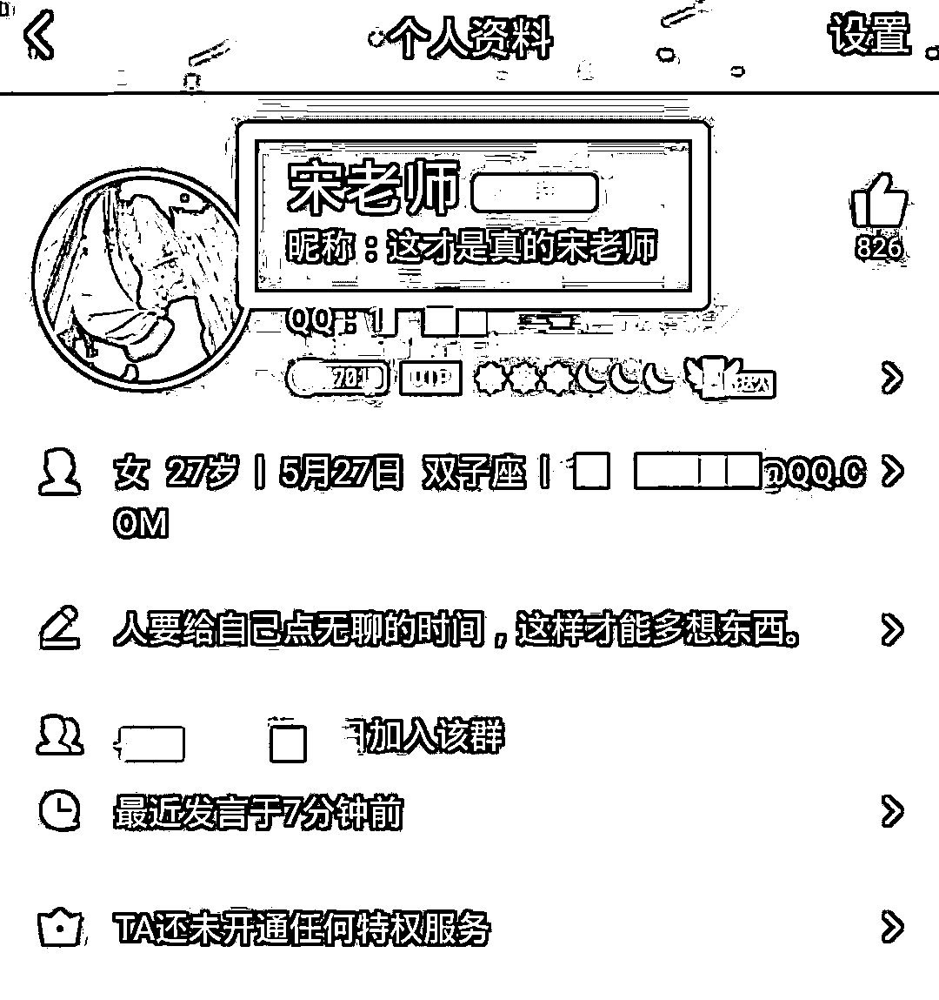

# 冒充老师类诈骗的终极解决方案！

> 原文：[`mp.weixin.qq.com/s?__biz=MzIyMDYwMTk0Mw==&mid=2247524424&idx=7&sn=a43656cde0395cb812b1b0a0b1f61b96&chksm=97cbab70a0bc22668b39840ba2208febd5bfa952b0bf9d16272002fb3515cc4a5fe4c127e1ba&scene=27#wechat_redirect`](http://mp.weixin.qq.com/s?__biz=MzIyMDYwMTk0Mw==&mid=2247524424&idx=7&sn=a43656cde0395cb812b1b0a0b1f61b96&chksm=97cbab70a0bc22668b39840ba2208febd5bfa952b0bf9d16272002fb3515cc4a5fe4c127e1ba&scene=27#wechat_redirect)

#近段时间，多位学生家长反映，有骗子在家长群冒充老师，以收取各种费用为由诱骗群里的学生家长通过扫描二维码转账，希望我们能做一期警示推文提醒广大家长朋友。今天我们再来说说此类诈骗。

先来看看诈骗手法

骗子先通过各种办法找到家长群，冒充学生家长进入学校班级家长群（通常为微信群或 QQ 群），然后再潜伏一段时间，目的是摸清群内老师的活跃规律，利用“真老师不可能随时使用手机”这个时间差，将群昵称和头像设置为和老师一样的，冒充老师在群里发布消息，以收取服装费、教材费、资料费等名义诱骗家长在线转账。

为了更逼真，有的骗子甚至会将多个帐号混进家长群，在“假老师”发出收款信息后再用另一个“假家长”的帐号回复“已转”、“已支付”等消息“带节奏”。

▲大家看得出来群里“21 班班主任”和“千里之星”是骗子吗？ 

 网友提供的真实案例 再来看看破解的招

总结此类诈骗手法，不难发现作案成功的三个要素：**进群、冒充、利用时间差行骗。**

针对上述总结出的“行骗三要素”，我们可制定如下**破解三巧招：“设卡”“标注”“拉长时间线+核实”。**

**1、设卡****设置进家长群的关卡**

这需要群里的班主任老师加强对家长群的管理。无论是 QQ 群还是微信群，群管理员可通过设置“加群验证”防止骗子随意进入家长群，家长进群后，需要按要求修改自己的昵称，便于老师管理。

微信群请务必将**“群聊邀请确认”**开关打开，并且群管理员应当严格审核申请人的身份，避免骗子浑水摸鱼入群。

QQ 群的管理员可以在“群聊设置”里面，点击“管理群”按钮，里面找到**“加群设置”的三个功能设置**选项进行以上设置。假如所有家长已经入群，可以将群设置为“不允许任何人加群”，更加安全。**但仍然不能高枕无忧，因为家长和老师的帐号都有被盗号的风险。**

**2、标注****把真老师标注明确**

我们无法制止群里的骗子通过修改头像和昵称冒充老师，但是我们可以通过给真老师设置昵称的办法把冒充者筛查出来。

[`mp.weixin.qq.com/mp/readtemplate?t=pages/video_player_tmpl&action=mpvideo&auto=0&vid=wxv_2139586474202169344`](https://mp.weixin.qq.com/mp/readtemplate?t=pages/video_player_tmpl&action=mpvideo&auto=0&vid=wxv_2139586474202169344)

▲家长们，备注走起来~

微信群的群名称显示规则是：备注优先于群昵称，比如，班主任自己设置的昵称为**“宋老师”**，但某位学生家长给班主任设置的备注为**“我儿子的克星，富有责任心的宋老师”**，那么在这位学生家长的群对话框中，班主任老师显示的名字就是“我儿子的克星，富有责任心的宋老师”，而不是“宋老师”。

QQ 群里的群昵称是优先于备注的，但是只要你点开老师的头像看一下具体信息，也是能准确根据备注区分的。

这样很简单的一个操作，就可将真正的老师帐号标注出来。假定群里有骗子要冒充老师行骗，那么他只能根据老师的群昵称将自己的群昵称也设置为“宋老师”，而不是你给老师设置的“我儿子的克星，富有责任心的宋老师”，这就很容易判断这个“宋老师”是骗子无疑了！骗子看似高明的伪装，也就成了“皇帝的新装”。

**快，各位家长们快快开动脑筋，给家长群里的老师们想一个足够个性（骗子想不到）又满怀敬意的备注名吧！**

**3、终极辨别****拉长时间线+核实**

考虑到学校收费都不会紧急到要马上完成，既然骗子是利用真老师没使用手机这个短暂的时间差行骗，那么家长们在家长群看到有“老师”发布收费信息时不要急着缴费，可通过电话联系或其他方式与班主任本人核实信息真伪，避免被骗。

当然，如果不需要在线收取各种费用，班主任老师就可和家长群里的家长们约定好，让骗子无可乘之机。

来源：十堰人民路派出所

← 向右滑动与灰产圈互动交流 →

