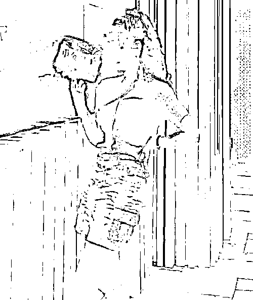
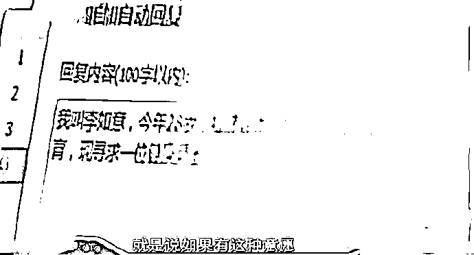
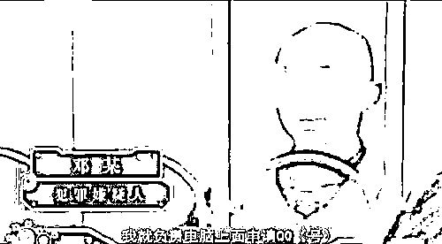
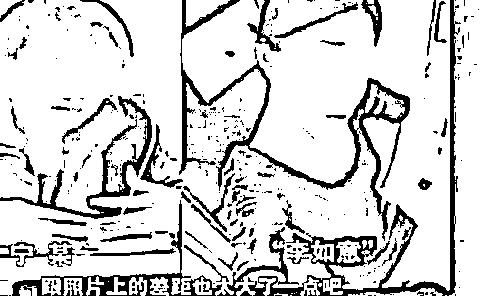
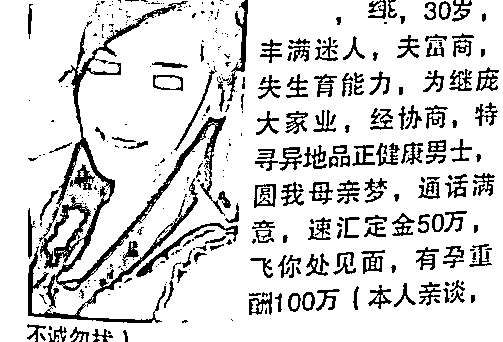

# 少妇 250 万重金求子，甘肃壮汉千里赴约，不料险些丢掉性命

> 原文：[`mp.weixin.qq.com/s?__biz=MzIyMDYwMTk0Mw==&mid=2247524477&idx=2&sn=0efedec35cde3681f840ea6ce5861d8e&chksm=97cbab45a0bc22531c25fc08fffe9152f3aefb73ef938d9efe0d880bd2ec13c6c809b11da8be&scene=27#wechat_redirect`](http://mp.weixin.qq.com/s?__biz=MzIyMDYwMTk0Mw==&mid=2247524477&idx=2&sn=0efedec35cde3681f840ea6ce5861d8e&chksm=97cbab45a0bc22531c25fc08fffe9152f3aefb73ef938d9efe0d880bd2ec13c6c809b11da8be&scene=27#wechat_redirect)

还记得电线杠上的重金求子么？三十左右，美丽动人，丰满少妇，丈夫富豪，不育残疾，重金求子，律师公证，欢迎致电……  

说起骗局，那真是层出不穷。我们今天要说的是一个老掉牙的骗局：重金求子。说起现在的骗局，关注的人士耳熟能详，比如“杀猪盘”，比如“网络刷单”，比如“美女陪玩游戏”等等，不一而足。其实所有的骗局，其底层逻辑都是相通的。通过下面这个骗局，让大家感受一下被骗者是如何越陷越深的。

### **农民工遇到丈夫无生育能力的“富婆”**

王勇（化名，本文均为化名）是一位甘肃的农民工，平时在工地上干活。2015 年，他突然收到了一条好友申请通知。这个女子的好友申请备注是：自己需要“重金求子”，能让她怀孕的人可以获得 250 万的酬劳。

王勇虽然不相信，但是依然添加了该女子为好友。两人开始了聊天，女子称自己的姓陈，名字是如意，老公虽然有钱，但是却因为意外的车祸失去了那个能力，现在全家人的希望就是能让她怀上孩子，来继承他家庭的巨额财产。为了表示自己不是骗子，李某还给自己的电话留给了王勇。

王勇好奇地拨通了李某的电话，对面是一个声音甜美的女子。一天中午休息时，王某闲来无事，打开李某的空间，立即被漂亮的照片所吸引，原来与自己联系的女子竟然有“闭月羞花”的容貌。但是，此时的王某并未决定答应李某的请求，而是继续观察。

### **聊出感情转了 300 元 掉入合同陷阱**

李某每天给王勇打电话，两人聊工作，聊生活，无话不谈。最后李某竟然叫王勇老公，而王勇称呼李某宝贝。就在两人你侬我侬之际，李某表示她已经爱上了王勇，所以她决定和老公离婚，只要王勇配合完成重金求子的计划，钱到手之后，她立马离婚。

王勇听的是心潮澎湃，他跟李某称可以试一试。李某听他这么一说，立马抛出缴纳押金 300 元的噱头。王某虽然是一个农民工，300 块钱对他来说也不算多，就给李某打了过去。

李某说到钱后，立即给王勇发了一份“重金求子合同”，合同中约定了两人的权利和义务。王勇签了这个字，她说就有了保障。这时，王勇已经深信不疑。

合同签订了，王勇问李某两人何时见面。李某说在两人见面之前，必须买一份保险，保险人是他们两个人，保费是 14000 元，每人 7000 元自己出。这是一大笔钱，王勇确实有过犹豫，但是最终还是给李某转了过去。随之而来的是什么体检费、护理费、车费、住宿费等等，王勇的钱用完了，就找朋友借。

最后，王勇实在是借不到钱了，李某于是让王勇到福建省厦门市来，两人可以见面。王勇实在是太激动了，又死皮赖脸求朋友借了路费和住宿费。到达酒店后，王勇迫不及待打电话问李某什么时间能到。李某说这次带了 50 万过来，但是需要 1 万元的手续费。

### **“富婆”及其老公浮出水面**

王勇说他真的没钱了，李某却说这钱带不来，她也就没有必要过来了。绝望的王勇又死皮赖脸找朋友借了 1 万元，给李某打了过去。在 10 分钟之后，王勇发现自己已经被拉入了黑名单。人在绝望的时候很容易冲动做傻事，王勇站在楼顶准备一死了之，全家的家当没了，又借了十几万。当他往楼下看的那一秒，很害怕，于是放弃死亡并拨打了 110。

警方通过查询王勇的转账记录发现，对方接受账号的钱陆续被蒙面人取现。顺藤摸瓜，最终抓住了“富婆”宁某以及其丈夫邓某。俗话说：夫妻同心，其利断金！邓某负责网上聊天，宁某来打电话。

### **案例分析及启示‍**

《民法典》第一百四十三条，具备下列条件的民事法律行为有效:(一)行为人具有相应的民事行为能力;(二)意思表示真实;(三)不违反法律、行政法规的强制性规定，不违背公序良俗。

合同绑架是本案的特点，真是不得不防。王勇和宁某所签订的“重金求子”合同，显然违反公序良俗而无效。如果王勇明白，他就不会因为签订合同而害怕。

此外，《中华人民共和国刑法》第二百六十六条规定：诈骗公私财物，数额较大的，处三年以下有期徒刑、拘役或者管制，并处或单处罚金。宁某夫妻两人属于共同犯罪，他们共同对这诈骗 27 万负刑事责任，依法应当认定为数额较大，最终两人均被判处 8 年有期徒刑。

一个并不高明的骗局折磨得李勇死去活来。幸运的是，李勇被骗的钱全部被追回，否则他真的不敢回家。大家记住：网上的事，只要让我们打钱的人都是骗子！

来源：大 R 说安全，阻击诈骗

← 向右滑动与灰产圈互动交流 →

