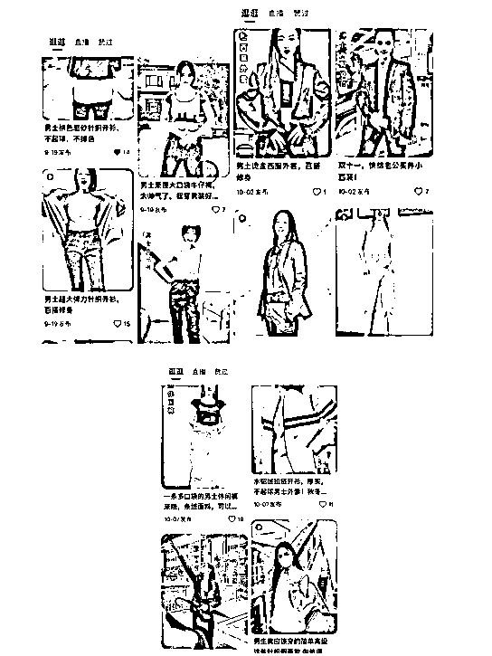
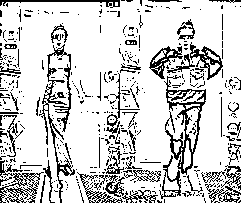
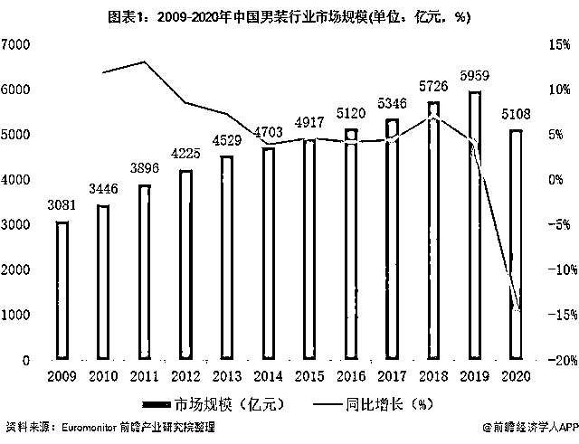

# 抖音快手里卖男装的“女模特”，怎么都流行大胸、露沟、穿丁字裤了？

> 原文：[`mp.weixin.qq.com/s?__biz=MzIyMDYwMTk0Mw==&mid=2247524477&idx=4&sn=ff009f21030beaf1f1bc4a17582a5ea4&chksm=97cbab45a0bc2253dd02ebf5e1355e28a5a0750ff7ea43609e7bff6e00f8a1116c08ef0cecf6&scene=27#wechat_redirect`](http://mp.weixin.qq.com/s?__biz=MzIyMDYwMTk0Mw==&mid=2247524477&idx=4&sn=ff009f21030beaf1f1bc4a17582a5ea4&chksm=97cbab45a0bc2253dd02ebf5e1355e28a5a0750ff7ea43609e7bff6e00f8a1116c08ef0cecf6&scene=27#wechat_redirect)

来源 | 螳螂观察（ID:TanglangFin）

文 | 陈三

男装，最近有点“火热”。

简简单单一件男士针织开衫，在小姐姐有料的身材下被凹出了时尚感。

附和声、呐喊声不断。

“这个视频可以，能火。”

“人好看穿什么都好看。”

也不乏时不时出现的吐槽声，

“胆子真大。”

“哪里来的风。”

“这是男装？”

但总之，是阻挡不了此类风气的蔓延。

原本冷冷清清的男装展示视频，现今是热闹非凡，男装没变味，衬托之下还莫名的有种火了的味道，而这都要归功于这一群“与众不同”的销售小姐姐。

如此之下，这股来路不明的邪气开始在男装盛行。

**“女色”围剿**

动感的音乐，扑通扑通撩拨着屏幕外无数的“小心脏”。

更撩人的是衣着性感的跑步机小姐姐。

**穿着泳衣？情趣内衣？丁字裤？绑腿裤？**

不管怎样，远超凡人的认知范围。

要说露肉，但又好像谈不上，要说没露，正常人又接受不了。

但总之，在做着贩卖身材的生意。

年轻靓丽的女孩，跑步机上踏着“六亲不认”的步伐，期间做作的将腰线用力拉到最大，瞬间聚焦所有的目光，一起投向她的腰臀部，挑逗和玩味着各色眼球，诱人氛围瞬间溢满屏幕。

随后女孩画风生变，干净利落的开始了她的男装变装秀。

小手一招，帅气的男裤就已上身。

跟随着跑步机不紧不慢的节奏，一整套男装行头瞬间掩盖了之前所有的“骚气”。

右手插兜，甜酷、帅气、时尚，满屏 BF 风。

最后轻松套上简约的男士外套，虽肥大、宽松，但却又搭配得恰到好处，不管是纯黑还是卡其，都能被演示得堪称完美。

可见，男装女穿更别有一番魅力。

显然，整场下来，不管是性感女装还是感性男装，女孩都诠释得极其到位。

然而最过目不忘的，却是其“辣眼”的曲线展示。

有人更直接在评论区吐槽，“狠”，“太狠了”。

这样来看，如今的男装下起“狠手”来连自己都害怕。

但这一切终究都是在为带货做铺垫。

《螳螂观察》点击进入主页界面，简单明了的“男装批发”，橱柜里满货架的男装品类，都在告知着“有颜有料”好带货的秘密。

“女色”临近，处处是招，招招都是绝招。

在某宝上，一店铺的男士针织开衫展示视频，展示男装的同样是年轻漂亮的女孩。

搞不懂了，明明今年才进行第七次人口普查，男性同胞人口数以绝对优势完胜，但为何该露脸该代言时愣是找不出个人头。

是颜值、身材太次拿不出手？还是都在参与拯救地球的伟大项目？

不管原因何在，最终出面的仍是盘正条顺的靓丽女孩。

男装女穿，正正经经走 BF 风带货也无可厚非，女生卖男装也存在一定的合理性。

但诡异就诡异在带货女孩的身上，表情怪异撩逗不断，不时拉扯衣服展现自己傲人的身材，边扭屁股边撩发堪称“福利”站点。

这是展示衣服呢还是展示身材呢？

网友们更是愤愤不平，

“低俗。”

“得了狂犬病吗？”

“这是卖的衣服吗？”

“我就纳闷了，男人的衣服为啥要女人做模特？”

然而，女卖男装的骚操作并未因“辣眼”就停下来，反而愈演愈烈。

《螳螂观察》看到，同是某宝，简单包裹严实的男士毛衣也能玩出花样。

软萌靓妹子，又扭又跳“小动作”不断，恶心的是，展现毛衣的材质要在胸上画圈，镜头在整个展示环节都没变化，唯独在此处却拉了个近镜头。

还有奇葩的是，没法正正经经的露，那就提拉衣服向上脱，转圈 360 度无死角的展示小蛮腰。

有机会正正经经露，机会绝对抓得死死的，普通男士针织开衫里搭上性感蕾丝内搭，细腰立显。

或是身材凹凸有致，开衫内配上普通白 T，随意摆弄一番，效果也能立马惊人。

在展示男士裤子时，魔鬼步伐更是一步接一步，有大幅度弯腰“不经意”间秀沟、凸显翘臀的。

**有为凸显舒适，为凸显百搭，为凸显很值得，不断的扭屁股、撅屁股、摸屁股的。**

一个看不出有啥优势的男裤，还真被她们整出了“特色”，卖个裤子，还真是下了“血本”

此外，**扯衣服、拍胸，无底线的操作是应有尽有，只有想不到没有她们做不到。**

****

**除了 T 台，俨然最好最火热的秀场暗藏在男装展示台。**

**只能说，靠“女色”做生意是个好门路。**

**看样子，现在卖男装的某宝卖家们是跑出了一条带货好捷径。**

**随意翻动页面，男装区满屏“女色”，八个有五个都是惺惺作态的诡异现象。**

****

**《螳螂观察》看到，**不仅在某宝，现在的某手某音上，同样如此，甚至有种“青出于蓝而胜于蓝”的架势。****

**身材高挑的女模特，长相甜美，穿着性感吊带长裙，步伐优雅，甚是迷人。**

**但转眼就攻入了“男装带货群”，换上休闲男装，职业素养无可挑剔。**

****

**另一男装带货女模特亦是如此，高开叉到腰的长裙，低俗恶心到了极点，瞬间吸引全场眼球，带货带成这样，还真是佩服。**

****

**然而这样的好手段貌似已泛滥成灾，比比皆是的“生意人”一茬接一茬，在收割韭菜的路上是得心应手。**

****

****

**只能说，如今的男装就如同一块正香的“唐僧肉”，能吸引如此多的鬼怪扑入也在情在理。**

****惨****遭“啃食”，****

****男装为何“香”起来了？****

**“她经济”的当下，“抓住了女性，就抓住了消费。”**

**消费市场女性一直是其中的主力军。**

**曾有一张消费价值图片在朋友圈、微博被刷屏，在某电商网站发布的一份大数据排行榜上，投资人心目中消费投资和市场价值，从高到低排序为少女>儿童>少妇>老人>狗>男人。**

****

**有意思的是，男人的消费价值在投资人眼中还比不上一众“汪星人”。**

**这也从侧面反映了，要想从这个被人嫌弃的领域淘金不那么容易，特别是在这其中分量更轻的男装。**

**据今年 4 月 QuestMobileGROWTH 用户画像标签数据库显示，日常消费场景中男性用户消费偏好集中的是 3C 电子产品、汽车用品等品类，而作为服饰却被丢弃在了最末端。**

****

**如今男装成为了某些人眼中新的掘金场所，的确令人费解。**

**究其原因，无非在于颜值经济兴起，90 后、00 后开始在意自己的个人装扮，注重个人形象，男装市场自然随风而起。根据前瞻产业研究院整理数据，中国男装行业市场规模由 2009 年 3081 亿元，增加至 2019 年 5959 亿元，呈逐年稳定增长趋势，即使是受疫情影响的 2020 年，市场规模仍有 5108 亿元。**

****

**千亿的市场规模，向大众演示着这是条不错的赛道。**

**同时，男装还属隐藏的赚钱“好手”，在这一方面，绝不属于冷门科系。从前瞻产业研究院整理的数据，我国四大男装品牌，2021 年 Q1，七匹狼毛利率为 38.25%、九牧王 60.38%、海澜之家 42.91%、报喜鸟 67.14%。**

****

**可见，男装市场有着较高的利润水平，并存有较大想象空间。**

**此外，沉闷的线下消费逐渐被多样化的线上消费取代，抖音、快手、小红书等平台强行“种草”，男性消费习惯生变，曾经隐形的男装消费潜能被激发出来，“败家爷们儿”日趋增多。**

**由此种种，男装开始“香”起来，成为一些“有心人”新的挖金场所。**

**可如今靠着卖弄“女色”来营销男装，公平法则下搞“特殊”终究会迎来“水逆”的一天。**

****小众领域不该****

****有如此大的“风浪”****

**现今的男装在消费市场上一直隶属“小众领域”。**

**《螳螂观察》据前瞻产业研究院整理数据，2020 年市占率前三的品牌海澜之家、Adidas 和优衣库，分别为 5%、2.4%和 2.1%。市占率前十的男装品牌加起来还不足 20%。**

****

**可见，在男装领域，即便是头部玩家也难以吃透市场，仅在边缘地带掘食。**

**而对于中尾部的后浪来说，要想分食更多的市场蛋糕则会更加的艰难。**

**但随着男装价值凸显，“后浪”们纷纷进驻，盘子越转越大，穿着性感并不太雅观的服饰，卖弄着“女色”，成为了现在线上平台推销男装的好门路。**

**“明明挺好看一美女，干嘛穿成这样。”**

**“差点举报。”**

**“各种模仿。”**

**“卖点熊衣裳，节操都没有了。”**

**“全网最狠的一个卖男装的。”**

**显然，对于这样“异样”的行为大多数人是反对的。**

**但一边抱怨一边下单，却是“哥哥”们的正常操作。**

**毕竟，对于男装来说，品牌和颜值属性没那么强烈，在哪买不是买。**

**可终究“哥哥”们的“爱”还是错付了，成了最易收割的韭菜。**

**细究男装带货的小姐姐一番，衣着性感是其最大的卖点，最应该是主角的服饰反倒成了陪衬，甚至如同买一送一的赠品。**

**讽刺的是，即便是个赠品也有个名称，但小姐姐们的货架上的服饰即无编码也无名称，直白点说，就是常听的三无产品。**

****

**品牌名那一栏，全部统一备注为“其他”，更有甚者商品详情栏就是“其他”。**

**震不震惊，不是说好的卖男装，这简直就是在卖“寂寞”。**

**然而据正经渠道，据正经卖男装的品牌，有名有姓、成分清晰、明码标价，可是基本的职业素养。**

****

**靠着“女色”揽顾客，俨然卖的也是“女色”。**

**有的还非常贴心的写上“假一赔九”。**

****

**奇了怪了，本就是个三无产品，写个打假意义何在。**

**边缘危险地带行走，贪图捷径，总有“翻船”的时候。**

**此外，所谓生意买卖，除了强调货要对版，更重要的还是在于服务，好的服务事半功倍，不无道理。**

**视频里楚楚动人、甜美魅惑，服务态度热情似火，五星好评拿捏得稳稳当当。**

**可到了货品环节，格外扎眼的“本店一律概不退货”、“本店概不负责”字眼，怎么看怎么不是滋味。**

**虽说道理是这么个道理，但服务态度上是格外的“冷冰冰”。**

****

**按理说，正确的打开方式应是图文并茂，语气和缓，将好服务进行到底。**

**而不是两张面孔来回切换，只管割韭菜。**

****

**足可见，这些个靠“擦边球”起来的男装生意，的确有些胆大包天，不仅来源成谜，还态度蛮横，只是一味在暴风卷钱。**

**但疯狂挑衅法律和道德，终究会陷入不尽的黑暗之中。**

**虽说对“女色”约束有限，它也是当今最为便利和最为迅速实现财富自由的行当，但到底与“常规”背道而驰，能走多远，不知道，但能预知的是不会太远。**

**总之，要兴风作浪的妖魔鬼怪越来越少，道阻且长，这需要监管、平台、消费者三方“打妖棒”合力作用，才能按下这样的邪气。**

****

**← 向右滑动与灰产圈互动交流 →**

****