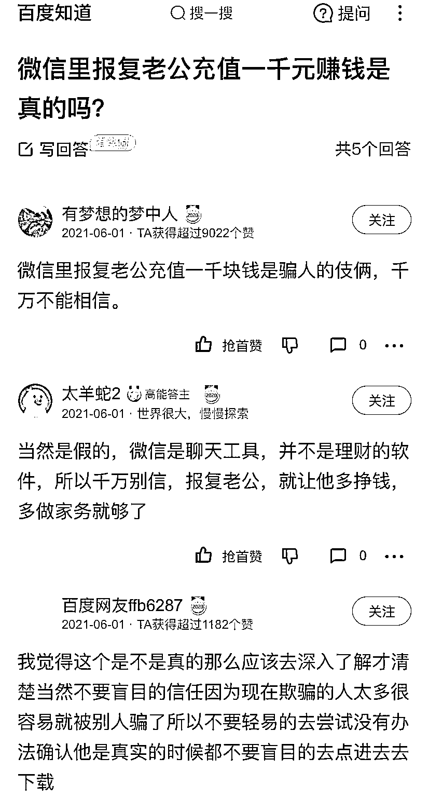
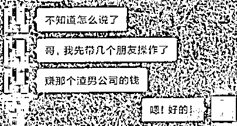

# 同情心泛滥？帮女网友“报复”渣男老公，不料反被骗 5.8 万！

> 原文：[`mp.weixin.qq.com/s?__biz=MzIyMDYwMTk0Mw==&mid=2247524477&idx=5&sn=808107c8fbb8d8efc168485659b44394&chksm=97cbab45a0bc225320b7292aeb7d7cbeb2a96212213b70f3cf623c2fafe78c11d07817be844d&scene=27#wechat_redirect`](http://mp.weixin.qq.com/s?__biz=MzIyMDYwMTk0Mw==&mid=2247524477&idx=5&sn=808107c8fbb8d8efc168485659b44394&chksm=97cbab45a0bc225320b7292aeb7d7cbeb2a96212213b70f3cf623c2fafe78c11d07817be844d&scene=27#wechat_redirect)

今年 6 月份

有一位网友在百度知道上提问：

**微信里报复老公充值一千元是真的吗？**

有几位好心网友耐心回答

**都表示对方是骗子**

**万万不能信**

可 10 月 1 日

昆明市五华区的李某员

还是中了“报复老公”的招

当天 12 时左右，昆明市五华区的李某员在手机微信朋友圈里看到有人发布了一条朋友圈。

发布者头像是个女子，内容为她说她老公出轨了，她要报复她老公。

“然后她说自己老公是做博彩系统的，她知道那个系统的漏洞，她想通过向他人提供漏洞的方式帮助其他人去套她老公的钱，用这种方式来报复她老公。”

网络图片 

李某员看到后信以为真，就主动联系了该网友，并添加了对方的 QQ 号。

添加好友后，对方就称投钱到她说的那个博彩系统里，她通过操作漏洞，告诉他需要投注的数字，让他下注。

**对方发给李某员一个链接**，并知道他下载注册了**一个名为“澳门新葡京”的软件**。

李某员点击进入该软件后发现其为一个博彩平台，内含时彩、幸运飞艇等博彩方式。

此时，对方让他玩**“澳门时时彩”**，他就按照对方的指导进行了操作，**在该平台上充值 5.8 万元**。

可他提现时，平台却显示无法提现。

同时，他收到了银行的提示电话，提示其对方账户是诈骗账户，其就怀疑被骗，故报警。

**反诈民警提醒：**

“微信好友”称报复老公给你送钱？

小心馅饼变陷阱！

一定要牢记“三不一多”原则：

**未知链接不点击**

**陌生来电不轻信**

**个人信息不透露**

**转账汇款多核实**

来源：昆明反电信网络诈骗中心

← 向右滑动与灰产圈互动交流 →

