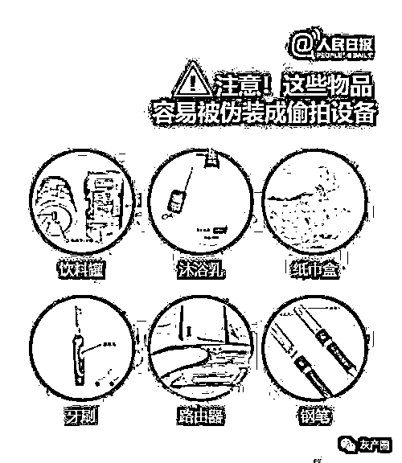

# 在中国，有一条极其隐秘的偷拍色情产业链，至少有 6 亿女性可能面临或已被侵害

> 原文：[`mp.weixin.qq.com/s?__biz=MzIyMDYwMTk0Mw==&mid=2247524547&idx=2&sn=1b646b6ce11adc1eb3b1072ba0c4f8df&chksm=97cbabfba0bc22ed6e5f6928e65661b9e7cc81273046fadc236fa8103878b2f15e3727854833&scene=27#wechat_redirect`](http://mp.weixin.qq.com/s?__biz=MzIyMDYwMTk0Mw==&mid=2247524547&idx=2&sn=1b646b6ce11adc1eb3b1072ba0c4f8df&chksm=97cbabfba0bc22ed6e5f6928e65661b9e7cc81273046fadc236fa8103878b2f15e3727854833&scene=27#wechat_redirect)

11 月 19 日晚，王先生和女朋友在郑州一家名为“小笨客栈”的酒店办理了入住手续，晚上吃过饭回到房间准备看电视时，发现电视一直打不开，王先生就去查看机顶盒，没想到机顶盒里竟然有一个针孔摄像头

[`v.qq.com/iframe/preview.html?width=500&height=375&auto=0&vid=a3310lktgkj`](https://v.qq.com/iframe/preview.html?width=500&height=375&auto=0&vid=a3310lktgkj)

在中国，有一条极其隐秘的偷拍色情产业链，至少有 6 亿女性可能面临或已被侵害。

偷拍行为几乎已经渗透到生活的各个角落，而且偷拍者的偷拍手段也是五花八门，令人防不胜防，很多女性在毫不知情的情况下成了“色情片”的女主角，视频或照片也被恶意传播到网上，供无数人“观赏”。

不得不承认的是，在互联网时代，色情就是最大的流量，而巨大的流量意味着巨额的利益。偷拍产业链，正是建立在这样的色情流量之上。此前就有媒体爆出，偷拍产业链远比想象中更加庞大，从制造出售器材到偷拍，再到售卖传播不雅视频，偷拍早就形成了一条完整的闭环黑色产业链。

投资几百元，买上一套偷拍设备，再将拍到的视频简单剪辑后加上字幕，然后就能开始这门“一本万利”的生意了。

实际上，成本对于偷拍者来说根本不值一提，因为他们会把偷拍到的视频卖给境内外的色情网站，网站每收购一部片子，或者一套女生的偷拍照片，偷拍者就会有几百到几万的报酬。

这些色情网站得到了视频和图片，通常会被分类上传且明码标价，以供各种用户需求。 

而那些想看偷拍的视频和图片的人，在注册网站成为他们的用户同时，还需要开通网站的会员后才能有获得观看权限。 

如果再想看到更多的内容，则需要花费更多的金钱购买高等级的 VIP。 

于是就形成了偷拍者疯狂的偷拍，然后把资源卖给色情网站，而网站再卖给用户这样一个完美产业链闭环。 

更令人瞠目结舌的是，在巨额利益的驱使下，大量 50 岁左右的大妈开始被培训成专业偷拍者。这些大妈当然不是对偷拍有什么兴趣，她们被发展成偷拍者，完全是因为不会引起女性注意且非常隐蔽，而且可以自由出入女卫生间、女浴室等地方。这些大妈每拍摄 24 小时的片源，就能得到 500 到 1000 元不等的回报，这是一笔没有什么风险且十分易得的收入。

对于偷拍者来说，只要能成功偷拍到别人的私生活，就有源源不断的金钱收入，但对于受害者来说，这却是无尽的噩梦，因为视频会被二道贩子多次倒卖，警方想要追回并永久删除，几乎是不可能的。 

**我们阻止不了别人的恶，但是一定要学会保护自己。**  

看见或者看不见 _：大家以后去酒店，带个面具。只要不拍脸，啥都好说  

番茄殿下：觉得是时候立法了！个人隐私安全很令人堪忧。长此以往，以后谁敢住酒店？

 财经网：酒店或者租房等场所，但凡发现针孔摄像头，总有办法查出安放的人，一个是查看酒店登记信息或者租房客的身份信息，另一个是查看针孔摄像头的购买来源，找到相应的出售方，很快找到买方是谁。对针孔摄像头，应该禁止私人购买，买方与卖方都应该承担法律责任，窥探别人隐私乃至用之牟利，理应入刑

来源：围脖那些事儿

← 向右滑动与灰产圈互动交流 →

