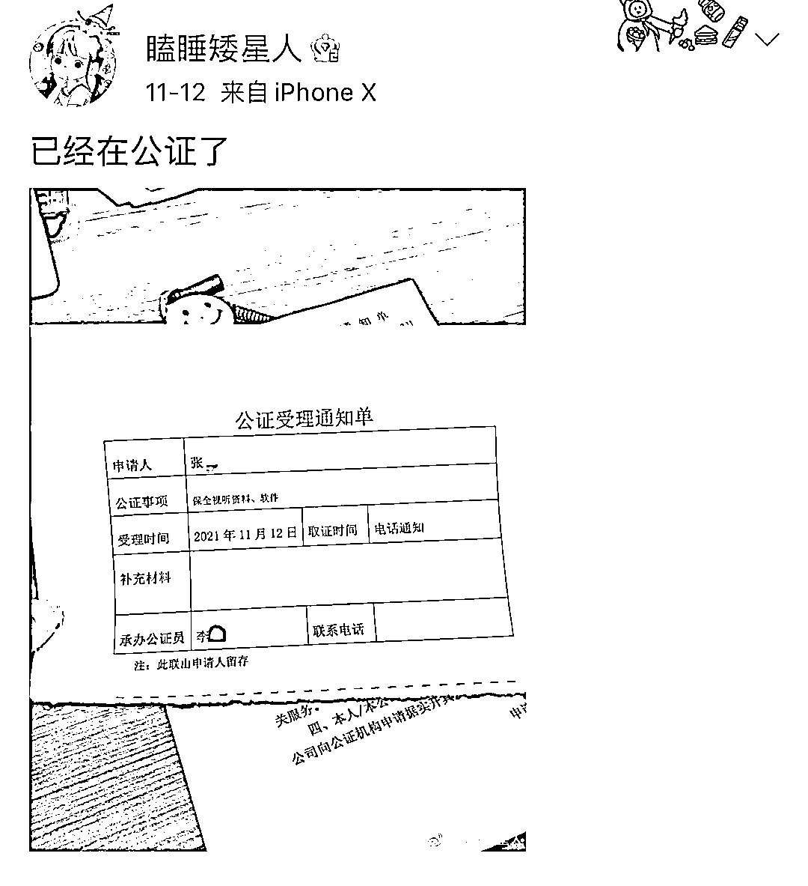
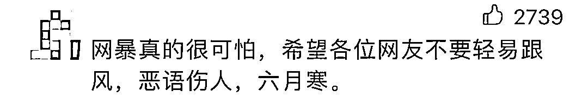
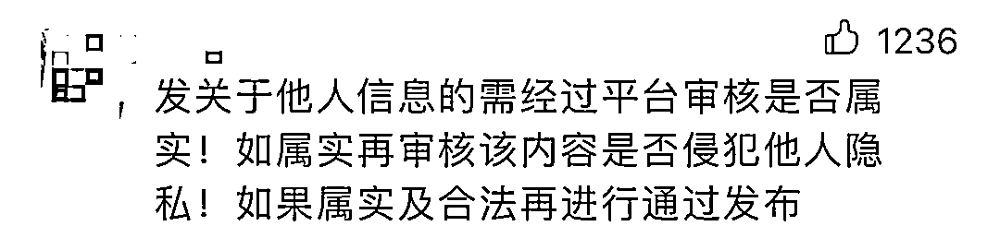
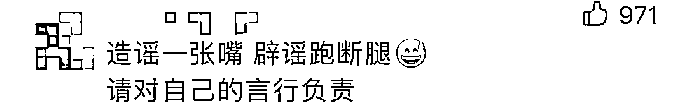

# “73 岁富豪娶 29 岁美女”？真相令人愤怒！

> 原文：[`mp.weixin.qq.com/s?__biz=MzIyMDYwMTk0Mw==&mid=2247524547&idx=3&sn=f9ebd53a95f9af20f5dc5d3ef83a7f63&chksm=97cbabfba0bc22ed0ef3c88bd83527af202c0b545efc690c2f0c1622e963ef2ae9e72eb6a084&scene=27#wechat_redirect`](http://mp.weixin.qq.com/s?__biz=MzIyMDYwMTk0Mw==&mid=2247524547&idx=3&sn=f9ebd53a95f9af20f5dc5d3ef83a7f63&chksm=97cbabfba0bc22ed0ef3c88bd83527af202c0b545efc690c2f0c1622e963ef2ae9e72eb6a084&scene=27#wechat_redirect)

19 日，一位名叫“飞哥在东莞”的网友，在某平台图文并茂发文：“73 岁东莞清溪企业家豪娶 29 岁广西大美女，88 万礼金+88 万二房公寓+豪车一辆。”

消息在网上快速扩散后，有网友发现，照片系几年前一女生和外公拍的写真被盗用。

今天凌晨，名为 _Niki 君 _ 的博主刊出长文，回应被造谣“老夫少妻”一事。

“_Niki 君 _” 表示，**前几年为满足外公的心愿**，她于 2018 年 12 月 29 日在小红书发帖晒出自己和外公游玩上海的照片，之后又陆续晒出自己陪外公拍的写真。

但昨日被朋友告知，**发现部分图片出现在某网络平台，并被写成了“老夫少妻”的故事**：73 岁东莞清溪镇企业家豪娶 29 岁大美女，88W 礼金+一套 80W 二房公寓+豪车一台……

博主表示自己非常崩溃，对其生活已经造成困扰，并已经联系律师要严肃追责，她希望能将当事人行拘，还在收集证据。

网友看完也纷纷表示：**造谣一张嘴，辟谣跑断腿！支持维权！**

今天，橙柿互动记者搜索发现，**目前“飞哥在东莞”的原贴已经删除，且也搜不到对应的账号**。

而据细心网友的爆料，“飞哥在东莞”已改名为“东莞故事会“，浏览他的帖子发现，**该账号经常发布类似博眼球的消息**。

截至目前，“东莞故事会“还未就此事进行回应或者道歉。

新闻多看点：

[**此前消息****：****湖南女孩被诬“海王”遭网暴？后续来了......**](http://mp.weixin.qq.com/s?__biz=MjM5OTU5MDY4Mg==&mid=2655214884&idx=3&sn=4f0e3ebf8230338b03366ffb7948b0c9&chksm=bc8ed3518bf95a474dd542789a2a7644c35bad55ab8344077b73266ae98c2a39d5cf37325471&scene=21#wechat_redirect)

相信不少网友应该记得，**就在前几天，也发生过一件类似的事情。**

11 月 11 日，在北京一所大学读大四的湖南女孩小嘉（化名）的维权帖，引发关注。

就在 10 日，一短视频账号将她的照片和毫无关联的网络传言拼凑在一起，做成短视频在多个网络平台上发布，点赞迅速破万。

有不明真相的人看到造谣视频后，用跟贴和私信等方式对她进行谩骂攻击，她决心拿起法律武器，维护自己的权益。

她说，“这次事件不仅是为自己发声，也是为被谩骂和被造谣的人发声”。

值得注意的是，**发布该短视频的账号是一个名为“大眼看世界”的蓝 V，视频用的文字材料是传言，照片却是小嘉的美妆照。**

小嘉录制的澄清视频表示，文字信息写的是长春的一名女生，而她是湖南人，在北京读书，短视频称小嘉在花呗有欠款，但是她从来没有开通过花呗。

更让小嘉愤怒和震惊的是——**“仅凭四张图片就能把你写得如此不堪，一些不明真相的网友，不仅在评论区对我说了很难听的话，甚至还攻击我的父母……”**

15 日，**该账号发表《致歉信》，并表示永久关停账号。目前，账号视频内容已全部清空。**

维权一事得到不少网友的支援，大家纷纷表示，别让伤害继续传递！

**网络空间不是法外之地**

**不造谣、不传谣**

**理性看待热点**

**坚决对网络暴力说不！**

来源：都市快报、新浪微博、中国青年报、红网

← 向右滑动与灰产圈互动交流 →

