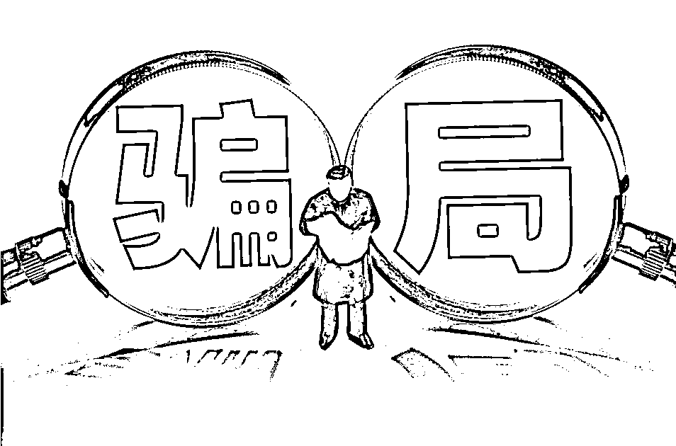
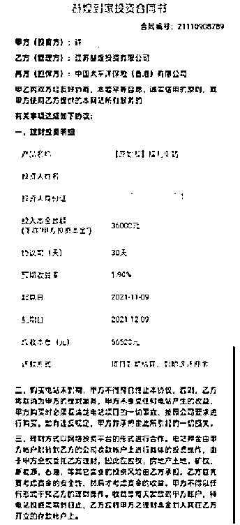
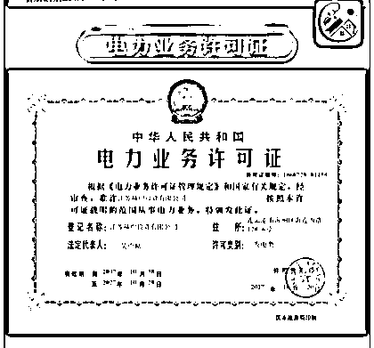
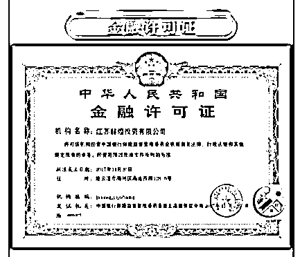
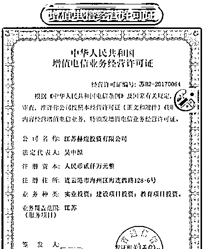
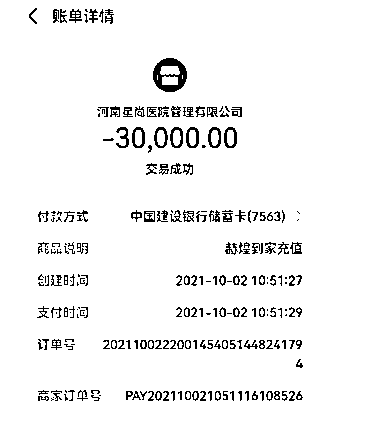
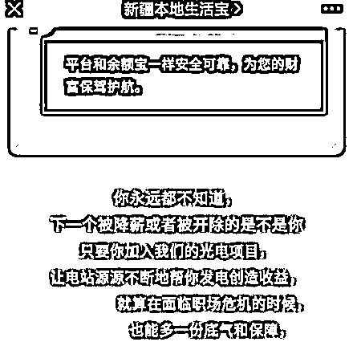
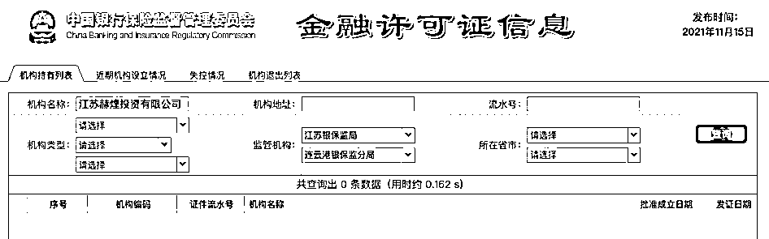

# “光伏发电”投资骗局：除了营业执照都是假的，多省上百投资者被骗

> 原文：[`mp.weixin.qq.com/s?__biz=MzIyMDYwMTk0Mw==&mid=2247524547&idx=4&sn=65c14cf94f378cc6b40b95b0613ffdca&chksm=97cbabfba0bc22edd51d6a46e0ac5396ecf1a6a5353e3df2f28866e484ce6ece2d1a7c6eab2f&scene=27#wechat_redirect`](http://mp.weixin.qq.com/s?__biz=MzIyMDYwMTk0Mw==&mid=2247524547&idx=4&sn=65c14cf94f378cc6b40b95b0613ffdca&chksm=97cbabfba0bc22edd51d6a46e0ac5396ecf1a6a5353e3df2f28866e484ce6ece2d1a7c6eab2f&scene=27#wechat_redirect)

**“你永远都不知道，下一个被降薪或者被开除的是不是你。只要你加入我们的光电项目，让电站源源不断地帮你发电创造收益”**，这是“赫煌到家”APP 的广告词。

11 月 21 日，有多位投资者向红星资本局爆料称，自己在一款名为“赫煌到家”的 APP 中，遭遇了“光伏发电”投资骗局，被骗金额从几万到几十万不等。

河北张家口市的许女士告诉红星资本局，她从今年 9 月起，先后向赫煌到家 APP 投入 13 万元，直到 11 月 16 日 APP 无法打开，才发觉被骗。宁夏中卫市的李先生也遭遇了同样的骗局，他投入了 34 万元。

据许女士讲述，该 APP 自称：投资光伏发电项目、国家扶持、每天都有收益，企业资质也十分齐全，包括营业执照、电力业务许可证、金融许可证、保险证明书，甚至还包括增值电信经营许可证。

11 月 21 日下午，红星资本局发现，**赫煌投资公司除了营业执照外，其他的企业资质均查询不到，或为造假。**

另据媒体报道，**有投资者曾到连云港去找这家公司，但发现其工商登记的地址是一片杂草丛生的荒地。**

**光伏发电 APP 骗局** 

**“收益低、资质全、评价好”**

来自河北张家口市的许女士告诉红星资本局，今年 9 月 12 日，她在“河北本地生活宝”的公众号上，看到了“赫煌到家”APP 的广告。该 APP 自称：投资光伏发电项目、国家扶持、每天都有收益，并且提到实名认证后就奖励 30 元。

于是，许女士下载注册了“赫煌到家”APP，并将奖励的 30 元投了进去。第二天，30 元投资显示收益几毛钱，还能立即提现，许女士又投了 500 元，每天的收益是 1.5 元。“这个收益没有那么夸张，不是 500 投进去立马几十块的收益，我就比较放心”，许女士说。

许女士其中一次投资 受访人供图

除了收益，许女士还注意到，“赫煌到家”APP 中企业资质十分齐全，包括营业执照、电力业务许可证、金融许可证、保险证明书，甚至还包括增值电信经营许可证。她查询了营业执照，与 APP 中的信息吻合，便放松了警惕。

就这样，从 9 月 12 日到 11 月 15 日，许女士先后投入 13 万元，她朋友也投了 11 万元。直到 11 月 16 日，“赫煌到家”APP 推出“充值 5 万送 5 万”的周年庆活动，“收益太高了，我觉得上当受骗了。”许女士发觉被骗后，当天想要提现所有充值的金额，却发现“赫煌到家”APP 已经打不开了。

与许女士有着相同遭遇的，还有宁夏中卫市的李先生。9 月 21 日，李先生也是通过某微信公众号看到了“赫煌到家”APP 的广告。

上网查询后，他发现“赫煌到家”的光伏发电投资项目评价不错。李先生先后投了 8 次钱，共计 34 万元，到了 11 月 16 日，该 APP 无法登陆，他才发觉自己被骗了。

李先生其中一次投资 受访人供图

发现被骗后，许女士和李先生已经向当地派出所报案。许女士告诉红星资本局，截至目前，**“赫煌到家”APP 投资者组建的群聊已超过 140 人，最多的一位投资者被骗近 70 万元，群成员被骗金额共计 600 万元左右。**

**号称能带来发电收益的赫煌投资** 

**参保人数为 0，资质大多造假**

“你永远都不知道，下一个被降薪或者被开除的是不是你。只要你加入我们的光电项目，让电站源源不断地帮你发电创造收益”，这是“赫煌到家”APP 的广告词。

在采访中，许女士和其他投资者曾一致提到，有许多本地公众号文章为“赫煌到家”APP 做推广。11 月 21 日下午，红星资本局发现，这些公众号文章目前已被删除，该 APP 的下载链接、二维码均已失效。

一张营业执照截图显示，“赫煌到家”APP 背后的主体是江苏赫煌投资有限公司（以下简称“赫煌投资”），法定代表人和实际控制人名为吴中原，成立日期在 2017 年 10 月，经营范围包括：实业投资、建设项目投资、教育项目投资，注册资本 2000 万元。

但公开数据平台显示，**赫煌投资的参保人数为 0。红星资本局随后拨打了赫煌投资的电话，提示为“空号”。**

值得注意的是，赫煌投资除了营业执照外，其他的企业资质均查询不到，或为造假。

**红星资本局通过国家能源局资质和信用信息系统、中国银保监管理委员会、工信部政务服务平台搜索发现，赫煌投资的电力业务许可证、金融许可证以及增值电信经营许可证，通通查询不到。**

“这些企业资质，我们不知道去哪里查，就没有理会，只看到营业执照是真的就相信了”，许女士对红星资本局说。

**光伏发电缘何成为骗局？** 

**行业高速发展、热度高居不下**

许女士表示，在自己家乡，光伏发电项目随处可见，她以为这款 APP 的项目也是国家扶持的正规投资。

李先生也说：“之前在新闻上看到，清洁能源光伏发电现在是国家支持的项目”，所以并没有怀疑太多。

光伏发电早已不是一个新鲜名词，为促进清洁能源的发展，从 2009 年开始，国家相继颁布一系列财政补贴措施以促进光伏产业发展。

此后，光伏发电企业迎来爆发增长期。天眼查数据显示，截至今年 11 月，我国目前现存光伏发电相关企业 20.03 万家。

今年 9 月 30 日，中国光伏产业高质量发展论坛在京举行。论坛上发布的《国家电投建设世界一流光伏产业宣言（升级版）》指出，**自 2016 年至今，国家电投光伏装机增长了 6 倍，超过 3500 万千瓦，连续 5 年位居全球首位，已成为全球最大的新能源发电企业。**

据第一财经报道，过去十年，光伏发电成本从每度 2.47 元下降到 0.37 元，降幅远高于风电成本。业内预计，随着光伏接近平价，未来十年光伏装机需求量将迎来十倍增长。

一边是光伏发电行业的快速增长，另一边也有人利用光伏发电投资的热度来制造骗局，“赫煌到家”APP 或许只是其中之一。

红星资本局注意到，根据安徽省公安厅官网 10 月 9 日消息，亳州市蒙城县公安局还曾侦破一起利用 EPC 光伏发电项目实施合同诈骗案件。

根据通报，不法分子谎称自己掌握光伏发电安装工程，与受害人签订《EPC 光伏发电安装合同》，再诱导受害人向指定的虚假企业购买施工所需的光伏板，诈骗受害人定金。

警方提示称，投资企业和人员要提高防范意识，通过实地考察、官方咨询等途径了解企业的真实状况，切勿盲目投资。

此外，有市场人士也对红星资本局感叹，**政策刺激下，光伏市场早已锣鼓喧天。但对于普通投资人而言，需谨慎投资，多方考察，以免信息不对称带来的风险和困境。**

← 向右滑动与灰产圈互动交流 →

