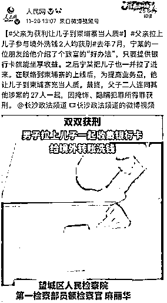
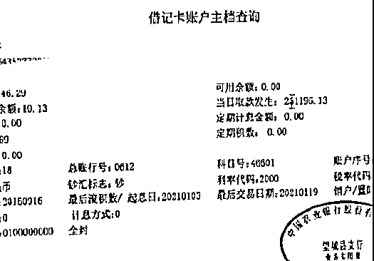
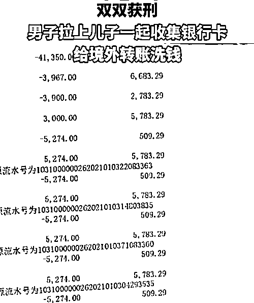

# 奇葩！为了赚钱，父亲竟让儿子到柬埔寨当人质

> 原文：[`mp.weixin.qq.com/s?__biz=MzIyMDYwMTk0Mw==&mid=2247524547&idx=5&sn=b7f79034298c44ec78754b05cee8c277&chksm=97cbabfba0bc22ed64c0050e3dd278dad031753c299fdecb01ba0868e5097ae1fd3b3d5b6fa6&scene=27#wechat_redirect`](http://mp.weixin.qq.com/s?__biz=MzIyMDYwMTk0Mw==&mid=2247524547&idx=5&sn=b7f79034298c44ec78754b05cee8c277&chksm=97cbabfba0bc22ed64c0050e3dd278dad031753c299fdecb01ba0868e5097ae1fd3b3d5b6fa6&scene=27#wechat_redirect)

11 月 20 日上午，小编刷微博时看到这样一条新闻：

“【#父亲为获利让儿子到柬埔寨当人质#】#父亲拉上儿子参与境外洗钱 2 人均获刑#去年 7 月，宁某的一位朋友给他介绍了个致富的“好办法”，只要提供银行卡就能坐享收益。之后宁某把儿子也一并拉了进来。在联络到柬埔寨的上线后，为提高业务量，他让儿子到柬埔寨充当人质。最终，父子二人连同其他涉案的 27 人一起，因掩饰、隐瞒犯罪所得罪获刑。”

简单易操作致富门路？

称只需要提供银行卡就能坐享其成 

据长沙市望城区人民检察院通报的案件来看。

2020 年 7 月，望城的宁某、姚某在朋友常某的推荐下前往广西南宁，当时常某给二人介绍了一个所谓的致富门路——只要提供银行卡就能坐享收益。

虽然明知出借银行卡是用于接收转移犯罪所得资金，但在利益面前，两人没有考虑太多，直接将银行卡出租给了常某。

**“在南宁提供银行卡是万分之八的点，宁某觉得太少了就回来单干，常某给他百分之二十。”望城区人民检察院第一检察部员额检察官麻丽华向记者介绍案情。**

在向常某缴纳十万元保证金后，宁某回到望城“单干”，常某为宁某提供业务，宁某向常某提供银行卡。

**期间，宁某觉得常某提供的业务量不大，于是单线联系了一个名叫“猛子”的人，对方表示可以给宁某提供业务，但条件是宁某的儿子要前往柬埔寨充当人质，提成由最开始的万分之八提高到万分之五十。**

宁某答应了这一条件，见业务量大，他还联系了同案的邓某、韩某、伏某等人为其提供银行卡，用于接收转移犯罪所得资金。

**“经查实，这些银行卡转移的资金都是为境外的电信诈骗服务，不利于公安机关打击电信网络犯罪，影响是非常大。”麻丽华表示。**

而自 2020 年 7 月至 2021 年 1 月 14 日，宁某父子及姚某共转入资金 1170 余万元，转出资金 1160 余万元。

天网恢恢疏而不漏，最终，宁某父子二人连同其他涉案的 27 人因掩饰、隐瞒犯罪所得罪获刑。

说实话，看到这个新闻时，小编简直瞳孔地震，这种为了钱把亲生儿子送到柬埔寨当人质的操作真是迷之又迷。

更别说是在现阶段这样一个，国家大力打击境外电信诈骗和洗钱团伙的情况下，为电信诈骗团伙洗钱，只会让自己接受法律的制裁。

我国关于洗钱的法律规定

**洗钱罪：**

《中华人民共和国刑法》第一百九十一条规定：明知是毒品犯罪、黑社会性质的组织犯罪、恐怖活动犯罪、走私犯罪、贪污贿赂犯罪、破坏金融管理秩序犯罪、金融诈骗犯罪的所得及其产生的收益，为掩饰、隐瞒其来源和性质，有下列行为之一的，没收实施以上犯罪的所得及其产生的收益，处五年以下有期徒刑或者拘役，并处或者单处洗钱数额百分之五以上百分之二十以下罚金；情节严重的，处五年以上十年以下有期徒刑，并处洗钱数额百分之五以上百分之二十以下罚金：（一）提供资金账户的；（二）协助将财产转换为现金、金融票据、有价证券的；（三）通过转账或者其他结算方式协助资金转移的；（四）协助将资金汇往境外的；（五）以其他方法掩饰、隐瞒犯罪所得及其收益的来源和性质的。

**掩饰、隐瞒犯罪所得、犯罪所得收益罪：**

《中华人民共和国刑法》第三百一十二条规定：明知是犯罪所得及其产生的收益而予以窝藏、转移、收购、代为销售或者以其他方法掩饰、隐瞒的，处三年以下有期徒刑、拘役或者管制，并处或者单处罚金；情节严重的，处三年以上七年以下有期徒刑，并处罚金。

**包庇毒品犯罪分子罪；窝藏、转移、隐瞒毒品、毒赃罪：**

《中华人民共和国刑法》第三百四十九条规定：包庇走私、贩卖、运输、制造毒品的犯罪分子的，为犯罪分子窝藏、转移、隐瞒毒品或者犯罪所得的财物的，处三年以下有期徒刑、拘役或者管制；情节严重的，处三年以上十年以下有期徒刑。

而对于生活在柬埔寨的大家来说，洗钱活动可能会渗透到我们生活中国的方方面面，因此更需要我们时刻保持警惕，远离洗钱活动。

远离这些洗钱手段

反洗钱，人人有责

为了让大家远离“洗钱罪”，首先你要知道洗钱都有哪些手段，只有了解了洗钱的手段和方式，才能真正远离洗钱行为。

对此，小编也为大家总结了几大洗钱套路：

**第一，密集使用现金的行业。**对一些犯罪分子来说，因需要洗的金额巨大，所以会通过以赌场、娱乐场所、酒吧、金银首饰店等店铺掩护，通过虚假交易将犯罪收益宣布为经营的合法收入。

**第二，直接购买实物资产。**比如购买房产、古董、艺术品等，然后转手卖掉获取现金。

**第三，利用证券业洗钱。**通过证券账户购买股票、基金，然后卖掉变为现金，实现资金的黑转白。部分证券公司，为了自身利润，对客户缺乏审查机制，为犯罪分子提供了机会。

**第四，人头账户。**大额资金容易被监管，有的人会通过租赁形式，租借大批不知情的人员身份信息，开立银行、股票交易等账户，并定期将黑钱打入这些账户，然后进行复杂的彼此交易，最终将黑钱洗白。

此外还有直接跨国搬运、跨国交易、地下钱庄、假借贷、投资洗钱

来源：柬途网     作者/衔云 编辑/衔云

← 向右滑动与灰产圈互动交流 →

