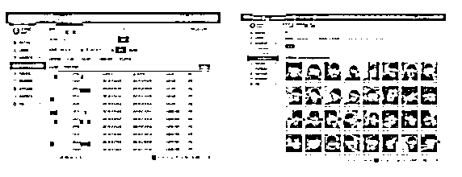

# 细思极恐！河北一售楼处违法“偷拍”17 万余张人脸！被罚 8 万元

> 原文：[`mp.weixin.qq.com/s?__biz=MzIyMDYwMTk0Mw==&mid=2247524547&idx=6&sn=681ae00faa98bcfc11cc8ae163571b8d&chksm=97cbabfba0bc22eda32e3ba2762bf710fafd5faddc2acb1351d1f8efb86b0d1839c70526ba3f&scene=27#wechat_redirect`](http://mp.weixin.qq.com/s?__biz=MzIyMDYwMTk0Mw==&mid=2247524547&idx=6&sn=681ae00faa98bcfc11cc8ae163571b8d&chksm=97cbabfba0bc22eda32e3ba2762bf710fafd5faddc2acb1351d1f8efb86b0d1839c70526ba3f&scene=27#wechat_redirect)

**刷脸支付、刷脸考勤、刷脸解锁……**

**眼下，“刷脸”已成为一种时尚。**

**但在享受便捷的时候，**

**你是否意识到，**

**可能有商家**

**把你的人脸信息“偷”走了！**

************

售楼处摄像头“不对劲儿”

执法人员一查竟发现 17 万余张被“偷拍”的人脸

今年 8 月，衡水市市场监督管理综合执法局执法人员检查发现，市区某房地产营销公司在其负责销售的售楼部现场的多台摄像头中，**有 4 台摄像头的外观与平常的安防摄像头明显不同，**这引起了执法人员的高度警觉。

执法人员随即找到该公司负责人，要求登录系统后台进行查看。果然，在营销部办公室电脑的系统后台中，执法人员找到了**被“摄像头”（人脸抓拍机）记录下的人脸头像，其中就包括了执法人员刚才进入售楼部时的头像，数量达 17 万余张。**

执法人员立刻固定证据，并对相关人员展开询问调查。 

消费者签完购房合同

被再次人脸识别

据此奖励分销商或推荐人佣金

执法人员通过调查询问了解到，为促进销售，该公司开展了老带新奖励、中介分销转介营销活动，并于 2020 年 12 月通过安装摄像头人脸抓拍系统识别区分案场访客的来源。

**每当有来访人员到达售楼处，4 台人脸抓拍机就会抓拍记录下来访者的人脸信息，并储存在服务器上。**

在**消费者签订购房买卖合同时，该公司会通过消费者身份证信息和再次人脸识别，**使用人证一体机或微信人证核验小程序匹配出其首次到访时间、到访次数等信息，用来区分购房者的来源渠道，并据此与分销商或推荐人结算佣金奖励。

 △人证一体机

告示牌提醒进入视频监控区域

但没有明确告知消费者

个人信息收集、使用的目的和范围

自 2020 年 12 月起，售楼处开始在人脸抓拍摄像头下方悬挂“为保证您的权益不受侵害，本售楼处已安装视频采集设备，我们承诺保护您的人脸等信息安全”的温馨提示告示牌。**但都没有明确告诉消费者收集、使用人脸信息的真实目的和范围。**

执法人员也随机抽取了部分购房者了解情况，**他们均表示对个人信息被采集和使用的情况毫不知情。**

人脸采集未经消费者同意侵害消费者权益

该公司被责令改正并罚款 8 万元

该公司在其售楼处**未明示收集、使用信息的真实目的和范围，采集人脸信息的过程也未经消费者同意，**违反了《消费者权益保护法》第二十九条第一款的规定，**属于侵害消费者权益的行为。**

**近日，衡水市市场监督管理局对此案依法作出处理：责令改正并罚款 8 万元。**

根据国家市场监督管理总局、国家标准化管理委员会发布的《信息安全技术个人信息安全规范》（GB/T 35273-2020）中有明确规定：**人脸信息属于生物识别信息，也属于个人敏感信息，收集个人信息时，应获得个人信息主体的授权同意。**

2021 年 1 月 1 日正式实施的《中华人民共和国民法典》也有相关规定：**处理个人信息应征得该自然人或者其监护人同意。**

《中华人民共和国消费者权益保护法》第二十九条第一款的规定：“经营者收集、使用消费者个人信息，应当遵循合法、正当、必要的原则，明示收集、使用信息的目的、方式和范围，并经消费者同意。经营者收集、使用消费者个人信息，应当公开其收集、使用规则，不得违反法律、法规的规定和双方的约定收集、使用信息。”

特别提醒

广大消费者在购买商品、接受服务时，要提高个人信息保护意识，若发现可疑摄像头“偷”取个人人脸信息等情况，可直接联系市场监管部门进行投诉举报。

**保护自身合法权益，**

**转发提示身边更多人注意！**

来源：河北市场监管、衡水日报、衡水市场监管、巴蜀反诈

← 向右滑动与灰产圈互动交流 →

