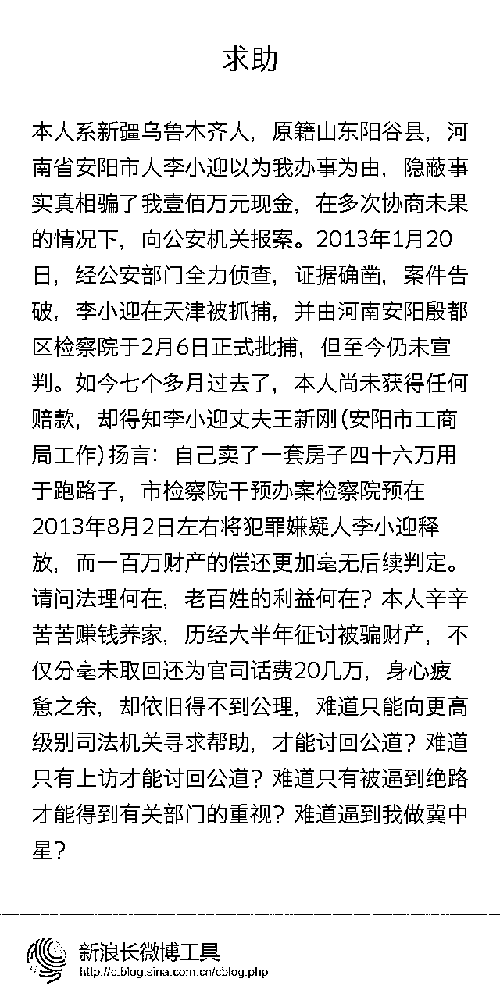

# 安阳狗咬人事件引发举国关注，没想到意外牵出狗主人夫妻诈骗百万案！

> 原文：[`mp.weixin.qq.com/s?__biz=MzIyMDYwMTk0Mw==&mid=2247524609&idx=1&sn=be7bc15b0ea6bd0292c20ddf1bfbc8a4&chksm=97cbaa39a0bc232fd771ba5244df56c1ae868f82c4c93cfbb691b603abffd49e68624192c0c2&scene=27#wechat_redirect`](http://mp.weixin.qq.com/s?__biz=MzIyMDYwMTk0Mw==&mid=2247524609&idx=1&sn=be7bc15b0ea6bd0292c20ddf1bfbc8a4&chksm=97cbaa39a0bc232fd771ba5244df56c1ae868f82c4c93cfbb691b603abffd49e68624192c0c2&scene=27#wechat_redirect)

近日，河南安阳一老人被同小区业主家大狗咬伤，河南广播电视台栏目《小莉帮忙》一个多月内针对此事做了 10 期节目，起初狗主人迟迟不出面承认“狗咬人”之事。

小莉曾咨询城管部门，得知巨型贵宾犬属于禁养犬只，归公安部门管理不予办理狗证。可是即便有当地城管、辖区民警调查协调，狗主人仍不肯正面回复。

这种处理方式未免让人有些无语。而这样不配合警方工作的人，到底是有多牛气呢？

狗主人各种耍无赖“躲猫猫”后，节目最终通过打听，终于揭开了谜底，确认狗主人名叫王新刚，在安阳市场监管综合行政执法支队就职。

于是小莉同老人家属一行人前往该单位实名制举报，对方仍然避而不见。反倒是办公室的主任出来调和，说狗主人这是怕矛盾升级，再这样下去要告他们诽谤！

当他们再次来到该单位去实名举报时，没料到现场竟然冲出来几名陌生的神秘人要动手，办公室主任则目睹着这一切。 

之后，警方从“神秘人”的身上搜出警棍。神奇的是，就连本来位于“禁养”之列的两只巨型贵宾犬都已经办理下狗证，说是“心理辅导犬”。

与此同时，某些相关部门处理问题的态度和方式也令人疑惑不解。

过程十分琐碎，十期节目过后，记者杨小莉在采访中参与协调的节目主持人多次协调仍旧无果，甚至无奈落泪。相关话题上了热搜，引发公众关注。

[`v.qq.com/iframe/preview.html?width=500&height=375&auto=0&vid=c33093t85rj`](https://v.qq.com/iframe/preview.html?width=500&height=375&auto=0&vid=c33093t85rj)

各路媒体报道后，当地才有了反应，11 月 19 日，安阳市市场监管局党组研究决定，从 2021 年 11 月 19 日起，对安阳市市场监管综合行政执法支队食品药品稽查专员王某予以停职，配合组织核查。

11 月 19 日晚，河南安阳“狗咬人”事件中犬只主人王新刚向被咬伤老人及家属道歉。

[`mp.weixin.qq.com/mp/readtemplate?t=pages/video_player_tmpl&action=mpvideo&auto=0&vid=wxv_2143791434821369860`](https://mp.weixin.qq.com/mp/readtemplate?t=pages/video_player_tmpl&action=mpvideo&auto=0&vid=wxv_2143791434821369860)

随着“狗咬人”事件发酵，远在新疆乌鲁木齐的杜庆达不经意间看到该事件中熟悉的名字——王新刚和李小迎。 

这事没完，这么一件“小事”为何会闹的举国关注，背后的问题不能不查！

万万没想到，狗咬人事件还把狗主人王新刚家更多事情牵扯出来，网友的网络举报那才叫一个刺激，有关部门有关人估计坐不住了吧！安阳纪监委@清风安阳 ，剩下的就看你们了……

* * *

胆量超过体重:不查不知道，一查吓一跳！

大仙女张小闹:我已经搬好小板凳，看看还有什么瓜

歌意气指江山:卧槽，终于，狗除了搜救，缉毒和食材之外，又有了一个新功能！反腐！

* * *

来源：微博那些事儿

← 向右滑动与灰产圈互动交流 →

