# 40 分钟，搭讪七八位女孩？甚至骚扰、偷拍、直播围观？！专家：可原地报警！

> 原文：[`mp.weixin.qq.com/s?__biz=MzIyMDYwMTk0Mw==&mid=2247524609&idx=2&sn=0455f6dd0aa7e34d8fec8641d1c45605&chksm=97cbaa39a0bc232fd5fe42a4ca03c473b0bffcf39222354a53f44fc034e71e13514b9f489e45&scene=27#wechat_redirect`](http://mp.weixin.qq.com/s?__biz=MzIyMDYwMTk0Mw==&mid=2247524609&idx=2&sn=0455f6dd0aa7e34d8fec8641d1c45605&chksm=97cbaa39a0bc232fd5fe42a4ca03c473b0bffcf39222354a53f44fc034e71e13514b9f489e45&scene=27#wechat_redirect)

现在，一种户外搭讪的网络直播以及相关短视频内容，越来越多地出现在各大网络平台。在这类视频的拍摄过程中，主播会在街头和途经的路人进行搭讪。许多普通的路人会在不同意甚至不知情的情况下，被主播拍摄，成为视频中的素材。

**骚扰偷拍 户外搭讪式直播乱象丛生**

[`mp.weixin.qq.com/mp/readtemplate?t=pages/video_player_tmpl&action=mpvideo&auto=0&vid=wxv_2146976156628090889`](https://mp.weixin.qq.com/mp/readtemplate?t=pages/video_player_tmpl&action=mpvideo&auto=0&vid=wxv_2146976156628090889)

△央视财经《第一时间》栏目视频

在北京某商业区，一位网络主播，正和路人进行搭讪。他搭讪的全过程，被视频平台全程直播。在被路人拒绝后，该主播依然尾随在路人身后，一边拍摄，一边对路人的外貌衣着进行点评。 

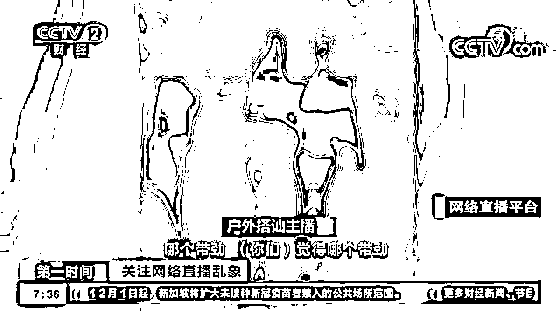

直播中，主播通常选择繁华的商业街区或旅游景点，对路人进行追拍、搭讪。

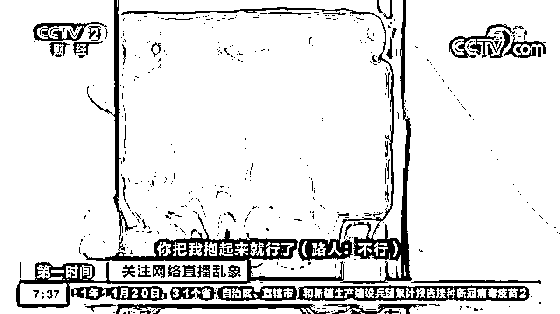

明知对方还未成年，这位主播仍会提出过分的要求，甚至在搭讪过程中进行肢体接触。

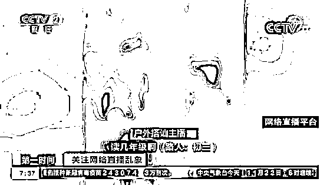

而这位主播，则以“为网友相亲”为噱头，跑遍全国各地搭讪异性。  

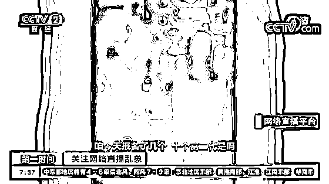

**户外搭讪主播：**这个身材好，你好美女，你听我讲两句，我是一千多万粉的大网红，我直播间今天报名了十个资产过亿的富二代，我帮他们相亲找女朋友。

直播开播 40 分钟的时间，该主播已经搭讪了七八位女孩。

在户外搭讪类的直播及短视频的拍摄过程中，一旦被主播的镜头对准，不论是否同意，**路人被搭讪后的真实反应，都已经被记录下来，供直播间内网友们“围观”。有时，主播们甚至还会偷拍路人。** 日前，一位女性博主发布了一段视频，讲述了自己被偷拍的经历。 

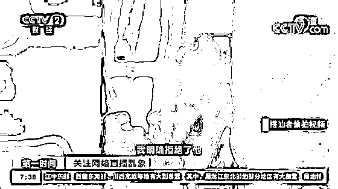

**某网络博主：**前两天我和朋友去上海新天地附近逛街，然后我们停在路边拍照聊天，这时候上来了一个莫名其妙的男的，要加我的微信，我明确拒绝了他。接下来，我以为事情就结束了，没想到我收到了一些粉丝提醒，他一共将搭讪我的视频进行了两条剪辑，发布在他的两个不同的账号，可是他凭什么偷拍我？！

**专家：部分户外直播侵犯肖像权名誉权构成违法**

[`mp.weixin.qq.com/mp/readtemplate?t=pages/video_player_tmpl&action=mpvideo&auto=0&vid=wxv_2146977632570114049`](https://mp.weixin.qq.com/mp/readtemplate?t=pages/video_player_tmpl&action=mpvideo&auto=0&vid=wxv_2146977632570114049)

△央视财经《第一时间》栏目视频

法律专家告诉记者，像上述这些在户外对陌生路人进行语言、肢体骚扰，跟拍甚至偷拍，并在没有经过对方允许，甚至是不知情的情况下，将对方的视频放到网络上等行为，已经涉嫌违法。根据不同情形，侵犯了个人隐私权、肖像权、名誉权等多项权利。专家指出，拍摄者在拍摄时，不能在未经允许的情况下把路人的肖像作为画面主体进行展示；不得暴露路人的隐私。

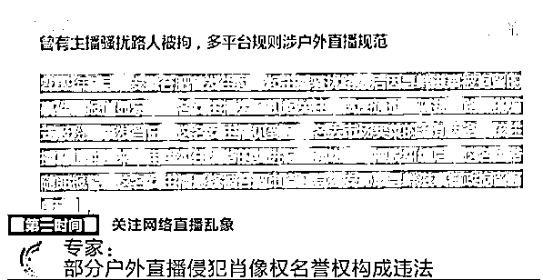

近年来，有关户外主播偷拍、搭讪骚扰路人引发案件纠纷的情况时有发生。2019 年 7 月，安徽合肥一名女主播为了引起关注，试图通过“骚扰”路人的方式吸粉。该女主播最终被公安机关以寻衅滋事行政拘留 8 天；2020 年 9 月，某网络男主播在街头直播搭讪，向多名女子求吻，甚至尾随一名醉酒女子而遭到网友举报。随后平台将其账号永久封禁，并上报互联网主播黑名单。 

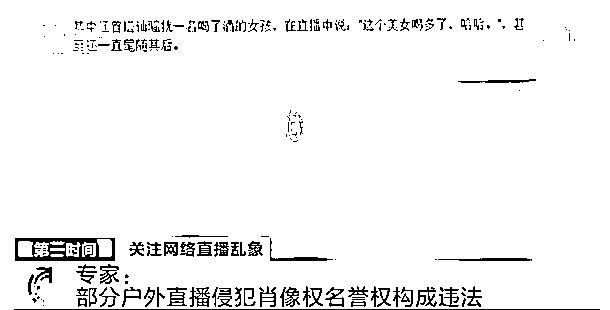

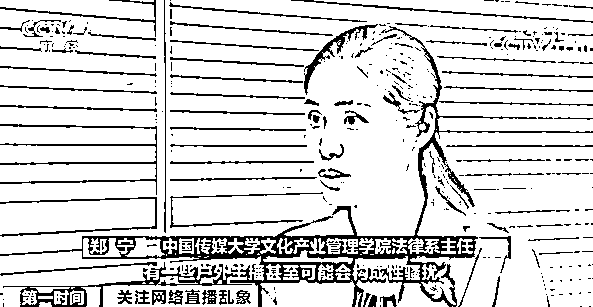

**中国传媒大学文化产业管理学院法律系主任 郑宁：**有一些户外主播甚至会构成性骚扰，比如说他对一些女性有身体上的触摸等不尊重行为，这个在《民法典》里也是明令禁止的。 

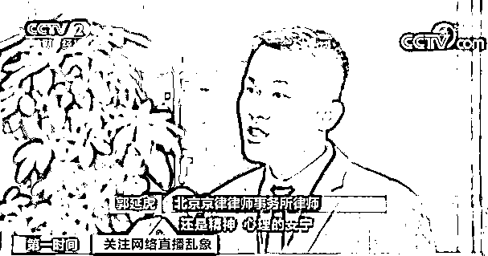

**北京京律律师事务所律师 郭延虎：**《民法典》明确提出了对生活安宁权的保护，不管是我们的物理生活空间，还是心理、精神的安宁，都依法受到保护，任何人不得侵害。

**为求流量主播无视规则 平台给予纵容**

[`mp.weixin.qq.com/mp/readtemplate?t=pages/video_player_tmpl&action=mpvideo&auto=0&vid=wxv_2146977829014536199`](https://mp.weixin.qq.com/mp/readtemplate?t=pages/video_player_tmpl&action=mpvideo&auto=0&vid=wxv_2146977829014536199)

△央视财经《第一时间》栏目视频

记者在调查中发现，很多网络视频平台对户外直播行为都作出过明确规定，然而为了追求流量，部分主播无视规定，而平台也给予纵容。

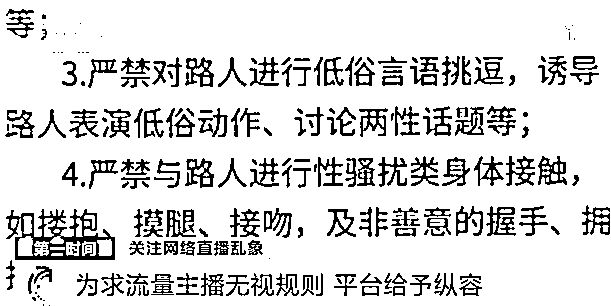

在各平台对户外直播行为的管理规定中，明文规定了严禁主播在直播过程中对路人进行言语、肢体骚扰等行为。然而部分主播却无视规定。在流量的驱动下，部分平台对户外搭讪式直播及短视频中的不良内容，也并未严格执行相关规定。  

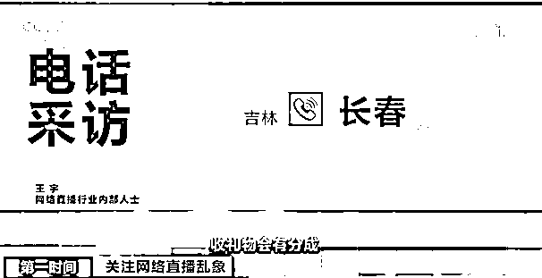

**网络直播行业内部人士 王宇：**平台扶持主播就类似于公司扶持业务员，平台也希望出现各种各样优秀业绩的销售员工，收礼物是有分成的，所以平台不会太绝对地杜绝。

 某互动直播平台上，一位户外直播板块的男主播因每晚直播自己在不同场合与不同异性搭讪的情形，在短短两个月的时间内就收获了百万粉丝。有些直播平台单独设有“户外搭讪”这个类别；还会在搜索时跳出“街头撩妹真实搭讪”“户外撩妹祖师爷”等关键词，引导用户观看。 

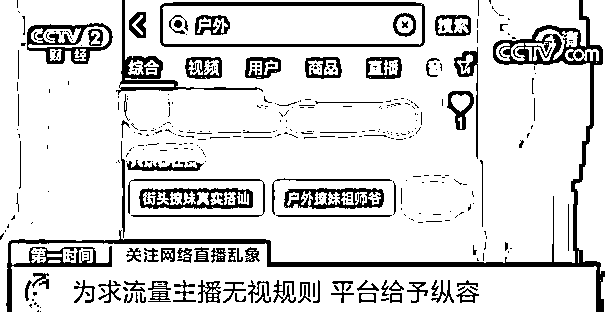

前面提到的被偷拍的女博主告诉记者，她向平台举报发布偷拍视频的账号，该号被封禁。但该团队还拥有另外两个账号，每天仍然在发布着搭讪女路人的视频。她与支持她的网友对另两个账号进行了多次反复举报，却始终不成功。  

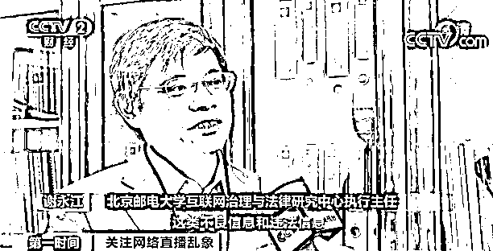

**北京邮电大学互联网治理与法律研究中心执行主任 谢永江：**这类不良信息和违法信息在平台上的广泛存在，说明网络平台没有尽到主体责任，放任不良信息和违法信息的传播，上到热搜、排行榜，它属于主动地将信息呈现。深层次来讲，这些信息的传播跟平台的利益存在一定关联。 

**过分骚扰 可直接原地报警**

专家指出，户外直播，主播在拍摄过程中未经他人允许，不能把路人的具体模样拍到视频里。在未征得他人同意的情况下，要将被拍摄者脸部及可识别的标记去掉。坚决不能悄悄跟拍、偷拍。

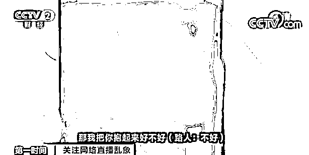

如果发现被偷拍、跟拍，当事人可以通过以下几点来维护自己的合法权益。  

**中国政法大学传播法研究中心副主任 朱巍：**看到别人已经明确拍摄你了，如果你认为他拍摄的内容有可能会被传到网上，可以拒绝拍摄。哪怕他不传到网上，对着你本人来拍，这是一个非常不礼貌的行为，违反了人和人之间交往的安全距离。

按法律来讲，这种拍摄对个人隐私权、肖像权，包括有可能涉及的名誉权都会造成损害，所以当然有权利拒绝拍摄，而且把拍摄东西立即删掉。如果是直播的情况下，可以按照直播平台的管理规定，要求平台暂停这段直播，把它删掉。在公开场合对人进行这种骚扰，实际已经触犯了治安处罚法的相关规定。骚扰很过分的话，可以直接原地报警，警方处理比较好。

**乱象频出 平台应当担责**

[`mp.weixin.qq.com/mp/readtemplate?t=pages/video_player_tmpl&action=mpvideo&auto=0&vid=wxv_2146978086242811905`](https://mp.weixin.qq.com/mp/readtemplate?t=pages/video_player_tmpl&action=mpvideo&auto=0&vid=wxv_2146978086242811905)

△央视财经《第一时间》栏目视频 

以低俗、粗俗等举动博人眼球、换取流量，这种直播方式已经完全越界，不仅污染了网络空间，对于线下的普通人的生活，也是一种直接的骚扰。整治户外直播乱象，不能仅靠线下的执法力量，还要靠平台治理。

正如专家说的，平台承担主体责任，必须把好关口，不能让低俗行为在线上传播；另一方面，要利用大数据手段及时甄别低俗直播，一旦发现，就要通过屏蔽、降权、下线甚至封号等手段及时制止。从源头上把控，让这些网红主播无利可图，他们自然也就消停了。

来源：央视财经（ID：cctvyscj）、央视新闻客户端

← 向右滑动与灰产圈互动交流 →

