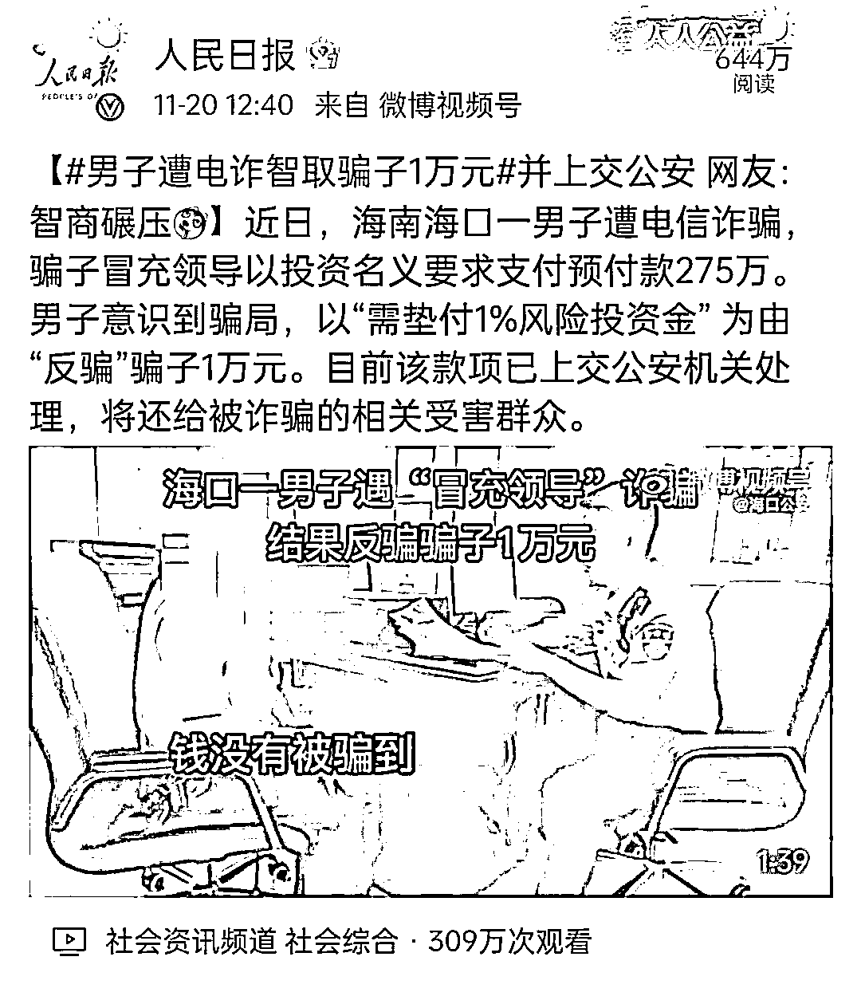
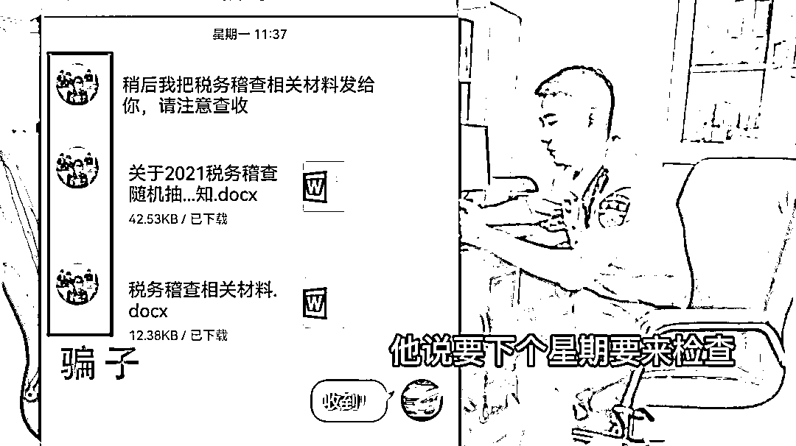
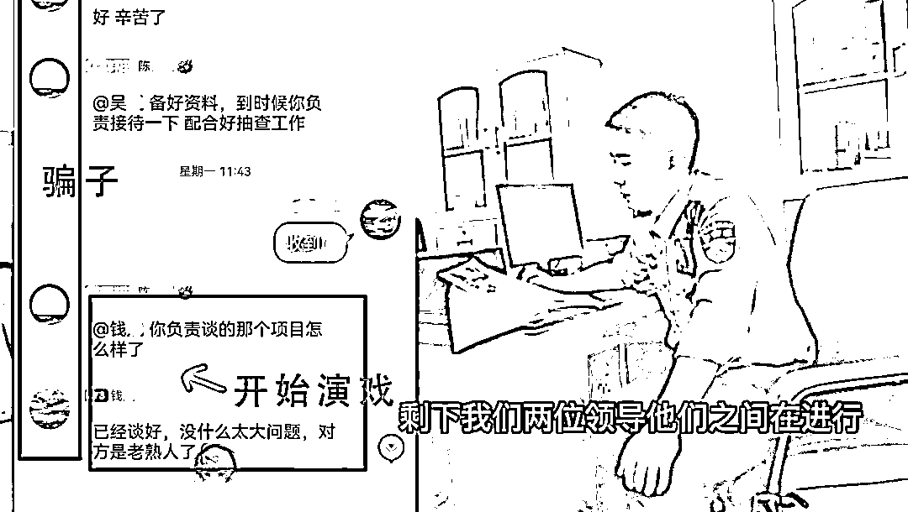
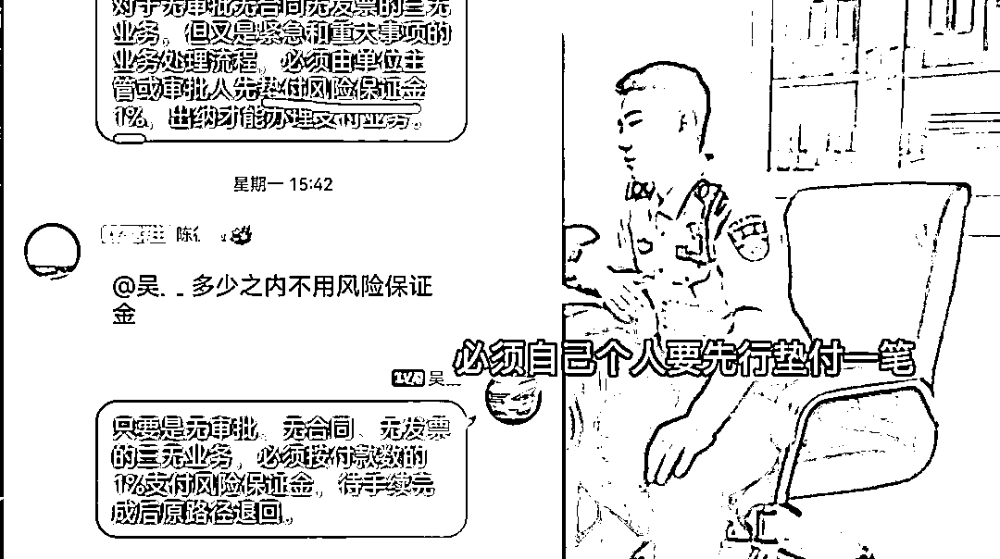
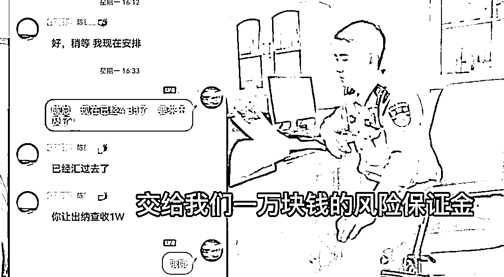

# 海口男子遇诈骗，反“骗”对方 1 万元！网友：开个班吧

> 原文：[`mp.weixin.qq.com/s?__biz=MzIyMDYwMTk0Mw==&mid=2247524609&idx=3&sn=1d0014cd89021de612c885be0a3307e4&chksm=97cbaa39a0bc232fa7920d201d0fb9d7b23c54a09b5be040828d7d7931e18e8e0e33150648eb&scene=27#wechat_redirect`](http://mp.weixin.qq.com/s?__biz=MzIyMDYwMTk0Mw==&mid=2247524609&idx=3&sn=1d0014cd89021de612c885be0a3307e4&chksm=97cbaa39a0bc232fa7920d201d0fb9d7b23c54a09b5be040828d7d7931e18e8e0e33150648eb&scene=27#wechat_redirect)

最近大家有没有

被警察蜀黍拦下来

**“你好！下载这个反诈骗 APP，**

**可以防止被骗哟~”**

的确

如今电信诈骗真的很猖狂

冒充银行、冒充家人

甚至连公检法都敢随意冒充

有人也因此上当受骗，**损失惨重**

****

海口一男子近日遭遇电信诈骗

警惕性很高的他

以“需垫付 1%风投金”为由

反骗对方 1 万元

连人民日报都转发了

网友们纷纷表示

*“诈骗的反被骗了，真厉害”*

*“智商碾压”*

*“开个班吧！我想学”*

一起来看看是怎么回事吧？

**【视频】**

[`mp.weixin.qq.com/mp/readtemplate?t=pages/video_player_tmpl&action=mpvideo&auto=0&vid=wxv_2145334637726842886`](https://mp.weixin.qq.com/mp/readtemplate?t=pages/video_player_tmpl&action=mpvideo&auto=0&vid=wxv_2145334637726842886)

**11 月 17 日上午 9 时许**

龙华分局金贸派出所值班民警接到市民吴先生报案称自己遭遇电信诈骗。经了解，吴先生与 11 月 15 日被一名自称是“税务局工作人员”的女子添加，并拉入了一个有两名“公司领导”的 QQ 群内，以税务稽查为由，让吴先生与两名“公司领导”继续交流业务。

其中一名“公司领导”要求作为公司财务的吴先生将 275 万元人民币转账到某交易账户。

由于日常负责财务工作，加上近期一直看到派出所的反诈宣传提示，对电信诈骗的防范意识一直很高，吴先生很快便敏感地意识到，这几个人应该都是诈骗分子。于是，吴先生便试着于这伙诈骗分子周旋，想看看这些人如何诈骗自己。 

当诈骗分子要求吴先生转账之后，吴先生以“公司规定”为由，提出单位主官或审批人需要垫付百分之一的“风险保证金”才能安排财务转账。

为了让吴先生顺利转账，两名诈骗分子合谋将一万元“风险保证金”转到了吴先生提供的个人账户上，并不断催促吴先生尽快转款。

*这波操作*

*小编看了都直呼 666*

在收到诈骗分子转账的 1 万元后，

吴先生来到了辖区

金贸派出所报案反映情况，

向民警咨询求助

如何处置这笔资金。

经查询，

吴先生所收到一万元人民币

涉及外省的一宗诈骗案件

民警将配合发案地警方

将这一万元赃款

归还给相关受害人

警方提示

当前各类电信诈骗案件频发，作案手段花样百出，请广大市民提高警惕，在操作转账汇款时要更加小心谨慎，以免上当受骗。同时，也号召大家都安装**“国家反诈中心”APP**，并开启“来电预警”功能，各类支付账户、网址以及交友账号都能通过“风险查询”功能进行验证，这样就能够有效消除绝大多数被骗的风险隐患了。

来源：海南特区报，利箭在行动

← 向右滑动与灰产圈互动交流 →

