# 没法吃→真地道，这变脸绝了

> 原文：[`mp.weixin.qq.com/s?__biz=MzIyMDYwMTk0Mw==&mid=2247524609&idx=4&sn=d62c7a9273f49590a43929e09d1ef5bc&chksm=97cbaa39a0bc232fdc5a7d9c1eb9a0623987fa782f8e58e55e6981f30b80011915eff4f09d36&scene=27#wechat_redirect`](http://mp.weixin.qq.com/s?__biz=MzIyMDYwMTk0Mw==&mid=2247524609&idx=4&sn=d62c7a9273f49590a43929e09d1ef5bc&chksm=97cbaa39a0bc232fdc5a7d9c1eb9a0623987fa782f8e58e55e6981f30b80011915eff4f09d36&scene=27#wechat_redirect)

“炸酱面过水差点意思，嚯，这哪炸酱啊，没法吃这个！”

“这一看就是刚煮的老北京的炸酱面...真有一种家里妈妈做的味道，肯德基的炸酱面那是真地道。”

近日，抖音一网红两次到店试吃肯德基炸酱面，由于前后评价截然相反引发网友热议。许多网友吐槽比起炸酱面，该网红的“川剧变脸”才叫地道。而目前，该网红的抖音账号已删除过往的全部视频。

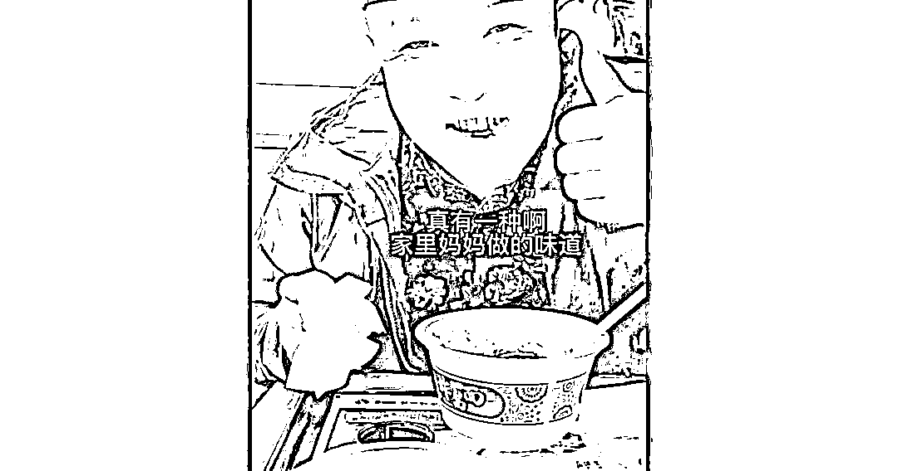

视频截图

据了解，这个自称为美食探店达人的网红博主“牛道”在抖音平台拥有超 150 万粉丝。在他第一次探店肯德基的视频中，“牛道”在开头就评价推出老北京炸酱面的肯德基“飘了”，可谓是为后续的嫌弃态度定了调子。

随后，“牛道”进店点餐，得知一碗炸酱面的售价是 26 元，他颇似惊讶地批道：“26 呢，这么贵。”等到面上来，“牛道”先展示了菜码和面条，称菜码里起码有胡萝卜、黄瓜丝，芹菜丁，“面的话看着能有二两面，（面）条看着倒是挺筋道的”。

接下来，用筷子捞了捞面的“牛道”语气略显不满，称面“怎么给过水了”，认为“炸酱面过水差点意思”。接着，“牛道”又挑了点炸酱尝了下，只见他眉头一皱，双眼眯起，满脸痛苦表情地称：“嚯，这哪炸酱啊！没法吃这个！”

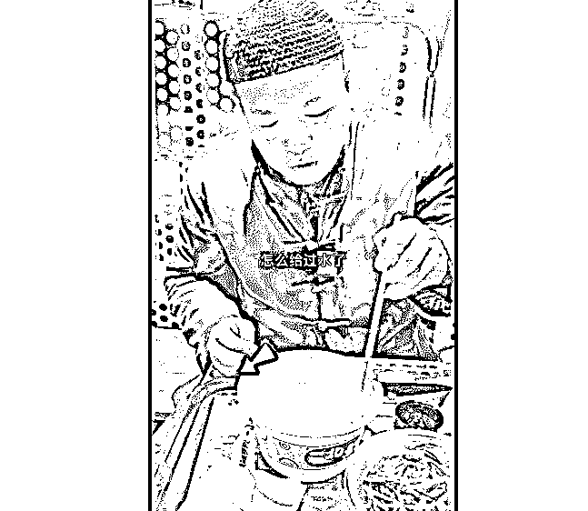

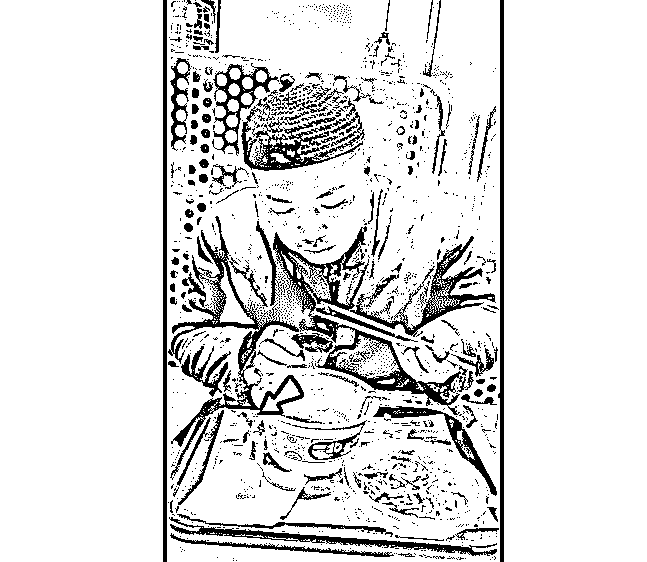

然后，令人意外的场面出现了。“牛道”从自己先前拎着的袋子中拿出一罐“老北京炸酱”，对着镜头开始“拉踩”——“这才是真正的老北京炸酱呢，200 克一罐，这俩酱一比您就知道了。”

“这个干巴巴”，“牛道”把肯德基的炸酱往镜头前一送；“这个油酱分离，这才是真正的老北京炸酱”，“牛道”用筷子挑出大团自带炸酱拌到面里，“这拌出来讲的得是枣红色”。之后，“牛道”夹起拌好的炸酱面，面对镜头笑称，“嘿，还是咱方砖厂炸酱啊地道”。说完，他便大口吃起了面。

你以为到此就结束了，不，只见视频中的“牛道”大声问起肯德基服务员，“哎，您这有蒜吗”。在得到否定的回答后，他又拿起自带的炸酱，跟着镜头说，“这老北京炸酱，吃这口必须得吃蒜，没有蒜就没有酱的灵魂了”。

又“拉踩”一波后，“牛道”就正式推销起自带的炸酱：“这口啊特别方便，往家里冰箱里一放，甭管早点还是宵夜，您随吃随有啊。您听我的没错，您是自己吃、送礼，您都合适。抓紧您弄两单尝尝吧。”

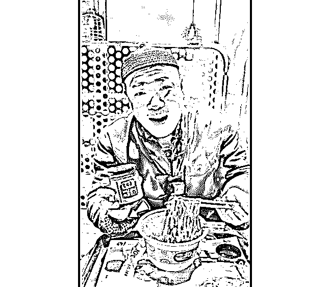

至此，这条“恰饭”视频到此结束。单看这一视频，虽然有争议，但并未引起大范围讨论。但令人没想到的是，“牛道”之后又发布了一条吹捧肯德基炸酱面的视频。

在这条 11 月 20 日发布的视频中 ，“牛道”的态度可谓是截然相反。上支视频中他称 26 元售价贵，这支视频就变成了“26 块钱还真不贵”。上支视频中嗤之以鼻的炸酱，变成了“这小酱是真棒”。上支视频中嫌弃的“过水面条”，变成了“这面条也好...还冒着热气呢，一看就是刚煮得的”。就连上支视频中，自带炸酱拌出来的“枣红色”，都变成了肯德基“专属”——“老北京的炸酱面，讲究拌出来得是枣红色，肉呢还得切这种筛子丁”。

之后，在对着镜头大口吃了几口肯德基的炸酱面后，“牛道”竖起了大拇指，笑着做出了“妈妈牌”炸酱面认证：“真有一种啊，家里妈妈做的味道。身为一名北京的美食达人，我可以很负责任地告诉你，肯德基的炸酱面那是真地道。”为了继续拉高肯德基炸酱面，“牛道”又夸了面给的多，服务还“地道”。最后，他总结道：“感觉一来到这，就跟到了家似的这感觉。抽空啊，您一定来这尝尝。”

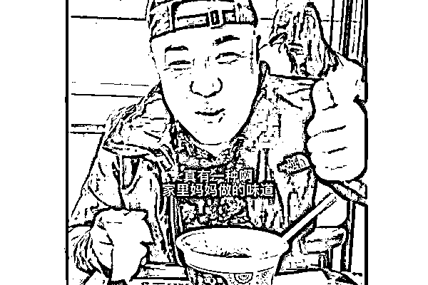

在“牛道”第二支视频发布后，不少网友都注意到他在两支视频中对肯德基炸酱面截然相反的评价，#网红探店肯德基炸酱面大变脸#话题也登上微博热搜。许多网友吐槽“牛道”“变脸挺快”，比起炸酱面，他“川剧变脸”才叫地道。

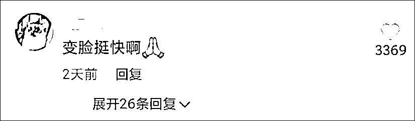

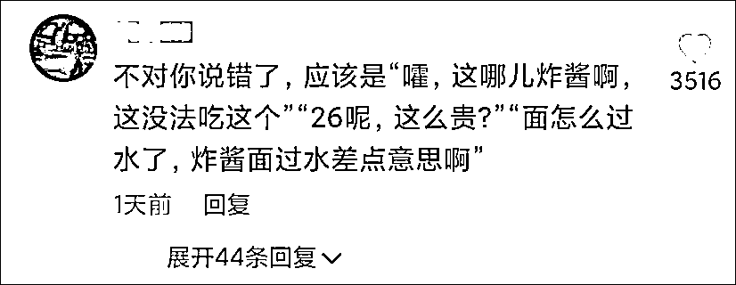

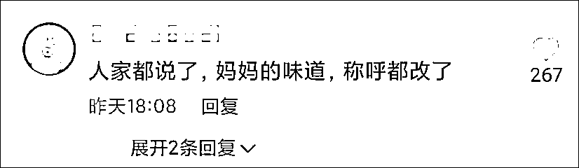

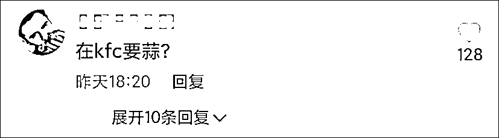

还有部分网友呼吁，对“牛道”这类“有奶便是娘，没奶可劲儿踩”的变脸行为，相关平台应予以封杀。

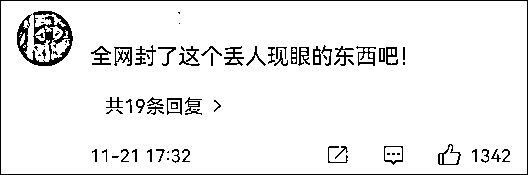

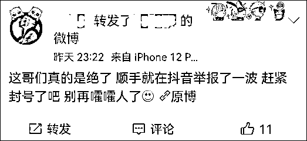

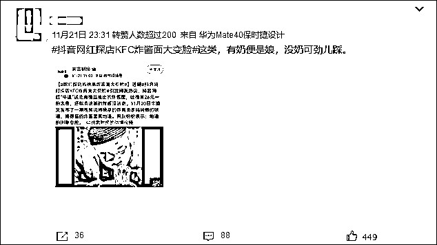

值得一提的是，在今日上午 8 时，“牛道”的抖音账号显示已被博主设置为私密账号，关注后还需得到博主同意才能查看内容。而到了今日 11 时前后，“牛道”的抖音账号已解除私密账号设置，但以往的全部视频目前均已被删除。

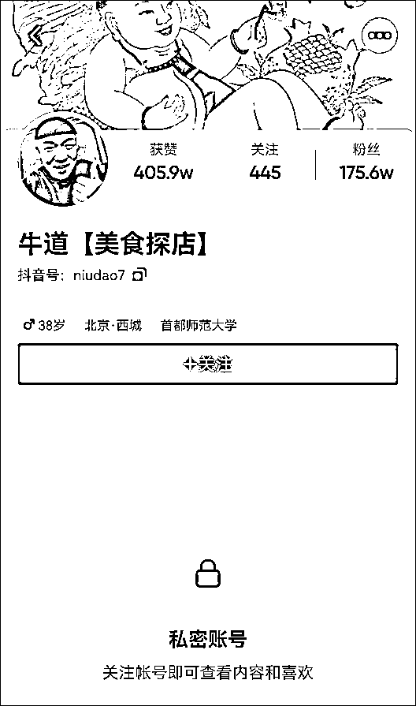

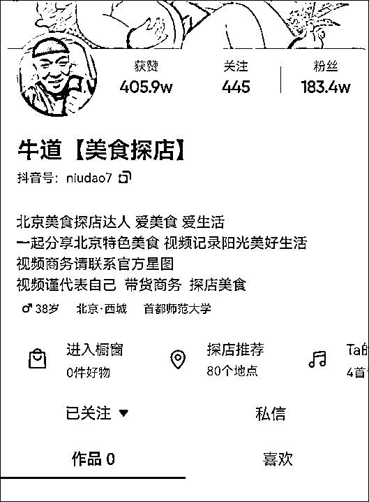

来源：观察者网

← 向右滑动与灰产圈互动交流 →

