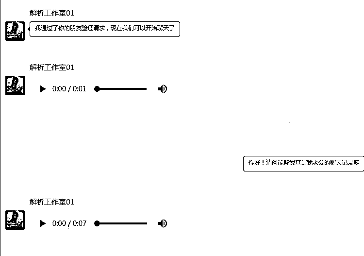
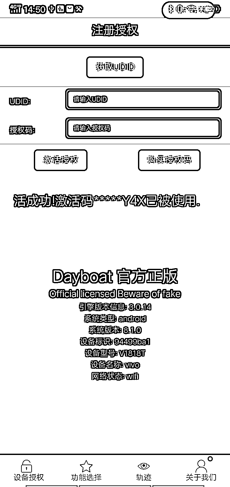
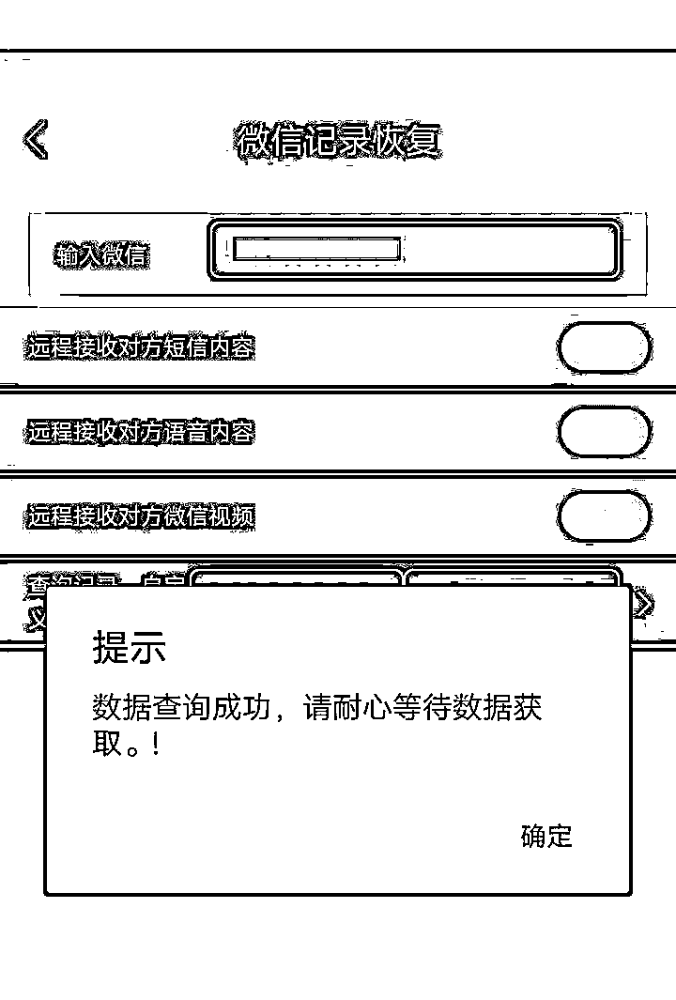
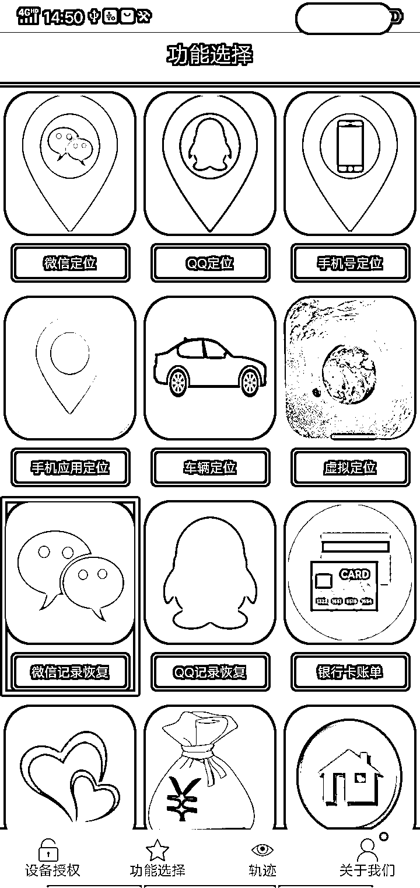

# 手机定位、聊天记录恢复、车辆定位、银行流水查询……超强诈骗软件发布！

> 原文：[`mp.weixin.qq.com/s?__biz=MzIyMDYwMTk0Mw==&mid=2247524609&idx=6&sn=7ff94ce3b6320cf4ae6d8e1e604fa1f3&chksm=97cbaa39a0bc232fa2b86b3a9e66c407d2cedd582e477d7d21fb33d3c5ec9b5262e72169954f&scene=27#wechat_redirect`](http://mp.weixin.qq.com/s?__biz=MzIyMDYwMTk0Mw==&mid=2247524609&idx=6&sn=7ff94ce3b6320cf4ae6d8e1e604fa1f3&chksm=97cbaa39a0bc232fa2b86b3a9e66c407d2cedd582e477d7d21fb33d3c5ec9b5262e72169954f&scene=27#wechat_redirect)

如今微信已成为生活中必不可少的通讯工具，人们可通过微信收发信息、拨打视频电话、支付各种费用等。因微信的私密性，有人就想通过互联网寻找查看他人的微信聊天记录，并发生了违法犯罪人员抓住被害人心理弱点，以有办法“恢复他人聊天记录”的手段诈骗成功的案件。最近，胡女士就遭遇了类似诈骗案件。

11 月中旬，胡女士想恢复丈夫微信聊天记录，就在网络上搜索关键字，添加了声称可以“恢复微信聊天记录”的“客服”。

该“客服”使用语音和胡女士交流，要求胡女士支付 680 元恢复软件的下载费用。胡女士按对方要求转账后，下载了一款名为“Dayboat”的手机软件，打开发现该软件还需授权码才能使用。 

 

胡女士继续询问“客服”，对方回复需支付 1380 元的授权费才能使用软件。胡女士又按“客服”要求转账 1380 元后，终于进入了软件。

 

进入软件后，胡女士还是无法使用界面上的“微信记录恢复”功能，“客服”告诉胡女士还得继续转账 3000 元的数据连接费才可使用该功能。无奈之下胡女士只好再次转了 3000 元给“客服”。可她使用“微信恢复”功能后软件一直停留在“数据查询成功”界面，询问“客服”后再也得不到回复信息，才发现自己被骗了共计 5060 元。

 

警方提示

1.微信聊天记录均加密并储存在微信使用者的手机内，网络上称可以付费恢复他人微信聊天记录的方法，绝对是陷阱。

2.自己重要的微信聊天记录，可使用微信电脑版将聊天记录备份在电脑上，以防手机丢失或不慎将聊天记录删除。

3.诈骗软件内还有“车辆定位”、“手机定位”、“微信定位”等功能，同样是违法犯罪人员用于实施诈骗的手段，切勿上当受骗。

来源：义乌公安，阻击诈骗

← 向右滑动与灰产圈互动交流 →

