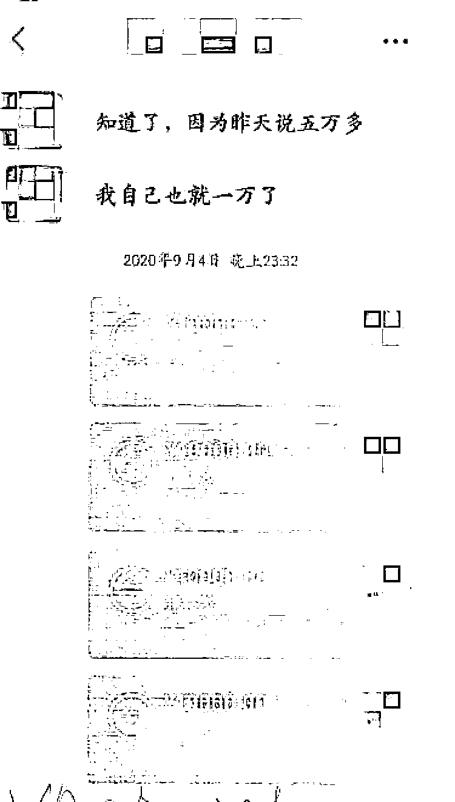
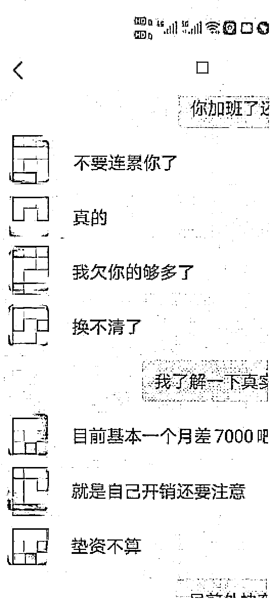
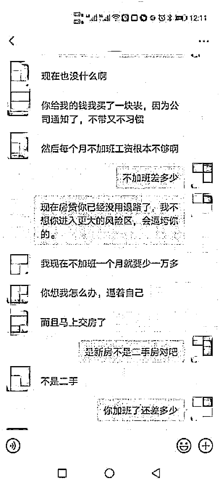
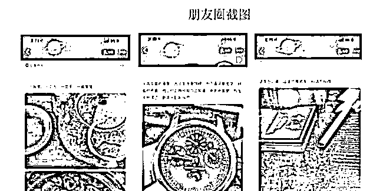

# “海王”周旋 6 个女人间，受害者还心甘情愿帮他带孩子

> 原文：[`mp.weixin.qq.com/s?__biz=MzIyMDYwMTk0Mw==&mid=2247524678&idx=3&sn=520a27ce9b329221a8a786144e85bdca&chksm=97cbaa7ea0bc236813bba2896f3a05794329f30e8b50e83148ffbdac798a91c90bc3396be096&scene=27#wechat_redirect`](http://mp.weixin.qq.com/s?__biz=MzIyMDYwMTk0Mw==&mid=2247524678&idx=3&sn=520a27ce9b329221a8a786144e85bdca&chksm=97cbaa7ea0bc236813bba2896f3a05794329f30e8b50e83148ffbdac798a91c90bc3396be096&scene=27#wechat_redirect)

该公众号已被封禁

##### 某集团高管，年入百万，不仅事业成功，还做石油生意投资理财，妥妥地一名钻石王老五。然而，在这样的人设包装下，奚某其实是一名“海王”，周旋于多名女子间骗财骗色。日前，上海宝山区检察院对这名男子以诈骗罪提起公诉。

## **首付 950 万元为女友买房？**

2020 年 2 月，小兰通过珍爱网结识了奚某，奚某自称是某集团高管，做建筑的，管理着 5000 多人，工作特别繁忙。

两人相识 3 个月后确认恋爱关系。一天，奚某告诉小兰，他支付首付 950 万元，为小兰购买了一套房子，现在已经涨价到 12 万元一平了。奚某为此向他人借了款，每月的工资还房贷后，日常开销非常紧张。

2020 年 7 月，奚某说自己只剩下 1000 元，手机也摔坏了，想换手机却没钱，还发了一张京东购物的截图，内容是一部价值 7000 元的华为手机，说自己喜欢这个。

小兰心疼男友，立即同意帮他买，加上奚某看中的一副 1000 多元的耳机，小兰将 9000 元转账给了奚某。

之后，奚某在小兰面前提起买房子后没钱，还要为公司垫资购买建筑材料，每年垫资 30-50 万元，公司要在年底才会支付，自己亏空很多钱，又要还款，每个月不加班工资不够用，许诺等公司报销之后再装修豪宅。

小兰听到奚某抱怨“我又不能让你每个月补贴我一万元钱”，就赶紧给他打款。于是，小兰先后转账 11 万元给奚某。

## **上网查询，他竟有诈骗前科**

但是，不久后，小兰却发现奚某有些不对劲。

原来，奚某平时拍摄小视频上传抖音，内容一般是拍自己的奔驰车、自己工作很辛苦，还有工地上的工人出事，在医院处理等，抖音评论区中有不少女性用户表达关心奚某情况的留言。

作为女友，小兰看到留言很吃醋，便质问奚某，奚某以姐姐关心自己，搪塞了过去。

小兰越想越不对劲，便在网上对奚某进行了搜索。**没想到在裁判文书网查到，奚某竟是失信人员，还有伪装成某集团成功人士诈骗的犯罪前科。**

对此，奚某辩称是集团内部安排他去做的。但这解释过于苍白，小兰不相信他，直接加了这些留言的女性用户，其中一名周女士和小兰取得了联系。

周女士告诉小兰，奚某是一个爱情诈骗犯，骗了很多女孩子，周女士也是其中之一，被骗了五六十万元，但是她很爱奚某，两人同居在一起。

奚某认识小兰的时候还有老婆，是 2020 年 6 月才离婚的。

小兰幡然醒悟，和奚某摊牌，要么还款，要么去派出所。奚某选择了还款，多次协商后分期归还了部分。小兰去报过案，但由于是孤立案件，又有较长时间的感情纠葛，奚某的行为被认为是恋爱纠纷，未予立案。

## **花言巧语骗女友投资**

多行不义，奚某的诈骗行为终究躲不过法网。被害人小晶的报案，得以让奚某的行为公之于众。

2021 年 1 月，小晶通过一款手机 APP 结识奚某，两人相谈甚欢，便约出来见面，之后确定了男女朋友关系。

在小晶眼中，奚某是个钻石王老五。奚某自称家里是开公司的，自己的工资待遇很高，开的车是奔驰 E 级，穿戴名牌，经常带小晶出入高档场所，还给小晶和家人赠送奢侈品和高档烟酒。

奚某的朋友圈

奚某的朋友圈经常发送投资理财的信息，小晶和奚某聊天中也提到自己会做投资。

2021 年 1 月，小晶向银行贷款 20 万元用来买车，奚某得知此事后，说有朋友在做道达尔石油投资理财，小晶可以将 20 万元交给奚某进行投资，每月收益 6000 元，本金随时能够领出来。至于车子，奚某有车可以负责接送。小晶同意了，就将 20 万元转给了奚某。

之后，奚某称投资非常稳定，鼓动小晶继续追加。于是，小晶就追加了 15 万元的投资。在此期间，奚某偶尔给小晶发投资的 K 线图，也告诉小晶道达尔石油投资的情况，小晶没有看懂，出于信任，也没有多问。

2 月底，小晶拿到了第一笔投资的利息 6000 元，后来在奚某的多次游说下，小晶再次追加 10 万元。两人相处期间，小晶还给了奚某花 1 万多元购买了手机。

## **车辆竟登记在他人名下**

2021 年过完年，小晶发现奚某很久没有开奔驰车了，奚某解释被朋友借去当婚车了。

后来，小晶拿着奚某的车辆行驶证托二手车市场的朋友了解，发现这辆车根本不在奚某名下，这才起了疑心，经过再三追问，奚某发誓车子是自己的，行驶证真实有效。

但与此同时，小晶发现奚某还有很多事情隐瞒她、欺骗她。例如，奚某有过一段婚姻，有一个 10 岁的儿子。小晶觉得奚某并不可靠，就提出让奚某将投资款共计 45 万元归还，但奚某一直推脱，小晶无奈选择报警。

实际上，奚某的奔驰车其实是另一名被害人小凤购买的。

小凤与奚某恋爱期间，奚某以公司资金需要周转、买房子需要支付房产税为由，从小凤处获得 11 万余元。

虽然奚某承诺事后会还，但一直没有兑现。小凤考虑到奚某的公司高管身份，花 50 多万元买了一辆奔驰车，供奚某使用。

但小凤通过车辆定位发现奚某去过静安、宝山等多处住宅，便产生了怀疑。在向奚某要回车辆时，奚某以各种理由推脱，甚至说出“我的病危通知书都下来了，你不关心我却关心车”这样的话。

## **上门寻找意外发现真相**

小凤听说奚某谎称有工程骗取好友小佳的事情后，结合之前种种疑点，觉得奚某可能是个骗子，就根据奚某的户口本地址寻上门，发现奚某竟有一个十岁左右的儿子。

奚某的父母说，奚某的女友是周女士，她在帮奚某带孩子。

随后，小凤就联系了周女士见面。周女士告诉小凤：“在你身上发生的一切，我也同样经历过，你被骗了 7 万多，算少的，我是你的好几倍。”

然而，周女士已经深深陷了进去，还帮奚某购买了一辆 40 多万元的轿车。案发后，民警联系了周女士，**周女士却称自己没有被骗，不愿制作笔录。**

经过调查，其他被害人也一一浮出水面。**奚某谎称自己是某集团高管，以结婚谈恋爱为名，伪造车辆行驶证，虚构为被害人买房、投资道达尔石油生意、垫付集团公司资材等理由，骗取 6 名女性近 80 万元。**

来源 ：新闻晨报，潇湘晨报

← 向右滑动与灰产圈互动交流 →

