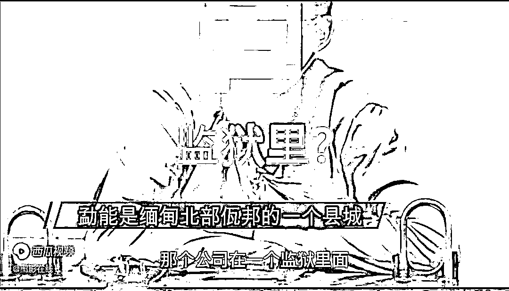
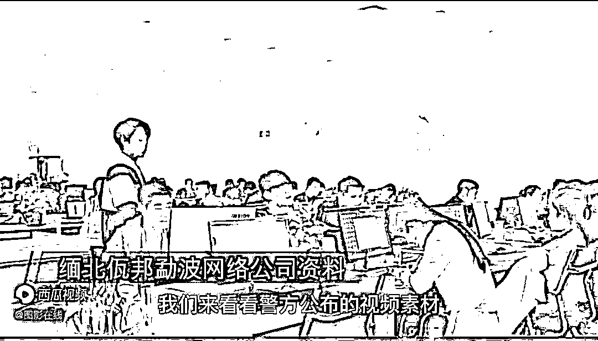

# 缅北电信诈骗：比坐牢还苦，连自杀都没机会

> 原文：[`mp.weixin.qq.com/s?__biz=MzIyMDYwMTk0Mw==&mid=2247524711&idx=3&sn=3209161d79ba1b0cee608f779480f480&chksm=97cbaa5fa0bc2349d44d76852384a8ee546a38141f28778cc7f305f5e9cf8fe22b7f827c4768&scene=27#wechat_redirect`](http://mp.weixin.qq.com/s?__biz=MzIyMDYwMTk0Mw==&mid=2247524711&idx=3&sn=3209161d79ba1b0cee608f779480f480&chksm=97cbaa5fa0bc2349d44d76852384a8ee546a38141f28778cc7f305f5e9cf8fe22b7f827c4768&scene=27#wechat_redirect)

[`mp.weixin.qq.com/mp/readtemplate?t=pages/video_player_tmpl&action=mpvideo&auto=0&vid=wxv_2146027842311094272`](https://mp.weixin.qq.com/mp/readtemplate?t=pages/video_player_tmpl&action=mpvideo&auto=0&vid=wxv_2146027842311094272)

来源：“图影在线”头条号  

**这里是缅甸北部，但却是缅甸管控不了的地方。**

**这里深山环绕，又是几国交会处，是不法分子的天堂。**

**这里武装割据，每个山头都可能有不同的道。**

**这里就是大家熟知的金三角，一个你来了不一定回得去的地方。**

缅甸北部并不是莫名其妙的火起来的。其实在很久以前，警方一直在宣传缅北电信诈骗，一直到后来警方在网络上陆续公布了缅北电信诈骗公司非法拘禁殴打的视频得到了普遍关注。缅北由于复杂的历史背景原因，**毒品、私刑、电信诈骗、赌场、走私、偷渡才是真实的面目**。每一个区域都有军阀割据的民族武装。由于当地人基本上**全民汉语、汉字**，人民币是主要流通货币，**还能够使用电信、移动、联通三大运营商的信号。在缅北使用微信、支付宝、抖音、快手等各类 APP 也是畅通无阻的**。

我们来看看警方公布的视频素材，听听他们讲述自己在缅北电影诈骗公司都遭遇到了什么。

**嫌疑人 1：**“首先到了的缅甸孟波那边，然后就是那边有人接，各种各样的费用，不给的话就不能走，要不就卖到别的诈骗公司里面去”。
**警方：**诈骗公司在什么地方？
**嫌疑人 2：**“缅甸勐能，那个公司在一个监狱里面，都是专门做诈骗的”
**嫌疑人 3：**”我被他们用那个枪打，用枪托”
**嫌疑人 4**：基本上被人被卖了，就当一辈子在缅甸回不来了。 

**嫌疑人 2：****有时（被他们）打的吐血，打的自己吐血，每天就是三个馒头，两瓶水**。

**警方：**你现在回来以后，你有什么最大的感受吗？

**嫌疑人 4：****能够回来的最大感受****就是我还能活着回来！** **嫌疑人 5：**抖音上经常说缅甸水牢嘛，**扔进去里面全部都是水，而且他给你一个瓢，你把那个瓢的水慢慢的往外面倒，如果你倒得慢的话，那个水就会泡满**，**把人淹死。**

**嫌疑人 6：**然后我希望更多的人能看得到我的视频，然后知道我的情况，不要再去缅北， 

**嫌疑人 3：**被他们折磨了半个月左右的时间，我诈骗到，但他一毛钱都没给过，
**嫌疑人 4：**我被卖到别的公司去。对，直接卖了，**就跟那个卖菜一样卖了。**
**警方：**你身边有人被卖过吗？

**嫌疑人 3：**有，很多卖到别的公司去了，
**警方：哪你这个公司也有买过人进来吗？**

**嫌疑人 5：**肯定买过，那边的警察就跟那边的公司高层都是有联系的，利益之间的关系，

**嫌疑人 3：**比我做牢还苦。真的，我在那个地方，**我曾经想过自杀，****但是你的自杀的机会都没有。** **嫌疑人 4：**你报警了也不会有人理你。而且你报警的话，别人那时边的警察会让你先去找他，他也不会理你，把你弄的那就是，**打一顿之后再把你交回你原来的公司。**
**嫌疑人 3：**这辈子也再也不想着什么发财梦了

这些深陷缅北电信诈骗公司的人，他们绝大多数通过互联网里面的高薪诱导的骗到缅北。只要偷渡踏出国门边境的那一刻起，就意味着他们的噩梦就开始了。所以不要抱着侥幸的心理去偷渡，也不要认为那边全部汉语汉字具有亲切感，那些受武装保护的电信诈骗公司的老板，随身都是有枪的，并且还可以花高价向当地政府雇佣兵。

近几年，中国流入境外的资金损失都是有增无减。有的人民群众因为电信诈骗而家财散尽，一夜返贫，甚至有了背负着巨额债务，

**被骗的钱能追回来吗？****其她的地方是有机会的，****如果是缅甸北部，几率就很低。**前面我讲的很清楚了，电信诈骗公司在缅北是受武装保护的名义上，他们这个地方属于缅甸，但实际上它不受缅甸政府控制。缅北以前几乎家家户户都把罂粟当粮食一样的种。后来在中国的帮助下替代种植，这就是为什么现在缅北盛产香蕉、甘蔗、西瓜、橡胶、茶叶、杉木等等。但这些远远满足不了缅北的军阀，所以就慢慢的往现金网、电信诈骗、卖淫嫖娼上发展。

针对免费电信网络诈骗，公安机关想了个办法，不回来自首就注销你的户籍，这一招还挺管用的。中缅边境线几天的时间就架起了万里长城、铁丝网、边境武警官兵日夜巡逻，坚决不让缅北电信诈骗人员有机会偷偷回来，整治电信网络诈骗。就像当年整治缅北毒品种植一样，中国所进行的反诈行动，彻底震慑了缅北地区的所有人。

来源：“图影在线”，天天防诈骗

← 向右滑动与灰产圈互动交流 →

