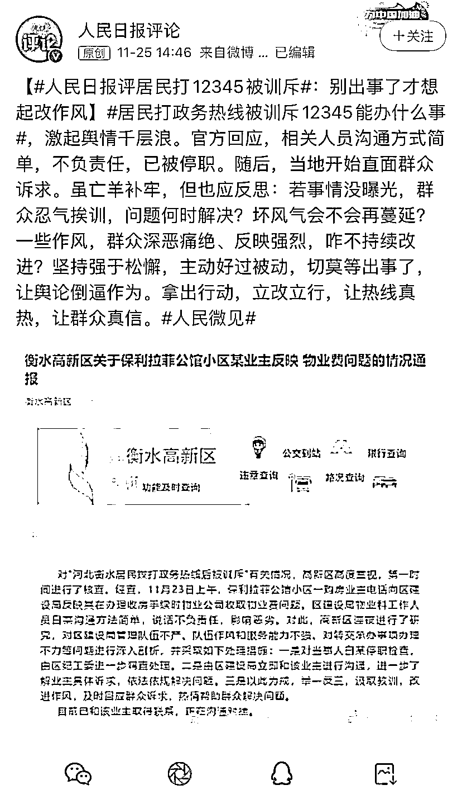

# “打 12345 的人基本上都废了”？停职处理！

> 原文：[`mp.weixin.qq.com/s?__biz=MzIyMDYwMTk0Mw==&mid=2247524769&idx=2&sn=c2a4c47c8b948bdf9dbf432709e1a94a&chksm=97cbaa99a0bc238f42e902be228fbef6a2c5448848e294506dcd73ca71087b0f8c6814f26bdc&scene=27#wechat_redirect`](http://mp.weixin.qq.com/s?__biz=MzIyMDYwMTk0Mw==&mid=2247524769&idx=2&sn=c2a4c47c8b948bdf9dbf432709e1a94a&chksm=97cbaa99a0bc238f42e902be228fbef6a2c5448848e294506dcd73ca71087b0f8c6814f26bdc&scene=27#wechat_redirect)

“12345 能办成什么事啊？只要打 12345 的人，基本上这个人都是废了。打 12345 的这些人没有一个办成的。”

近日，有媒体报道河北衡水市一居民打了 3 次 12345 政务热线和 20 多次政府部门值班电话后，听到了一段让他难以置信的答复。

[`mp.weixin.qq.com/mp/readtemplate?t=pages/video_player_tmpl&action=mpvideo&auto=0&vid=wxv_2151443814593413122`](https://mp.weixin.qq.com/mp/readtemplate?t=pages/video_player_tmpl&action=mpvideo&auto=0&vid=wxv_2151443814593413122)

澎湃新闻记者：高亮 编辑：林蓉 素材来源：衡水高新区 网络 责任编辑：周琦 校对：刘威

居民拨打政务热线后被训斥

涉事人员停职

25 日，河北衡水经济开发区管理委员会官方微信公众号发布消息，经查，11 月 23 日上午，保利拉菲公馆小区一购房业主电话向区建设局反映其在办理收房手续时物业公司收取物业费问题。**区建设局物业科工作人员白某沟通方法简单，说话不负责任，影响恶劣。**

对此，高新区对区建设局管理队伍不严、队伍作风和服务能力不强，对转交承办事项办理不力等问题进行深入剖析，并采取如下处理措施：**一是对当事人白某停职检查，由区纪工委进一步调查处理。二是由区建设局立即和该业主进行沟通，进一步了解业主具体诉求，依法依规解决问题。三是以此为戒，举一反三，汲取教训，改进作风，及时回应群众诉求，热情帮助群众解决问题。**

目前，相关部门已和该业主取得联系，正在沟通对接。

人民日报评论：

别出事了才想起改作风

 居民打政务热线被训斥 12345 能办什么事，激起舆情千层浪。官方回应，相关人员沟通方式简单，不负责任，已被停职。随后，当地开始直面群众诉求。 

虽亡羊补牢，但也应反思：若事情没曝光，群众忍气挨训，问题何时解决？坏风气会不会再蔓延？一些作风，群众深恶痛绝、反映强烈，咋不持续改进？坚持强于松懈，主动好过被动，切莫等出事了，让舆论倒逼作为。拿出行动，立改立行，让热线真热，让群众真信。

来源：澎湃新闻

← 向右滑动与灰产圈互动交流 →

