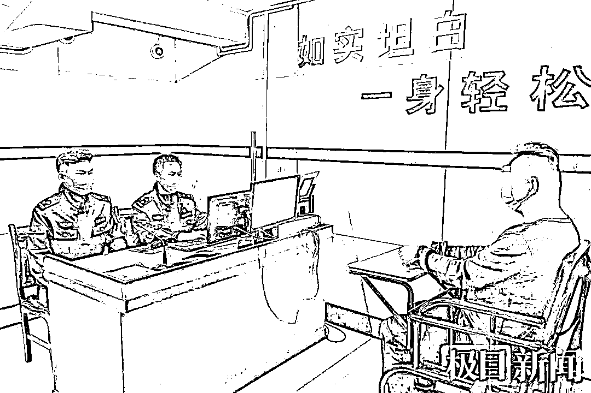
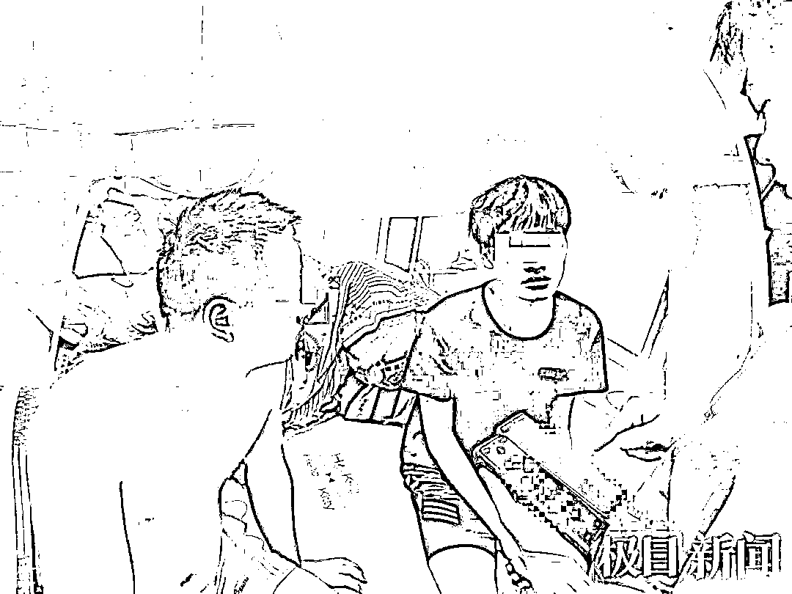
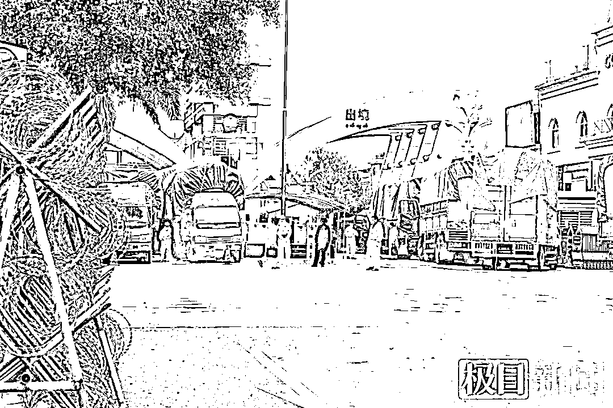

# 8 个月赚了 9 万多元却所剩无几，境外电诈“话务员”自述缅北噩梦

> 原文：[`mp.weixin.qq.com/s?__biz=MzIyMDYwMTk0Mw==&mid=2247524769&idx=3&sn=15f1534bbd3d108fea135dc48e607fd5&chksm=97cbaa99a0bc238f9cc063b7c67082bace3ff4657e0ee1cff38e6a74962ddf7dda9cdd3ad4f5&scene=27#wechat_redirect`](http://mp.weixin.qq.com/s?__biz=MzIyMDYwMTk0Mw==&mid=2247524769&idx=3&sn=15f1534bbd3d108fea135dc48e607fd5&chksm=97cbaa99a0bc238f9cc063b7c67082bace3ff4657e0ee1cff38e6a74962ddf7dda9cdd3ad4f5&scene=27#wechat_redirect)

偷渡到缅甸从事电信网络诈骗，是一种什么样的经历？“独自远在异国他乡，住在破旧旅社，感觉与世隔绝，感冒发烧就会被扔到山上，在那里，人命根本不值钱，孤独和恐惧一直伴随着我……跨过国境线回到国内的那一刻，终于感到解脱了。”10 月 21 日，“话务员”小周（化名）看守所内讲述了自己的缅北噩梦。

在看守所里坦白交代

10 月 21 日，武汉市江岸警方介绍，经过 1 个月的缜密侦查，10 月 11 日，在武汉及天门等地收网，打掉一个从缅北回流的虚假贷款诈骗团伙，抓获团伙成员 9 名。经过民警的政策宣传和规劝，小周坦白了自己在缅北电诈窝点充当话务员，实施电信网络诈骗的犯罪经历。

“高级酒店”竟是破旧旅社

小周说，去年 7 月份的一天，**一个朋友找到他，说有个机会可以赚大钱。小周问是什么机会，朋友说，有老板招聘年轻人去缅甸做贷款生意，公司在高档写字楼里，下班后住在高级酒店，工作很轻松，只要肯钻研，月收入大约****3-5 万****元。**小周听了眼前一亮，说自己愿意去。朋友让他等消息。

一个月后，朋友带着小周来到湖北省天门市，见到另外 4 个不认识的年轻人，一起坐上一辆面包车，一路奔波来到云南省，在靠近边境的地方下了车。**“蛇头”接到他们 6 人，坐摩托车、换面包车，又在山林中徒步前行，偷偷越过边境，来到缅甸北方一座小镇上。看到狭窄老旧的街道、低矮的房屋，小周的第一感觉就是失望，而之前朋友所说的“住高级酒店”更是无稽之谈，他们被带进一家破旧的旅社，3 个人同住一间房，热水都不能 24 小时供应。**

第二天，小周等人被带到公司上班，所谓高档写字楼，竟是一栋 5 层楼的私房。办公室十分拥挤，靠墙摆放着十几张小桌，桌上成排摆着旧手机，每个人面朝墙壁工作。

当天，**老板给每人发了一本话术本，让他们抄写，然后背熟。看到话术本，小周明白了，所谓“做贷款生意”，其实是****打诈骗电话**。

忍受与世隔绝的煎熬

在国内，小周知道电信网络犯罪是公安机关严厉打击的对象，感到害怕，提出要回国。老板恶声恶气地说，要回去可以，但必须先把路费交出来，3 万元钱。小周哪里拿得出这么多钱呢，后来，看到不愿意“上班”的人被责骂、被殴打。还有人悄悄告诉他，**这里天高地远，****人命不值钱。****小周只好就范**。

小周在缅北小镇的旅社里

所谓“工作”就是打电话，被称为“话务员”。**老板给他们配发了专门用于诈骗的手机，按照要求，小周每天拿着手机添加好友，再按照话术本，告诉对方可以办理“低息无抵押”贷款，引诱对方下载安装某“贷款 APP”。对方下载安装、注册后，申请借款就会遇到障碍，小周告诉对方，虽然贷款不需要抵押，但要缴纳“会员费”。对方发现交了“会员费”后还是贷不了款，小周再告诉对方要交“保证费”，然后还有“保险费”，等等，以各种名目要求对方交钱，直到把对方“榨干”**。

“话务员”没有底薪，个人收入全凭“业绩”——每骗到一笔钱，按 12%提成。

小周说，国内防骗宣传铺天盖地，人们防骗意识越来越强，做出“业绩”很难。他们每天上午 9 时上班，晚 9 时下班，中间不准休息，只能匆匆吃个盒饭，晚上经常加班，没有周末和节假日的概念。

小镇在每天晚上 9 时之后实行宵禁，街头到处是持枪的武装人员，随意进出街道就会被逮住。为了“安全”，老板把所有人的私人手机收走，统一保管。

每天下班后，小周拖着疲惫的身体回到小旅社，躺在床上，十分思念家乡和亲人，但却无法与家人联系，只能忍受与世隔绝的煎熬。

庆幸自己“健康活着回来”

今年 4 月份，当地的新冠疫情严重起来，医疗条件却很有限。小周听说，如果有人出现感冒发烧症状，就会被押到附近的山上，任其自生自灭。小周和同伙们害怕极了，每天都生活在恐惧中。到后来，就连团伙头目也没心思“上班”，渐渐散了伙。

度过了噩梦般的 8 个月，小周决定回国。今年 4 月底，小周和几名同伙辗转偷渡回国。小周说，跨过边境线的那一刻，他心情十分激动，“无论如何，终于解脱了。”

小周等人绕过国门偷渡回国

小周在缅北待了 8 个月，总共非法获利 9 万多元，除了往返路费和吃住等日常开销，落到手的钱所剩无几。他对民警说：“我非常后悔，虽然是被骗去了那边，但我做了违法犯罪的事情，愿意接受法律的制裁。其实，我是幸运的，至少我还能健康活着回来。”

目前，小周等 9 人因涉嫌诈骗罪已被江岸警方依法刑事拘留，案件还在进一步调查中。

**警方正告缅北回流人员，立即向警方投案或与社区、村委会取得联系，向公安机关如实供述违法犯罪行为，争取宽大处理。**

来源：天天防诈骗，极目新闻

← 向右滑动与灰产圈互动交流 →

