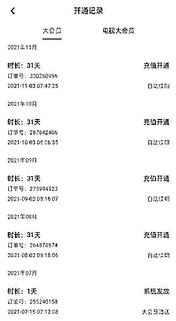

# App 自动续费吃相难看：卸载后仍扣款 退款无门

> 原文：[`mp.weixin.qq.com/s?__biz=MzIyMDYwMTk0Mw==&mid=2247524769&idx=4&sn=61828da62950dda7105dac8e4f12fb32&chksm=97cbaa99a0bc238f8cd230d819a4035157b5ef2023367cc8e9feabb889bfdfb8a3c31ae8aa63&scene=27#wechat_redirect`](http://mp.weixin.qq.com/s?__biz=MzIyMDYwMTk0Mw==&mid=2247524769&idx=4&sn=61828da62950dda7105dac8e4f12fb32&chksm=97cbaa99a0bc238f8cd230d819a4035157b5ef2023367cc8e9feabb889bfdfb8a3c31ae8aa63&scene=27#wechat_redirect)

|  
1

 |  
近日，上海市消保委测评 12 款 App 自动续费，其中，B 站会员提前 3 天扣费惹争议。

 |
|  
2

 |  
除了提前自动续费，更多的“坑”在于，默认勾选自动续费；开通容易取消难，用户较难找到取消入口；扣费前没有任何信息提醒；最终被扣的费用无法追回等。

 |
|  
3

 |  
如何取消自动续费？已扣会员费是否能在自动续费的第一时间退款？

 |

11 月 23 日，上海市消费者保护委员会（下简称上海消保委）发文称，调查了 12 款 App 自动续费扣款期限，包括爱奇艺、优酷视频、腾讯视频、芒果 TV、哔哩哔哩、知乎、喜马拉雅、饿了么、蜻蜓、keep、百度网盘和酷我音乐。

图源：上海市消保委

上海市消保委对比 12 款 App 的自动续费协议发现，大部分 App 自动续费扣款时间节点设置在到期前 1 天，少量 App 扣费时间节点较为模糊，比如知乎和酷我音乐都在合同里标注“即将过期时”，百度网盘标注“期限届满前后”。上海市消保委还特别点名，哔哩哔哩会员的微信、支付宝购买渠道提前 3 天自动续费。

B 站大会员自动续费 图源：新浪黑猫

哔哩哔哩在 11 月 24 日回复上海市消保委称：“我司非常重视，第一时间进行了自查自纠，我们将马上着手进行优化，将自动续费调整为‘提前 24 小时和到期后扣款’。”

自动扣费现象存在已久，如果用户选择自动续费享有一定优惠，平台也在第一次订阅时就已提示，这无疑是正常的商业行为，此次上海市消保委则“剑指”会员到期前自动扣费。

**   01    **

**卸载了仍自动续费**

新浪黑猫投诉平台上，关于自动扣费的投诉有 8 万多条，涵盖的 App 和服务甚广，说明自动扣费现象普遍。

除了提前扣费外，问题主要集中在几点：**默认勾选自动续费；开通容易取消难，用户较难找到取消入口；扣费前没有任何信息提醒；最终被扣的费用无法追回等**。

图源：新浪黑猫

2019 年时，《IT 时报》记者接到了一位 iPhone 用户投诉，案例较为典型。她在苹果 App Store 下载了一款“来电秀——手机混音铃声来电壁纸”App，开通了“三天免费试用”并在试用期内将 App 删除，但仍旧被自动扣了 263 元用于购买半年会员。

《IT 时报》记者试用后发现，此 App 在免费试用 3 天的界面上用几行小字提示：“订阅将会自动续订，除非在当前订阅期至少提前 24 小时取消自动续订”。这意味着，用户不选择免费试用 3 天就无法用这个 App，选择试用 3 天后就等于同意了这个协议。也就是说，用户须在试用第二天取消续订，263 元费用才不会被扣。

**开通容易取消难，卸载 App 并不等于取消续订，而要进入 iPhone 的三层入口取消，但一般用户都较难找到该入口。**

今年 5 月颁布施行的《网络交易监督管理办法》明确规定，网络交易经营者采取自动展期、自动续费等方式提供服务的，应当在消费者接受服务前和自动展期、自动续费等日期前 5 日，以显著方式提请消费者注意，由消费者自主选择。

按此规定，App 开发者应当提前 5 天以显著方式提醒用户“会员已到期，是否需要自动续费”，给予用户选择权。

**   02    **

**找谁退款成难题**

在上文提及的 iPhone 投诉案例中，找谁退款成为难题。第一责任主体是来电秀，但是 App 内无联系方式，App Store 里留下的开发者信息是海外注册证书，主体较难确认。

所幸，苹果公司提供了退款渠道，在 Apple 官网上方菜单栏找到“技术支持”，进入“账单和订阅”，点击“申请退款”就能找到退款途径，一般在被自动扣费的第一时间，苹果都会支持退还已扣费用。

对安卓用户来说，取消自动续费的路径，因品牌厂商不同而略有不同，但大多数手机厂商并不支持退还已扣费用。

用户遭遇此类问题时，应该第一时间向收取会员费的应用方追讨费用。有用户反映，曾遇到过两次被自动扣除会员费的情况，分别是淘宝 88VIP 和亚马逊 Prime 会员，都在被扣费的第一时间找了客服退款，但淘宝 88VIP 并没有成功，而亚马逊 Prime 会员则成功退款。

所以，是否能成功退款，还要看 App 开发者和应用市场所属方的态度。

**   03    **

**免密支付也要担心**

当下，越来越多生活服务类项目以小程序的方式“藏”在微信、支付宝里。

《IT 时报》记者在检查支付宝自动扣款项目时发现，自己无意间开通了飞猪信用住、哈啰出行和花呗等项目。检查微信自动扣款项目时发现，竟然开通了小电共享充电宝、京东快递、玛士琪无人货柜、TakeGo 无人店、湖州交通出行等一系列项目，部分项目开通时间为 3 年前。

左为支付宝，右为微信支付

可以看到，微信与支付宝平台的自动扣款与会员自动续费有所不同，主要适用于生活服务类，更倾向于免密支付。但要注意的是，一些自动续费会员也会“藏”在这些“自动扣款”类目里。

此前，有大批用户莫名开通美团月付这一类似于花呗的产品，被“透支消费”，直到美团月付通过关联银行卡还款时才发现。“险些成老赖，从开通到划扣银行卡都无感，因为平时垃圾短信太多，不太细看这些通知短信。”多位美团月付用户反映，美团 App 常将美团月付与优惠券绑定，一不小心就在诱导下开通这一网贷产品。

免密支付与自动续费相同的是，“坑”在无感，在享受方便的同时，用户应当自主预防各类衍生问题的发生。

**消费提醒：**

**防自动扣款方法**

**苹果：**【设置】——【头像 Apple ID 等】——【订阅】

**微信：**【我的】——【支付】——右上角【…】——【扣费服务】

**支付宝：**【我的】——【设置】——【支付设置】——【自动扣款】

按照以上路径，一一检查并选择要关闭的扣款项目。

← 向右滑动与灰产圈互动交流 →

