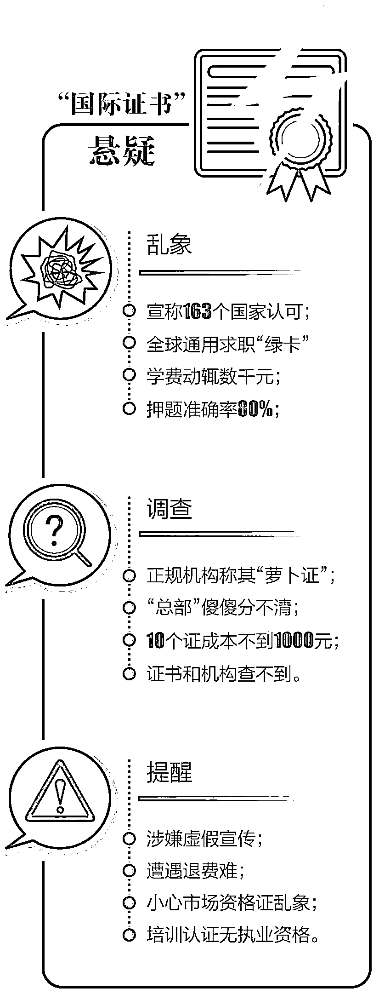

# 被打假的“国际心理咨询师证”仍在卖证骗钱

> 原文：[`mp.weixin.qq.com/s?__biz=MzIyMDYwMTk0Mw==&mid=2247524769&idx=5&sn=d2585614a69708853fbf46c792c7ceb6&chksm=97cbaa99a0bc238fb29df108d9c32e9e30a09c2b27177b978a01d5579d9f7d71f4908e656394&scene=27#wechat_redirect`](http://mp.weixin.qq.com/s?__biz=MzIyMDYwMTk0Mw==&mid=2247524769&idx=5&sn=d2585614a69708853fbf46c792c7ceb6&chksm=97cbaa99a0bc238fb29df108d9c32e9e30a09c2b27177b978a01d5579d9f7d71f4908e656394&scene=27#wechat_redirect)

“获得 163 个国家认可的证书”“21 世纪‘求职绿卡’”“获得国家认证许可的国际认证机构”……乍一看，这样的“证书”应当资质过硬且考取难度不小。然而，这些“高大上”的宣传词汇，早被曝光名不副实。

“ACI 注册国际心理咨询师”证书被曝光已有一年多。记者近日回访调查发现，该证书依旧在大摇大摆招生并组织考试。尽管该“国际证书”的含金量和颁发机构充满争议，但这背后的生意链条，还在暗流涌动。

**现状**

**宣称全球通用 学费三千起步** 

在网络输入“注册国际心理咨询”“心理咨询师”等字样，很快就能检索出相关信息。而点击这些页面信息进入，通常是不同教育培训机构的招生宣传广告。在这些教育培训机构的招生宣传页面中，大多指向“ACI 注册国际心理咨询师”。

一家名为“X 学教育”的机构网站，正在宣传“注册国际心理咨询师”的报考条件、考试时间、考试科目等内容。在该机构页面中，考取的“注册国际心理咨询师”证书被形容为“获得 163 个 WTO 成员国认可”“申请美国移民、签证可加分”“作为高级专业人才储备”等。而在“如何备考”一栏，该机构特别强调，针对上班族、零基础、多次未考过、没时间学习等的人群均给出相应解决方案——宣称有考前大纲；80%的考点串讲；以及押题准确率达到 80%。

在另一家教育机构的网站页面上，也展出了“ACI 注册国际心理咨询师”的招生考试信息。其宣称该考试“代表了当今职业资格认证的国际水平，具有广泛的代表性和国际权威性”。考试时间上，一般安排在每年的 3 月、6 月、9 月、12 月举行。具体流程为，学员完成全部 120 个课时的培训及考前辅导后，即可向培训机构申请考试。由培训机构统计后，向“ACI 国际认证中国总部”申请考试时间。具体学费标准为，网课加考证费用共计 4800 元。

记者查询多个教育培训机构后发现，针对“ACI 注册国际心理咨询师”的宣传信息并不少见。而在所谓“ACI 中国总部”网站，声明该考试不接受个人学员的报考，而必须通过授权培训中心进行报考。收费标准为全国统一认证考试费，中级 850 元；培训指导价 3600 元（包含认证考试费）。其中还特别备注——因全国各地消费水平差异，培训指导价允许有一定浮动。“我们对培训价格做了最低要求，其中中级培训价格不低于 3000 元。”

“国际注册心理咨询师，它是萝卜章假证啊，你搜一下就知道了。”记者联系上北京某教育机构，咨询有关“注册国际心理咨询师”的报名考试事宜，一名指导老师直截了当地说。该指导老师表示，**各国的国情和教育水平等都不一样，“怎么可能有一个证就能全世界通用的呢，对吧？”**

**调查**

**“总部”网站众多 相关资质不明**  

那么，这个所谓“ACI 注册国际心理咨询师证书”究竟是真是假、含金量如何、背后的证书颁发者又是谁呢？记者调查发现，相关机构和证书资质不仅无法通过权威渠道查询，甚至连所谓“ACI 美国认证协会”本身，都有“ACI 国际认证总部”“ACI 中国总部”等多家网站，令人傻傻分不清。

记者登录一家名为“ACI 国际认证总部”的网站，该机构宣称美国认证协会成立于科罗拉多州，是非盈利组织行业协会，是美国认证联盟（简称 ACA）的会员单位，是国际职业认证测试组织之一……得到美国政府的合法注册。而网站页面下方的信息显示，该机构地址在深圳，其中国区管理执行机构为深圳的一家“国际交流文化有限公司”。

另一家名为“ACI 中国总部”的网站，显示地址在北京。通过该网站常见问题可以知道，考试证书的资质查询只能登录该网站查询。而至于“ACI 证书国家认可吗”的提问，网站答复十分模糊——“国家对 ACI 认证持欢迎和支持的态度”“ACI 证书国际通用，其实际的意义在于，真正有效的‘证书’，其实应该来自市场、岗位以及社会大众的评判与需求。”

此前有媒体公开报道，曾与 ACI 合作过的教育培训机构工作人员透露，**ACI（美国认证协会）实际上是一个不具有任何行业资质，通过卖证牟取暴利的民间机构。某教育培训机构工作人员称，ACI 美国认证协会就是一个美籍华人在美国注册的一个民间机构，“10 个证成本不到 1000 元。****”**

而在国外职业资格证书管理平台上（版权所有者为人社部职业技能鉴定中心），同样查询不到“ACI 美国认证协会”和“ACI 注册国际心理咨询师证书”的相关信息。在该网“国外职业资格证书信息公示”一栏的“注册国际证书”中，一共列出了公示的 17 项国际职业资格证书。其中并不包含“注册国际心理咨询师证书”。而在“项目机构信息公示”一栏中，面向社会公示了诸如美国采购协会、美国教育考试服务中心等机构信息，同样不见“美国认证协会”。

就此，记者多次向“ACI 国际认证总部”致电，截止发稿时，都未有接听或回电。“有听说 ACI 注册国际心理咨询师，但也只是通过心理行业机构的揭黑文章所了解。”国家二级咨询师肖雪萍表示，至于 ACI 机构的内部运转到底如何，自己不知道。她提醒，心理咨询师的考试应该是相当严格和高标准的，“一些机构宣称考试高通过率、押题率等，不可信。”

**追踪**

**举报多退费难 仍有人不断入坑**  

尽管“ACI 注册国际心理咨询师”早被曝光乱象纷纷，但目前还有全国各地的一些考生对此并不知情，仍在交钱报名准备考取该证书。而在另一边，一些已经交过学费、从骗局中醒来的考生，也遭遇着退费难等困境。

“北京 XX 教育科技有限公司到处电话宣传 ACI 注册国际心理咨询师的含金量，放大证书作用，虚假宣传。”一名网友在网上发帖投诉称，自己报名的该机构注册国际心理咨询师课程一节课没上，目前机构不给自己退学费。不止如此，机构原本宣传 3580 元学费中包含报考费用，但两个月以后又再次收取了 850 元的报考费。“虚假宣传、颠三倒四。现在一节课还没上，我要求退费……”

与此同时，更多的人则发现了问题想要退费却遭遇困难。“之前报名了超职教育的 ACI 国际注册心理咨询师，报名费 800 元，证书不被国家承认，但是宣传的却是含金量很高。”一名网友在消费者投诉平台“黑猫投诉”发帖称，如今该教育机构的网上学习 APP 已经下线，自己联系不上机构的任何人员。此外，另一名网友也表示，自己在得知“ACI 注册国际心理咨询师证书属于未经国家承认的私人证书后，向某教育机构的跟班班主任发起退费申请，“对方并不支持退费，并继续对本人销售新班型等引导消费。”

国家二级心理咨询师肖雪萍透露，**早在 2017 年 9 月，国家人社部认证的“心理咨询师从业资格证书”就已经随着众多其他职业资格证书而取消。“现在没有正规的心理咨询师考证渠道了，眼下所有活跃于市面上的心理咨询师认证，说到底都只是培训认证。”她表示，培训认证只意味着考生参加过心理学方面的知识学习，而不能成为有法律依据的执业从业资格证明，“所有人都应该知道这一点，别被骗了。”**

此外，肖雪萍认为目前我国心理咨询人才缺口大，执业乱象比较多。另一方面，我国心理咨询师的人才培养相对不太成熟，不能较好满足社会需求。“既然大家都在找这样的机会去考试，说明背后有市场需求。”她期待，国家相关主管部门未来能够找到较好的渠道和政策制度安排，让想进入心理咨询行业的人能够实现梦想、发挥价值。 

来源：北京日报，巴蜀反诈

← 向右滑动与灰产圈互动交流 →

